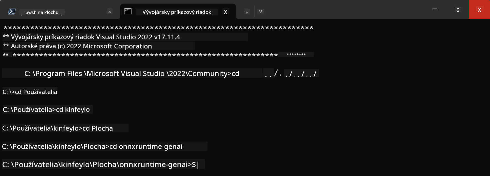

<!--
CO_OP_TRANSLATOR_METADATA:
{
  "original_hash": "b066fc29c1b2129df84e027cb75119ce",
  "translation_date": "2025-07-17T02:46:56+00:00",
  "source_file": "md/02.Application/01.TextAndChat/Phi3/ORTWindowGPUGuideline.md",
  "language_code": "sk"
}
-->
# **Návod pre OnnxRuntime GenAI Windows GPU**

Tento návod poskytuje kroky na nastavenie a používanie ONNX Runtime (ORT) s GPU na Windows. Je určený na to, aby vám pomohol využiť akceleráciu GPU pre vaše modely, čím zlepšíte výkon a efektivitu.

Dokument obsahuje pokyny na:

- Nastavenie prostredia: Inštrukcie na inštaláciu potrebných závislostí ako CUDA, cuDNN a ONNX Runtime.
- Konfigurácia: Ako nastaviť prostredie a ONNX Runtime na efektívne využitie GPU zdrojov.
- Tipy na optimalizáciu: Odporúčania, ako doladiť nastavenia GPU pre optimálny výkon.

### **1. Python 3.10.x /3.11.8**

   ***Poznámka*** Odporúčame použiť [miniforge](https://github.com/conda-forge/miniforge/releases/latest/download/Miniforge3-Windows-x86_64.exe) ako vaše Python prostredie

   ```bash

   conda create -n pydev python==3.11.8

   conda activate pydev

   ```

   ***Pripomienka*** Ak máte nainštalovanú nejakú Python ONNX knižnicu, prosím odinštalujte ju

### **2. Inštalácia CMake pomocou winget**

   ```bash

   winget install -e --id Kitware.CMake

   ```

### **3. Inštalácia Visual Studio 2022 - Desktop Development s C++**

   ***Poznámka*** Ak nechcete kompilovať, tento krok môžete preskočiť


### **4. Inštalácia NVIDIA ovládača**

1. **NVIDIA GPU Driver**  [https://www.nvidia.com/en-us/drivers/](https://www.nvidia.com/en-us/drivers/)

2. **NVIDIA CUDA 12.4** [https://developer.nvidia.com/cuda-12-4-0-download-archive](https://developer.nvidia.com/cuda-12-4-0-download-archive)

3. **NVIDIA CUDNN 9.4**  [https://developer.nvidia.com/cudnn-downloads](https://developer.nvidia.com/cudnn-downloads)

***Pripomienka*** Použite predvolené nastavenia počas inštalácie

### **5. Nastavenie NVIDIA prostredia**

Skopírujte NVIDIA CUDNN 9.4 súbory z priečinkov lib, bin, include do príslušných priečinkov NVIDIA CUDA 12.4

- skopírujte súbory z *'C:\Program Files\NVIDIA\CUDNN\v9.4\bin\12.6'* do *'C:\Program Files\NVIDIA GPU Computing Toolkit\CUDA\v12.4\bin'*

- skopírujte súbory z *'C:\Program Files\NVIDIA\CUDNN\v9.4\include\12.6'* do *'C:\Program Files\NVIDIA GPU Computing Toolkit\CUDA\v12.4\include'*

- skopírujte súbory z *'C:\Program Files\NVIDIA\CUDNN\v9.4\lib\12.6'* do *'C:\Program Files\NVIDIA GPU Computing Toolkit\CUDA\v12.4\lib\x64'*

### **6. Stiahnutie Phi-3.5-mini-instruct-onnx**

   ```bash

   winget install -e --id Git.Git

   winget install -e --id GitHub.GitLFS

   git lfs install

   git clone https://huggingface.co/microsoft/Phi-3.5-mini-instruct-onnx

   ```

### **7. Spustenie InferencePhi35Instruct.ipynb**

   Otvorte [Notebook](../../../../../../code/09.UpdateSamples/Aug/ortgpu-phi35-instruct.ipynb) a spustite ho


### **8. Kompilácia ORT GenAI GPU**

   ***Poznámka*** 
   
   1. Najprv odinštalujte všetky knižnice súvisiace s onnx, onnxruntime a onnxruntime-genai

   ```bash

   pip list 
   
   ```

   Potom odinštalujte všetky onnxruntime knižnice, napríklad:

   ```bash

   pip uninstall onnxruntime

   pip uninstall onnxruntime-genai

   pip uninstall onnxruntume-genai-cuda
   
   ```

   2. Skontrolujte podporu rozšírenia vo Visual Studio

   Skontrolujte priečinok C:\Program Files\NVIDIA GPU Computing Toolkit\CUDA\v12.4\extras, či obsahuje C:\Program Files\NVIDIA GPU Computing Toolkit\CUDA\v12.4\extras\visual_studio_integration. 
   
   Ak tam nie je, skontrolujte iné priečinky CUDA toolkit a skopírujte priečinok visual_studio_integration a jeho obsah do C:\Program Files\NVIDIA GPU Computing Toolkit\CUDA\v12.4\extras\visual_studio_integration

   - Ak nechcete kompilovať, tento krok môžete preskočiť

   ```bash

   git clone https://github.com/microsoft/onnxruntime-genai

   ```

   - Stiahnite [https://github.com/microsoft/onnxruntime/releases/download/v1.19.2/onnxruntime-win-x64-gpu-1.19.2.zip](https://github.com/microsoft/onnxruntime/releases/download/v1.19.2/onnxruntime-win-x64-gpu-1.19.2.zip)

   - Rozbaľte onnxruntime-win-x64-gpu-1.19.2.zip, premenovajte ho na **ort** a skopírujte priečinok ort do onnxruntime-genai

   - Pomocou Windows Terminálu otvorte Developer Command Prompt pre VS 2022 a prejdite do onnxruntime-genai



   - Kompilujte s vaším Python prostredím

   ```bash

   cd onnxruntime-genai

   python build.py --use_cuda  --cuda_home "C:\Program Files\NVIDIA GPU Computing Toolkit\CUDA\v12.4" --config Release
 

   cd build/Windows/Release/Wheel

   pip install .whl

   ```

**Zrieknutie sa zodpovednosti**:  
Tento dokument bol preložený pomocou AI prekladateľskej služby [Co-op Translator](https://github.com/Azure/co-op-translator). Aj keď sa snažíme o presnosť, prosím, majte na pamäti, že automatizované preklady môžu obsahovať chyby alebo nepresnosti. Originálny dokument v jeho pôvodnom jazyku by mal byť považovaný za autoritatívny zdroj. Pre kritické informácie sa odporúča profesionálny ľudský preklad. Nie sme zodpovední za akékoľvek nedorozumenia alebo nesprávne interpretácie vyplývajúce z použitia tohto prekladu.