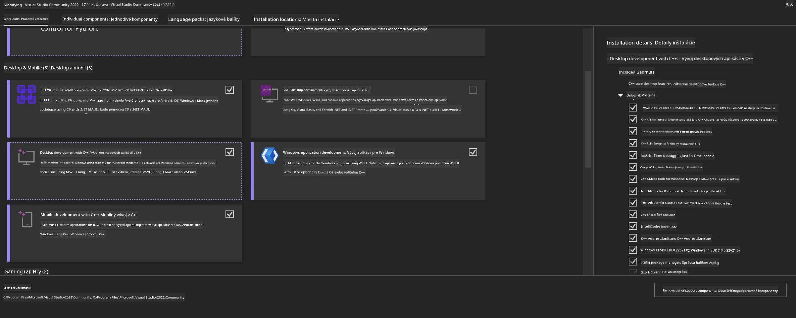
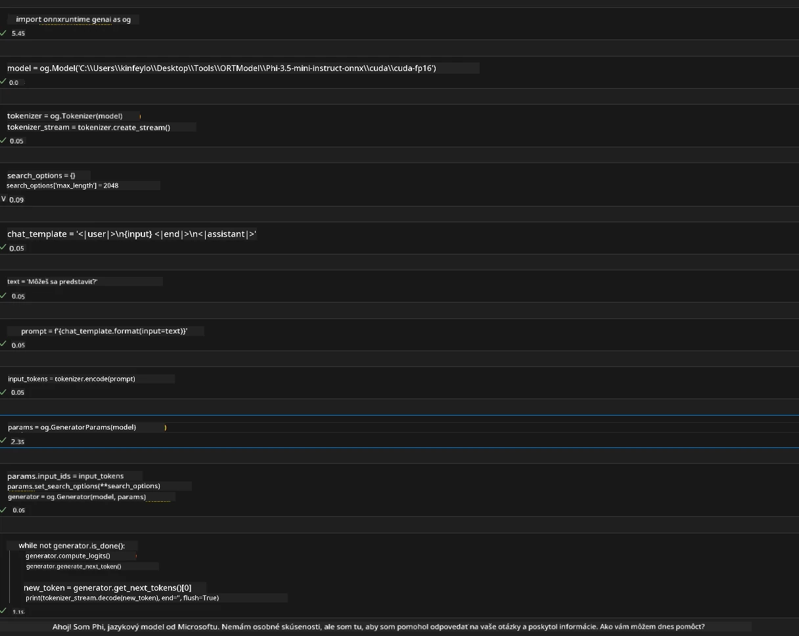
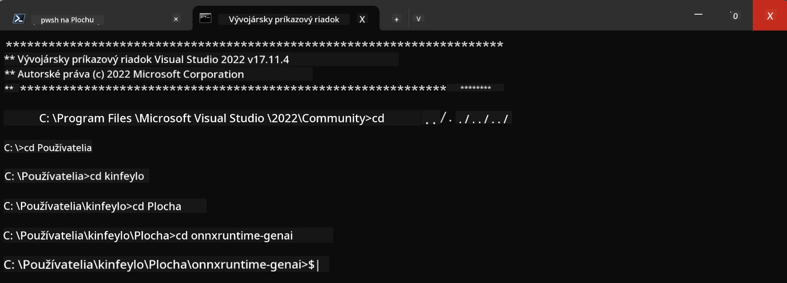

# **Návod pre OnnxRuntime GenAI Windows GPU**

Tento návod poskytuje kroky na nastavenie a používanie ONNX Runtime (ORT) s GPU na Windows. Je navrhnutý tak, aby vám pomohol využiť akceleráciu GPU pre vaše modely, čím zlepší výkon a efektivitu.

Dokument poskytuje usmernenia ohľadom:

- Nastavenie prostredia: Pokyny na inštaláciu potrebných závislostí ako CUDA, cuDNN a ONNX Runtime.
- Konfigurácia: Ako nakonfigurovať prostredie a ONNX Runtime na efektívne využívanie GPU zdrojov.
- Tipy na optimalizáciu: Odporúčania, ako doladiť nastavenia GPU pre optimálny výkon.

### **1. Python 3.10.x /3.11.8**

   ***Poznámka*** Odporúčame použiť [miniforge](https://github.com/conda-forge/miniforge/releases/latest/download/Miniforge3-Windows-x86_64.exe) ako vaše Python prostredie

   ```bash

   conda create -n pydev python==3.11.8

   conda activate pydev

   ```

   ***Pripomienka*** Ak máte nainštalovanú nejakú python ONNX knižnicu, prosím odinštalujte ju

### **2. Inštalácia CMake pomocou winget**


   ```bash

   winget install -e --id Kitware.CMake

   ```

### **3. Inštalácia Visual Studio 2022 - Vývoj desktopových aplikácií s C++**

   ***Poznámka*** Ak nechcete kompilovať, tento krok môžete preskočiť




### **4. Inštalácia NVIDIA ovládača**

1. **NVIDIA GPU ovládač**  [https://www.nvidia.com/en-us/drivers/](https://www.nvidia.com/en-us/drivers/)

2. **NVIDIA CUDA 12.4** [https://developer.nvidia.com/cuda-12-4-0-download-archive](https://developer.nvidia.com/cuda-12-4-0-download-archive)

3. **NVIDIA CUDNN 9.4**  [https://developer.nvidia.com/cudnn-downloads](https://developer.nvidia.com/cudnn-downloads)

***Pripomienka*** Prosím používajte predvolené nastavenia počas inštalácie

### **5. Nastavenie NVIDIA prostredia**

Skopírujte knižnice NVIDIA CUDNN 9.4 lib, bin, include do príslušných adresárov NVIDIA CUDA 12.4 lib, bin, include

- skopírujte súbory z *'C:\Program Files\NVIDIA\CUDNN\v9.4\bin\12.6'* do *'C:\Program Files\NVIDIA GPU Computing Toolkit\CUDA\v12.4\bin'*

- skopírujte súbory z *'C:\Program Files\NVIDIA\CUDNN\v9.4\include\12.6'* do *'C:\Program Files\NVIDIA GPU Computing Toolkit\CUDA\v12.4\include'*

- skopírujte súbory z *'C:\Program Files\NVIDIA\CUDNN\v9.4\lib\12.6'* do *'C:\Program Files\NVIDIA GPU Computing Toolkit\CUDA\v12.4\lib\x64'*


### **6. Stiahnite Phi-3.5-mini-instruct-onnx**


   ```bash

   winget install -e --id Git.Git

   winget install -e --id GitHub.GitLFS

   git lfs install

   git clone https://huggingface.co/microsoft/Phi-3.5-mini-instruct-onnx

   ```

### **7. Spustenie InferencePhi35Instruct.ipynb**

   Otvorte [notebook](../../../../code/09.UpdateSamples/Aug/ortgpu-phi35-instruct.ipynb) a vykonajte ho





### **8. Kompilácia ORT GenAI GPU**


   ***Poznámka*** 
   
   1. Najskôr odinštalujte všetko súvisiace s onnx, onnxruntime a onnxruntime-genai

   
   ```bash

   pip list 
   
   ```

   Potom odinštalujte všetky onnxruntime knižnice, napr.


   ```bash

   pip uninstall onnxruntime

   pip uninstall onnxruntime-genai

   pip uninstall onnxruntume-genai-cuda
   
   ```

   2. Skontrolujte podporu rozšírenia Visual Studio

   Skontrolujte, či sa v C:\Program Files\NVIDIA GPU Computing Toolkit\CUDA\v12.4\extras nachádza priečinok C:\Program Files\NVIDIA GPU Computing Toolkit\CUDA\v12.4\extras\visual_studio_integration. 
   
   Ak priečinok nie je nájdený, skontrolujte iné priečinky Cuda toolkit ovládača a skopírujte priečinok visual_studio_integration a jeho obsah do C:\Program Files\NVIDIA GPU Computing Toolkit\CUDA\v12.4\extras\visual_studio_integration


   - Ak nechcete kompilovať, tento krok môžete preskočiť


   ```bash

   git clone https://github.com/microsoft/onnxruntime-genai

   ```

   - Stiahnite si [https://github.com/microsoft/onnxruntime/releases/download/v1.19.2/onnxruntime-win-x64-gpu-1.19.2.zip](https://github.com/microsoft/onnxruntime/releases/download/v1.19.2/onnxruntime-win-x64-gpu-1.19.2.zip)

   - Rozbaľte onnxruntime-win-x64-gpu-1.19.2.zip a premenovajte priečinok na **ort**, skopírujte priečinok ort do onnxruntime-genai

   - Použite Windows Terminal, prejdite do Developer Command Prompt for VS 2022 a prejdite do onnxruntime-genai 



   - Kompilujte s vaším python prostredím

   
   ```bash

   cd onnxruntime-genai

   python build.py --use_cuda  --cuda_home "C:\Program Files\NVIDIA GPU Computing Toolkit\CUDA\v12.4" --config Release
 

   cd build/Windows/Release/Wheel

   pip install .whl

   ```

---

<!-- CO-OP TRANSLATOR DISCLAIMER START -->
**Vyhlásenie o zodpovednosti**:
Tento dokument bol preložený pomocou AI prekladateľskej služby [Co-op Translator](https://github.com/Azure/co-op-translator). Hoci sa snažíme o presnosť, vezmite prosím na vedomie, že automatické preklady môžu obsahovať chyby alebo nepresnosti. Pôvodný dokument v jeho natívnom jazyku by mal byť považovaný za autoritatívny zdroj. Pre kritické informácie sa odporúča profesionálny ľudský preklad. Nie sme zodpovední za žiadne nedorozumenia alebo nesprávne interpretácie vyplývajúce z použitia tohto prekladu.
<!-- CO-OP TRANSLATOR DISCLAIMER END -->