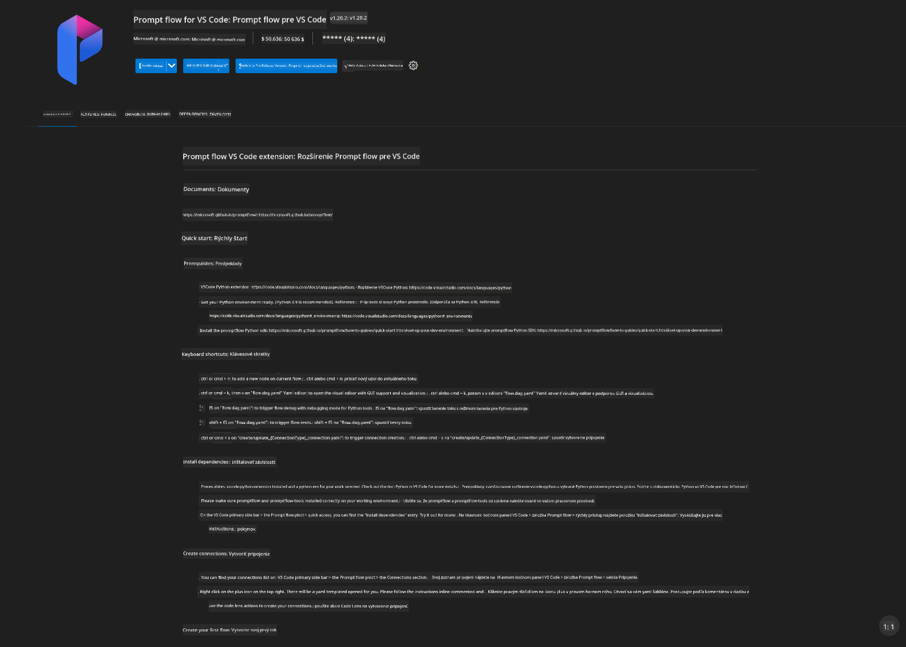
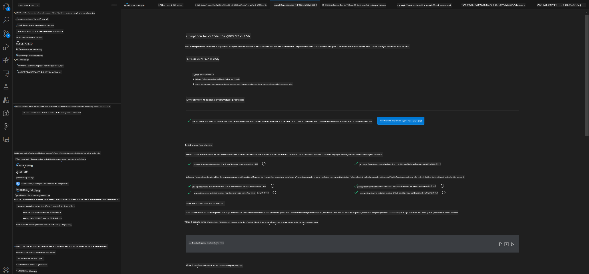
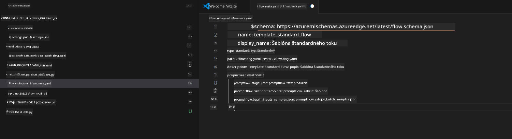
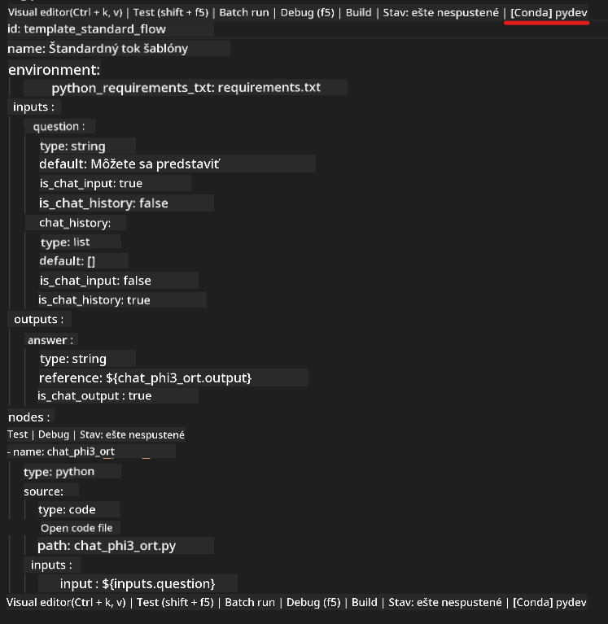
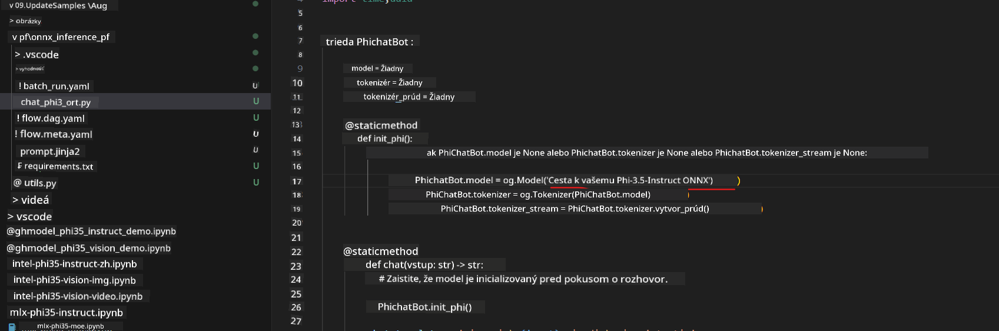
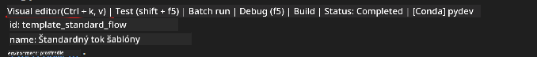
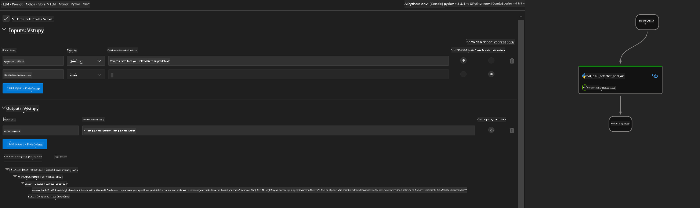
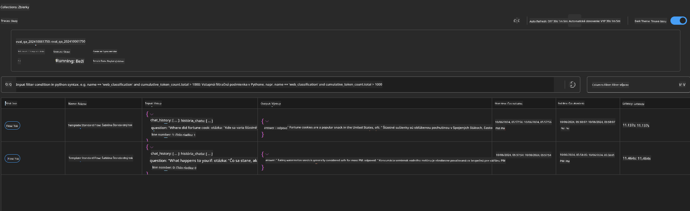

<!--
CO_OP_TRANSLATOR_METADATA:
{
  "original_hash": "92e7dac1e5af0dd7c94170fdaf6860fe",
  "translation_date": "2025-05-09T18:55:13+00:00",
  "source_file": "md/02.Application/01.TextAndChat/Phi3/UsingPromptFlowWithONNX.md",
  "language_code": "sk"
}
-->
# Používanie Windows GPU na vytvorenie riešenia Prompt flow s Phi-3.5-Instruct ONNX

Nasledujúci dokument je príklad, ako používať PromptFlow s ONNX (Open Neural Network Exchange) na vývoj AI aplikácií založených na modeloch Phi-3.

PromptFlow je súbor vývojových nástrojov navrhnutých na zjednodušenie celého vývojového cyklu AI aplikácií založených na LLM (Large Language Model), od nápadu a prototypovania až po testovanie a hodnotenie.

Integráciou PromptFlow s ONNX môžu vývojári:

- Optimalizovať výkon modelu: Využiť ONNX pre efektívne vyhodnocovanie a nasadenie modelov.
- Zjednodušiť vývoj: Použiť PromptFlow na správu pracovného toku a automatizáciu opakujúcich sa úloh.
- Zlepšiť spoluprácu: Uľahčiť tímovú spoluprácu poskytovaním jednotného vývojového prostredia.

**Prompt flow** je súbor nástrojov na vývoj, ktorý zjednodušuje celý vývojový cyklus AI aplikácií založených na LLM, od nápadu, prototypovania, testovania, hodnotenia až po produkčné nasadenie a monitorovanie. Uľahčuje tvorbu promptov a umožňuje vytvárať LLM aplikácie s kvalitou vhodnou na produkciu.

Prompt flow sa dokáže pripojiť k OpenAI, Azure OpenAI Service a prispôsobiteľným modelom (Huggingface, lokálny LLM/SLM). Plánujeme nasadiť kvantovaný ONNX model Phi-3.5 do lokálnych aplikácií. Prompt flow nám pomôže lepšie plánovať naše podnikanie a dokončiť lokálne riešenia založené na Phi-3.5. V tomto príklade skombinujeme ONNX Runtime GenAI knižnicu na dokončenie Prompt flow riešenia založeného na Windows GPU.

## **Inštalácia**

### **ONNX Runtime GenAI pre Windows GPU**

Prečítajte si tento návod na nastavenie ONNX Runtime GenAI pre Windows GPU [kliknite sem](./ORTWindowGPUGuideline.md)

### **Nastavenie Prompt flow vo VSCode**

1. Nainštalujte rozšírenie Prompt flow pre VS Code



2. Po inštalácii rozšírenia Prompt flow vo VS Code kliknite na rozšírenie a vyberte **Installation dependencies**, podľa tohto návodu nainštalujte Prompt flow SDK do svojho prostredia



3. Stiahnite si [Ukážkový kód](../../../../../../code/09.UpdateSamples/Aug/pf/onnx_inference_pf) a otvorte ho vo VS Code



4. Otvorte **flow.dag.yaml** a vyberte svoje Python prostredie



   Otvorte **chat_phi3_ort.py** a zmeňte umiestnenie Phi-3.5-instruct ONNX modelu



5. Spustite svoj prompt flow na testovanie

Otvorte **flow.dag.yaml** a kliknite na vizuálny editor



Po kliknutí ho spustite na testovanie



1. Môžete spustiť dávkový režim v termináli, aby ste videli viac výsledkov


```bash

pf run create --file batch_run.yaml --stream --name 'Your eval qa name'    

```

Výsledky si môžete pozrieť vo svojom predvolenom prehliadači




**Vyhlásenie o zodpovednosti**:  
Tento dokument bol preložený pomocou AI prekladateľskej služby [Co-op Translator](https://github.com/Azure/co-op-translator). Hoci sa snažíme o presnosť, berte prosím na vedomie, že automatizované preklady môžu obsahovať chyby alebo nepresnosti. Originálny dokument v jeho pôvodnom jazyku by mal byť považovaný za autoritatívny zdroj. Pre kritické informácie sa odporúča profesionálny ľudský preklad. Nie sme zodpovední za akékoľvek nedorozumenia alebo nesprávne výklady vyplývajúce z použitia tohto prekladu.