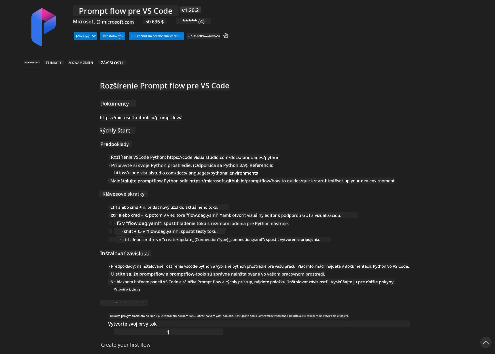
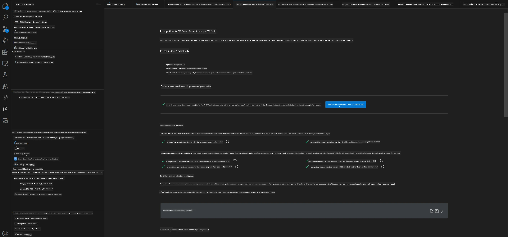
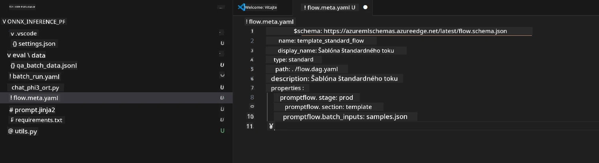
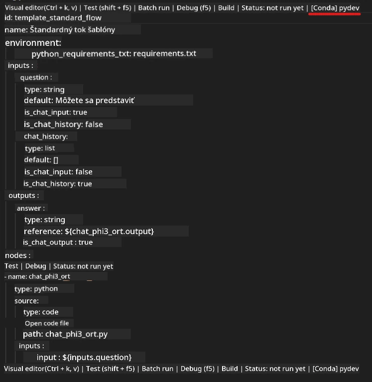
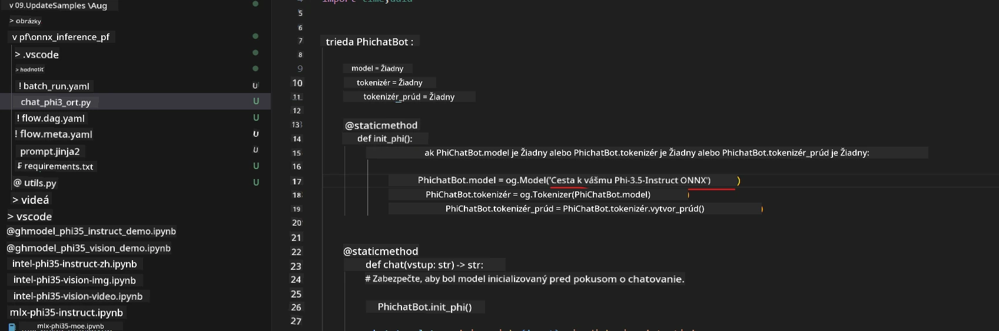
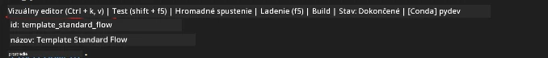
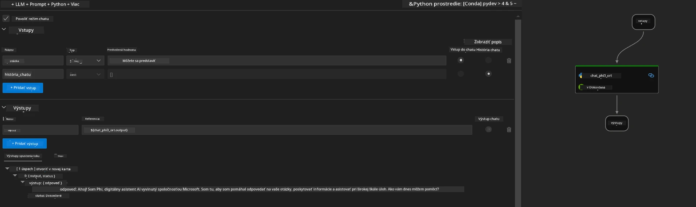
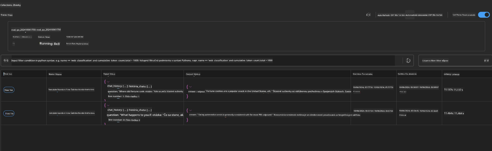

# Použitie Windows GPU na vytvorenie riešenia Prompt flow s Phi-3.5-Instruct ONNX 

Nasledujúci dokument je príklad, ako používať PromptFlow s ONNX (Open Neural Network Exchange) pre vývoj AI aplikácií založených na modeloch Phi-3.

PromptFlow je súbor vývojových nástrojov navrhnutých na zjednodušenie celého vývojového cyklu AI aplikácií založených na LLM (Large Language Model), od nápadu a prototypovania až po testovanie a vyhodnocovanie.

Integráciou PromptFlow s ONNX môžu vývojári:

- Optimalizovať výkon modelu: Využiť ONNX pre efektívne inferovanie a nasadenie modelu.
- Zjednodušiť vývoj: Použiť PromptFlow na správu pracovného toku a automatizáciu opakujúcich sa úloh.
- Zlepšiť spoluprácu: Umožniť lepšiu spoluprácu medzi členmi tímu prostredníctvom jednotného vývojového prostredia.

**Prompt flow** je súbor vývojových nástrojov navrhnutých na zjednodušenie celého vývojového cyklu AI aplikácií založených na LLM, od námetov, prototypovania, testovania, vyhodnocovania až po produkčné nasadenie a monitorovanie. Uľahčuje prompt engineering a umožňuje vytvárať LLM aplikácie s produkčnou kvalitou.

Prompt flow sa môže pripojiť k OpenAI, Azure OpenAI Service a prispôsobiteľným modelom (Huggingface, lokálny LLM/SLM). Dúfame, že nasadíme kvantovaný ONNX model Phi-3.5 do lokálnych aplikácií. Prompt flow nám pomôže lepšie plánovať náš biznis a dokončiť lokálne riešenia založené na Phi-3.5. V tomto príklade skombinujeme ONNX Runtime GenAI knižnicu pre dokončenie riešenia Prompt flow založeného na Windows GPU.

## **Inštalácia**

### **ONNX Runtime GenAI pre Windows GPU**

Prečítajte si tento návod na nastavenie ONNX Runtime GenAI pre Windows GPU  [kliknite sem](./ORTWindowGPUGuideline.md)

### **Nastavenie Prompt flow vo VSCode**

1. Nainštalujte rozšírenie Prompt flow do VS Code



2. Po inštalácii rozšírenia Prompt flow vo VS Code kliknite na rozšírenie a vyberte **Inštalačné závislosti** podľa tohto návodu nainštalujte Prompt flow SDK do vášho prostredia



3. Stiahnite si [Ukážkový kód](../../../../../../code/09.UpdateSamples/Aug/pf/onnx_inference_pf) a otvorte tento príklad vo VS Code



4. Otvorte **flow.dag.yaml** a vyberte svoje Python prostredie



   Otvorte **chat_phi3_ort.py** a zmeňte umiestnenie vášho Phi-3.5-instruct ONNX modelu



5. Spustite svoj prompt flow na testovanie

Otvorte **flow.dag.yaml** a kliknite na vizuálny editor



po kliknutí ho spustite na test



1. Môžete spustiť dávku v termináli pre zobrazenie viacerých výsledkov


```bash

pf run create --file batch_run.yaml --stream --name 'Your eval qa name'    

```

Výsledky si môžete pozrieť vo vašom predvolenom prehliadači




---

<!-- CO-OP TRANSLATOR DISCLAIMER START -->
**Vyhlásenie o zodpovednosti**:
Tento dokument bol preložený pomocou AI prekladateľskej služby [Co-op Translator](https://github.com/Azure/co-op-translator). Hoci sa snažíme o presnosť, vezmite prosím na vedomie, že automatické preklady môžu obsahovať chyby alebo nepresnosti. Pôvodný dokument v jeho natívnom jazyku by mal byť považovaný za autoritatívny zdroj. Pre kritické informácie sa odporúča profesionálny ľudský preklad. Nie sme zodpovední za žiadne nedorozumenia alebo nesprávne interpretácie vyplývajúce z použitia tohto prekladu.
<!-- CO-OP TRANSLATOR DISCLAIMER END -->