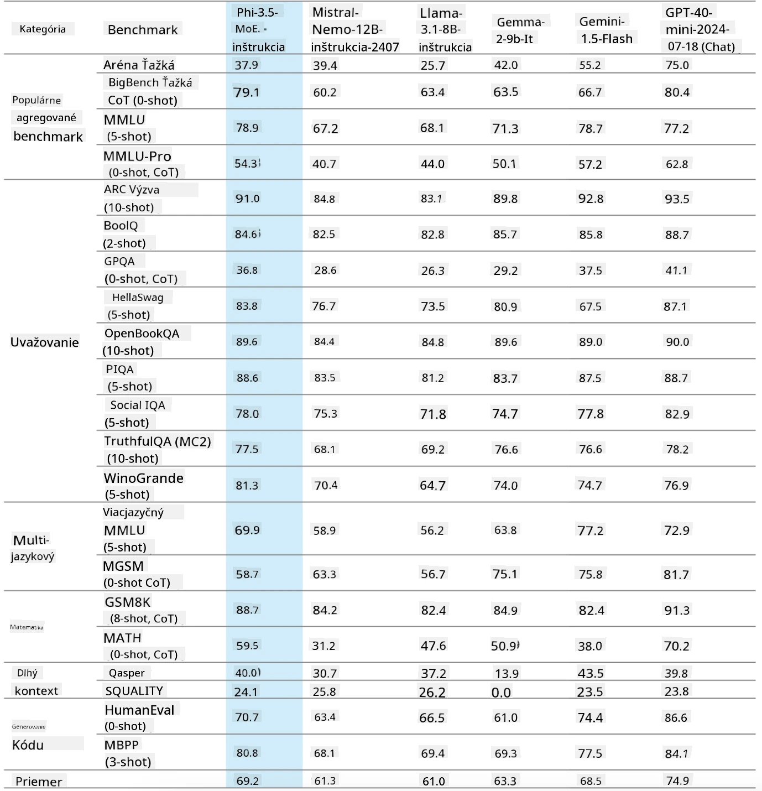
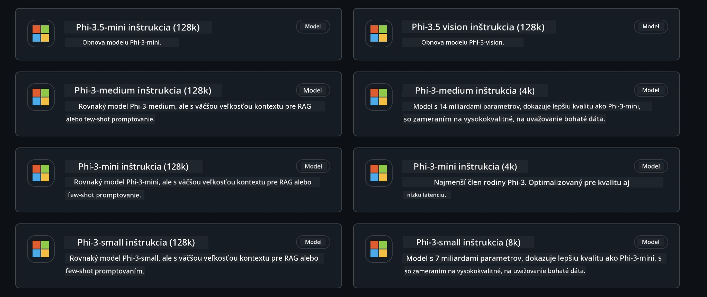
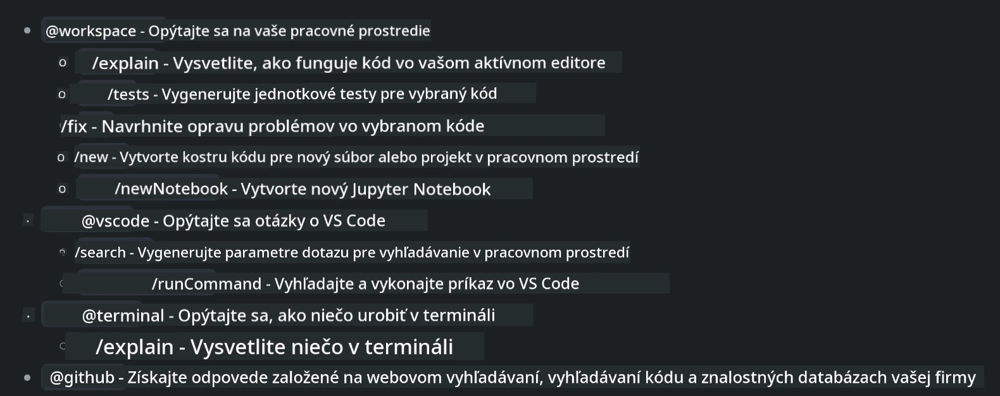
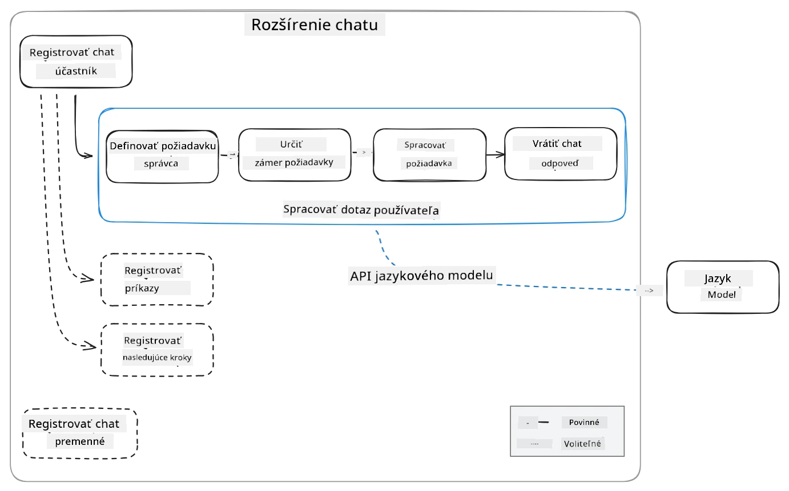
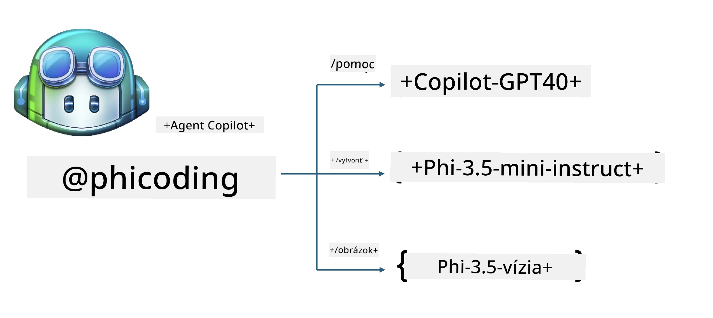
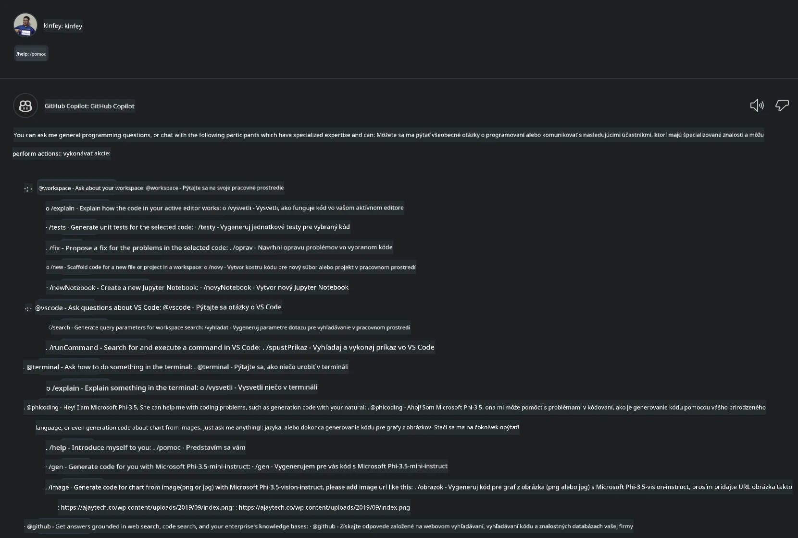
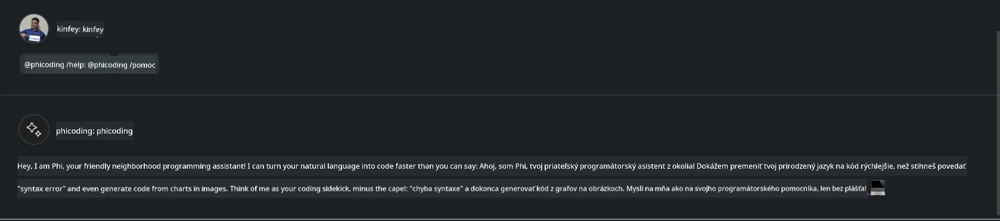
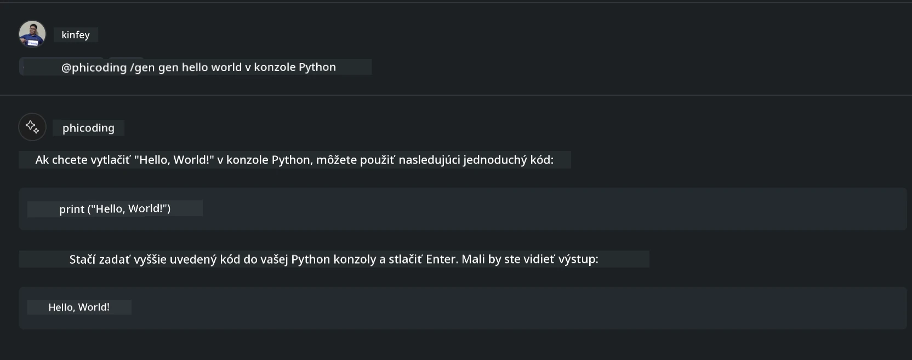
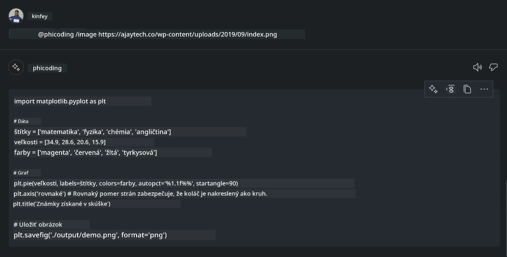

# **Vytvorte si vlastného agenta Visual Studio Code Chat Copilot s Phi-3.5 od GitHub Models**

Používate Visual Studio Code Copilot? Najmä v Chate môžete využiť rôznych agentov na zlepšenie schopnosti vytvárať, písať a udržiavať projekty vo Visual Studio Code. Visual Studio Code poskytuje API, ktoré umožňuje firmám a jednotlivcom vytvárať rôznych agentov podľa ich podnikania a rozširovať ich schopnosti v rôznych špecializovaných oblastiach. V tomto článku sa zameriame na **Phi-3.5-mini-instruct (128k)** a **Phi-3.5-vision-instruct (128k)** od GitHub Models, aby ste si mohli vytvoriť vlastného agenta pre Visual Studio Code.

## **O Phi-3.5 na GitHub Models**

Vieme, že Phi-3/3.5-mini-instruct z rodiny Phi-3/3.5 má silné schopnosti porozumenia a generovania kódu a má výhody oproti Gemma-2-9b a Mistral-Nemo-12B-instruct-2407.



Najnovšie GitHub Models už poskytujú prístup k modelom Phi-3.5-mini-instruct (128k) a Phi-3.5-vision-instruct (128k). Vývojári k nim môžu pristupovať cez OpenAI SDK, Azure AI Inference SDK a REST API.



***Poznámka:*** Odporúča sa tu používať Azure AI Inference SDK, pretože lepšie prepína s Azure Model Catalog v produkčnom prostredí.

Nižšie sú výsledky **Phi-3.5-mini-instruct (128k)** a **Phi-3.5-vision-instruct (128k)** v scenári generovania kódu po prepojení s GitHub Models, a zároveň príprava na nasledujúce príklady.

**Demo: GitHub Models Phi-3.5-mini-instruct (128k) generuje kód z Promptu** ([kliknite na tento odkaz](../../../../../../code/09.UpdateSamples/Aug/ghmodel_phi35_instruct_demo.ipynb))

**Demo: GitHub Models Phi-3.5-vision-instruct (128k) generuje kód z obrázka** ([kliknite na tento odkaz](../../../../../../code/09.UpdateSamples/Aug/ghmodel_phi35_vision_demo.ipynb))


## **O GitHub Copilot Chat Agentovi**

GitHub Copilot Chat Agent dokáže dokončiť rôzne úlohy v rôznych projektových scenároch na základe kódu. Systém má štyroch agentov: workspace, github, terminal, vscode.



Pridaním mena agenta s ‘@’ môžete rýchlo dokončiť príslušnú prácu. Pre firmy, ak pridáte vlastný obsah súvisiaci s podnikaním, ako sú požiadavky, kódovanie, testovacie špecifikácie a vydania, môžete mať silnejšie súkromné podnikové funkcie založené na GitHub Copilot.

Visual Studio Code Chat Agent teraz oficiálne vydal svoje API, ktoré umožňuje firmám alebo firemným vývojárom vyvíjať agentov založených na rôznych softvérových podnikových ekosystémoch. Na základe vývojovej metódy Visual Studio Code Extension Development môžete jednoducho pristupovať k rozhraniu Visual Studio Code Chat Agent API. Môžeme vyvíjať na základe tohto procesu.



Vývojový scenár podporuje prístup k API tretích strán modelov (ako GitHub Models, Azure Model Catalog a vlastné služby založené na open source modeloch) a tiež môže používať modely gpt-35-turbo, gpt-4 a gpt-4o poskytované GitHub Copilot.

## **Pridajte agenta @phicoding založeného na Phi-3.5**

Snažíme sa integrovať programovacie schopnosti Phi-3.5 na dokončenie písania kódu, generovania kódu z obrázkov a ďalších úloh. Dokončite agenta postaveného okolo Phi-3.5 - @PHI, tu sú niektoré funkcie:

1. Generovanie sebapredstavenia na základe GPT-4o poskytovaného GitHub Copilot cez príkaz **@phicoding /help**

2. Generovanie kódu pre rôzne programovacie jazyky na základe **Phi-3.5-mini-instruct (128k)** cez príkaz **@phicoding /gen**

3. Generovanie kódu na základe **Phi-3.5-vision-instruct (128k)** a doplnenie obrázkov cez príkaz **@phicoding /image**



## **Súvisiace kroky**

1. Nainštalujte podporu pre vývoj Visual Studio Code Extension pomocou npm

```bash

npm install --global yo generator-code 

```
2. Vytvorte plugin Visual Studio Code Extension (používajte vývojový režim Typescript, pomenovaný phiext)

```bash

yo code 

```

3. Otvorte vytvorený projekt a upravte package.json. Tu sú súvisiace inštrukcie a konfigurácie, vrátane konfigurácie GitHub Models. Upozorňujeme, že tu musíte pridať svoj GitHub Models token.

```json

{
  "name": "phiext",
  "displayName": "phiext",
  "description": "",
  "version": "0.0.1",
  "engines": {
    "vscode": "^1.93.0"
  },
  "categories": [
    "AI",
    "Chat"
  ],
  "activationEvents": [],
  "enabledApiProposals": [
      "chatVariableResolver"
  ],
  "main": "./dist/extension.js",
  "contributes": {
    "chatParticipants": [
        {
            "id": "chat.phicoding",
            "name": "phicoding",
            "description": "Hey! I am Microsoft Phi-3.5, She can help me with coding problems, such as generation code with your natural language, or even generation code about chart from images. Just ask me anything!",
            "isSticky": true,
            "commands": [
                {
                    "name": "help",
                    "description": "Introduce myself to you"
                },
                {
                    "name": "gen",
                    "description": "Generate code for you with Microsoft Phi-3.5-mini-instruct"
                },
                {
                    "name": "image",
                    "description": "Generate code for chart from image(png or jpg) with Microsoft Phi-3.5-vision-instruct, please add image url like this : https://ajaytech.co/wp-content/uploads/2019/09/index.png"
                }
            ]
        }
    ],
    "commands": [
        {
            "command": "phicoding.namesInEditor",
            "title": "Use Microsoft Phi 3.5 in Editor"
        }
    ],
    "configuration": {
      "type": "object",
      "title": "githubmodels",
      "properties": {
        "githubmodels.endpoint": {
          "type": "string",
          "default": "https://models.inference.ai.azure.com",
          "description": "Your GitHub Models Endpoint",
          "order": 0
        },
        "githubmodels.api_key": {
          "type": "string",
          "default": "Your GitHub Models Token",
          "description": "Your GitHub Models Token",
          "order": 1
        },
        "githubmodels.phi35instruct": {
          "type": "string",
          "default": "Phi-3.5-mini-instruct",
          "description": "Your Phi-35-Instruct Model",
          "order": 2
        },
        "githubmodels.phi35vision": {
          "type": "string",
          "default": "Phi-3.5-vision-instruct",
          "description": "Your Phi-35-Vision Model",
          "order": 3
        }
      }
    }
  },
  "scripts": {
    "vscode:prepublish": "npm run package",
    "compile": "webpack",
    "watch": "webpack --watch",
    "package": "webpack --mode production --devtool hidden-source-map",
    "compile-tests": "tsc -p . --outDir out",
    "watch-tests": "tsc -p . -w --outDir out",
    "pretest": "npm run compile-tests && npm run compile && npm run lint",
    "lint": "eslint src",
    "test": "vscode-test"
  },
  "devDependencies": {
    "@types/vscode": "^1.93.0",
    "@types/mocha": "^10.0.7",
    "@types/node": "20.x",
    "@typescript-eslint/eslint-plugin": "^8.3.0",
    "@typescript-eslint/parser": "^8.3.0",
    "eslint": "^9.9.1",
    "typescript": "^5.5.4",
    "ts-loader": "^9.5.1",
    "webpack": "^5.94.0",
    "webpack-cli": "^5.1.4",
    "@vscode/test-cli": "^0.0.10",
    "@vscode/test-electron": "^2.4.1"
  },
  "dependencies": {
    "@types/node-fetch": "^2.6.11",
    "node-fetch": "^3.3.2",
    "@azure-rest/ai-inference": "latest",
    "@azure/core-auth": "latest",
    "@azure/core-sse": "latest"
  }
}


```

4. Upravte src/extension.ts

```typescript

// The module 'vscode' contains the VS Code extensibility API
// Import the module and reference it with the alias vscode in your code below
import * as vscode from 'vscode';
import ModelClient from "@azure-rest/ai-inference";
import { AzureKeyCredential } from "@azure/core-auth";


interface IPhiChatResult extends vscode.ChatResult {
    metadata: {
        command: string;
    };
}


const MODEL_SELECTOR: vscode.LanguageModelChatSelector = { vendor: 'copilot', family: 'gpt-4o' };

function isValidImageUrl(url: string): boolean {
    const regex = /^(https?:\/\/.*\.(?:png|jpg))$/i;
    return regex.test(url);
}
  

// This method is called when your extension is activated
// Your extension is activated the very first time the command is executed
export function activate(context: vscode.ExtensionContext) {

    const codinghandler: vscode.ChatRequestHandler = async (request: vscode.ChatRequest, context: vscode.ChatContext, stream: vscode.ChatResponseStream, token: vscode.CancellationToken): Promise<IPhiChatResult> => {


        const config : any = vscode.workspace.getConfiguration('githubmodels');
        const endPoint: string = config.get('endpoint');
        const apiKey: string = config.get('api_key');
        const phi35instruct: string = config.get('phi35instruct');
        const phi35vision: string = config.get('phi35vision');
        
        if (request.command === 'help') {

            const content = "Welcome to Coding assistant with Microsoft Phi-3.5"; 
            stream.progress(content);


            try {
                const [model] = await vscode.lm.selectChatModels(MODEL_SELECTOR);
                if (model) {
                    const messages = [
                        vscode.LanguageModelChatMessage.User("Please help me express this content in a humorous way: I am a programming assistant who can help you convert natural language into code and generate code based on the charts in the images. output format like this : Hey I am Phi ......")
                    ];
                    const chatResponse = await model.sendRequest(messages, {}, token);
                    for await (const fragment of chatResponse.text) {
                        stream.markdown(fragment);
                    }
                }
            } catch(err) {
                console.log(err);
            }


            return { metadata: { command: 'help' } };

        }

        
        if (request.command === 'gen') {

            const content = "Welcome to use phi-3.5 to generate code";

            stream.progress(content);

            const client = new ModelClient(endPoint, new AzureKeyCredential(apiKey));

            const response = await client.path("/chat/completions").post({
              body: {
                messages: [
                  { role:"system", content: "You are a coding assistant.Help answer all code generation questions." },
                  { role:"user", content: request.prompt }
                ],
                model: phi35instruct,
                temperature: 0.4,
                max_tokens: 1000,
                top_p: 1.
              }
            });

            stream.markdown(response.body.choices[0].message.content);

            return { metadata: { command: 'gen' } };

        }


        
        if (request.command === 'image') {


            const content = "Welcome to use phi-3.5 to generate code from image(png or jpg),image url like this:https://ajaytech.co/wp-content/uploads/2019/09/index.png";

            stream.progress(content);

            if (!isValidImageUrl(request.prompt)) {
                stream.markdown('Please provide a valid image URL');
                return { metadata: { command: 'image' } };
            }
            else
            {

                const client = new ModelClient(endPoint, new AzureKeyCredential(apiKey));
    
                const response = await client.path("/chat/completions").post({
                    body: {
                      messages: [
                        { role: "system", content: "You are a helpful assistant that describes images in details." },
                        { role: "user", content: [
                            { type: "text", text: "Please generate code according to the chart in the picture according to the following requirements\n1. Keep all information in the chart, including data and text\n2. Do not generate additional information that is not included in the chart\n3. Please extract data from the picture, do not generate it from csv\n4. Please save the regenerated chart as a chart and save it to ./output/demo.png"},
                            { type: "image_url", image_url: {url: request.prompt}
                            }
                          ]
                        }
                      ],
                      model: phi35vision,
                      temperature: 0.4,
                      max_tokens: 2048,
                      top_p: 1.
                    }
                  });
    
                
                stream.markdown(response.body.choices[0].message.content);
    
                return { metadata: { command: 'image' } };
            }


        }


        return { metadata: { command: '' } };
    };


    const phi_ext = vscode.chat.createChatParticipant("chat.phicoding", codinghandler);

    phi_ext.iconPath = new vscode.ThemeIcon('sparkle');


    phi_ext.followupProvider = {
        provideFollowups(result: IPhiChatResult, context: vscode.ChatContext, token: vscode.CancellationToken) {
            return [{
                prompt: 'Let us coding with Phi-3.5 😋😋😋😋',
                label: vscode.l10n.t('Enjoy coding with Phi-3.5'),
                command: 'help'
            } satisfies vscode.ChatFollowup];
        }
    };

    context.subscriptions.push(phi_ext);
}

// This method is called when your extension is deactivated
export function deactivate() {}


```

6. Spustenie

***/help***



***@phicoding /help***



***@phicoding /gen***



***@phicoding /image***



Môžete si stiahnuť ukážkový kód: [kliknite](../../../../../../code/09.UpdateSamples/Aug/vscode)

## **Zdroje**

1. Zaregistrujte sa na GitHub Models [https://gh.io/models](https://gh.io/models)

2. Naučte sa vývoj Visual Studio Code Extension [https://code.visualstudio.com/api/get-started/your-first-extension](https://code.visualstudio.com/api/get-started/your-first-extension)

3. Spoznajte Visual Studio Code Copilot Chat API [https://code.visualstudio.com/api/extension-guides/chat](https://code.visualstudio.com/api/extension-guides/chat)

**Vyhlásenie o zodpovednosti**:  
Tento dokument bol preložený pomocou AI prekladateľskej služby [Co-op Translator](https://github.com/Azure/co-op-translator). Aj keď sa snažíme o presnosť, prosím, majte na pamäti, že automatizované preklady môžu obsahovať chyby alebo nepresnosti. Originálny dokument v jeho pôvodnom jazyku by mal byť považovaný za autoritatívny zdroj. Pre kritické informácie sa odporúča profesionálny ľudský preklad. Nie sme zodpovední za akékoľvek nedorozumenia alebo nesprávne interpretácie vyplývajúce z použitia tohto prekladu.