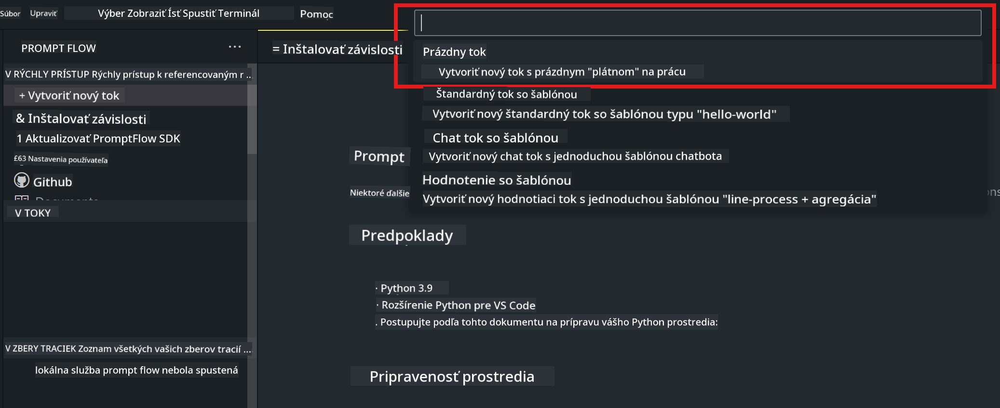
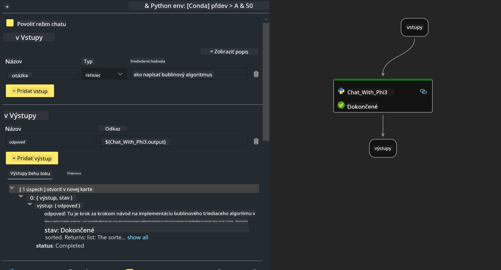

<!--
CO_OP_TRANSLATOR_METADATA:
{
  "original_hash": "bc29f7fe7fc16bed6932733eac8c81b8",
  "translation_date": "2025-07-17T04:01:35+00:00",
  "source_file": "md/02.Application/02.Code/Phi3/VSCodeExt/HOL/AIPC/02.PromptflowWithNPU.md",
  "language_code": "sk"
}
-->
# **Lab 2 - Spustenie Prompt flow s Phi-3-mini v AIPC**

## **Čo je Prompt flow**

Prompt flow je súbor vývojových nástrojov navrhnutých na zjednodušenie celého vývojového cyklu AI aplikácií založených na LLM, od nápadu, prototypovania, testovania, hodnotenia až po nasadenie do produkcie a monitorovanie. Uľahčuje prácu s prompt engineeringom a umožňuje vytvárať LLM aplikácie s kvalitou vhodnou pre produkciu.

S prompt flow budete môcť:

- Vytvárať toky, ktoré prepájajú LLM, prompty, Python kód a ďalšie nástroje do vykonateľného pracovného postupu.

- Jednoducho ladiť a iterovať svoje toky, najmä interakciu s LLM.

- Hodnotiť svoje toky, počítať metriky kvality a výkonu na väčších dátových súboroch.

- Integrovať testovanie a hodnotenie do vášho CI/CD systému, aby ste zabezpečili kvalitu toku.

- Nasadiť svoje toky na vybranú platformu pre servovanie alebo ich jednoducho integrovať do kódu vašej aplikácie.

- (Voliteľné, ale veľmi odporúčané) Spolupracovať s tímom využitím cloudovej verzie Prompt flow v Azure AI.

## **Čo je AIPC**

AI PC má CPU, GPU a NPU, z ktorých každý má špecifické schopnosti akcelerácie AI. NPU, teda neurónová výpočtová jednotka, je špecializovaný akcelerátor, ktorý spracováva úlohy umelej inteligencie (AI) a strojového učenia (ML) priamo na vašom počítači, namiesto odosielania dát do cloudu. GPU a CPU tiež zvládajú tieto úlohy, no NPU je obzvlášť efektívny pri nízkoenergetických AI výpočtoch. AI PC predstavuje zásadnú zmenu v tom, ako naše počítače fungujú. Nie je to riešenie problému, ktorý predtým neexistoval, ale veľké zlepšenie pre každodenné používanie PC.

Ako to teda funguje? V porovnaní s generatívnou AI a obrovskými veľkými jazykovými modelmi (LLM) trénovanými na množstve verejných dát, AI, ktorá beží na vašom PC, je dostupnejšia na takmer každej úrovni. Koncept je jednoduchší na pochopenie a keďže je trénovaný na vašich dátach bez potreby prístupu do cloudu, výhody sú okamžite atraktívnejšie pre širšiu skupinu používateľov.

V blízkej budúcnosti AI PC znamená osobných asistentov a menšie AI modely bežiace priamo na vašom počítači, ktoré využívajú vaše dáta na poskytovanie osobných, súkromných a bezpečnejších AI vylepšení pre bežné činnosti – zapisovanie zápisníc zo stretnutí, organizovanie fantasy futbalovej ligy, automatizáciu úprav fotografií a videí alebo plánovanie ideálneho itinerára na rodinné stretnutie podľa príchodov a odchodov všetkých účastníkov.

## **Vytváranie generatívnych kódových tokov na AIPC**

***Note*** ：Ak ste ešte nenainštalovali prostredie, navštívte prosím [Lab 0 - Inštalácie](./01.Installations.md)

1. Otvorte rozšírenie Prompt flow vo Visual Studio Code a vytvorte prázdny projekt toku



2. Pridajte vstupné a výstupné parametre a pridajte Python kód ako nový tok



Môžete sa riadiť touto štruktúrou (flow.dag.yaml) pri zostavovaní svojho toku

```yaml

inputs:
  question:
    type: string
    default: how to write Bubble Algorithm
outputs:
  answer:
    type: string
    reference: ${Chat_With_Phi3.output}
nodes:
- name: Chat_With_Phi3
  type: python
  source:
    type: code
    path: Chat_With_Phi3.py
  inputs:
    question: ${inputs.question}


```

3. Pridajte kód do ***Chat_With_Phi3.py***

```python


from promptflow.core import tool

# import torch
from transformers import AutoTokenizer, pipeline,TextStreamer
import intel_npu_acceleration_library as npu_lib

import warnings

import asyncio
import platform

class Phi3CodeAgent:
    
    model = None
    tokenizer = None
    text_streamer = None
    
    model_id = "microsoft/Phi-3-mini-4k-instruct"

    @staticmethod
    def init_phi3():
        
        if Phi3CodeAgent.model is None or Phi3CodeAgent.tokenizer is None or Phi3CodeAgent.text_streamer is None:
            Phi3CodeAgent.model = npu_lib.NPUModelForCausalLM.from_pretrained(
                                    Phi3CodeAgent.model_id,
                                    torch_dtype="auto",
                                    dtype=npu_lib.int4,
                                    trust_remote_code=True
                                )
            Phi3CodeAgent.tokenizer = AutoTokenizer.from_pretrained(Phi3CodeAgent.model_id)
            Phi3CodeAgent.text_streamer = TextStreamer(Phi3CodeAgent.tokenizer, skip_prompt=True)

    

    @staticmethod
    def chat_with_phi3(prompt):
        
        Phi3CodeAgent.init_phi3()

        messages = "<|system|>You are a AI Python coding assistant. Please help me to generate code in Python.The answer only genertated Python code, but any comments and instructions do not need to be generated<|end|><|user|>" + prompt +"<|end|><|assistant|>"


        generation_args = {
            "max_new_tokens": 1024,
            "return_full_text": False,
            "temperature": 0.3,
            "do_sample": False,
            "streamer": Phi3CodeAgent.text_streamer,
        }

        pipe = pipeline(
            "text-generation",
            model=Phi3CodeAgent.model,
            tokenizer=Phi3CodeAgent.tokenizer,
            # **generation_args
        )

        result = ''

        with warnings.catch_warnings():
            warnings.simplefilter("ignore")
            response = pipe(messages, **generation_args)
            result =response[0]['generated_text']
            return result


@tool
def my_python_tool(question: str) -> str:
    if platform.system() == 'Windows':
        asyncio.set_event_loop_policy(asyncio.WindowsSelectorEventLoopPolicy())
    return Phi3CodeAgent.chat_with_phi3(question)


```

4. Tok môžete otestovať cez Debug alebo Run, aby ste skontrolovali, či generovanie kódu funguje správne


5. Spustite tok ako vývojové API v termináli

```

pf flow serve --source ./ --port 8080 --host localhost   

```

Môžete ho otestovať v Postman / Thunder Client

### **Note**

1. Prvé spustenie trvá dlhšie. Odporúča sa stiahnuť model phi-3 cez Hugging face CLI.

2. Vzhľadom na obmedzený výpočtový výkon Intel NPU sa odporúča používať Phi-3-mini-4k-instruct.

3. Používame Intel NPU akceleráciu na kvantizáciu INT4 konverzie, ale ak službu znovu spustíte, je potrebné vymazať cache a nc_workshop priečinky.

## **Zdroje**

1. Naučte sa Promptflow [https://microsoft.github.io/promptflow/](https://microsoft.github.io/promptflow/)

2. Naučte sa Intel NPU akceleráciu [https://github.com/intel/intel-npu-acceleration-library](https://github.com/intel/intel-npu-acceleration-library)

3. Ukážkový kód, stiahnite [Local NPU Agent Sample Code](../../../../../../../../../code/07.Lab/01/AIPC)

**Vyhlásenie o zodpovednosti**:  
Tento dokument bol preložený pomocou AI prekladateľskej služby [Co-op Translator](https://github.com/Azure/co-op-translator). Aj keď sa snažíme o presnosť, prosím, majte na pamäti, že automatizované preklady môžu obsahovať chyby alebo nepresnosti. Pôvodný dokument v jeho rodnom jazyku by mal byť považovaný za autoritatívny zdroj. Pre kritické informácie sa odporúča profesionálny ľudský preklad. Nie sme zodpovední za akékoľvek nedorozumenia alebo nesprávne interpretácie vyplývajúce z použitia tohto prekladu.