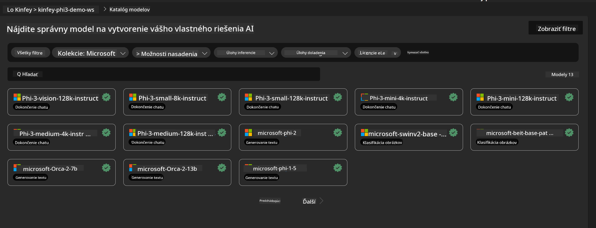
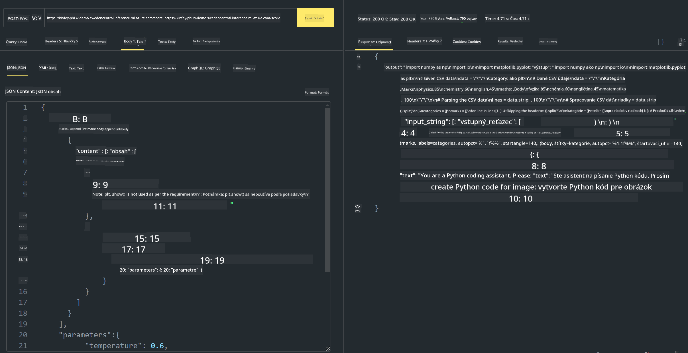

<!--
CO_OP_TRANSLATOR_METADATA:
{
  "original_hash": "20cb4e6ac1686248e8be913ccf6c2bc2",
  "translation_date": "2025-05-09T19:30:06+00:00",
  "source_file": "md/02.Application/02.Code/Phi3/VSCodeExt/HOL/AIPC/03.DeployPhi3VisionOnAzure.md",
  "language_code": "sk"
}
-->
# **Laboratórium 3 - Nasadenie Phi-3-vision v Azure Machine Learning Service**

Používame NPU na dokončenie produkčného nasadenia lokálneho kódu, a potom chceme cez to zaviesť schopnosť využívať PHI-3-VISION na generovanie kódu z obrázkov.

V tomto úvode si rýchlo vytvoríme Model As Service Phi-3 Vision službu v Azure Machine Learning Service.

***Note***: Phi-3 Vision vyžaduje výpočtový výkon na rýchlejšie generovanie obsahu. Potrebujeme cloudový výpočtový výkon, ktorý nám s tým pomôže.

### **1. Vytvorenie Azure Machine Learning Service**

Musíme vytvoriť Azure Machine Learning Service v Azure Portáli. Ak sa chcete naučiť ako, navštívte tento odkaz [https://learn.microsoft.com/azure/machine-learning/quickstart-create-resources?view=azureml-api-2](https://learn.microsoft.com/azure/machine-learning/quickstart-create-resources?view=azureml-api-2)

### **2. Výber Phi-3 Vision v Azure Machine Learning Service**



### **3. Nasadenie Phi-3-Vision v Azure**


### **4. Testovanie Endpointu v Postmane**



***Note***

1. Parametre, ktoré sa majú odoslať, musia obsahovať Authorization, azureml-model-deployment a Content-Type. Potrebujete skontrolovať informácie o nasadení, aby ste ich získali.

2. Na odoslanie parametrov Phi-3-Vision potrebuje odoslať odkaz na obrázok. Pozrite si spôsob prenosu parametrov podľa GPT-4-Vision, napríklad

```json

{
  "input_data":{
    "input_string":[
      {
        "role":"user",
        "content":[ 
          {
            "type": "text",
            "text": "You are a Python coding assistant.Please create Python code for image "
          },
          {
              "type": "image_url",
              "image_url": {
                "url": "https://ajaytech.co/wp-content/uploads/2019/09/index.png"
              }
          }
        ]
      }
    ],
    "parameters":{
          "temperature": 0.6,
          "top_p": 0.9,
          "do_sample": false,
          "max_new_tokens": 2048
    }
  }
}

```

3. Zavolajte **/score** pomocou metódy Post

**Gratulujeme**! Úspešne ste dokončili rýchle nasadenie PHI-3-VISION a vyskúšali, ako generovať kód z obrázkov. Ďalej môžeme vytvárať aplikácie v kombinácii s NPU a cloudom.

**Vyhlásenie o zodpovednosti**:  
Tento dokument bol preložený pomocou AI prekladateľskej služby [Co-op Translator](https://github.com/Azure/co-op-translator). Hoci sa snažíme o presnosť, prosím berte na vedomie, že automatizované preklady môžu obsahovať chyby alebo nepresnosti. Pôvodný dokument v jeho rodnom jazyku by mal byť považovaný za autoritatívny zdroj. Pre kritické informácie sa odporúča profesionálny ľudský preklad. Nie sme zodpovední za žiadne nedorozumenia alebo nesprávne výklady vyplývajúce z použitia tohto prekladu.