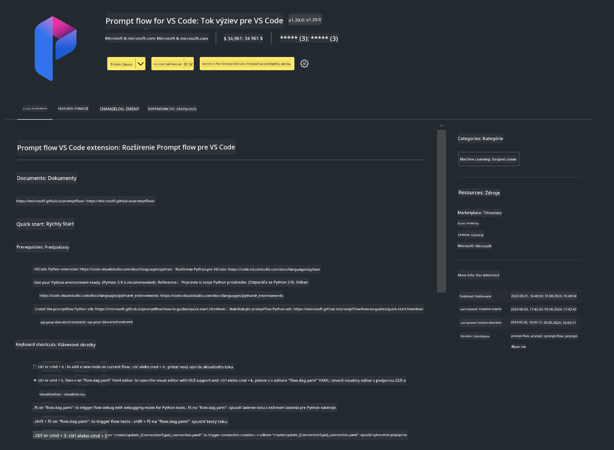

<!--
CO_OP_TRANSLATOR_METADATA:
{
  "original_hash": "4b16264917d9b93169745d92b8ce8c65",
  "translation_date": "2025-05-09T19:37:05+00:00",
  "source_file": "md/02.Application/02.Code/Phi3/VSCodeExt/HOL/Apple/01.Installations.md",
  "language_code": "sk"
}
-->
# **Lab 0 - Inštalácia**

Keď vstúpime do Labu, potrebujeme nakonfigurovať príslušné prostredie:

### **1. Python 3.11+**

Odporúča sa použiť miniforge na nastavenie vášho Python prostredia.

Pre konfiguráciu miniforge, pozrite si [https://github.com/conda-forge/miniforge](https://github.com/conda-forge/miniforge)

Po nastavení miniforge spustite nasledujúci príkaz v Power Shelli

```bash

conda create -n pyenv python==3.11.8 -y

conda activate pyenv

```

### **2. Inštalácia Prompt flow SDK**

V Labe 1 používame Prompt flow, takže je potrebné nakonfigurovať Prompt flow SDK.

```bash

pip install promptflow --upgrade

```

Môžete skontrolovať promptflow sdk týmto príkazom

```bash

pf --version

```

### **3. Inštalácia rozšírenia Prompt flow pre Visual Studio Code**



### **4. Apple MLX Framework**

MLX je framework pre strojové učenie na Apple silicium, vyvinutý Apple machine learning výskumom. Môžete použiť **Apple MLX framework** na zrýchlenie LLM / SLM s Apple Silicon. Ak chcete vedieť viac, môžete si prečítať [https://github.com/microsoft/PhiCookBook/blob/main/md/01.Introduction/03/MLX_Inference.md](https://github.com/microsoft/PhiCookBook/blob/main/md/01.Introduction/03/MLX_Inference.md).

Nainštalujte MLX framework knižnicu v bashi

```bash

pip install mlx-lm

```

### **5. Ďalšie Python knižnice**

vytvorte súbor requirements.txt a pridajte tento obsah

```txt

notebook
numpy 
scipy 
scikit-learn 
matplotlib 
pandas 
pillow 
graphviz

```

### **6. Inštalácia NVM**

nainštalujte nvm v Powershelli

```bash

brew install nvm

```

nainštalujte nodejs 18.20

```bash

nvm install 18.20.0

nvm use 18.20.0

```

### **7. Inštalácia podpory vývoja vo Visual Studio Code**

```bash

npm install --global yo generator-code

```

Gratulujeme! Úspešne ste nakonfigurovali SDK. Teraz pokračujte k praktickým krokom.

**Vyhlásenie o zodpovednosti**:  
Tento dokument bol preložený pomocou AI prekladateľskej služby [Co-op Translator](https://github.com/Azure/co-op-translator). Aj keď sa snažíme o presnosť, vezmite prosím na vedomie, že automatizované preklady môžu obsahovať chyby alebo nepresnosti. Originálny dokument v jeho pôvodnom jazyku by mal byť považovaný za autoritatívny zdroj. Pre dôležité informácie sa odporúča profesionálny ľudský preklad. Nezodpovedáme za akékoľvek nedorozumenia alebo nesprávne interpretácie vyplývajúce z použitia tohto prekladu.