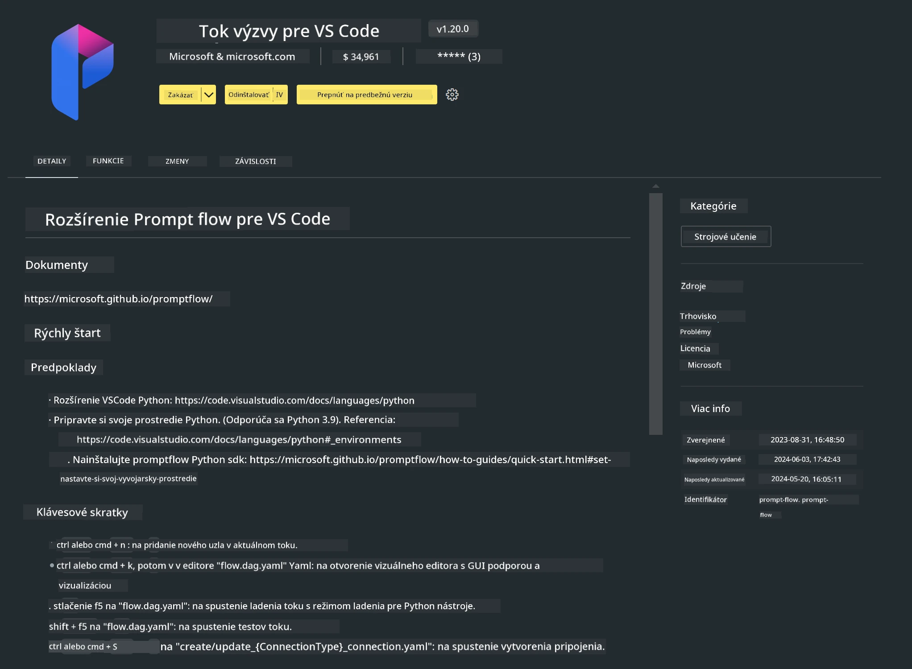

# **Lab 0 - Inštalácia**

Keď vstúpime do laboratória, je potrebné nastaviť príslušné prostredie:


### **1. Python 3.11+**

Odporúča sa použiť miniforge na nastavenie vášho Python prostredia.

Pre konfiguráciu miniforge, prosím, pozrite si [https://github.com/conda-forge/miniforge](https://github.com/conda-forge/miniforge)

Po nastavení miniforge spustite nasledujúci príkaz v Power Shelli

```bash

conda create -n pyenv python==3.11.8 -y

conda activate pyenv

```


### **2. Inštalácia Prompt flow SDK**

V Labe 1 používame Prompt flow, preto je potrebné nastaviť Prompt flow SDK.

```bash

pip install promptflow --upgrade

```

Promptflow sdk môžete overiť týmto príkazom


```bash

pf --version

```

### **3. Inštalácia rozšírenia Prompt flow pre Visual Studio Code**



### **4. Apple MLX Framework**

MLX je framework pre strojové učenie na Apple silikóne, vyvinutý Apple machine learning výskumom. Môžete použiť **Apple MLX framework** na zrýchlenie LLM / SLM na Apple Silicon. Ak chcete vedieť viac, prečítajte si [https://github.com/microsoft/PhiCookBook/blob/main/md/01.Introduction/03/MLX_Inference.md](https://github.com/microsoft/PhiCookBook/blob/main/md/01.Introduction/03/MLX_Inference.md).

Nainštalujte MLX framework knižnicu v bash


```bash

pip install mlx-lm

```


### **5. Ďalšie Python knižnice**


vytvorte súbor requirements.txt a pridajte tento obsah

```txt

notebook
numpy 
scipy 
scikit-learn 
matplotlib 
pandas 
pillow 
graphviz

```


### **6. Inštalácia NVM**

nainštalujte nvm v Powershelli


```bash

brew install nvm

```

nainštalujte nodejs 18.20


```bash

nvm install 18.20.0

nvm use 18.20.0

```

### **7. Inštalácia podpory vývoja vo Visual Studio Code**


```bash

npm install --global yo generator-code

```

Gratulujeme! Úspešne ste nastavili SDK. Pokračujte na praktické kroky.

**Vyhlásenie o zodpovednosti**:  
Tento dokument bol preložený pomocou AI prekladateľskej služby [Co-op Translator](https://github.com/Azure/co-op-translator). Hoci sa snažíme o presnosť, prosím, majte na pamäti, že automatizované preklady môžu obsahovať chyby alebo nepresnosti. Originálny dokument v jeho pôvodnom jazyku by mal byť považovaný za autoritatívny zdroj. Pre kritické informácie sa odporúča profesionálny ľudský preklad. Nie sme zodpovední za akékoľvek nedorozumenia alebo nesprávne interpretácie vyplývajúce z použitia tohto prekladu.