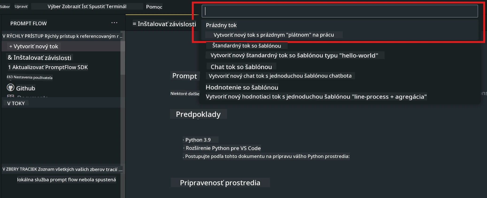
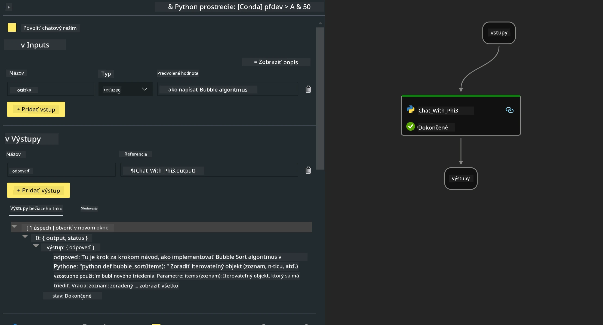

<!--
CO_OP_TRANSLATOR_METADATA:
{
  "original_hash": "3dbbf568625b1ee04b354c2dc81d3248",
  "translation_date": "2025-07-17T04:28:43+00:00",
  "source_file": "md/02.Application/02.Code/Phi3/VSCodeExt/HOL/Apple/02.PromptflowWithMLX.md",
  "language_code": "sk"
}
-->
# **Lab 2 - Spustenie Prompt flow s Phi-3-mini v AIPC**

## **Čo je Prompt flow**

Prompt flow je súbor vývojových nástrojov navrhnutých na zjednodušenie celého vývojového cyklu AI aplikácií založených na LLM, od nápadu, prototypovania, testovania, hodnotenia až po nasadenie do produkcie a monitorovanie. Uľahčuje prácu s prompt engineeringom a umožňuje vytvárať LLM aplikácie s kvalitou vhodnou pre produkciu.

S prompt flow budete môcť:

- Vytvárať toky, ktoré prepájajú LLM, prompty, Python kód a ďalšie nástroje do spustiteľného pracovného postupu.

- Jednoducho ladiť a iterovať svoje toky, najmä interakciu s LLM.

- Hodnotiť svoje toky, počítať metriky kvality a výkonu na väčších dátových súboroch.

- Integrovať testovanie a hodnotenie do vášho CI/CD systému, aby ste zabezpečili kvalitu toku.

- Nasadiť svoje toky na vybranú platformu pre servovanie alebo ich jednoducho integrovať do kódu vašej aplikácie.

- (Voliteľné, ale veľmi odporúčané) Spolupracovať s tímom využitím cloudovej verzie Prompt flow v Azure AI.

## **Vytváranie generujúcich kódových tokov na Apple Silicon**

***Poznámka*** ：Ak ste ešte nenainštalovali prostredie, navštívte [Lab 0 - Inštalácie](./01.Installations.md)

1. Otvorte rozšírenie Prompt flow vo Visual Studio Code a vytvorte prázdny projekt toku



2. Pridajte vstupné a výstupné parametre a pridajte Python kód ako nový tok



Môžete sa riadiť touto štruktúrou (flow.dag.yaml) pri zostavovaní svojho toku

```yaml

inputs:
  prompt:
    type: string
    default: Write python code for Fibonacci serie. Please use markdown as output
outputs:
  result:
    type: string
    reference: ${gen_code_by_phi3.output}
nodes:
- name: gen_code_by_phi3
  type: python
  source:
    type: code
    path: gen_code_by_phi3.py
  inputs:
    prompt: ${inputs.prompt}


```

3. Kvantifikácia phi-3-mini

Chceme lepšie spustiť SLM na lokálnych zariadeniach. Vo všeobecnosti kvantifikujeme model (INT4, FP16, FP32)

```bash

python -m mlx_lm.convert --hf-path microsoft/Phi-3-mini-4k-instruct

```

**Poznámka:** predvolený priečinok je mlx_model

4. Pridajte kód do ***Chat_With_Phi3.py***

```python


from promptflow import tool

from mlx_lm import load, generate


# The inputs section will change based on the arguments of the tool function, after you save the code
# Adding type to arguments and return value will help the system show the types properly
# Please update the function name/signature per need
@tool
def my_python_tool(prompt: str) -> str:

    model_id = './mlx_model_phi3_mini'

    model, tokenizer = load(model_id)

    # <|user|>\nWrite python code for Fibonacci serie. Please use markdown as output<|end|>\n<|assistant|>

    response = generate(model, tokenizer, prompt="<|user|>\n" + prompt  + "<|end|>\n<|assistant|>", max_tokens=2048, verbose=True)

    return response


```

4. Tok môžete otestovať cez Debug alebo Run, aby ste skontrolovali, či generovanie kódu funguje správne


5. Spustite tok ako vývojové API v termináli

```

pf flow serve --source ./ --port 8080 --host localhost   

```

Môžete ho otestovať v Postman / Thunder Client

### **Poznámka**

1. Prvé spustenie trvá dlhšie. Odporúča sa stiahnuť model phi-3 cez Hugging face CLI.

2. Vzhľadom na obmedzený výpočtový výkon Intel NPU sa odporúča použiť Phi-3-mini-4k-instruct.

3. Používame Intel NPU Acceleration na kvantizáciu INT4 konverzie, ale ak službu znovu spustíte, je potrebné vymazať cache a priečinky nc_workshop.

## **Zdroje**

1. Naučte sa Promptflow [https://microsoft.github.io/promptflow/](https://microsoft.github.io/promptflow/)

2. Naučte sa Intel NPU Acceleration [https://github.com/intel/intel-npu-acceleration-library](https://github.com/intel/intel-npu-acceleration-library)

3. Ukážkový kód, stiahnite si [Local NPU Agent Sample Code](../../../../../../../../../code/07.Lab/01/AIPC/local-npu-agent)

**Vyhlásenie o zodpovednosti**:  
Tento dokument bol preložený pomocou AI prekladateľskej služby [Co-op Translator](https://github.com/Azure/co-op-translator). Hoci sa snažíme o presnosť, prosím, majte na pamäti, že automatizované preklady môžu obsahovať chyby alebo nepresnosti. Originálny dokument v jeho pôvodnom jazyku by mal byť považovaný za autoritatívny zdroj. Pre kritické informácie sa odporúča profesionálny ľudský preklad. Nie sme zodpovední za akékoľvek nedorozumenia alebo nesprávne interpretácie vyplývajúce z použitia tohto prekladu.