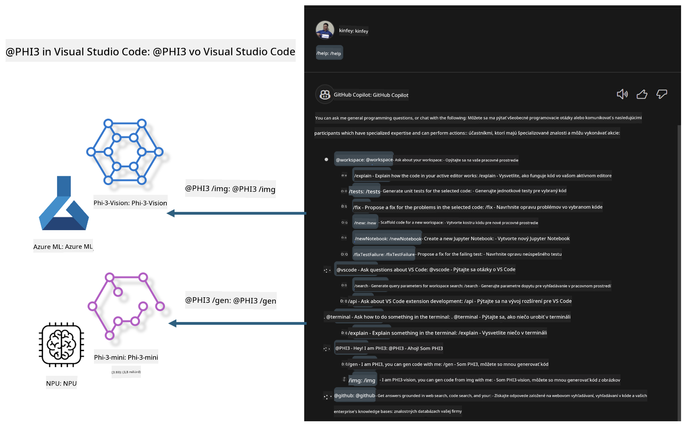

<!--
CO_OP_TRANSLATOR_METADATA:
{
  "original_hash": "00b7a699de8ac405fa821f4c0f7fc0ab",
  "translation_date": "2025-05-09T19:16:58+00:00",
  "source_file": "md/02.Application/02.Code/Phi3/VSCodeExt/README.md",
  "language_code": "sk"
}
-->
# **Vytvorte si vlastný Visual Studio Code GitHub Copilot Chat s Microsoft Phi-3 Family**

Použili ste už workspace agenta v GitHub Copilot Chat? Chcete si vytvoriť vlastného kódového agenta pre svoj tím? Tento praktický workshop má za cieľ spojiť open source model na vytvorenie podnikateľského kódového agenta na úrovni firmy.

## **Základy**

### **Prečo si vybrať Microsoft Phi-3**

Phi-3 je rodina modelov, ktorá zahŕňa phi-3-mini, phi-3-small a phi-3-medium, založené na rôznych tréningových parametroch pre generovanie textu, dokončenie dialógu a generovanie kódu. K dispozícii je aj phi-3-vision založený na Vision. Je vhodný pre podniky alebo rôzne tímy na vytváranie offline generatívnych AI riešení.

Odporúčame prečítať si tento odkaz [https://github.com/microsoft/PhiCookBook/blob/main/md/01.Introduction/01/01.PhiFamily.md](https://github.com/microsoft/PhiCookBook/blob/main/md/01.Introduction/01/01.PhiFamily.md)

### **Microsoft GitHub Copilot Chat**

Rozšírenie GitHub Copilot Chat vám poskytuje chat rozhranie, ktoré vám umožňuje komunikovať s GitHub Copilot a dostávať odpovede na otázky súvisiace s kódovaním priamo vo VS Code, bez potreby prehľadávať dokumentáciu alebo fóra online.

Copilot Chat môže používať zvýraznenie syntaxe, odsadenie a ďalšie formátovacie prvky, aby bola generovaná odpoveď prehľadnejšia. V závislosti od typu otázky od používateľa môže výsledok obsahovať odkazy na kontext, ktorý Copilot použil pri generovaní odpovede, ako napríklad zdrojové súbory alebo dokumentáciu, alebo tlačidlá na prístup k funkciám VS Code.

- Copilot Chat sa integruje do vášho vývojového toku a poskytuje pomoc tam, kde ju potrebujete:

- Začnite inline chat konverzáciu priamo z editora alebo terminálu, keď potrebujete pomoc počas kódovania

- Použite Chat zobrazenie, aby ste mali AI asistenta po ruke kedykoľvek

- Spustite Quick Chat, aby ste položili rýchlu otázku a mohli sa okamžite vrátiť k práci

GitHub Copilot Chat môžete použiť v rôznych situáciách, napríklad:

- Odpovedať na otázky ohľadom kódovania, ako najlepšie vyriešiť problém

- Vysvetliť kód niekoho iného a navrhnúť zlepšenia

- Navrhnúť opravy kódu

- Generovať jednotkové testy

- Generovať dokumentáciu kódu

Odporúčame prečítať si tento odkaz [https://code.visualstudio.com/docs/copilot/copilot-chat](https://code.visualstudio.com/docs/copilot/copilot-chat?WT.mc_id=aiml-137032-kinfeylo)

###  **Microsoft GitHub Copilot Chat @workspace**

Odkazovanie na **@workspace** v Copilot Chat vám umožňuje klásť otázky o celom vašom kódovom základe. Na základe otázky Copilot inteligentne vyhľadá relevantné súbory a symboly, ktoré potom uvádza vo svojej odpovedi ako odkazy a príklady kódu.

Na zodpovedanie vašej otázky **@workspace** prehľadáva rovnaké zdroje, aké by vývojár použil pri navigácii v kódovej základni vo VS Code:

- Všetky súbory v pracovnom priestore, okrem tých, ktoré sú ignorované súborom .gitignore

- Štruktúru adresárov s vnorenými priečinkami a názvami súborov

- Index vyhľadávania kódu GitHubu, ak je workspace GitHub repozitár a je indexovaný kódovým vyhľadávaním

- Symboly a definície v pracovnom priestore

- Aktuálne vybraný text alebo viditeľný text v aktívnom editore

Poznámka: .gitignore sa obchádza, ak máte otvorený súbor alebo máte vybraný text v ignorovanom súbore.

Odporúčame prečítať si tento odkaz [[https://code.visualstudio.com/docs/copilot/copilot-chat](https://code.visualstudio.com/docs/copilot/workspace-context?WT.mc_id=aiml-137032-kinfeylo)]

## **Viac o tomto workshope**

GitHub Copilot výrazne zlepšil efektivitu programovania v podnikoch a každý podnik chce prispôsobiť relevantné funkcie GitHub Copilot. Mnohé firmy si vytvorili vlastné rozšírenia podobné GitHub Copilot na základe svojich obchodných scenárov a open source modelov. Pre podniky sú prispôsobené rozšírenia ľahšie na kontrolu, no zároveň to môže ovplyvniť používateľský zážitok. GitHub Copilot má totiž silnejšie funkcie pri riešení všeobecných scenárov a profesionálnosti. Ak sa podarí zachovať konzistentný zážitok, je lepšie prispôsobiť vlastné rozšírenie firmy. GitHub Copilot Chat poskytuje relevantné API pre podniky na rozšírenie chatovacieho zážitku. Udržiavanie konzistentného zážitku spolu s prispôsobenými funkciami prináša lepší používateľský zážitok.

Tento workshop využíva model Phi-3 v kombinácii s lokálnym NPU a hybridom Azure na vytvorenie vlastného Agenta v GitHub Copilot Chat ***@PHI3*** na pomoc vývojárom v podniku pri dokončení generovania kódu***(@PHI3 /gen)*** a generovaní kódu na základe obrázkov ***(@PHI3 /img)***.

### ***Poznámka:*** 

Tento workshop je momentálne implementovaný na AIPC Intel CPU a Apple Silicon. Pokračujeme v aktualizácii verzie pre Qualcomm NPU.

## **Workshop**

| Názov | Popis | AIPC | Apple |
| ------------ | ----------- | -------- |-------- |
| Lab0 - Inštalácie(✅) | Konfigurácia a inštalácia súvisiacich prostredí a inštalačných nástrojov | [Go](./HOL/AIPC/01.Installations.md) |[Go](./HOL/Apple/01.Installations.md) |
| Lab1 - Spustenie Prompt flow s Phi-3-mini (✅) | Využitie AIPC / Apple Silicon, lokálneho NPU na vytvorenie generovania kódu cez Phi-3-mini | [Go](./HOL/AIPC/02.PromptflowWithNPU.md) |  [Go](./HOL/Apple/02.PromptflowWithMLX.md) |
| Lab2 - Nasadenie Phi-3-vision na Azure Machine Learning Service(✅) | Generovanie kódu nasadením modelového katalógu Azure Machine Learning Service - Phi-3-vision image | [Go](./HOL/AIPC/03.DeployPhi3VisionOnAzure.md) |[Go](./HOL/Apple/03.DeployPhi3VisionOnAzure.md) |
| Lab3 - Vytvorenie @phi-3 agenta v GitHub Copilot Chat(✅)  | Vytvorenie vlastného Phi-3 agenta v GitHub Copilot Chat na dokončenie generovania kódu, generovania grafov, RAG a pod. | [Go](./HOL/AIPC/04.CreatePhi3AgentInVSCode.md) | [Go](./HOL/Apple/04.CreatePhi3AgentInVSCode.md) |
| Ukážkový kód (✅)  | Stiahnutie ukážkového kódu | [Go](../../../../../../../code/07.Lab/01/AIPC) | [Go](../../../../../../../code/07.Lab/01/Apple) |

## **Zdroje**

1. Phi-3 Cookbook [https://github.com/microsoft/Phi-3CookBook](https://github.com/microsoft/Phi-3CookBook)

2. Viac o GitHub Copilot [https://learn.microsoft.com/training/paths/copilot/](https://learn.microsoft.com/training/paths/copilot/?WT.mc_id=aiml-137032-kinfeylo)

3. Viac o GitHub Copilot Chat [https://learn.microsoft.com/training/paths/accelerate-app-development-using-github-copilot/](https://learn.microsoft.com/training/paths/accelerate-app-development-using-github-copilot/?WT.mc_id=aiml-137032-kinfeylo)

4. Viac o GitHub Copilot Chat API [https://code.visualstudio.com/api/extension-guides/chat](https://code.visualstudio.com/api/extension-guides/chat?WT.mc_id=aiml-137032-kinfeylo)

5. Viac o Azure AI Foundry [https://learn.microsoft.com/training/paths/create-custom-copilots-ai-studio/](https://learn.microsoft.com/training/paths/create-custom-copilots-ai-studio/?WT.mc_id=aiml-137032-kinfeylo)

6. Viac o modelovom katalógu Azure AI Foundry [https://learn.microsoft.com/azure/ai-studio/how-to/model-catalog-overview](https://learn.microsoft.com/azure/ai-studio/how-to/model-catalog-overview)

**Vyhlásenie o zodpovednosti**:  
Tento dokument bol preložený pomocou AI prekladateľskej služby [Co-op Translator](https://github.com/Azure/co-op-translator). Aj keď sa snažíme o presnosť, prosím, majte na pamäti, že automatizované preklady môžu obsahovať chyby alebo nepresnosti. Originálny dokument v jeho pôvodnom jazyku by mal byť považovaný za autoritatívny zdroj. Pre kritické informácie sa odporúča profesionálny ľudský preklad. Nie sme zodpovední za akékoľvek nedorozumenia alebo nesprávne interpretácie vyplývajúce z použitia tohto prekladu.