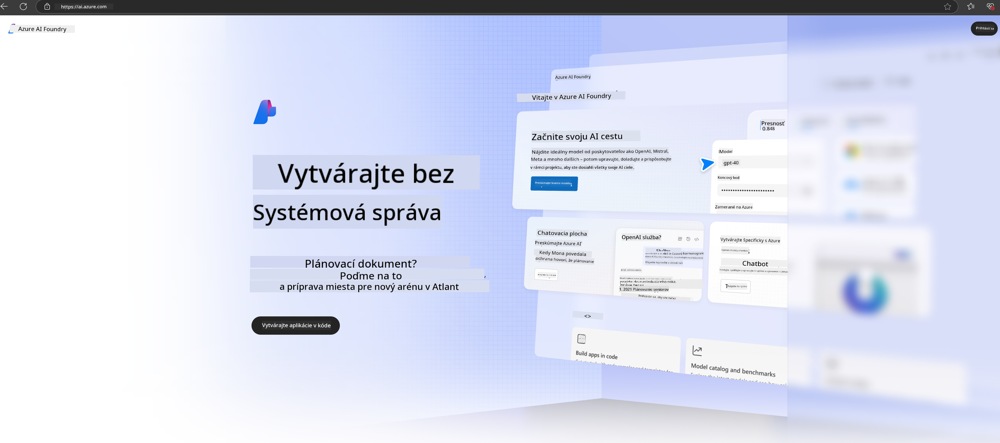

<!--
CO_OP_TRANSLATOR_METADATA:
{
  "original_hash": "3a1e48b628022485aac989c9f733e792",
  "translation_date": "2025-07-17T05:27:36+00:00",
  "source_file": "md/02.QuickStart/AzureAIFoundry_QuickStart.md",
  "language_code": "sk"
}
-->
# **Používanie Phi-3 v Azure AI Foundry**

S rozvojom generatívnej AI dúfame, že využijeme jednotnú platformu na správu rôznych LLM a SLM, integráciu podnikových dát, operácie doladenia/RAG a hodnotenie rôznych podnikových procesov po integrácii LLM a SLM, aby sa generatívna AI mohla lepšie uplatniť v inteligentných aplikáciách. [Azure AI Foundry](https://ai.azure.com) je podniková platforma pre generatívne AI aplikácie.

S Azure AI Foundry môžete hodnotiť odpovede veľkých jazykových modelov (LLM) a orchestráciu komponentov aplikácií s prompt flow pre lepší výkon. Platforma umožňuje škálovateľnosť pri transformácii dôkazov konceptu na plnohodnotnú produkciu s ľahkosťou. Neustále monitorovanie a zdokonaľovanie podporujú dlhodobý úspech.

Model Phi-3 môžeme rýchlo nasadiť na Azure AI Foundry jednoduchými krokmi a následne využiť Azure AI Foundry na dokončenie súvisiacich úloh ako Playground/Chat, doladenie, hodnotenie a ďalšie.

## **1. Príprava**

Ak už máte na svojom zariadení nainštalovaný [Azure Developer CLI](https://learn.microsoft.com/azure/developer/azure-developer-cli/overview?WT.mc_id=aiml-138114-kinfeylo), použitie tejto šablóny je také jednoduché ako spustenie tohto príkazu v novom adresári.

## Manuálne vytvorenie

Vytvorenie projektu a hubu v Microsoft Azure AI Foundry je skvelý spôsob, ako organizovať a spravovať svoju AI prácu. Tu je krok za krokom návod, ako začať:

### Vytvorenie projektu v Azure AI Foundry

1. **Prejdite na Azure AI Foundry**: Prihláste sa do portálu Azure AI Foundry.
2. **Vytvorte projekt**:
   - Ak ste už v nejakom projekte, vyberte v ľavom hornom rohu stránky „Azure AI Foundry“ pre návrat na domovskú stránku.
   - Vyberte „+ Create project“.
   - Zadajte názov projektu.
   - Ak máte hub, bude predvolene vybraný. Ak máte prístup k viacerým hubom, môžete si vybrať iný z rozbaľovacieho zoznamu. Ak chcete vytvoriť nový hub, vyberte „Create new hub“ a zadajte jeho názov.
   - Vyberte „Create“.

### Vytvorenie hubu v Azure AI Foundry

1. **Prejdite na Azure AI Foundry**: Prihláste sa pomocou svojho Azure účtu.
2. **Vytvorte hub**:
   - Vyberte Management center v ľavom menu.
   - Vyberte „All resources“, potom šípku vedľa „+ New project“ a zvoľte „+ New hub“.
   - V dialógu „Create a new hub“ zadajte názov hubu (napr. contoso-hub) a upravte ostatné polia podľa potreby.
   - Vyberte „Next“, skontrolujte informácie a potom vyberte „Create“.

Pre podrobnejšie inštrukcie môžete navštíviť oficiálnu [Microsoft dokumentáciu](https://learn.microsoft.com/azure/ai-studio/how-to/create-projects).

Po úspešnom vytvorení môžete pristupovať k vytvorenému studiu cez [ai.azure.com](https://ai.azure.com/)

Na jednom AI Foundry môže byť viacero projektov. Vytvorte si projekt v AI Foundry ako prípravu.

Vytvorte Azure AI Foundry [QuickStarts](https://learn.microsoft.com/azure/ai-studio/quickstarts/get-started-code)

## **2. Nasadenie modelu Phi v Azure AI Foundry**

Kliknite na možnosť Explore v projekte, aby ste vstúpili do Model Catalog a vyberte Phi-3

Vyberte Phi-3-mini-4k-instruct

Kliknite na 'Deploy' pre nasadenie modelu Phi-3-mini-4k-instruct

> [!NOTE]
>
> Pri nasadzovaní si môžete vybrať výpočtový výkon

## **3. Playground Chat Phi v Azure AI Foundry**

Prejdite na stránku nasadenia, vyberte Playground a komunikujte s Phi-3 v Azure AI Foundry

## **4. Nasadenie modelu z Azure AI Foundry**

Ak chcete nasadiť model z Azure Model Catalog, postupujte podľa týchto krokov:

- Prihláste sa do Azure AI Foundry.
- Vyberte model, ktorý chcete nasadiť, z katalógu modelov Azure AI Foundry.
- Na stránke Detail modelu vyberte Deploy a potom Serverless API s Azure AI Content Safety.
- Vyberte projekt, v ktorom chcete model nasadiť. Pre použitie Serverless API musí vaše pracovné prostredie patriť do regiónu East US 2 alebo Sweden Central. Môžete si prispôsobiť názov nasadenia.
- V sprievodcovi nasadením vyberte Pricing and terms, aby ste sa oboznámili s cenami a podmienkami používania.
- Vyberte Deploy. Počkajte, kým bude nasadenie pripravené a budete presmerovaní na stránku Deployments.
- Vyberte Open in playground, aby ste začali interagovať s modelom.
- Môžete sa vrátiť na stránku Deployments, vybrať nasadenie a poznamenať si cieľovú URL endpointu a Secret Key, ktoré môžete použiť na volanie nasadenia a generovanie výstupov.
- Detaily endpointu, URL a prístupové kľúče nájdete vždy v záložke Build pod sekciou Components v Deployments.

> [!NOTE]
> Upozorňujeme, že váš účet musí mať oprávnenia Azure AI Developer role na Resource Group, aby ste mohli tieto kroky vykonať.

## **5. Používanie Phi API v Azure AI Foundry**

Môžete pristupovať na https://{Your project name}.region.inference.ml.azure.com/swagger.json cez Postman GET a kombinovať to s Key, aby ste sa oboznámili s dostupnými rozhraniami.

Veľmi pohodlne získate parametre požiadaviek aj odpovedí.

**Zrieknutie sa zodpovednosti**:  
Tento dokument bol preložený pomocou AI prekladateľskej služby [Co-op Translator](https://github.com/Azure/co-op-translator). Aj keď sa snažíme o presnosť, prosím, majte na pamäti, že automatizované preklady môžu obsahovať chyby alebo nepresnosti. Pôvodný dokument v jeho rodnom jazyku by mal byť považovaný za autoritatívny zdroj. Pre kritické informácie sa odporúča profesionálny ľudský preklad. Nie sme zodpovední za akékoľvek nedorozumenia alebo nesprávne interpretácie vyplývajúce z použitia tohto prekladu.