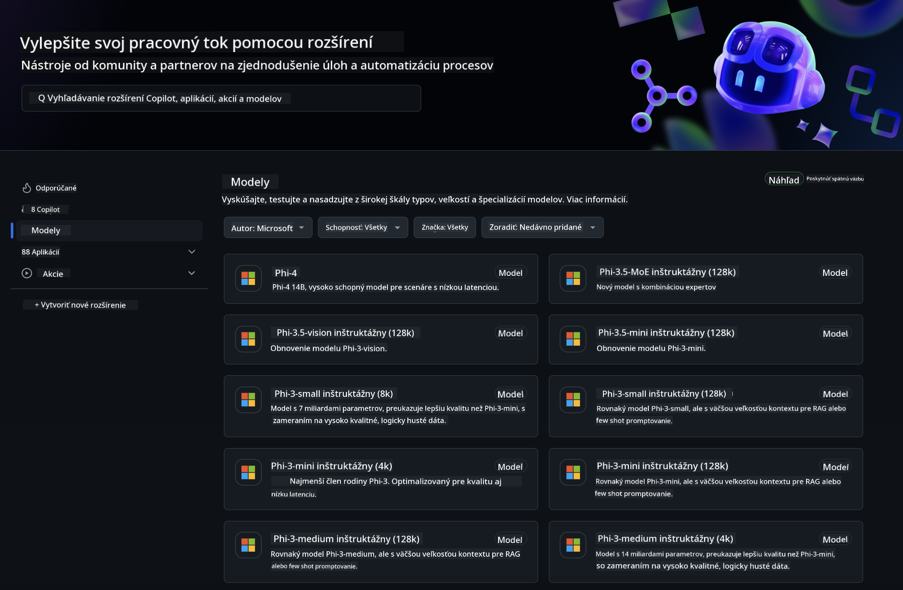

<!--
CO_OP_TRANSLATOR_METADATA:
{
  "original_hash": "5113634b77370af6790f9697d5d7de90",
  "translation_date": "2025-07-17T05:41:20+00:00",
  "source_file": "md/02.QuickStart/GitHubModel_QuickStart.md",
  "language_code": "sk"
}
-->
## GitHub Models - Obmedzená verejná beta

Vitajte na [GitHub Models](https://github.com/marketplace/models)! Všetko je pripravené na preskúmanie AI modelov hosťovaných na Azure AI.



Pre viac informácií o modeloch dostupných na GitHub Models si pozrite [GitHub Model Marketplace](https://github.com/marketplace/models)

## Dostupné modely

Každý model má vlastné prostredie na testovanie a ukážkový kód


### Phi-3 modely v GitHub Model katalógu

[Phi-3-Medium-128k-Instruct](https://github.com/marketplace/models/azureml/Phi-3-medium-128k-instruct)

[Phi-3-medium-4k-instruct](https://github.com/marketplace/models/azureml/Phi-3-medium-4k-instruct)

[Phi-3-mini-128k-instruct](https://github.com/marketplace/models/azureml/Phi-3-mini-128k-instruct)

[Phi-3-mini-4k-instruct](https://github.com/marketplace/models/azureml/Phi-3-mini-4k-instruct)

[Phi-3-small-128k-instruct](https://github.com/marketplace/models/azureml/Phi-3-small-128k-instruct)

[Phi-3-small-8k-instruct](https://github.com/marketplace/models/azureml/Phi-3-small-8k-instruct)

## Začíname

K dispozícii je niekoľko základných príkladov, ktoré môžete spustiť. Nájdete ich v priečinku samples. Ak chcete prejsť priamo na svoj obľúbený jazyk, príklady sú dostupné v týchto jazykoch:

- Python
- JavaScript
- cURL

K dispozícii je tiež špeciálne prostredie Codespaces na spúšťanie príkladov a modelov.


## Ukážkový kód

Nižšie nájdete ukážky kódu pre niekoľko prípadov použitia. Pre ďalšie informácie o Azure AI Inference SDK si pozrite kompletnú dokumentáciu a príklady.

## Nastavenie

1. Vytvorte osobný prístupový token  
Nie je potrebné tokenu prideľovať žiadne oprávnenia. Upozorňujeme, že token bude odoslaný do služby Microsoft.

Na použitie nižšie uvedených ukážok kódu si vytvorte premennú prostredia, kde nastavíte svoj token ako kľúč pre klientsky kód.

Ak používate bash:  
```
export GITHUB_TOKEN="<your-github-token-goes-here>"
```  
Ak používate powershell:  

```
$Env:GITHUB_TOKEN="<your-github-token-goes-here>"
```  

Ak používate Windows príkazový riadok:  

```
set GITHUB_TOKEN=<your-github-token-goes-here>
```  

## Python ukážka

### Inštalácia závislostí  
Nainštalujte Azure AI Inference SDK pomocou pip (vyžaduje Python >=3.8):

```
pip install azure-ai-inference
```  
### Spustenie základného príkladu kódu

Tento príklad ukazuje základné volanie API pre chat completion. Využíva GitHub AI model inference endpoint a váš GitHub token. Volanie je synchronné.

```
import os
from azure.ai.inference import ChatCompletionsClient
from azure.ai.inference.models import SystemMessage, UserMessage
from azure.core.credentials import AzureKeyCredential

endpoint = "https://models.inference.ai.azure.com"
# Replace Model_Name 
model_name = "Phi-3-small-8k-instruct"
token = os.environ["GITHUB_TOKEN"]

client = ChatCompletionsClient(
    endpoint=endpoint,
    credential=AzureKeyCredential(token),
)

response = client.complete(
    messages=[
        SystemMessage(content="You are a helpful assistant."),
        UserMessage(content="What is the capital of France?"),
    ],
    model=model_name,
    temperature=1.,
    max_tokens=1000,
    top_p=1.
)

print(response.choices[0].message.content)
```

### Spustenie viackolovej konverzácie

Tento príklad ukazuje viackolovú konverzáciu s chat completion API. Pri použití modelu v chatovej aplikácii je potrebné spravovať históriu konverzácie a posielať modelu najnovšie správy.

```
import os
from azure.ai.inference import ChatCompletionsClient
from azure.ai.inference.models import AssistantMessage, SystemMessage, UserMessage
from azure.core.credentials import AzureKeyCredential

token = os.environ["GITHUB_TOKEN"]
endpoint = "https://models.inference.ai.azure.com"
# Replace Model_Name
model_name = "Phi-3-small-8k-instruct"

client = ChatCompletionsClient(
    endpoint=endpoint,
    credential=AzureKeyCredential(token),
)

messages = [
    SystemMessage(content="You are a helpful assistant."),
    UserMessage(content="What is the capital of France?"),
    AssistantMessage(content="The capital of France is Paris."),
    UserMessage(content="What about Spain?"),
]

response = client.complete(messages=messages, model=model_name)

print(response.choices[0].message.content)
```

### Streamovanie výstupu

Pre lepší používateľský zážitok je vhodné streamovať odpoveď modelu, aby sa prvý token zobrazil čo najskôr a nemuseli ste čakať na dlhé odpovede.

```
import os
from azure.ai.inference import ChatCompletionsClient
from azure.ai.inference.models import SystemMessage, UserMessage
from azure.core.credentials import AzureKeyCredential

token = os.environ["GITHUB_TOKEN"]
endpoint = "https://models.inference.ai.azure.com"
# Replace Model_Name
model_name = "Phi-3-small-8k-instruct"

client = ChatCompletionsClient(
    endpoint=endpoint,
    credential=AzureKeyCredential(token),
)

response = client.complete(
    stream=True,
    messages=[
        SystemMessage(content="You are a helpful assistant."),
        UserMessage(content="Give me 5 good reasons why I should exercise every day."),
    ],
    model=model_name,
)

for update in response:
    if update.choices:
        print(update.choices[0].delta.content or "", end="")

client.close()
```

## JavaScript

### Inštalácia závislostí

Nainštalujte Node.js.

Skopírujte nasledujúce riadky a uložte ich ako súbor package.json do vášho priečinka.

```
{
  "type": "module",
  "dependencies": {
    "@azure-rest/ai-inference": "latest",
    "@azure/core-auth": "latest",
    "@azure/core-sse": "latest"
  }
}
```

Poznámka: @azure/core-sse je potrebný iba pri streamovaní odpovedí chat completions.

Otvorte terminál v tomto priečinku a spustite npm install.

Pre každý z nižšie uvedených kódov skopírujte obsah do súboru sample.js a spustite pomocou node sample.js.

### Spustenie základného príkladu kódu

Tento príklad ukazuje základné volanie API pre chat completion. Využíva GitHub AI model inference endpoint a váš GitHub token. Volanie je synchronné.

```
import ModelClient from "@azure-rest/ai-inference";
import { AzureKeyCredential } from "@azure/core-auth";

const token = process.env["GITHUB_TOKEN"];
const endpoint = "https://models.inference.ai.azure.com";
// Update your modelname
const modelName = "Phi-3-small-8k-instruct";

export async function main() {

  const client = new ModelClient(endpoint, new AzureKeyCredential(token));

  const response = await client.path("/chat/completions").post({
    body: {
      messages: [
        { role:"system", content: "You are a helpful assistant." },
        { role:"user", content: "What is the capital of France?" }
      ],
      model: modelName,
      temperature: 1.,
      max_tokens: 1000,
      top_p: 1.
    }
  });

  if (response.status !== "200") {
    throw response.body.error;
  }
  console.log(response.body.choices[0].message.content);
}

main().catch((err) => {
  console.error("The sample encountered an error:", err);
});
```

### Spustenie viackolovej konverzácie

Tento príklad ukazuje viackolovú konverzáciu s chat completion API. Pri použití modelu v chatovej aplikácii je potrebné spravovať históriu konverzácie a posielať modelu najnovšie správy.

```
import ModelClient from "@azure-rest/ai-inference";
import { AzureKeyCredential } from "@azure/core-auth";

const token = process.env["GITHUB_TOKEN"];
const endpoint = "https://models.inference.ai.azure.com";
// Update your modelname
const modelName = "Phi-3-small-8k-instruct";

export async function main() {

  const client = new ModelClient(endpoint, new AzureKeyCredential(token));

  const response = await client.path("/chat/completions").post({
    body: {
      messages: [
        { role: "system", content: "You are a helpful assistant." },
        { role: "user", content: "What is the capital of France?" },
        { role: "assistant", content: "The capital of France is Paris." },
        { role: "user", content: "What about Spain?" },
      ],
      model: modelName,
    }
  });

  if (response.status !== "200") {
    throw response.body.error;
  }

  for (const choice of response.body.choices) {
    console.log(choice.message.content);
  }
}

main().catch((err) => {
  console.error("The sample encountered an error:", err);
});
```

### Streamovanie výstupu

Pre lepší používateľský zážitok je vhodné streamovať odpoveď modelu, aby sa prvý token zobrazil čo najskôr a nemuseli ste čakať na dlhé odpovede.

```
import ModelClient from "@azure-rest/ai-inference";
import { AzureKeyCredential } from "@azure/core-auth";
import { createSseStream } from "@azure/core-sse";

const token = process.env["GITHUB_TOKEN"];
const endpoint = "https://models.inference.ai.azure.com";
// Update your modelname
const modelName = "Phi-3-small-8k-instruct";

export async function main() {

  const client = new ModelClient(endpoint, new AzureKeyCredential(token));

  const response = await client.path("/chat/completions").post({
    body: {
      messages: [
        { role: "system", content: "You are a helpful assistant." },
        { role: "user", content: "Give me 5 good reasons why I should exercise every day." },
      ],
      model: modelName,
      stream: true
    }
  }).asNodeStream();

  const stream = response.body;
  if (!stream) {
    throw new Error("The response stream is undefined");
  }

  if (response.status !== "200") {
    stream.destroy();
    throw new Error(`Failed to get chat completions, http operation failed with ${response.status} code`);
  }

  const sseStream = createSseStream(stream);

  for await (const event of sseStream) {
    if (event.data === "[DONE]") {
      return;
    }
    for (const choice of (JSON.parse(event.data)).choices) {
        process.stdout.write(choice.delta?.content ?? ``);
    }
  }
}

main().catch((err) => {
  console.error("The sample encountered an error:", err);
});
```

## REST

### Spustenie základného príkladu kódu

Vložte nasledujúce do shellu:

```
curl -X POST "https://models.inference.ai.azure.com/chat/completions" \
    -H "Content-Type: application/json" \
    -H "Authorization: Bearer $GITHUB_TOKEN" \
    -d '{
        "messages": [
            {
                "role": "system",
                "content": "You are a helpful assistant."
            },
            {
                "role": "user",
                "content": "What is the capital of France?"
            }
        ],
        "model": "Phi-3-small-8k-instruct"
    }'
```

### Spustenie viackolovej konverzácie

Volajte chat completion API a odovzdajte históriu chatu:

```
curl -X POST "https://models.inference.ai.azure.com/chat/completions" \
    -H "Content-Type: application/json" \
    -H "Authorization: Bearer $GITHUB_TOKEN" \
    -d '{
        "messages": [
            {
                "role": "system",
                "content": "You are a helpful assistant."
            },
            {
                "role": "user",
                "content": "What is the capital of France?"
            },
            {
                "role": "assistant",
                "content": "The capital of France is Paris."
            },
            {
                "role": "user",
                "content": "What about Spain?"
            }
        ],
        "model": "Phi-3-small-8k-instruct"
    }'
```

### Streamovanie výstupu

Toto je príklad volania endpointu so streamovaním odpovede.

```
curl -X POST "https://models.inference.ai.azure.com/chat/completions" \
    -H "Content-Type: application/json" \
    -H "Authorization: Bearer $GITHUB_TOKEN" \
    -d '{
        "messages": [
            {
                "role": "system",
                "content": "You are a helpful assistant."
            },
            {
                "role": "user",
                "content": "Give me 5 good reasons why I should exercise every day."
            }
        ],
        "stream": true,
        "model": "Phi-3-small-8k-instruct"
    }'
```

## Bezplatné používanie a limity pre GitHub Models


[Limity pre používanie playgroundu a bezplatné API](https://docs.github.com/en/github-models/prototyping-with-ai-models#rate-limits) sú určené na experimentovanie s modelmi a prototypovanie AI aplikácií. Ak chcete prekročiť tieto limity a škálovať svoju aplikáciu, musíte si zabezpečiť zdroje z Azure účtu a autentifikovať sa tam namiesto použitia osobného GitHub tokenu. V kóde nie je potrebné nič meniť. Použite tento odkaz, aby ste zistili, ako prekročiť limity bezplatnej úrovne v Azure AI.

### Upozornenia

Pamätajte, že pri interakcii s modelom experimentujete s AI, takže môžu sa vyskytnúť chyby v obsahu.

Funkcia je obmedzená rôznymi limitmi (vrátane počtu požiadaviek za minútu, za deň, tokenov na požiadavku a súbežných požiadaviek) a nie je určená na produkčné použitie.

GitHub Models používa Azure AI Content Safety. Tieto filtre nie je možné v rámci GitHub Models vypnúť. Ak sa rozhodnete používať modely cez platenú službu, nakonfigurujte si filtre obsahu podľa svojich požiadaviek.

Táto služba je poskytovaná podľa GitHub Pre-release Terms.

**Vyhlásenie o zodpovednosti**:  
Tento dokument bol preložený pomocou AI prekladateľskej služby [Co-op Translator](https://github.com/Azure/co-op-translator). Aj keď sa snažíme o presnosť, prosím, majte na pamäti, že automatizované preklady môžu obsahovať chyby alebo nepresnosti. Pôvodný dokument v jeho rodnom jazyku by mal byť považovaný za autoritatívny zdroj. Pre kritické informácie sa odporúča profesionálny ľudský preklad. Nie sme zodpovední za akékoľvek nedorozumenia alebo nesprávne interpretácie vyplývajúce z použitia tohto prekladu.