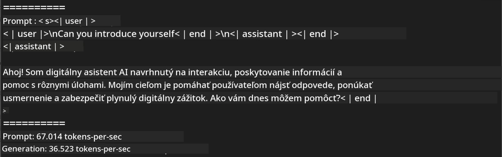
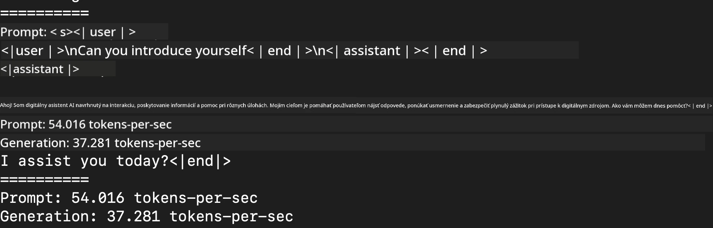
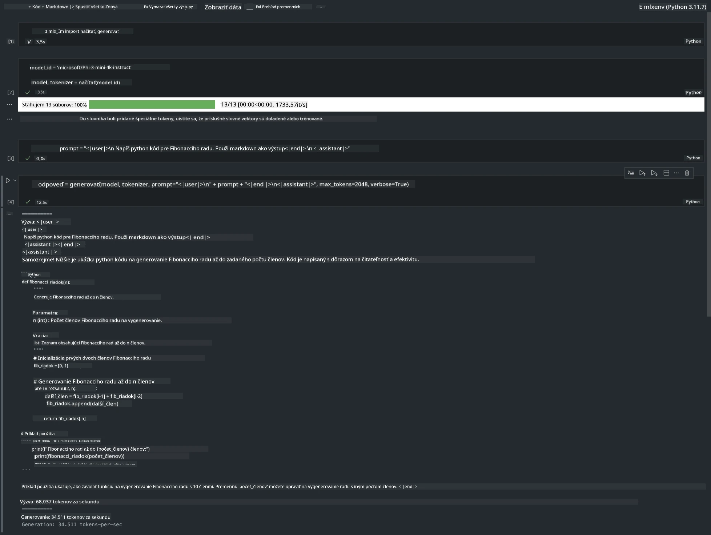

<!--
CO_OP_TRANSLATOR_METADATA:
{
  "original_hash": "dcb656f3d206fc4968e236deec5d4384",
  "translation_date": "2025-07-17T10:09:07+00:00",
  "source_file": "md/03.FineTuning/03.Inference/MLX_Inference.md",
  "language_code": "sk"
}
-->
# **Inference Phi-3 s Apple MLX Framework**

## **Čo je MLX Framework**

MLX je framework pre pole dát určený na výskum strojového učenia na Apple silicium, vyvinutý tímom Apple pre výskum strojového učenia.

MLX je navrhnutý výskumníkmi strojového učenia pre výskumníkov strojového učenia. Framework je určený tak, aby bol používateľsky prívetivý, no zároveň efektívny na trénovanie a nasadzovanie modelov. Dizajn frameworku je zároveň konceptuálne jednoduchý. Naším cieľom je uľahčiť výskumníkom rozširovanie a vylepšovanie MLX, aby mohli rýchlo skúmať nové nápady.

LLM modely môžu byť zrýchlené na zariadeniach Apple Silicon pomocou MLX a modely je možné veľmi pohodlne spúšťať lokálne.

## **Použitie MLX na inference Phi-3-mini**

### **1. Nastavte si MLX prostredie**

1. Python 3.11.x  
2. Nainštalujte MLX knižnicu


```bash

pip install mlx-lm

```

### **2. Spustenie Phi-3-mini v termináli s MLX**


```bash

python -m mlx_lm.generate --model microsoft/Phi-3-mini-4k-instruct --max-token 2048 --prompt  "<|user|>\nCan you introduce yourself<|end|>\n<|assistant|>"

```

Výsledok (moje prostredie je Apple M1 Max, 64GB) je



### **3. Kvantizácia Phi-3-mini s MLX v termináli**


```bash

python -m mlx_lm.convert --hf-path microsoft/Phi-3-mini-4k-instruct

```

***Poznámka:*** Model je možné kvantizovať pomocou mlx_lm.convert, predvolená kvantizácia je INT4. Tento príklad kvantizuje Phi-3-mini do INT4.

Model je možné kvantizovať pomocou mlx_lm.convert, predvolená kvantizácia je INT4. Tento príklad ukazuje kvantizáciu Phi-3-mini do INT4. Po kvantizácii bude uložený v predvolenom adresári ./mlx_model

Model kvantizovaný pomocou MLX môžeme otestovať z terminálu


```bash

python -m mlx_lm.generate --model ./mlx_model/ --max-token 2048 --prompt  "<|user|>\nCan you introduce yourself<|end|>\n<|assistant|>"

```

Výsledok je




### **4. Spustenie Phi-3-mini s MLX v Jupyter Notebooku**




***Poznámka:*** Prečítajte si tento príklad [kliknite na tento odkaz](../../../../../code/03.Inference/MLX/MLX_DEMO.ipynb)


## **Zdroje**

1. Viac o Apple MLX Framework [https://ml-explore.github.io](https://ml-explore.github.io/mlx/build/html/index.html)

2. Apple MLX GitHub Repo [https://github.com/ml-explore](https://github.com/ml-explore)

**Vyhlásenie o zodpovednosti**:  
Tento dokument bol preložený pomocou AI prekladateľskej služby [Co-op Translator](https://github.com/Azure/co-op-translator). Aj keď sa snažíme o presnosť, prosím, majte na pamäti, že automatizované preklady môžu obsahovať chyby alebo nepresnosti. Originálny dokument v jeho pôvodnom jazyku by mal byť považovaný za autoritatívny zdroj. Pre kritické informácie sa odporúča profesionálny ľudský preklad. Nie sme zodpovední za akékoľvek nedorozumenia alebo nesprávne interpretácie vyplývajúce z použitia tohto prekladu.