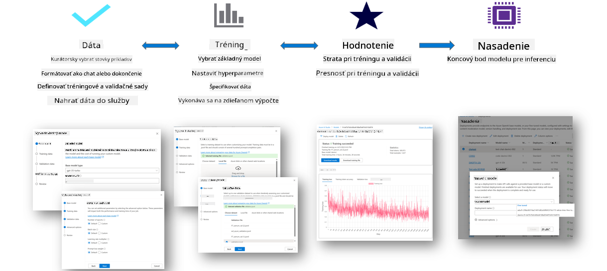

<!--
CO_OP_TRANSLATOR_METADATA:
{
  "original_hash": "c1559c5af6caccf6f623fd43a6b3a9a3",
  "translation_date": "2025-07-17T06:12:49+00:00",
  "source_file": "md/03.FineTuning/FineTuning_AIFoundry.md",
  "language_code": "sk"
}
-->
# Doladenie Phi-3 pomocou Azure AI Foundry

Pozrime sa, ako doladiť jazykový model Phi-3 Mini od Microsoftu pomocou Azure AI Foundry. Doladenie vám umožní prispôsobiť Phi-3 Mini konkrétnym úlohám, čím sa stane ešte výkonnejším a lepšie rozumie kontextu.

## Úvahy

- **Možnosti:** Ktoré modely je možné doladiť? Na čo všetko sa dá základný model doladiť?
- **Cena:** Aký je cenový model pre doladenie?
- **Prispôsobiteľnosť:** Do akej miery môžem upraviť základný model – a akými spôsobmi?
- **Pohodlie:** Ako vlastne prebieha doladenie – musím písať vlastný kód? Potrebujem vlastný výpočtový výkon?
- **Bezpečnosť:** Doladené modely môžu predstavovať bezpečnostné riziká – sú zavedené nejaké ochranné opatrenia, ktoré zabraňujú neúmyselnému poškodeniu?


## Príprava na doladenie

### Predpoklady

> [!NOTE]
> Pre modely rodiny Phi-3 je ponuka doladenia na základe platby podľa použitia dostupná iba pre huby vytvorené v regiónoch **East US 2**.

- Predplatné Azure. Ak ešte nemáte predplatné Azure, vytvorte si [platený Azure účet](https://azure.microsoft.com/pricing/purchase-options/pay-as-you-go), aby ste mohli začať.

- Projekt v [AI Foundry](https://ai.azure.com?WT.mc_id=aiml-138114-kinfeylo).
- Na prístup k operáciám v Azure AI Foundry sa používajú riadené prístupy na základe rolí (Azure RBAC). Na vykonanie krokov v tomto článku musí mať váš používateľský účet priradenú __rolu Azure AI Developer__ v rámci skupiny prostriedkov.

### Registrácia poskytovateľa predplatného

Overte, či je predplatné zaregistrované u poskytovateľa zdrojov `Microsoft.Network`.

1. Prihláste sa do [Azure portálu](https://portal.azure.com).
1. V ľavom menu vyberte **Subscriptions**.
1. Vyberte predplatné, ktoré chcete použiť.
1. V ľavom menu vyberte **AI project settings** > **Resource providers**.
1. Skontrolujte, či je v zozname poskytovateľov zdrojov uvedený **Microsoft.Network**. Ak nie, pridajte ho.

### Príprava dát

Pripravte si tréningové a validačné dáta na doladenie modelu. Vaše tréningové a validačné dáta by mali obsahovať príklady vstupov a výstupov, ktoré definujú, ako chcete, aby model fungoval.

Uistite sa, že všetky tréningové príklady majú očakávaný formát pre inferenciu. Na efektívne doladenie modelov zabezpečte vyvážený a rozmanitý dataset.

To zahŕňa udržiavanie rovnováhy dát, zahrnutie rôznych scenárov a pravidelnú úpravu tréningových dát tak, aby zodpovedali reálnym očakávaniam, čo vedie k presnejším a vyváženejším odpovediam modelu.

Rôzne typy modelov vyžadujú odlišný formát tréningových dát.

### Chat Completion

Tréningové a validačné dáta, ktoré použijete, **musia** byť vo formáte JSON Lines (JSONL). Pre `Phi-3-mini-128k-instruct` musí byť dataset na doladenie vo formáte konverzačného štýlu, ktorý používa API pre chatové dokončenia.

### Príklad formátu súboru

```json
    {"messages": [{"role": "system", "content": "You are an Xbox customer support agent whose primary goal is to help users with issues they are experiencing with their Xbox devices. You are friendly and concise. You only provide factual answers to queries, and do not provide answers that are not related to Xbox."}, {"role": "user", "content": "Is Xbox better than PlayStation?"}, {"role": "assistant", "content": "I apologize, but I cannot provide personal opinions. My primary job is to assist you with any issues related to your Xbox device. Do you have any Xbox-related issues that need addressing?"}]}
    {"messages": [{"role": "system", "content": "You are an Xbox customer support agent whose primary goal is to help users with issues they are experiencing with their Xbox devices. You are friendly and concise. You only provide factual answers to queries, and do not provide answers that are not related to Xbox."}, {"role": "user", "content": "Can I play PC games on my Xbox?"}, {"role": "assistant", "content": "While Xbox consoles don't natively support PC games, they can play an array of Xbox games, many of which are also available on PC. Can I assist you with finding games compatible with your Xbox device?"}]}
    {"messages": [{"role": "system", "content": "You are an Xbox customer support agent whose primary goal is to help users with issues they are experiencing with their Xbox devices. You are friendly and concise. You only provide factual answers to queries, and do not provide answers that are not related to Xbox."}, {"role": "user", "content": "I'm having trouble connecting my Xbox to the Wi-Fi."}, {"role": "assistant", "content": "No worries, let's go through the network settings on your Xbox. Can you please tell me what happens when you try to connect it to the Wi-Fi?"}]}
```

Podporovaný typ súboru je JSON Lines. Súbory sa nahrávajú do predvoleného úložiska a sprístupňujú sa vo vašom projekte.

## Doladenie Phi-3 pomocou Azure AI Foundry

Azure AI Foundry vám umožňuje prispôsobiť veľké jazykové modely vašim vlastným dátam pomocou procesu nazývaného doladenie. Doladenie prináša významnú hodnotu tým, že umožňuje prispôsobenie a optimalizáciu pre konkrétne úlohy a aplikácie. Vedie k lepšiemu výkonu, úspore nákladov, zníženiu latencie a prispôsobeným výstupom.



### Vytvorenie nového projektu

1. Prihláste sa do [Azure AI Foundry](https://ai.azure.com).

1. Vyberte **+New project** pre vytvorenie nového projektu v Azure AI Foundry.

    

1. Vykonajte nasledujúce kroky:

    - Názov projektu **Hub name**. Musí byť jedinečný.
    - Vyberte **Hub**, ktorý chcete použiť (v prípade potreby vytvorte nový).

    

1. Vykonajte nasledujúce kroky na vytvorenie nového hubu:

    - Zadajte **Hub name**. Musí byť jedinečný.
    - Vyberte svoje Azure **Subscription**.
    - Vyberte **Resource group**, ktorú chcete použiť (v prípade potreby vytvorte novú).
    - Vyberte **Location**, ktorú chcete použiť.
    - Vyberte **Connect Azure AI Services**, ktoré chcete použiť (v prípade potreby vytvorte nové).
    - Pri **Connect Azure AI Search** vyberte **Skip connecting**.

    

1. Vyberte **Next**.
1. Vyberte **Create a project**.

### Príprava dát

Pred doladením zozbierajte alebo vytvorte dataset relevantný pre vašu úlohu, napríklad inštrukcie pre chat, páry otázka-odpoveď alebo iné relevantné textové dáta. Dáta vyčistite a predspracujte odstránením šumu, riešením chýbajúcich hodnôt a tokenizáciou textu.

### Doladenie modelov Phi-3 v Azure AI Foundry

> [!NOTE]
> Doladenie modelov Phi-3 je momentálne podporované iba v projektoch umiestnených v East US 2.

1. V ľavom paneli vyberte **Model catalog**.

1. Do **search bar** zadajte *phi-3* a vyberte model phi-3, ktorý chcete použiť.

    

1. Vyberte **Fine-tune**.

    

1. Zadajte názov **Fine-tuned model name**.

    

1. Vyberte **Next**.

1. Vykonajte nasledujúce kroky:

    - Vyberte typ úlohy **task type** ako **Chat completion**.
    - Vyberte **Training data**, ktoré chcete použiť. Dáta môžete nahrať cez Azure AI Foundry alebo z lokálneho prostredia.

    

1. Vyberte **Next**.

1. Nahrajte **Validation data**, ktoré chcete použiť, alebo vyberte **Automatic split of training data**.

    

1. Vyberte **Next**.

1. Vykonajte nasledujúce kroky:

    - Vyberte **Batch size multiplier**, ktorý chcete použiť.
    - Vyberte **Learning rate**, ktorý chcete použiť.
    - Vyberte počet **Epochs**, ktoré chcete použiť.

    

1. Vyberte **Submit** na spustenie procesu doladenia.

    

1. Po dokončení doladenia sa stav zobrazí ako **Completed**, ako je znázornené na obrázku nižšie. Teraz môžete model nasadiť a používať ho vo svojej aplikácii, v playgrounde alebo v prompt flow. Pre viac informácií pozrite [Ako nasadiť rodinu malých jazykových modelov Phi-3 pomocou Azure AI Foundry](https://learn.microsoft.com/azure/ai-studio/how-to/deploy-models-phi-3?tabs=phi-3-5&pivots=programming-language-python).

    

> [!NOTE]
> Pre podrobnejšie informácie o doladení Phi-3 navštívte [Fine-tune Phi-3 models in Azure AI Foundry](https://learn.microsoft.com/azure/ai-studio/how-to/fine-tune-phi-3?tabs=phi-3-mini).

## Odstránenie doladených modelov

Doladený model môžete vymazať zo zoznamu doladených modelov v [Azure AI Foundry](https://ai.azure.com) alebo zo stránky s detailmi modelu. Vyberte doladený model, ktorý chcete vymazať na stránke Fine-tuning, a potom kliknite na tlačidlo Delete.

> [!NOTE]
> Vlastný model nemôžete vymazať, ak má existujúce nasadenie. Najprv musíte vymazať nasadenie modelu, až potom môžete vymazať vlastný model.

## Náklady a kvóty

### Úvahy o nákladoch a kvótach pre modely Phi-3 doladené ako služba

Modely Phi doladené ako služba sú poskytované Microsoftom a integrované s Azure AI Foundry na použitie. Ceny nájdete pri [nasadzovaní](https://learn.microsoft.com/azure/ai-studio/how-to/deploy-models-phi-3?tabs=phi-3-5&pivots=programming-language-python) alebo doladení modelov v záložke Pricing and terms v sprievodcovi nasadením.

## Filtrovanie obsahu

Modely nasadené ako služba s platbou podľa použitia sú chránené službou Azure AI Content Safety. Pri nasadení na endpointy v reálnom čase môžete túto funkciu vypnúť. S povolenou ochranou obsahu Azure AI prechádzajú prompt aj odpoveď cez súbor klasifikačných modelov, ktoré detegujú a zabraňujú výstupu škodlivého obsahu. Systém filtrovania obsahu deteguje a zasahuje pri špecifických kategóriách potenciálne škodlivého obsahu vo vstupných promptoch aj vo výstupných odpovediach. Viac informácií o [Azure AI Content Safety](https://learn.microsoft.com/azure/ai-studio/concepts/content-filtering).

**Konfigurácia doladenia**

Hyperparametre: Definujte hyperparametre ako learning rate, batch size a počet tréningových epoch.

**Funkcia straty**

Vyberte vhodnú funkciu straty pre vašu úlohu (napr. cross-entropy).

**Optimalizátor**

Vyberte optimalizátor (napr. Adam) pre aktualizácie gradientov počas tréningu.

**Proces doladenia**

- Načítanie predtrénovaného modelu: Načítajte checkpoint Phi-3 Mini.
- Pridanie vlastných vrstiev: Pridajte vrstvy špecifické pre úlohu (napr. klasifikačnú hlavu pre inštrukcie chatu).

**Tréning modelu**  
Doladte model pomocou pripraveného datasetu. Sledujte priebeh tréningu a podľa potreby upravujte hyperparametre.

**Vyhodnotenie a validácia**

Validačná množina: Rozdeľte dáta na tréningovú a validačnú množinu.

**Vyhodnotenie výkonu**

Použite metriky ako presnosť, F1 skóre alebo perplexitu na hodnotenie výkonu modelu.

## Uloženie doladeného modelu

**Checkpoint**  
Uložte checkpoint doladeného modelu pre budúce použitie.

## Nasadenie

- Nasadenie ako webová služba: Nasadte doladený model ako webovú službu v Azure AI Foundry.
- Testovanie endpointu: Posielajte testovacie dotazy na nasadený endpoint a overte jeho funkčnosť.

## Iterácia a zlepšovanie

Iterujte: Ak výkon nie je uspokojivý, upravujte hyperparametre, pridávajte viac dát alebo doladte model na ďalšie epochy.

## Monitorovanie a dolaďovanie

Neustále sledujte správanie modelu a podľa potreby ho dolaďujte.

## Prispôsobenie a rozšírenie

Vlastné úlohy: Phi-3 Mini môžete doladiť pre rôzne úlohy okrem inštrukcií pre chat. Preskúmajte ďalšie možnosti použitia!  
Experimentujte: Vyskúšajte rôzne architektúry, kombinácie vrstiev a techniky na zlepšenie výkonu.

> [!NOTE]
> Doladenie je iteratívny proces. Experimentujte, učte sa a prispôsobujte model, aby ste dosiahli najlepšie výsledky pre vašu konkrétnu úlohu!

**Vyhlásenie o zodpovednosti**:  
Tento dokument bol preložený pomocou AI prekladateľskej služby [Co-op Translator](https://github.com/Azure/co-op-translator). Aj keď sa snažíme o presnosť, prosím, majte na pamäti, že automatizované preklady môžu obsahovať chyby alebo nepresnosti. Originálny dokument v jeho pôvodnom jazyku by mal byť považovaný za autoritatívny zdroj. Pre kritické informácie sa odporúča profesionálny ľudský preklad. Nie sme zodpovední za akékoľvek nedorozumenia alebo nesprávne interpretácie vyplývajúce z použitia tohto prekladu.