<!--
CO_OP_TRANSLATOR_METADATA:
{
  "original_hash": "c1559c5af6caccf6f623fd43a6b3a9a3",
  "translation_date": "2025-05-09T20:36:49+00:00",
  "source_file": "md/03.FineTuning/FineTuning_AIFoundry.md",
  "language_code": "sk"
}
-->
# Doladenie Phi-3 pomocou Azure AI Foundry

Poďme preskúmať, ako doladiť jazykový model Phi-3 Mini od Microsoftu pomocou Azure AI Foundry. Doladenie vám umožní prispôsobiť Phi-3 Mini konkrétnym úlohám, čím sa model stane ešte výkonnejším a lepšie chápu kontext.

## Úvahy

- **Schopnosti:** Ktoré modely je možné doladiť? Čo všetko môže základný model po doladení robiť?
- **Cena:** Aký je cenový model pre doladenie
- **Prispôsobiteľnosť:** Do akej miery môžem meniť základný model – a akými spôsobmi?
- **Pohodlie:** Ako vlastne prebieha doladenie – musím písať vlastný kód? Potrebujem vlastný výpočtový výkon?
- **Bezpečnosť:** Doladené modely môžu predstavovať bezpečnostné riziká – sú k dispozícii nejaké ochranné mechanizmy na prevenciu neúmyselnej škody?

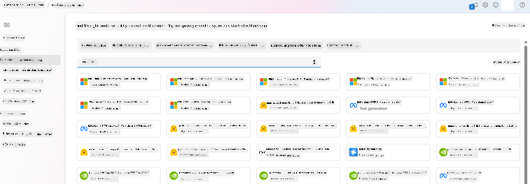

## Príprava na doladenie

### Predpoklady

> [!NOTE]
> Pre modely rodiny Phi-3 je ponuka doladenia v modeli pay-as-you-go dostupná iba pre huby vytvorené v regiónoch **East US 2**.

- Predplatné Azure. Ak ešte nemáte Azure predplatné, vytvorte si [platený Azure účet](https://azure.microsoft.com/pricing/purchase-options/pay-as-you-go), aby ste mohli začať.

- Projekt v [AI Foundry](https://ai.azure.com?WT.mc_id=aiml-138114-kinfeylo).
- Na udelenie prístupu k operáciám v Azure AI Foundry sa používajú riadenia prístupu založené na rolách Azure (Azure RBAC). Pre vykonanie krokov v tomto článku musí mať váš používateľský účet pridelenú __Azure AI Developer rolu__ v rámci skupiny prostriedkov.

### Registrácia poskytovateľa predplatného

Overte, či je predplatné registrované pre poskytovateľa zdrojov `Microsoft.Network`.

1. Prihláste sa do [Azure portálu](https://portal.azure.com).
1. Vyberte **Subscriptions** v ľavom menu.
1. Vyberte predplatné, ktoré chcete použiť.
1. V ľavom menu vyberte **AI project settings** > **Resource providers**.
1. Skontrolujte, či je v zozname poskytovateľov zdrojov uvedený **Microsoft.Network**. Ak nie, pridajte ho.

### Príprava dát

Pripravte si tréningové a validačné dáta na doladenie modelu. Vaše tréningové a validačné dátové sady by mali obsahovať príklady vstupov a výstupov, ako očakávate, že model bude fungovať.

Uistite sa, že všetky tréningové príklady majú očakávaný formát pre inferenciu. Na efektívne doladenie modelov zabezpečte vyváženú a rozmanitú dátovú sadu.

To zahŕňa udržiavanie rovnováhy dát, zahrnutie rôznych scenárov a pravidelné vylepšovanie tréningových dát, aby zodpovedali reálnym očakávaniam, čo vedie k presnejším a vyváženejším odpovediam modelu.

Rôzne typy modelov vyžadujú odlišný formát tréningových dát.

### Chat Completion

Tréningové a validačné dáta musia byť vo formáte JSON Lines (JSONL). Pre `Phi-3-mini-128k-instruct` musí byť dataset na doladenie vo formáte konverzačného štýlu, ktorý používa API Chat completions.

### Príklad formátu súboru

```json
    {"messages": [{"role": "system", "content": "You are an Xbox customer support agent whose primary goal is to help users with issues they are experiencing with their Xbox devices. You are friendly and concise. You only provide factual answers to queries, and do not provide answers that are not related to Xbox."}, {"role": "user", "content": "Is Xbox better than PlayStation?"}, {"role": "assistant", "content": "I apologize, but I cannot provide personal opinions. My primary job is to assist you with any issues related to your Xbox device. Do you have any Xbox-related issues that need addressing?"}]}
    {"messages": [{"role": "system", "content": "You are an Xbox customer support agent whose primary goal is to help users with issues they are experiencing with their Xbox devices. You are friendly and concise. You only provide factual answers to queries, and do not provide answers that are not related to Xbox."}, {"role": "user", "content": "Can I play PC games on my Xbox?"}, {"role": "assistant", "content": "While Xbox consoles don't natively support PC games, they can play an array of Xbox games, many of which are also available on PC. Can I assist you with finding games compatible with your Xbox device?"}]}
    {"messages": [{"role": "system", "content": "You are an Xbox customer support agent whose primary goal is to help users with issues they are experiencing with their Xbox devices. You are friendly and concise. You only provide factual answers to queries, and do not provide answers that are not related to Xbox."}, {"role": "user", "content": "I'm having trouble connecting my Xbox to the Wi-Fi."}, {"role": "assistant", "content": "No worries, let's go through the network settings on your Xbox. Can you please tell me what happens when you try to connect it to the Wi-Fi?"}]}
```

Podporovaný typ súboru je JSON Lines. Súbory sa nahrávajú do predvoleného úložiska a sú k dispozícii vo vašom projekte.

## Doladenie Phi-3 pomocou Azure AI Foundry

Azure AI Foundry vám umožňuje prispôsobiť veľké jazykové modely na základe vašich vlastných dát pomocou procesu nazývaného doladenie. Doladenie prináša významnú hodnotu tým, že umožňuje prispôsobenie a optimalizáciu pre konkrétne úlohy a aplikácie. Výsledkom je lepší výkon, úspora nákladov, znížená latencia a prispôsobené výstupy.

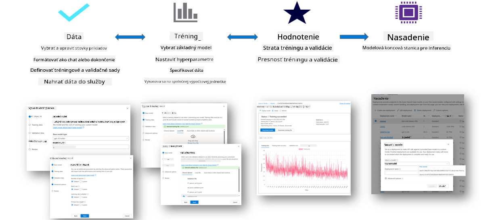

### Vytvorenie nového projektu

1. Prihláste sa do [Azure AI Foundry](https://ai.azure.com).

1. Vyberte **+New project** na vytvorenie nového projektu v Azure AI Foundry.

    

1. Vykonajte nasledovné kroky:

    - Názov projektu **Hub name** musí byť jedinečný.
    - Vyberte **Hub**, ktorý chcete použiť (prípadne vytvorte nový).

    

1. Vykonajte nasledovné kroky na vytvorenie nového hubu:

    - Zadajte **Hub name**. Musí byť jedinečný.
    - Vyberte svoje Azure **Subscription**.
    - Vyberte **Resource group**, ktorú chcete použiť (prípadne vytvorte novú).
    - Vyberte **Location**, ktorú chcete použiť.
    - Vyberte **Connect Azure AI Services** (prípadne vytvorte nové).
    - Vyberte **Connect Azure AI Search** a zvoľte **Skip connecting**.

    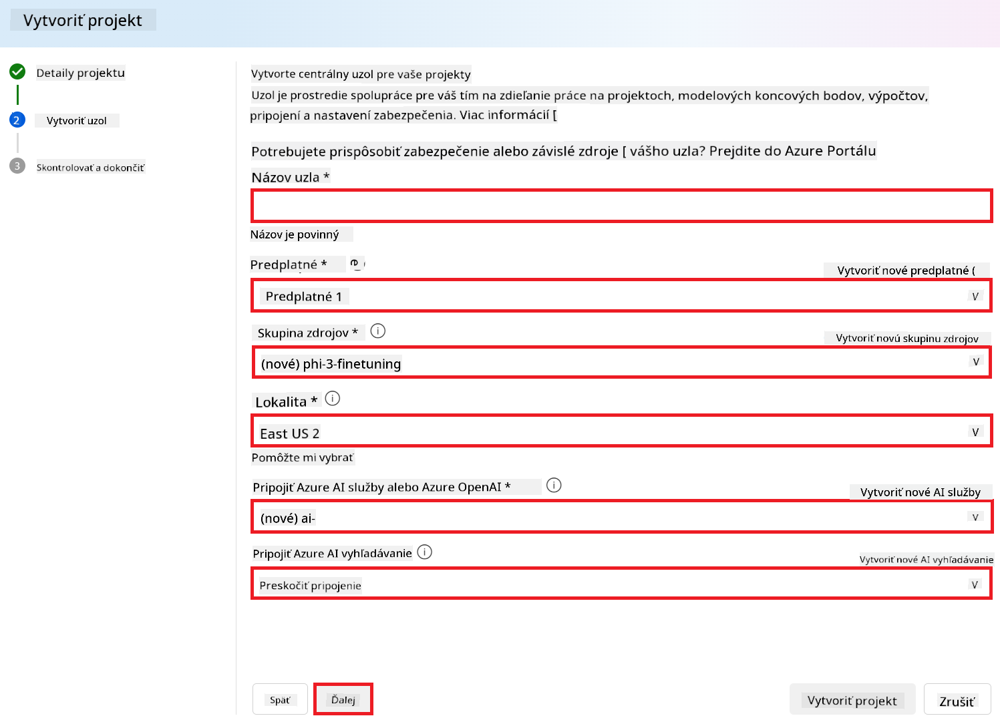

1. Vyberte **Next**.
1. Vyberte **Create a project**.

### Príprava dát

Pred doladením zozbierajte alebo vytvorte dataset relevantný pre vašu úlohu, napríklad chatové inštrukcie, otázky a odpovede alebo iné textové dáta. Dáta očistite a predspracujte odstránením šumu, doplnením chýbajúcich hodnôt a tokenizáciou textu.

### Doladenie modelov Phi-3 v Azure AI Foundry

> [!NOTE]
> Doladenie modelov Phi-3 je momentálne podporované iba v projektoch umiestnených v East US 2.

1. Vyberte **Model catalog** v ľavom paneli.

1. Do **search bar** zadajte *phi-3* a vyberte model phi-3, ktorý chcete použiť.

    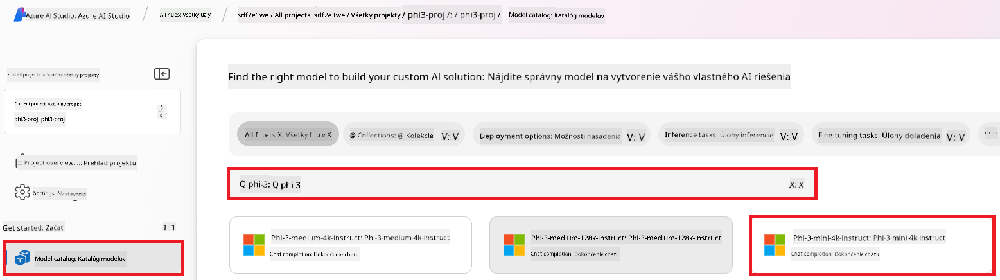

1. Vyberte **Fine-tune**.

    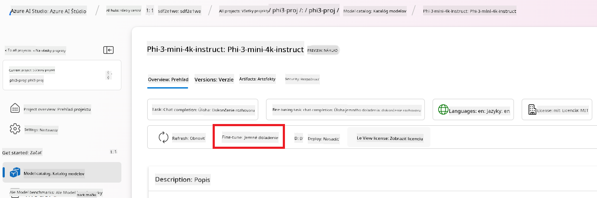

1. Zadajte názov **Fine-tuned model name**.

    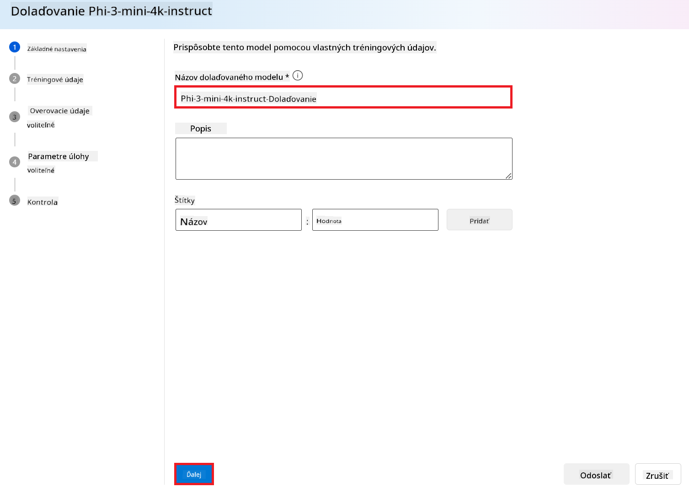

1. Vyberte **Next**.

1. Vykonajte nasledovné kroky:

    - Vyberte typ úlohy **task type** ako **Chat completion**.
    - Vyberte **Training data**, ktoré chcete použiť. Dáta môžete nahrať cez Azure AI Foundry alebo z lokálneho prostredia.

    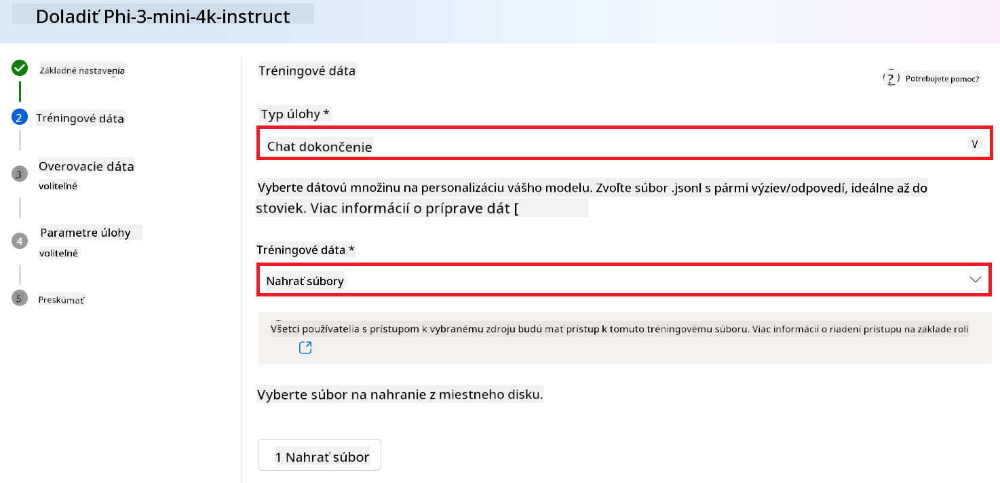

1. Vyberte **Next**.

1. Nahrajte **Validation data**, ktoré chcete použiť, alebo vyberte **Automatic split of training data**.

    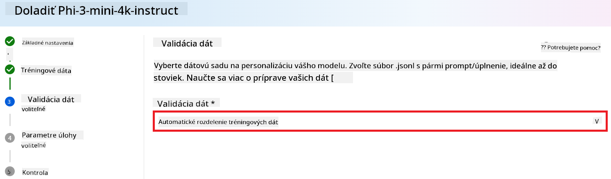

1. Vyberte **Next**.

1. Vykonajte nasledovné kroky:

    - Vyberte **Batch size multiplier**, ktorý chcete použiť.
    - Vyberte **Learning rate**, ktorý chcete použiť.
    - Vyberte počet **Epochs**, ktoré chcete použiť.

    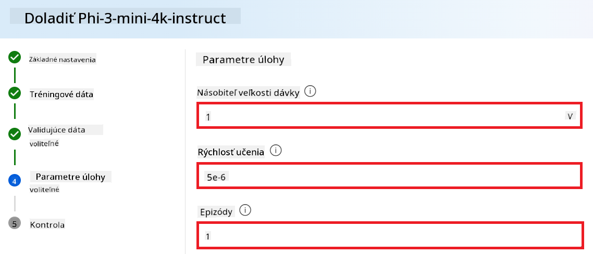

1. Vyberte **Submit** na spustenie procesu doladenia.

    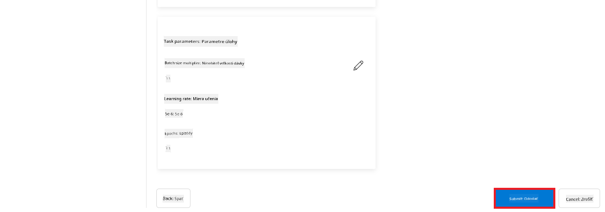

1. Po úspešnom doladení sa stav zmení na **Completed**, ako je znázornené na obrázku nižšie. Teraz môžete model nasadiť a používať ho vo vlastnej aplikácii, v playgrounde alebo v prompt flow. Viac informácií nájdete v článku [How to deploy Phi-3 family of small language models with Azure AI Foundry](https://learn.microsoft.com/azure/ai-studio/how-to/deploy-models-phi-3?tabs=phi-3-5&pivots=programming-language-python).

    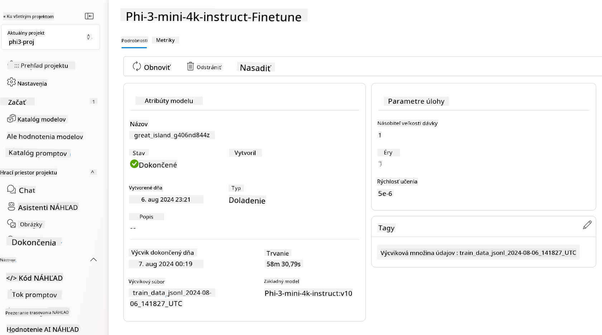

> [!NOTE]
> Pre podrobnejšie informácie o doladení Phi-3 navštívte [Fine-tune Phi-3 models in Azure AI Foundry](https://learn.microsoft.com/azure/ai-studio/how-to/fine-tune-phi-3?tabs=phi-3-mini).

## Odstránenie doladených modelov

Doladený model môžete vymazať zo zoznamu doladených modelov v [Azure AI Foundry](https://ai.azure.com) alebo zo stránky s detailmi modelu. Na stránke Fine-tuning vyberte model, ktorý chcete vymazať, a potom kliknite na tlačidlo Delete.

> [!NOTE]
> Vlastný model nemôžete vymazať, ak má existujúce nasadenie. Najprv musíte vymazať nasadenie modelu, až potom môžete vymazať vlastný model.

## Náklady a limity

### Náklady a limity pre modely Phi-3 doladené ako služba

Modely Phi doladené ako služba poskytuje Microsoft a sú integrované v Azure AI Foundry. Cenník nájdete pri [nasadzovaní](https://learn.microsoft.com/azure/ai-studio/how-to/deploy-models-phi-3?tabs=phi-3-5&pivots=programming-language-python) alebo doladení modelov v záložke Pricing and terms v sprievodcovi nasadením.

## Filtrovanie obsahu

Modely nasadené ako služba v režime pay-as-you-go sú chránené službou Azure AI Content Safety. Pri nasadení na real-time endpointy môžete túto funkciu vypnúť. Keď je Azure AI Content Safety zapnuté, vstupné výzvy aj výstupy prechádzajú súborom klasifikačných modelov, ktoré detegujú a zabraňujú generovaniu škodlivého obsahu. Systém filtrovania deteguje a zasahuje pri konkrétnych kategóriách potenciálne škodlivého obsahu vo vstupoch aj výstupoch. Viac sa dozviete o [Azure AI Content Safety](https://learn.microsoft.com/azure/ai-studio/concepts/content-filtering).

**Konfigurácia doladenia**

Hyperparametre: Definujte hyperparametre ako learning rate, batch size a počet tréningových epoch.

**Funkcia straty**

Vyberte vhodnú funkciu straty pre vašu úlohu (napr. cross-entropy).

**Optimalizátor**

Vyberte optimalizátor (napr. Adam) pre aktualizácie gradientov počas tréningu.

**Proces doladenia**

- Načítajte predtrénovaný model: Načítajte checkpoint Phi-3 Mini.
- Pridajte vlastné vrstvy: Pridajte vrstvy špecifické pre úlohu (napr. klasifikačnú hlavu pre chatové inštrukcie).

**Trénovanie modelu**  
Doladte model pomocou pripraveného datasetu. Sledujte priebeh tréningu a podľa potreby upravujte hyperparametre.

**Vyhodnotenie a validácia**

Validačná sada: Rozdeľte dáta na tréningovú a validačnú sadu.

**Vyhodnotenie výkonu**

Použite metriky ako presnosť, F1 skóre alebo perplexitu na hodnotenie výkonu modelu.

## Uloženie doladeného modelu

**Checkpoint**  
Uložte checkpoint doladeného modelu pre budúce použitie.

## Nasadenie

- Nasadenie ako webová služba: Nasadte doladený model ako webovú službu v Azure AI Foundry.
- Testovanie endpointu: Pošlite testovacie dopyty na nasadený endpoint, aby ste overili jeho funkčnosť.

## Iterácia a vylepšovanie

Iterujte: Ak výkon nie je uspokojivý, upravujte hyperparametre, pridajte viac dát alebo doladte model počas ďalších epoch.

## Monitorovanie a zdokonaľovanie

Model neustále sledujte a podľa potreby vylepšujte.

## Prispôsobovanie a rozširovanie

Vlastné úlohy: Phi-3 Mini je možné doladiť pre rôzne úlohy okrem chatových inštrukcií. Preskúmajte ďalšie možnosti využitia!  
Experimentujte: Vyskúšajte rôzne architektúry, kombinácie vrstiev a techniky na zlepšenie výkonu.

> [!NOTE]
> Doladenie je iteratívny proces. Experimentujte, učte sa a prispôsobujte model, aby ste dosiahli najlepšie výsledky pre vašu konkrétnu úlohu!

**Vyhlásenie o zodpovednosti**:  
Tento dokument bol preložený pomocou AI prekladateľskej služby [Co-op Translator](https://github.com/Azure/co-op-translator). Aj keď sa snažíme o presnosť, vezmite prosím na vedomie, že automatické preklady môžu obsahovať chyby alebo nepresnosti. Originálny dokument v jeho pôvodnom jazyku by mal byť považovaný za autoritatívny zdroj. Pre kritické informácie sa odporúča profesionálny ľudský preklad. Nie sme zodpovední za akékoľvek nedorozumenia alebo nesprávne výklady vyplývajúce z použitia tohto prekladu.