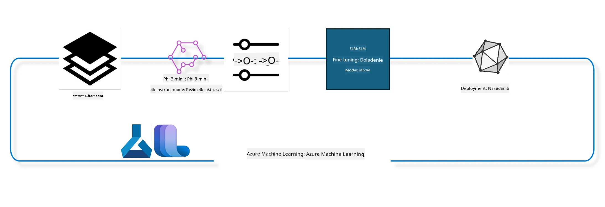

## Ako používať komponenty chat-completion z Azure ML systémového registra na doladenie modelu

V tomto príklade budeme doladiť model Phi-3-mini-4k-instruct na dokončenie konverzácie medzi 2 ľuďmi pomocou datasetu ultrachat_200k.



Príklad vám ukáže, ako vykonať doladenie pomocou Azure ML SDK a Pythonu a potom nasadiť doladený model na online endpoint na inferenciu v reálnom čase.

### Tréningové dáta

Použijeme dataset ultrachat_200k. Ide o silno filtrovanú verziu datasetu UltraChat, ktorý sa použil na trénovanie Zephyr-7B-β, špičkového 7b chat modelu.

### Model

Použijeme model Phi-3-mini-4k-instruct, aby sme ukázali, ako si užívateľ môže doladiť model pre úlohu chat-completion. Ak ste tento notebook otvorili z konkrétnej karty modelu, nezabudnite si nahradiť názov modelu.

### Úlohy

- Vybrať model na doladenie.
- Vybrať a preskúmať tréningové dáta.
- Nakonfigurovať job doladenia.
- Spustiť job doladenia.
- Skontrolovať metriky tréningu a vyhodnotenia.
- Registrovať doladený model.
- Nasadiť doladený model na inferenciu v reálnom čase.
- Urobiť upratovanie zdrojov.

## 1. Nastavenie predpokladov

- Nainštalujte závislosti
- Pripojte sa k AzureML Workspace. Viac informácií na set up SDK authentication. Nahradiť <WORKSPACE_NAME>, <RESOURCE_GROUP> a <SUBSCRIPTION_ID> nižšie.
- Pripojenie k azureml systémovému registru
- Nastaviť voliteľný názov experimentu
- Skontrolovať alebo vytvoriť výpočtový klaster.

> [!NOTE]
> Požiadavky: Jeden GPU uzol môže mať viac GPU kariet. Napríklad v jednom uzle Standard_NC24rs_v3 je 4 NVIDIA V100 GPU, zatiaľ čo v Standard_NC12s_v3 sú 2 NVIDIA V100 GPU. Pozrite dokumentáciu pre tieto informácie. Počet GPU kariet na uzol nastavujete v parametri gpus_per_node nižšie. Správne nastavenie zabezpečí využitie všetkých GPU v uzle. Odporúčané SKU pre GPU výpočty nájdete tu a tu.

### Python knižnice

Nainštalujte závislosti spustením bunky nižšie. Toto nie je voliteľný krok, ak bežíte v novom prostredí.

```bash
pip install azure-ai-ml
pip install azure-identity
pip install datasets==2.9.0
pip install mlflow
pip install azureml-mlflow
```

### Interakcia s Azure ML

1. Tento Python skript slúži na interakciu so službou Azure Machine Learning (Azure ML). Tu je rozpis, čo robí:

    - Importuje potrebné moduly z azure.ai.ml, azure.identity a azure.ai.ml.entities balíkov. Tiež importuje modul time.

    - Pokúša sa autentifikovať pomocou DefaultAzureCredential(), ktorý poskytuje zjednodušený spôsob autentifikácie pre rýchly štart vývoja aplikácií bežiacich v Azure cloude. Ak to zlyhá, použije InteractiveBrowserCredential(), ktorý poskytuje interaktívny prihlasovací prompt.

    - Následne skúsi vytvoriť inštanciu MLClient pomocou metódy from_config, ktorá číta konfiguráciu z defaultného config súboru (config.json). Ak toto zlyhá, vytvorí MLClient manuálnym poskytnutím subscription_id, resource_group_name a workspace_name.

    - Vytvorí ďalšiu inštanciu MLClient pre Azure ML register s názvom "azureml". Tento register slúži na uchovávanie modelov, pipelines na doladenie a prostredí.

    - Nastaví experiment_name na "chat_completion_Phi-3-mini-4k-instruct".

    - Vygeneruje unikátny timestamp prevodom aktuálneho času (v sekundách od epochy, ako float) na celé číslo a potom na string. Tento timestamp sa môže použiť na vytvorenie unikátnych mien a verzií.

    ```python
    # Importujte potrebné moduly z Azure ML a Azure Identity
    from azure.ai.ml import MLClient
    from azure.identity import (
        DefaultAzureCredential,
        InteractiveBrowserCredential,
    )
    from azure.ai.ml.entities import AmlCompute
    import time  # Importujte modul time
    
    # Pokúste sa autentifikovať pomocou DefaultAzureCredential
    try:
        credential = DefaultAzureCredential()
        credential.get_token("https://management.azure.com/.default")
    except Exception as ex:  # Ak DefaultAzureCredential zlyhá, použite InteractiveBrowserCredential
        credential = InteractiveBrowserCredential()
    
    # Pokúste sa vytvoriť inštanciu MLClient pomocou predvolenej konfiguračnej súboru
    try:
        workspace_ml_client = MLClient.from_config(credential=credential)
    except:  # Ak to zlyhá, vytvorte inštanciu MLClient manuálnym poskytnutím detailov
        workspace_ml_client = MLClient(
            credential,
            subscription_id="<SUBSCRIPTION_ID>",
            resource_group_name="<RESOURCE_GROUP>",
            workspace_name="<WORKSPACE_NAME>",
        )
    
    # Vytvorte ďalšiu inštanciu MLClient pre Azure ML register s názvom "azureml"
    # Tento register je miesto, kde sú uložené modely, fine-tuning pipeline a prostredia
    registry_ml_client = MLClient(credential, registry_name="azureml")
    
    # Nastavte názov experimentu
    experiment_name = "chat_completion_Phi-3-mini-4k-instruct"
    
    # Vygenerujte unikátny časový údaj, ktorý môže byť použitý pre mená a verzie, ktoré musia byť jedinečné
    timestamp = str(int(time.time()))
    ```

## 2. Vyberte základný model na doladenie

1. Phi-3-mini-4k-instruct je model s 3.8 miliardami parametrov, ľahký, špičkový open model založený na datasetoch použitých pre Phi-2. Model patrí do rodiny Phi-3 a jeho Mini verzia je vo variantoch 4K a 128K podľa dĺžky kontextu (v tokenoch), ktorý dokáže spracovať. Potrebujeme doladiť model na náš konkrétny účel, aby sme ho mohli použiť. Modely si môžete prezrieť v Model Catalogue v AzureML Studiu, filtrovaním podľa úlohy chat-completion. V tomto príklade používame model Phi-3-mini-4k-instruct. Ak ste otvorili notebook pre iný model, nahraďte názov a verziu modelu.

> [!NOTE]
> ide o model id vlastnosť modelu. Tá sa odovzdá ako vstup do jobu doladenia. Je dostupná aj ako pole Asset ID na stránke s detailmi modelu v AzureML Studio Model Catalogue.

2. Tento Python skript komunikuje so službou Azure Machine Learning (Azure ML). Tu je rozpis čo robí:

    - Nastaví model_name na "Phi-3-mini-4k-instruct".

    - Používa metódu get z vlastnosti models objektu registry_ml_client na získanie najnovšej verzie modelu so zadaným názvom z Azure ML registra. Metóda get je volaná so dvoma argumentmi: názvom modelu a štítkom určujúcim, že má byť získaná najnovšia verzia.

    - Vypíše správu do konzoly s názvom, verziou a id modelu, ktorý sa použije na doladenie. Používa sa metóda format reťazca na vloženie týchto vlastností z foundation_model objektu.

    ```python
    # Nastavte názov modelu
    model_name = "Phi-3-mini-4k-instruct"
    
    # Získajte najnovšiu verziu modelu z registra Azure ML
    foundation_model = registry_ml_client.models.get(model_name, label="latest")
    
    # Vytlačte názov modelu, verziu a ID
    # Tieto informácie sú užitočné na sledovanie a ladenie
    print(
        "\n\nUsing model name: {0}, version: {1}, id: {2} for fine tuning".format(
            foundation_model.name, foundation_model.version, foundation_model.id
        )
    )
    ```

## 3. Vytvorenie výpočtu pre job

Job doladenia funguje IBA s GPU výpočtom. Veľkosť výpočtu závisí od veľkosti modelu a v mnohých prípadoch je zložité nájsť správny výpočet pre job. V tejto bunke používateľovi pomáhame vybrať správny výpočet pre job.

> [!NOTE]
> Nižšie uvedené výpočty fungujú s najoptimalizovanejšou konfiguráciou. Akékoľvek zmeny konfigurácie môžu viesť k chybe Cuda Out Of Memory. V takých prípadoch sa skúste prepnúť na väčšiu veľkosť výpočtu.

> [!NOTE]
> Pri výbere compute_cluster_size nižšie sa uistite, že tento výpočet je dostupný vo vašej resource group. Ak nie je, môžete požiadať o prístup ku compute resources.

### Kontrola podpory modelu pre doladenie

1. Tento Python skript interaguje s modelom Azure Machine Learning (Azure ML). Tu je rozpis, čo robí:

    - Importuje modul ast, ktorý poskytuje funkcie na spracovanie stromov Python abstraktnej syntaxe.

    - Kontroluje, či objekt foundation_model (ktorý reprezentuje model v Azure ML) má tag s názvom finetune_compute_allow_list. Tagy v Azure ML sú kľúč-hodnota páry, ktoré môžete vytvárať a používať na filtrovanie a triedenie modelov.

    - Ak tag finetune_compute_allow_list existuje, používa ast.literal_eval na bezpečné parsovanie hodnoty tagu (reťazec) na Python zoznam. Tento zoznam sa priradí premennej computes_allow_list a vypíše sa správa o tom, že výpočet by mal byť vytvorený z tohto zoznamu.

    - Ak tag neexistuje, nastaví computes_allow_list na None a vypíše správu, že tento tag nie je súčasťou tagov modelu.

    - Celkovo tento skript kontroluje prítomnosť špecifického tagu v metaúdajoch modelu, konvertuje jeho hodnotu na zoznam, ak existuje, a poskytuje užívateľovi spätnú väzbu.

    ```python
    # Importujte modul ast, ktorý poskytuje funkcie na spracovanie stromov abstraktnej syntaktickej gramatiky Pythonu
    import ast
    
    # Skontrolujte, či sa v značkách modelu nachádza značka 'finetune_compute_allow_list'
    if "finetune_compute_allow_list" in foundation_model.tags:
        # Ak je značka prítomná, použite ast.literal_eval na bezpečné parsovanie hodnoty značky (reťazca) do zoznamu Pythonu
        computes_allow_list = ast.literal_eval(
            foundation_model.tags["finetune_compute_allow_list"]
        )  # konvertujte reťazec na python zoznam
        # Vytlačte správu oznamujúcu, že sa má vytvoriť výpočet zo zoznamu
        print(f"Please create a compute from the above list - {computes_allow_list}")
    else:
        # Ak značka nie je prítomná, nastavte computes_allow_list na None
        computes_allow_list = None
        # Vytlačte správu oznamujúcu, že značka 'finetune_compute_allow_list' nie je súčasťou značiek modelu
        print("`finetune_compute_allow_list` is not part of model tags")
    ```

### Kontrola Compute Instance

1. Tento Python skript komunikuje so službou Azure Machine Learning (Azure ML) a vykonáva viaceré kontroly na výpočtovej inštancii. Tu je rozpis čo robí:

    - Pokúša sa získať výpočtovú inštanciu so špecifikovaným názvom compute_cluster z Azure ML workspace. Ak je stav provisioning "failed", vyhodí ValueError.

    - Kontroluje, či computes_allow_list nie je None. Ak nie je, premení všetky veľkosti výpočtov v zozname na malé písmená a kontroluje, či je veľkosť aktuálnej výpočtovej inštancie v zozname. Ak nie je, vyhodí ValueError.

    - Ak je computes_allow_list None, kontroluje, či veľkosť výpočtovej inštancie nie je v zozname nepodporovaných GPU VM veľkostí. Ak je, vyhodí ValueError.

    - Získa zoznam všetkých dostupných veľkostí výpočtov vo workspace, prechádza ich a pre každý názov, ak sa zhoduje s veľkosťou aktuálneho výpočtu, získa počet GPU pre túto veľkosť a nastaví gpu_count_found na True.

    - Ak je gpu_count_found True, vypíše počet GPU vo výpočte. Ak nie, vyhodí ValueError.

    - Celkovo vykonáva viacero kontrol na výpočtovej inštancii v Azure ML workspace vrátane stavu provisioning, kontroly veľkosti oproti zoznamom a počtu GPU.
    
    ```python
    # Vytlačiť správu výnimky
    print(e)
    # Vznesie ValueError, ak veľkosť výpočtu nie je dostupná v pracovnom priestore
    raise ValueError(
        f"WARNING! Compute size {compute_cluster_size} not available in workspace"
    )
    
    # Načítať inštanciu výpočtu z Azure ML pracovného priestoru
    compute = workspace_ml_client.compute.get(compute_cluster)
    # Skontrolovať, či stav poskytovania inštancie výpočtu je "failed"
    if compute.provisioning_state.lower() == "failed":
        # Vznesie ValueError, ak je stav poskytovania "failed"
        raise ValueError(
            f"Provisioning failed, Compute '{compute_cluster}' is in failed state. "
            f"please try creating a different compute"
        )
    
    # Skontrolovať, či computes_allow_list nie je None
    if computes_allow_list is not None:
        # Konvertovať všetky veľkosti výpočtov v computes_allow_list na malé písmená
        computes_allow_list_lower_case = [x.lower() for x in computes_allow_list]
        # Skontrolovať, či veľkosť inštancie výpočtu je v computes_allow_list_lower_case
        if compute.size.lower() not in computes_allow_list_lower_case:
            # Vznesie ValueError, ak veľkosť inštancie výpočtu nie je v computes_allow_list_lower_case
            raise ValueError(
                f"VM size {compute.size} is not in the allow-listed computes for finetuning"
            )
    else:
        # Definovať zoznam nepodporovaných GPU VM veľkostí
        unsupported_gpu_vm_list = [
            "standard_nc6",
            "standard_nc12",
            "standard_nc24",
            "standard_nc24r",
        ]
        # Skontrolovať, či veľkosť inštancie výpočtu je v unsupported_gpu_vm_list
        if compute.size.lower() in unsupported_gpu_vm_list:
            # Vznesie ValueError, ak veľkosť inštancie výpočtu je v unsupported_gpu_vm_list
            raise ValueError(
                f"VM size {compute.size} is currently not supported for finetuning"
            )
    
    # Inicializovať príznak na kontrolu, či bol nájdený počet GPU v inštancii výpočtu
    gpu_count_found = False
    # Načítať zoznam všetkých dostupných veľkostí výpočtu v pracovnom priestore
    workspace_compute_sku_list = workspace_ml_client.compute.list_sizes()
    available_sku_sizes = []
    # Iterovať cez zoznam dostupných veľkostí výpočtu
    for compute_sku in workspace_compute_sku_list:
        available_sku_sizes.append(compute_sku.name)
        # Skontrolovať, či meno veľkosti výpočtu zodpovedá veľkosti inštancie výpočtu
        if compute_sku.name.lower() == compute.size.lower():
            # Ak áno, načítať počet GPU pre túto veľkosť výpočtu a nastaviť gpu_count_found na True
            gpus_per_node = compute_sku.gpus
            gpu_count_found = True
    # Ak je gpu_count_found True, vytlačiť počet GPU v inštancii výpočtu
    if gpu_count_found:
        print(f"Number of GPU's in compute {compute.size}: {gpus_per_node}")
    else:
        # Ak je gpu_count_found False, vznesie ValueError
        raise ValueError(
            f"Number of GPU's in compute {compute.size} not found. Available skus are: {available_sku_sizes}."
            f"This should not happen. Please check the selected compute cluster: {compute_cluster} and try again."
        )
    ```

## 4. Vyberte dataset pre doladenie modelu

1. Používame dataset ultrachat_200k. Dataset má štyri časti vhodné pre Supervised fine-tuning (sft).
Generation ranking (gen). Počet príkladov pre každú časť je uvedený nasledovne:

    ```bash
    train_sft test_sft  train_gen  test_gen
    207865  23110  256032  28304
    ```

1. Nasledujúce bunky ukazujú základnú prípravu dát na doladenie:

### Vizualizácia niekoľkých riadkov dát

Chceme, aby tento príklad bežal rýchlo, preto uložte train_sft, test_sft súbory obsahujúce 5% už orezaných riadkov. Znamená to, že doladený model bude menej presný, preto by nemal byť použiteľný v reálnom svete.
download-dataset.py sa používa na stiahnutie datasetu ultrachat_200k a transformáciu datasetu do formátu použiteľného komponentom pipeline pre doladenie. Keďže je dataset veľký, máme tu len časť datasetu.

1. Spustením skriptu nižšie sa stiahne iba 5% dát. Toto môžete zvýšiť zmenou parametra dataset_split_pc na požadované percento.

> [!NOTE]
> Niektoré jazykové modely používajú iné jazykové kódy, preto by názvy stĺpcov v datasete mali byť zodpovedajúce.

1. Tu je príklad, ako by mali dáta vyzerať
Dataset chat-completion je uložený v parquet formáte s každým záznamom podľa nasledovnej schémy:

    - Ide o JSON (JavaScript Object Notation) dokument, populárny formát na výmenu dát. Nie je to spustiteľný kód, ale formát na ukladanie a prenos dát. Tu je rozpis jeho štruktúry:

    - "prompt": kľúč s hodnotou typu string predstavujúci úlohu alebo otázku kladenú AI asistentovi.

    - "messages": kľúč so zoznamom objektov. Každý objekt reprezentuje správu v konverzácii medzi užívateľom a AI asistentom. Každá správa má dve položky:

    - "content": kľúč s obsahom správy ako text.
    - "role": kľúč s označením roly entity, ktorá správu poslala. Môže byť "user" alebo "assistant".
    - "prompt_id": kľúč s unikátnym identifikátorom promptu.

1. V tomto JSON dokumente sa nachádza konverzácia, kde užívateľ žiada AI asistenta vytvoriť protagonistu pre dystopický príbeh. Asistent odpovedá, užívateľ žiada viac detailov a asistent súhlasí s ich poskytnutím. Celá konverzácia je priradená ku konkrétnemu prompt_id.

    ```python
    {
        // The task or question posed to an AI assistant
        "prompt": "Create a fully-developed protagonist who is challenged to survive within a dystopian society under the rule of a tyrant. ...",
        
        // An array of objects, each representing a message in a conversation between a user and an AI assistant
        "messages":[
            {
                // The content of the user's message
                "content": "Create a fully-developed protagonist who is challenged to survive within a dystopian society under the rule of a tyrant. ...",
                // The role of the entity that sent the message
                "role": "user"
            },
            {
                // The content of the assistant's message
                "content": "Name: Ava\n\n Ava was just 16 years old when the world as she knew it came crashing down. The government had collapsed, leaving behind a chaotic and lawless society. ...",
                // The role of the entity that sent the message
                "role": "assistant"
            },
            {
                // The content of the user's message
                "content": "Wow, Ava's story is so intense and inspiring! Can you provide me with more details.  ...",
                // The role of the entity that sent the message
                "role": "user"
            }, 
            {
                // The content of the assistant's message
                "content": "Certainly! ....",
                // The role of the entity that sent the message
                "role": "assistant"
            }
        ],
        
        // A unique identifier for the prompt
        "prompt_id": "d938b65dfe31f05f80eb8572964c6673eddbd68eff3db6bd234d7f1e3b86c2af"
    }
    ```

### Stiahnutie dát

1. Tento Python skript slúži na stiahnutie datasetu pomocou pomocného skriptu download-dataset.py. Tu je rozpis čo robí:

    - Importuje modul os, ktorý poskytuje prenositeľné spôsoby práce s operačným systémom.

    - Používa funkciu os.system na spustenie skriptu download-dataset.py v shelli s argumentmi príkazového riadku. Argumenty špecifikujú dataset na stiahnutie (HuggingFaceH4/ultrachat_200k), adresár na stiahnutie (ultrachat_200k_dataset) a percento dát na rozdelenie (5). Funkcia vracia stav ukončenia príkazu, ktorý je uložený v exit_status.

    - Kontroluje, či exit_status nie je 0. Na unix-like OS znamená 0 úspech, iná hodnota chybu. Ak exit_status nie je 0, vyhodí výnimku s hlásením o chybe pri sťahovaní datasetu.

    - Celkovo skript spúšťa príkaz na stiahnutie datasetu pomocou pomocného skriptu a v prípade zlyhania vyhodí výnimku.
    
    ```python
    # Importujte modul os, ktorý poskytuje spôsob používania funkcií závislých od operačného systému
    import os
    
    # Použite funkciu os.system na spustenie skriptu download-dataset.py v shelli so špecifickými argumentmi príkazového riadku
    # Argumenty určujú dataset na stiahnutie (HuggingFaceH4/ultrachat_200k), adresár na stiahnutie (ultrachat_200k_dataset) a percento rozdelenia datasetu (5)
    # Funkcia os.system vracia výstupný stav príkazu, ktorý vykonala; tento stav je uložený v premennej exit_status
    exit_status = os.system(
        "python ./download-dataset.py --dataset HuggingFaceH4/ultrachat_200k --download_dir ultrachat_200k_dataset --dataset_split_pc 5"
    )
    
    # Skontrolujte, či exit_status nie je 0
    # V unixových operačných systémoch hodnota 0 zvyčajne znamená úspech príkazu, zatiaľ čo iné čísla znamenajú chybu
    # Ak exit_status nie je 0, vyhoďte výnimku s hlásením, že došlo k chybe pri sťahovaní datasetu
    if exit_status != 0:
        raise Exception("Error downloading dataset")
    ```

### Nahratie dát do DataFrame

1. Tento Python skript načítava JSON Lines súbor do pandas DataFrame a zobrazuje prvých 5 riadkov. Tu je rozpis čo robí:

    - Importuje knižnicu pandas, silnú knižnicu na manipuláciu a analýzu dát.

    - Nastavuje maximálnu šírku stĺpcov pre pandas zobrazenie na 0. To znamená, že sa zobrazí celý text každého stĺpca bez orezania pri výpise DataFrame.
    - Používa funkciu pd.read_json na načítanie súboru train_sft.jsonl z priečinka ultrachat_200k_dataset do DataFrame. Argument lines=True označuje, že súbor je vo formáte JSON Lines, kde každý riadok je samostatný JSON objekt.

    - Používa metódu head na zobrazenie prvých 5 riadkov DataFrame. Ak má DataFrame menej ako 5 riadkov, zobrazia sa všetky.

    - Zhrnuté, tento skript načítava súbor vo formáte JSON Lines do DataFrame a zobrazuje prvých 5 riadkov s úplným textom stĺpcov.
    
    ```python
    # Importujte knižnicu pandas, ktorá je výkonnou knižnicou na manipuláciu a analýzu dát
    import pandas as pd
    
    # Nastavte maximálnu šírku stĺpca pre zobrazovacie možnosti pandas na 0
    # To znamená, že pri vypísaní DataFrame sa zobrazí celý text každého stĺpca bez orezania
    pd.set_option("display.max_colwidth", 0)
    
    # Použite funkciu pd.read_json na načítanie súboru train_sft.jsonl z adresára ultrachat_200k_dataset do DataFrame
    # Argument lines=True označuje, že súbor je vo formáte JSON Lines, kde je každý riadok samostatný JSON objekt
    df = pd.read_json("./ultrachat_200k_dataset/train_sft.jsonl", lines=True)
    
    # Použite metódu head na zobrazenie prvých 5 riadkov DataFrame
    # Ak má DataFrame menej ako 5 riadkov, zobrazia sa všetky z nich
    df.head()
    ```

## 5. Odoslať úlohu doladenia modelu pomocou modelu a dát ako vstupov

Vytvorte úlohu, ktorá používa komponent pipeline pre chat-completion. Dozviete sa viac o všetkých parametroch podporovaných pre doladenie.

### Definovanie parametrov doladenia

1. Parametre doladenia možno rozdeliť do 2 kategórií - parametre školenia, parametre optimalizácie

1. Parametre školenia definujú aspekty školenia, ako sú -

    - Optimalizátor, plánovač, ktorý sa má použiť
    - Metrika na optimalizáciu doladenia
    - Počet školiacich krokov, veľkosť dávky a podobne
    - Parametre optimalizácie pomáhajú pri optimalizácii pamäte GPU a efektívnom využívaní výpočtových zdrojov.

1. Nižšie sú niektoré z parametrov, ktoré patria do tejto kategórie. Parametre optimalizácie sa líšia pre každý model a sú zabalené s modelom, aby sa tieto rozdiely riešili.

    - Povoliť deepspeed a LoRA
    - Povoliť školenie s kombinovanou presnosťou
    - Povoliť školenie na viacerých uzloch

> [!NOTE]
> Supervízované doladenie môže viesť k strate zarovnania alebo katastrofickému zabudnutiu. Odporúčame skontrolovať tento problém a spustiť fázu zarovnania po doladení.

### Parametre doladenia

1. Tento Python skript nastavuje parametre pre doladenie modelu strojového učenia. Tu je rozpis toho, čo robí:

    - Nastavuje predvolené parametre školenia ako počet epoch, veľkosti dávok pre tréning a vyhodnocovanie, rýchlosť učenia a typ plánovača rýchlosti učenia.

    - Nastavuje predvolené parametre optimalizácie, ako je použitie Layer-wise Relevance Propagation (LoRa) a DeepSpeed, a fázu DeepSpeed.

    - Kombinuje parametre školenia a optimalizácie do jedného slovníka s názvom finetune_parameters.

    - Kontroluje, či foundation_model obsahuje nejaké špecifické predvolené parametre modelu. Ak áno, vypíše varovnú správu a aktualizuje slovník finetune_parameters týmito modelovo špecifickými predvoľbami. Funkcia ast.literal_eval sa používa na konverziu týchto predvolieb zo stringu na Python slovník.

    - Vypisuje finálnu sadu parametrov pre doladenie, ktoré sa použijú pri spustení.

    - Zhrnuté, tento skript nastavuje a zobrazuje parametre pre doladenie modelu strojového učenia s možnosťou prepísať predvolené parametre modelovo špecifickými.

    ```python
    # Nastavte predvolené parametre tréningu, ako je počet trénovacích epoch, veľkosti dávok pre tréning a hodnotenie, rýchlosť učenia a typ plánovača rýchlosti učenia
    training_parameters = dict(
        num_train_epochs=3,
        per_device_train_batch_size=1,
        per_device_eval_batch_size=1,
        learning_rate=5e-6,
        lr_scheduler_type="cosine",
    )
    
    # Nastavte predvolené parametre optimalizácie, ako je použitie Layer-wise Relevance Propagation (LoRa) a DeepSpeed, a fáza DeepSpeed
    optimization_parameters = dict(
        apply_lora="true",
        apply_deepspeed="true",
        deepspeed_stage=2,
    )
    
    # Skombinujte parametre tréningu a optimalizácie do jedného slovníka nazvaného finetune_parameters
    finetune_parameters = {**training_parameters, **optimization_parameters}
    
    # Skontrolujte, či foundation_model má nejaké modelovo špecifické predvolené parametre
    # Ak áno, vytlačte varovnú správu a aktualizujte slovník finetune_parameters týmito modelovo špecifickými predvoľbami
    # Funkcia ast.literal_eval sa používa na konverziu modelovo špecifických predvolieb zo stringu na python slovník
    if "model_specific_defaults" in foundation_model.tags:
        print("Warning! Model specific defaults exist. The defaults could be overridden.")
        finetune_parameters.update(
            ast.literal_eval(  # konvertovať reťazec na python slovník
                foundation_model.tags["model_specific_defaults"]
            )
        )
    
    # Vytlačte konečnú sadu parametrov doladenia, ktoré budú použité pre beh
    print(
        f"The following finetune parameters are going to be set for the run: {finetune_parameters}"
    )
    ```

### Trénovacia pipeline

1. Tento Python skript definuje funkciu na generovanie zobrazovaného mena pre tréningovú pipeline strojového učenia a potom volá túto funkciu na generovanie a vytlačenie zobrazovaného mena. Tu je rozpis toho, čo robí:

1. Definuje sa funkcia get_pipeline_display_name. Táto funkcia generuje zobrazované meno na základe rôznych parametrov súvisiacich s tréningovou pipeline.

1. Vo funkcii vypočíta celkovú veľkosť dávky vynásobením veľkosti dávky na zariadenie, počtu krokov akumulácie gradientu, počtu GPU na uzol a počtu uzlov použitých na doladenie.

1. Získa rôzne iné parametre, ako je typ plánovača rýchlosti učenia, či je aplikovaný DeepSpeed, fáza DeepSpeed, či je aplikovaná Layer-wise Relevance Propagation (LoRa), limit na počet uložených kontrolných bodov modelu a max. dĺžka sekvencie.

1. Vytvorí reťazec, ktorý obsahuje všetky tieto parametre, oddelené pomlčkami. Ak je aplikovaný DeepSpeed alebo LoRa, reťazec obsahuje "ds" nasledované fázou DeepSpeed, alebo "lora". Ak nie, obsahuje "nods" alebo "nolora".

1. Funkcia vráti tento reťazec, ktorý slúži ako zobrazované meno pre tréningovú pipeline.

1. Po definovaní funkcie sa tá zavolá pre generovanie zobrazovaného mena, ktoré sa následne vypíše.

1. Zhrnuté, tento skript generuje zobrazované meno pre tréningovú pipeline strojového učenia na základe rôznych parametrov a následne toto meno vypíše.

    ```python
    # Definujte funkciu na generovanie zobrazovaného mena pre tréningový pipeline
    def get_pipeline_display_name():
        # Vypočítajte celkovú veľkosť dávky vynásobením veľkosti dávky na zariadenie, počtu krokov akumulácie gradientov, počtu GPU na uzol a počtu uzlov použitých na doladenie
        batch_size = (
            int(finetune_parameters.get("per_device_train_batch_size", 1))
            * int(finetune_parameters.get("gradient_accumulation_steps", 1))
            * int(gpus_per_node)
            * int(finetune_parameters.get("num_nodes_finetune", 1))
        )
        # Získajte typ plánovača rýchlosti učenia
        scheduler = finetune_parameters.get("lr_scheduler_type", "linear")
        # Zistite, či sa používa DeepSpeed
        deepspeed = finetune_parameters.get("apply_deepspeed", "false")
        # Získajte stupeň DeepSpeed
        ds_stage = finetune_parameters.get("deepspeed_stage", "2")
        # Ak sa používa DeepSpeed, zahrňte do zobrazovaného mena "ds" nasledované stupňom DeepSpeed; ak nie, zahrňte "nods"
        if deepspeed == "true":
            ds_string = f"ds{ds_stage}"
        else:
            ds_string = "nods"
        # Zistite, či sa používa Layer-wise Relevance Propagation (LoRa)
        lora = finetune_parameters.get("apply_lora", "false")
        # Ak sa používa LoRa, zahrňte "lora" do zobrazovaného mena; ak nie, zahrňte "nolora"
        if lora == "true":
            lora_string = "lora"
        else:
            lora_string = "nolora"
        # Získajte limit na počet uchovávaných modelových kontrolných bodov
        save_limit = finetune_parameters.get("save_total_limit", -1)
        # Získajte maximálnu dĺžku sekvencie
        seq_len = finetune_parameters.get("max_seq_length", -1)
        # Vytvorte zobrazované meno zreťazením všetkých týchto parametrov, oddelených pomlčkami
        return (
            model_name
            + "-"
            + "ultrachat"
            + "-"
            + f"bs{batch_size}"
            + "-"
            + f"{scheduler}"
            + "-"
            + ds_string
            + "-"
            + lora_string
            + f"-save_limit{save_limit}"
            + f"-seqlen{seq_len}"
        )
    
    # Zavolajte funkciu na generovanie zobrazovaného mena
    pipeline_display_name = get_pipeline_display_name()
    # Vytlačte zobrazované meno
    print(f"Display name used for the run: {pipeline_display_name}")
    ```

### Konfigurácia Pipeline

Tento Python skript definuje a konfiguruje pipeline strojového učenia pomocou Azure Machine Learning SDK. Tu je rozpis toho, čo robí:

1. Importuje potrebné moduly z Azure AI ML SDK.

1. Získava komponent pipeline s názvom "chat_completion_pipeline" z registra.

1. Definuje pipeline job pomocou dekorátora `@pipeline` a funkcie `create_pipeline`. Názov pipeline sa nastavuje na `pipeline_display_name`.

1. Vo vnútri funkcie `create_pipeline` inicializuje načítaný komponent pipeline s rôznymi parametrami, vrátane cesty k modelu, výpočtových clusterov pre rôzne fázy, datasetových rozdelení pre trénovanie a testovanie, počtu GPU použitých na doladenie a iných parametrov doladenia.

1. Mapuje výstup úlohy doladenia na výstup pipeline jobu. Toto sa robí preto, aby bolo možné jednoducho zaregistrovať doladený model, čo je potrebné pre nasadenie modelu do online alebo batch endpointu.

1. Vytvára inštanciu pipeline zavolaním funkcie `create_pipeline`.

1. Nastavuje parameter `force_rerun` pipeline na `True`, teda nebudú sa používať výsledky uložené v cache z predchádzajúcich úloh.

1. Nastavuje parameter `continue_on_step_failure` pipeline na `False`, teda pipeline sa zastaví, ak sa nejaký krok nepodarí.

1. Zhrnuté, tento skript definuje a konfiguruje pipeline strojového učenia pre úlohu chat completion pomocou Azure Machine Learning SDK.

    ```python
    # Importovať potrebné moduly zo Azure AI ML SDK
    from azure.ai.ml.dsl import pipeline
    from azure.ai.ml import Input
    
    # Získať komponent pipeline s názvom "chat_completion_pipeline" z registra
    pipeline_component_func = registry_ml_client.components.get(
        name="chat_completion_pipeline", label="latest"
    )
    
    # Definovať úlohu pipeline pomocou dekorátora @pipeline a funkcie create_pipeline
    # Názov pipeline je nastavený na pipeline_display_name
    @pipeline(name=pipeline_display_name)
    def create_pipeline():
        # Inicializovať získaný komponent pipeline s rôznymi parametrami
        # Tieto zahŕňajú cestu modelu, výpočtové klastry pre rôzne etapy, datasetové rozdelenia pre tréning a testovanie, počet GPU na ladenie a ďalšie parametre ladenia
        chat_completion_pipeline = pipeline_component_func(
            mlflow_model_path=foundation_model.id,
            compute_model_import=compute_cluster,
            compute_preprocess=compute_cluster,
            compute_finetune=compute_cluster,
            compute_model_evaluation=compute_cluster,
            # Namapovať datasetové rozdelenia na parametre
            train_file_path=Input(
                type="uri_file", path="./ultrachat_200k_dataset/train_sft.jsonl"
            ),
            test_file_path=Input(
                type="uri_file", path="./ultrachat_200k_dataset/test_sft.jsonl"
            ),
            # Nastavenia tréningu
            number_of_gpu_to_use_finetuning=gpus_per_node,  # Nastavené na počet GPU dostupných vo výpočte
            **finetune_parameters
        )
        return {
            # Namapovať výstup ladenej úlohy na výstup pipeline úlohy
            # Toto sa robí, aby sme mohli jednoducho zaregistrovať naladený model
            # Registrácia modelu je potrebná na nasadenie modelu do online alebo dávkového endpointu
            "trained_model": chat_completion_pipeline.outputs.mlflow_model_folder
        }
    
    # Vytvoriť inštanciu pipeline volaním funkcie create_pipeline
    pipeline_object = create_pipeline()
    
    # Nepoužívať uložené výsledky z predchádzajúcich úloh
    pipeline_object.settings.force_rerun = True
    
    # Nastaviť pokračovanie pri chybe kroku na False
    # To znamená, že pipeline sa zastaví, ak niektorý krok zlyhá
    pipeline_object.settings.continue_on_step_failure = False
    ```

### Odoslanie úlohy

1. Tento Python skript odosiela úlohu pipeline strojového učenia do Azure Machine Learning workspace a potom čaká na dokončenie úlohy. Tu je rozpis toho, čo robí:

    - Zavolá metódu create_or_update objektu jobs v workspace_ml_client, aby odoslal pipeline job. Pipeline, ktorá sa má spustiť, je zadaná pipeline_object a experiment, pod ktorý job patrí, je zadaný experiment_name.

    - Následne volá metódu stream objektu jobs v workspace_ml_client, aby počkal na dokončenie pipeline jobu. Job, na ktorý sa čaká, je definovaný atribútom name objektu pipeline_job.

    - Zhrnuté, tento skript odosiela úlohu pipeline strojového učenia do Azure Machine Learning workspace, a potom čaká na dokončenie úlohy.

    ```python
    # Odoslať úlohu pipeline do pracovného priestoru Azure Machine Learning
    # Pipeline, ktorá sa má spustiť, je určená objektom pipeline_object
    # Experiment, pod ktorým sa úloha spúšťa, je určený experiment_name
    pipeline_job = workspace_ml_client.jobs.create_or_update(
        pipeline_object, experiment_name=experiment_name
    )
    
    # Počkať na dokončenie úlohy pipeline
    # Úloha, na ktorú sa čaká, je určená atribútom name objektu pipeline_job
    workspace_ml_client.jobs.stream(pipeline_job.name)
    ```

## 6. Registrácia doladeného modelu do workspace

Zaregistrujeme model z výstupu úlohy doladenia. Toto umožní sledovanie pôvodu medzi doladeným modelom a úlohou doladenia. Úloha doladenia následne sleduje pôvod k základnému modelu, dátam a školiacemu kódu.

### Registrácia ML modelu

1. Tento Python skript registruje model strojového učenia, ktorý bol vytrénovaný v Azure Machine Learning pipeline. Tu je rozpis toho, čo robí:

    - Importuje potrebné moduly z Azure AI ML SDK.

    - Kontroluje, či je výstup trained_model dostupný z pipeline jobu cez volanie metódy get objektu jobs v workspace_ml_client a prístupom k jeho atribútu outputs.

    - Vytvára cestu k trénovanému modelu naformátovaním reťazca s názvom pipeline jobu a názvom výstupu ("trained_model").

    - Definuje názov pre doladený model pridaním "-ultrachat-200k" k pôvodnému názvu modelu a nahradí všetky lomky pomlčkami.

    - Pripravuje registráciu modelu vytvorením objektu Model s rôznymi parametrami, vrátane cesty k modelu, typu modelu (MLflow model), názvu a verzie modelu, a popisu modelu.

    - Registruje model cez volanie metódy create_or_update objektu models v workspace_ml_client s Model objektom ako argumentom.

    - Vytlačí zaregistrovaný model.

1. Zhrnuté, tento skript registruje model strojového učenia, ktorý bol vytrénovaný v Azure Machine Learning pipeline.
    
    ```python
    # Importovať potrebné moduly zo SDK Azure AI ML
    from azure.ai.ml.entities import Model
    from azure.ai.ml.constants import AssetTypes
    
    # Skontrolovať, či je výstup `trained_model` dostupný z pipeline jobu
    print("pipeline job outputs: ", workspace_ml_client.jobs.get(pipeline_job.name).outputs)
    
    # Vytvoriť cestu k trénovanému modelu formátovaním reťazca s názvom pipeline jobu a názvom výstupu ("trained_model")
    model_path_from_job = "azureml://jobs/{0}/outputs/{1}".format(
        pipeline_job.name, "trained_model"
    )
    
    # Definovať názov pre doladený model pridaním "-ultrachat-200k" k pôvodnému názvu modelu a nahradením lomítok pomlčkami
    finetuned_model_name = model_name + "-ultrachat-200k"
    finetuned_model_name = finetuned_model_name.replace("/", "-")
    
    print("path to register model: ", model_path_from_job)
    
    # Pripraviť registráciu modelu vytvorením objektu Model s rôznymi parametrami
    # Tieto zahŕňajú cestu k modelu, typ modelu (MLflow model), názov a verziu modelu a popis modelu
    prepare_to_register_model = Model(
        path=model_path_from_job,
        type=AssetTypes.MLFLOW_MODEL,
        name=finetuned_model_name,
        version=timestamp,  # Použiť časovú pečiatku ako verziu, aby sa predišlo konfliktu verzií
        description=model_name + " fine tuned model for ultrachat 200k chat-completion",
    )
    
    print("prepare to register model: \n", prepare_to_register_model)
    
    # Zaregistrovať model volaním metódy create_or_update objektu models v workspace_ml_client s objektom Model ako argumentom
    registered_model = workspace_ml_client.models.create_or_update(
        prepare_to_register_model
    )
    
    # Vytlačiť zaregistrovaný model
    print("registered model: \n", registered_model)
    ```

## 7. Nasadenie doladeného modelu na online endpoint

Online endpointy poskytujú trvácne REST API, ktoré môžu byť použité na integráciu s aplikáciami, ktoré potrebujú používať model.

### Správa Endpointu

1. Tento Python skript vytvára spravovaný online endpoint v Azure Machine Learning pre registrovaný model. Tu je rozpis toho, čo robí:

    - Importuje potrebné moduly z Azure AI ML SDK.

    - Definuje jedinečný názov online endpointu pridaním časovej pečiatky k reťazcu "ultrachat-completion-".

    - Pripravuje vytvorenie online endpointu vytvorením objektu ManagedOnlineEndpoint s rôznymi parametrami, vrátane názvu endpointu, popisu endpointu a režimu autentifikácie ("key").

    - Vytvára online endpoint cez volanie metódy begin_create_or_update workspace_ml_client s objektom ManagedOnlineEndpoint ako argumentom. Následne čaká na dokončenie operácie volaním metódy wait.

1. Zhrnuté, tento skript vytvára spravovaný online endpoint v Azure Machine Learning pre registrovaný model.

    ```python
    # Importujte potrebné moduly z Azure AI ML SDK
    from azure.ai.ml.entities import (
        ManagedOnlineEndpoint,
        ManagedOnlineDeployment,
        ProbeSettings,
        OnlineRequestSettings,
    )
    
    # Definujte unikátne meno pre online endpoint pridaním časovej pečiatky ku reťazcu "ultrachat-completion-"
    online_endpoint_name = "ultrachat-completion-" + timestamp
    
    # Pripravte vytvorenie online endpointu vytvorením objektu ManagedOnlineEndpoint s rôznymi parametrami
    # Tieto zahŕňajú meno endpointu, popis endpointu a režim overenia ("key")
    endpoint = ManagedOnlineEndpoint(
        name=online_endpoint_name,
        description="Online endpoint for "
        + registered_model.name
        + ", fine tuned model for ultrachat-200k-chat-completion",
        auth_mode="key",
    )
    
    # Vytvorte online endpoint zavolaním metódy begin_create_or_update workspace_ml_client s objektom ManagedOnlineEndpoint ako argumentom
    # Následne čakajte na dokončenie operácie vytvorenia zavolaním metódy wait
    workspace_ml_client.begin_create_or_update(endpoint).wait()
    ```

> [!NOTE]
> Tu nájdete zoznam SKU podporovaných pre nasadenie - [Managed online endpoints SKU list](https://learn.microsoft.com/azure/machine-learning/reference-managed-online-endpoints-vm-sku-list)

### Nasadenie ML modelu

1. Tento Python skript nasadzuje registrovaný model strojového učenia na spravovaný online endpoint v Azure Machine Learning. Tu je rozpis toho, čo robí:

    - Importuje modul ast, ktorý poskytuje funkcie na spracovanie stromov abstraktného syntaktického analyzátora Pythonu.

    - Nastavuje typ inštancie nasadenia na "Standard_NC6s_v3".

    - Kontroluje, či sa v základnom modeli nachádza značka inference_compute_allow_list. Ak áno, konvertuje hodnotu značky zo stringu na Python zoznam a priradí ho premennej inference_computes_allow_list. Ak nie, nastaví inference_computes_allow_list na None.

    - Kontroluje, či zvolený typ inštancie je v zozname povolených inštancií. Ak nie, vypíše správu, aby používateľ vybral typ inštancie zo zoznamu povolených.

    - Pripravuje vytvorenie nasadenia vytvorením objektu ManagedOnlineDeployment s parametrami vrátane názvu nasadenia, názvu endpointu, ID modelu, typu inštancie a počtu, nastavení liveness sondy a nastavení požiadaviek.

    - Vytvára nasadenie volaním metódy begin_create_or_update workspace_ml_client s objektom ManagedOnlineDeployment ako argumentom. Následne čaká na dokončenie operácie volaním metódy wait.

    - Nastavuje traffic endpointu tak, aby 100 % prevádzky smerovalo na nasadenie "demo".

    - Aktualizuje endpoint volaním metódy begin_create_or_update workspace_ml_client s objektom endpoint ako argumentom. Následne čaká na dokončenie aktualizácie volaním metódy result.

1. Zhrnuté, tento skript nasadzuje registrovaný model strojového učenia na spravovaný online endpoint v Azure Machine Learning.

    ```python
    # Importujte modul ast, ktorý poskytuje funkcie na spracovanie stromov abstraktnej syntaxe Pythonu
    import ast
    
    # Nastavte typ inštancie pre nasadenie
    instance_type = "Standard_NC6s_v3"
    
    # Skontrolujte, či je v základnom modeli prítomný tag `inference_compute_allow_list`
    if "inference_compute_allow_list" in foundation_model.tags:
        # Ak áno, konvertujte hodnotu tagu zo stringu na Python zoznam a priraďte ju do `inference_computes_allow_list`
        inference_computes_allow_list = ast.literal_eval(
            foundation_model.tags["inference_compute_allow_list"]
        )
        print(f"Please create a compute from the above list - {computes_allow_list}")
    else:
        # Ak nie, nastavte `inference_computes_allow_list` na `None`
        inference_computes_allow_list = None
        print("`inference_compute_allow_list` is not part of model tags")
    
    # Skontrolujte, či je zadaný typ inštancie na zozname povolených
    if (
        inference_computes_allow_list is not None
        and instance_type not in inference_computes_allow_list
    ):
        print(
            f"`instance_type` is not in the allow listed compute. Please select a value from {inference_computes_allow_list}"
        )
    
    # Pripravte vytvorenie nasadenia vytvorením objektu `ManagedOnlineDeployment` s rôznymi parametrami
    demo_deployment = ManagedOnlineDeployment(
        name="demo",
        endpoint_name=online_endpoint_name,
        model=registered_model.id,
        instance_type=instance_type,
        instance_count=1,
        liveness_probe=ProbeSettings(initial_delay=600),
        request_settings=OnlineRequestSettings(request_timeout_ms=90000),
    )
    
    # Vytvorte nasadenie volaním metódy `begin_create_or_update` klienta `workspace_ml_client` s objektom `ManagedOnlineDeployment` ako argumentom
    # Potom čakajte na dokončenie operácie vytvorenia volaním metódy `wait`
    workspace_ml_client.online_deployments.begin_create_or_update(demo_deployment).wait()
    
    # Nastavte prevádzku na endpoint, aby 100 % prevádzky smerovalo na nasadenie "demo"
    endpoint.traffic = {"demo": 100}
    
    # Aktualizujte endpoint volaním metódy `begin_create_or_update` klienta `workspace_ml_client` s objektom `endpoint` ako argumentom
    # Potom čakajte na dokončenie operácie aktualizácie volaním metódy `result`
    workspace_ml_client.begin_create_or_update(endpoint).result()
    ```

## 8. Testovanie endpointu s ukážkovými dátami

Získame vzorku dát z testovacej množiny a odošleme ju na online endpoint na inferenciu. Následne zobrazíme skórované štítky spolu s pravdivými štítkami.

### Čítanie výsledkov

1. Tento Python skript načítava súbor vo formáte JSON Lines do pandas DataFrame, náhodne vyberie vzorku a resetuje index. Tu je rozpis toho, čo robí:

    - Načíta súbor ./ultrachat_200k_dataset/test_gen.jsonl do pandas DataFrame. Funkcia read_json sa používa s argumentom lines=True, pretože súbor je vo formáte JSON Lines, kde každý riadok je samostatný JSON objekt.

    - Náhodne vyberie 1 riadok z DataFrame pomocou funkcie sample s argumentom n=1 pre určenie počtu náhodných riadkov.

    - Resetuje index DataFrame pomocou funkcie reset_index s argumentom drop=True, ktorý zahodí pôvodný index a nahradí ho novým predvoleným celočíselným indexom.

    - Zobrazí prvé 2 riadky DataFrame pomocou funkcie head s argumentom 2. Keďže DataFrame obsahuje len jeden riadok po vzorkovaní, zobrazí sa iba tento jeden riadok.

1. Zhrnuté, tento skript načítava súbor vo formáte JSON Lines do pandas DataFrame, vyberá náhodnú vzorku jedného riadku, resetuje index a zobrazuje prvý riadok.
    
    ```python
    # Importovať knižnicu pandas
    import pandas as pd
    
    # Načítať súbor JSON Lines './ultrachat_200k_dataset/test_gen.jsonl' do pandas DataFrame
    # Argument 'lines=True' označuje, že súbor je vo formáte JSON Lines, kde každý riadok je samostatný JSON objekt
    test_df = pd.read_json("./ultrachat_200k_dataset/test_gen.jsonl", lines=True)
    
    # Zobrať náhodný vzorku 1 riadku z DataFrame
    # Argument 'n=1' určuje počet náhodných riadkov na výber
    test_df = test_df.sample(n=1)
    
    # Resetovať index v DataFrame
    # Argument 'drop=True' znamená, že pôvodný index bude zrušený a nahradený novým indexom s predvolenými celými číslami
    # Argument 'inplace=True' znamená, že DataFrame bude upravený priamo (bez vytvorenia nového objektu)
    test_df.reset_index(drop=True, inplace=True)
    
    # Zobraziť prvé 2 riadky DataFrame
    # Keďže DataFrame obsahuje po vzorkovaní len jeden riadok, zobrazí sa iba tento jeden riadok
    test_df.head(2)
    ```

### Vytvorenie JSON objektu

1. Tento Python skript vytvára JSON objekt so špecifickými parametrami a ukladá ho do súboru. Tu je rozpis toho, čo robí:

    - Importuje modul json, ktorý poskytuje funkcie na prácu s JSON dátami.
    - Vytvára slovník parameters s kľučmi a hodnotami, ktoré predstavujú parametre pre strojové učenie. Kľúče sú "temperature", "top_p", "do_sample" a "max_new_tokens" a ich zodpovedajúce hodnoty sú 0.6, 0.9, True a 200.

    - Vytvára ďalší slovník test_json so dvoma kľúčmi: "input_data" a "params". Hodnota "input_data" je ďalší slovník s kľúčmi "input_string" a "parameters". Hodnota "input_string" je zoznam obsahujúci prvú správu z DataFrame test_df. Hodnota "parameters" je slovník parameters vytvorený vyššie. Hodnota "params" je prázdny slovník.

    - Otvára súbor s názvom sample_score.json
    
    ```python
    # Importujte modul json, ktorý poskytuje funkcie na prácu s JSON dátami
    import json
    
    # Vytvorte slovník `parameters` s kľúčmi a hodnotami, ktoré predstavujú parametre pre model strojového učenia
    # Kľúče sú "temperature", "top_p", "do_sample" a "max_new_tokens" a ich príslušné hodnoty sú 0.6, 0.9, True a 200
    parameters = {
        "temperature": 0.6,
        "top_p": 0.9,
        "do_sample": True,
        "max_new_tokens": 200,
    }
    
    # Vytvorte ďalší slovník `test_json` s dvoma kľúčmi: "input_data" a "params"
    # Hodnota "input_data" je ďalší slovník s kľúčmi "input_string" a "parameters"
    # Hodnota "input_string" je zoznam obsahujúci prvú správu z DataFrame `test_df`
    # Hodnota "parameters" je slovník `parameters` vytvorený predtým
    # Hodnota "params" je prázdny slovník
    test_json = {
        "input_data": {
            "input_string": [test_df["messages"][0]],
            "parameters": parameters,
        },
        "params": {},
    }
    
    # Otvorte súbor s názvom `sample_score.json` v adresári `./ultrachat_200k_dataset` v režime zápisu
    with open("./ultrachat_200k_dataset/sample_score.json", "w") as f:
        # Zapíšte slovník `test_json` do súboru vo formáte JSON pomocou funkcie `json.dump`
        json.dump(test_json, f)
    ```

### Volanie endpointu

1. Tento Python skript volá online endpoint v Azure Machine Learning, aby vyhodnotil JSON súbor. Tu je rozpis, čo robí:

    - Volá metódu invoke vlastnosti online_endpoints objektu workspace_ml_client. Táto metóda slúži na odoslanie požiadavky na online endpoint a získanie odpovede.

    - Špecifikuje názov endpointu a nasadenia pomocou argumentov endpoint_name a deployment_name. V tomto prípade je názov endpointu uložený v premennej online_endpoint_name a názov nasadenia je "demo".

    - Špecifikuje cestu k JSON súboru, ktorý sa má vyhodnotiť, pomocou argumentu request_file. V tomto prípade je súbor ./ultrachat_200k_dataset/sample_score.json.

    - Ukladá odpoveď z endpointu do premennej response.

    - Vypisuje surovú odpoveď.

1. Zhrnutie: tento skript volá online endpoint v Azure Machine Learning, aby vyhodnotil JSON súbor a vypísal odpoveď.

    ```python
    # Zavolajte online koncový bod v Azure Machine Learning na vyhodnotenie súboru `sample_score.json`
    # Metóda `invoke` vlastnosti `online_endpoints` objektu `workspace_ml_client` sa používa na odoslanie požiadavky na online koncový bod a získanie odpovede
    # Argument `endpoint_name` určuje názov koncového bodu, ktorý je uložený v premennej `online_endpoint_name`
    # Argument `deployment_name` určuje názov nasadenia, ktorý je "demo"
    # Argument `request_file` určuje cestu k JSON súboru na vyhodnotenie, ktorý je `./ultrachat_200k_dataset/sample_score.json`
    response = workspace_ml_client.online_endpoints.invoke(
        endpoint_name=online_endpoint_name,
        deployment_name="demo",
        request_file="./ultrachat_200k_dataset/sample_score.json",
    )
    
    # Vytlačte surovú odozvu z koncového bodu
    print("raw response: \n", response, "\n")
    ```

## 9. Zmazanie online endpointu

1. Nezabudnite zmazať online endpoint, inak bude účtovaný výpočtový výkon použitý týmto endpointom. Tento riadok Python kódu maže online endpoint v Azure Machine Learning. Tu je rozpis čo robí:

    - Volá metódu begin_delete vlastnosti online_endpoints objektu workspace_ml_client. Táto metóda spustí zmazanie online endpointu.

    - Špecifikuje názov endpointu, ktorý sa má zmazať, pomocou argumentu name. V tomto prípade je názov endpointu uložený v premennej online_endpoint_name.

    - Volá metódu wait, aby počkal na dokončenie operácie zmazania. Toto je blokujúca operácia, ktorá zabráni pokračovaniu skriptu, kým zmazanie neskončí.

    - Zhrnutie: tento riadok kódu spúšťa zmazanie online endpointu v Azure Machine Learning a čaká na dokončenie operácie.

    ```python
    # Odstráňte online koncový bod v Azure Machine Learning
    # Metóda `begin_delete` vlastnosti `online_endpoints` objektu `workspace_ml_client` sa používa na spustenie odstránenia online koncového bodu
    # Argument `name` určuje názov koncového bodu, ktorý sa má odstrániť, a je uložený v premennej `online_endpoint_name`
    # Metóda `wait` je zavolaná na počkanie dokončenia operácie odstránenia. Ide o blokujúcu operáciu, čo znamená, že zabráni pokračovaniu skriptu, kým odstránenie neskončí
    workspace_ml_client.online_endpoints.begin_delete(name=online_endpoint_name).wait()
    ```

---

<!-- CO-OP TRANSLATOR DISCLAIMER START -->
**Zrieknutie sa zodpovednosti**:  
Tento dokument bol preložený pomocou AI prekladateľskej služby [Co-op Translator](https://github.com/Azure/co-op-translator). Aj keď sa snažíme o presnosť, uvedomte si, že automatizované preklady môžu obsahovať chyby alebo nepresnosti. Považujte pôvodný dokument v jeho natívnom jazyku za autoritatívny zdroj. Pre kritické informácie sa odporúča profesionálny ľudský preklad. Nie sme zodpovední za akékoľvek nedorozumenia alebo nesprávne interpretácie vyplývajúce z použitia tohto prekladu.
<!-- CO-OP TRANSLATOR DISCLAIMER END -->