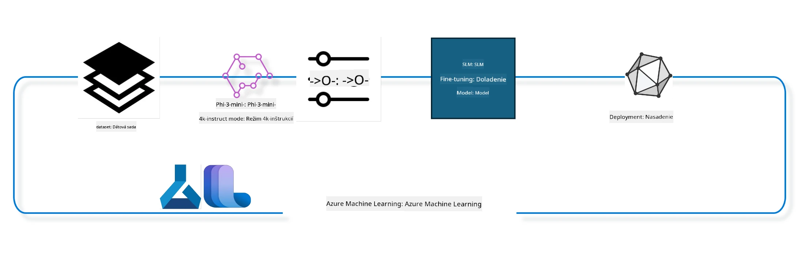

## Ako používať chat-kompletačné komponenty z Azure ML systémového registra na doladenie modelu

V tomto príklade vykonáme doladenie modelu Phi-3-mini-4k-instruct na dokončenie konverzácie medzi 2 ľuďmi pomocou datasetu ultrachat_200k.



Príklad vám ukáže, ako vykonať doladenie pomocou Azure ML SDK a Pythonu a následne nasadiť doladený model na online koncový bod pre inferenciu v reálnom čase.

### Trénovacie dáta

Použijeme dataset ultrachat_200k. Ide o výrazne filtrovanú verziu datasetu UltraChat, ktorá bola použitá na trénovanie Zephyr-7B-β, špičkového 7b chat modelu.

### Model

Použijeme model Phi-3-mini-4k-instruct, aby sme ukázali, ako môže používateľ doladiť model pre úlohu chat-kompletácie. Ak ste otvorili tento notebook zo špecifickej modelovej karty, nezabudnite vymeniť konkrétny názov modelu.

### Úlohy

- Vybrať model na doladenie.
- Vybrať a preskúmať trénovacie dáta.
- Konfigurovať úlohu doladenia.
- Spustiť úlohu doladenia.
- Skontrolovať metriky trénovania a vyhodnotenia.
- Zaregistrovať doladený model.
- Nasadiť doladený model na inferenciu v reálnom čase.
- Vyčistiť zdroje.

## 1. Nastavenie predpokladov

- Nainštalujte závislosti
- Pripojte sa k AzureML Workspace. Viac sa dozviete v nastavení SDK autentifikácie. Nižšie nahraďte <WORKSPACE_NAME>, <RESOURCE_GROUP> a <SUBSCRIPTION_ID>.
- Pripojte sa k azureml systémovému registru
- Nastavte voliteľný názov experimentu
- Skontrolujte alebo vytvorte výpočtový uzol.

> [!NOTE]
> Požiadavky: jeden GPU uzol môže mať viac GPU kariet. Napríklad v jednom uzle Standard_NC24rs_v3 sú 4 NVIDIA V100 GPU, zatiaľ čo v Standard_NC12s_v3 sú 2 NVIDIA V100 GPU. Pozrite dokumentáciu pre tieto informácie. Počet GPU kariet na uzol je nastavený v parametri gpus_per_node nižšie. Správne nastavenie tejto hodnoty zabezpečí využitie všetkých GPU v uzle. Odporúčané GPU compute SKU nájdete tu a tu.

### Python knižnice

Nainštalujte závislosti spustením nasledujúcej bunky. Toto nie je voliteľný krok, ak bežíte v novom prostredí.

```bash
pip install azure-ai-ml
pip install azure-identity
pip install datasets==2.9.0
pip install mlflow
pip install azureml-mlflow
```

### Interakcia s Azure ML

1. Tento Python skript slúži na interakciu so službou Azure Machine Learning (Azure ML). Tu je jeho rozbor:

    - Importuje potrebné moduly zo balíkov azure.ai.ml, azure.identity a azure.ai.ml.entities, ako aj modul time.

    - Snaží sa autentifikovať pomocou DefaultAzureCredential(), ktorý poskytuje zjednodušený autentifikačný zážitok na rýchle začatie vývoja aplikácií bežiacich v Azure cloude. Ak to zlyhá, použije InteractiveBrowserCredential(), ktorý poskytuje interaktívny prihlasovací výzvu.

    - Pokúsi sa vytvoriť inštanciu MLClient použitím metódy from_config, ktorá načíta konfiguráciu z predvolenej konfiguračnej súboru (config.json). Ak to zlyhá, vytvorí MLClient manuálnym zadaním subscription_id, resource_group_name a workspace_name.

    - Vytvorí ďalšiu inštanciu MLClient, tentokrát pre Azure ML registry s názvom "azureml". Táto registry uchováva modely, doladovacie pipeline a prostredia.

    - Nastaví experiment_name na "chat_completion_Phi-3-mini-4k-instruct".

    - Vygeneruje unikátny časový pečiatkový reťazec prevodom aktuálneho času (v sekundách od epochy, ako číslo s plávajúcou desatinnou čiarkou) na integer a následne na reťazec. Tento časový pečiatok môže byť použitý na vytváranie jedinečných názvov a verzií.

    ```python
    # Importujte potrebné moduly z Azure ML a Azure Identity
    from azure.ai.ml import MLClient
    from azure.identity import (
        DefaultAzureCredential,
        InteractiveBrowserCredential,
    )
    from azure.ai.ml.entities import AmlCompute
    import time  # Importujte modul time
    
    # Pokúste sa autentifikovať pomocou DefaultAzureCredential
    try:
        credential = DefaultAzureCredential()
        credential.get_token("https://management.azure.com/.default")
    except Exception as ex:  # Ak DefaultAzureCredential zlyhá, použite InteractiveBrowserCredential
        credential = InteractiveBrowserCredential()
    
    # Pokúste sa vytvoriť inštanciu MLClient pomocou predvolenej konfiguračnej súboru
    try:
        workspace_ml_client = MLClient.from_config(credential=credential)
    except:  # Ak to zlyhá, vytvorte inštanciu MLClient manuálnym poskytnutím údajov
        workspace_ml_client = MLClient(
            credential,
            subscription_id="<SUBSCRIPTION_ID>",
            resource_group_name="<RESOURCE_GROUP>",
            workspace_name="<WORKSPACE_NAME>",
        )
    
    # Vytvorte ďalšiu inštanciu MLClient pre Azure ML register s názvom "azureml"
    # Tento register je miesto, kde sú uložené modely, ladacie pipelines a prostredia
    registry_ml_client = MLClient(credential, registry_name="azureml")
    
    # Nastavte názov experimentu
    experiment_name = "chat_completion_Phi-3-mini-4k-instruct"
    
    # Vygenerujte jedinečný časový údaj, ktorý možno použiť pre názvy a verzie, ktoré musia byť jedinečné
    timestamp = str(int(time.time()))
    ```

## 2. Vyberte základný model na doladenie

1. Phi-3-mini-4k-instruct je model s 3,8 miliardami parametrov, ľahký, špičkový open model vybudovaný na datasetoch použitých pre Phi-2. Model patrí do rodiny Phi-3 a verzia Mini prichádza vo dvoch variantoch 4K a 128K, čo je dĺžka kontextu (v tokenoch), ktorú vie podporiť. Potrebujeme model doladiť na náš konkrétny účel, aby sme ho mohli použiť. Tieto modely môžete prehliadať v Katalógu modelov v AzureML Studio filtrovaním podľa úlohy chat-kompletácie. V tomto príklade používame model Phi-3-mini-4k-instruct. Ak ste otvorili tento notebook pre iný model, nahraďte názov a verziu modelu podľa potreby.

> [!NOTE]
> Vlastnosť model_id modelu. Toto bude odovzdané ako vstup do úlohy doladenia. Toto je tiež dostupné ako pole Asset ID na stránke detailov modelu v Katalógu modelov AzureML Studio.

2. Tento Python skript komunikuje so službou Azure Machine Learning (Azure ML). Tu je jeho rozbor:

    - Nastaví model_name na "Phi-3-mini-4k-instruct".

    - Použije metódu get z vlastnosti models objektu registry_ml_client na získanie najnovšej verzie modelu so zadaným názvom z Azure ML registra. Metóda get je volaná s dvoma argumentmi: názvom modelu a štítkom, ktorý špecifikuje, že má byť vrátená najnovšia verzia modelu.

    - Vypíše správu na konzolu oznamujúcu názov, verziu a id modelu, ktorý bude použitý na doladenie. Na vloženie názvu, verzie a id modelu do správy sa používa formát metódy reťazca. Názov, verzia a id modelu sú získané ako vlastnosti objektu foundation_model.

    ```python
    # Nastavte názov modelu
    model_name = "Phi-3-mini-4k-instruct"
    
    # Získajte najnovšiu verziu modelu z registra Azure ML
    foundation_model = registry_ml_client.models.get(model_name, label="latest")
    
    # Vytlačte názov modelu, verziu a id
    # Tieto informácie sú užitočné na sledovanie a ladenie
    print(
        "\n\nUsing model name: {0}, version: {1}, id: {2} for fine tuning".format(
            foundation_model.name, foundation_model.version, foundation_model.id
        )
    )
    ```

## 3. Vytvorenie výpočtového uzla pre úlohu

Doladenie funguje IBA s GPU výpočtom. Veľkosť výpočtu závisí od veľkosti modelu a vo väčšine prípadov je ťažké správne určiť vhodný výpočtový uzol. V tejto bunke používateľovi poradíme, ako vybrať správny výpočtový uzol.

> [!NOTE]
> Nižšie uvedené výpočty fungujú v najoptimalizovanejšej konfigurácii. Akékoľvek zmeny v konfigurácii môžu viesť k chybe Cuda Out Of Memory. V takých prípadoch skúste upgradovať výpočtový uzol na väčší.

> [!NOTE]
> Pri výbere compute_cluster_size nižšie sa uistite, že výpočtový uzol je k dispozícii vo vašej resource group. Ak konkrétny výpočtový uzol nie je dostupný, môžete požiadať o prístup k výpočtovým zdrojom.

### Kontrola podpory doladenia modelu

1. Tento Python skript komunikuje s modelom Azure Machine Learning (Azure ML). Tu je jeho rozbor:

    - Importuje modul ast, ktorý poskytuje funkcie na spracovanie stromov abstraktnej syntaxe Pythonu.

    - Kontroluje, či objekt foundation_model (ktorý reprezentuje model v Azure ML) má tag s názvom finetune_compute_allow_list. V Azure ML sú tagy dvojice kľúč-hodnota, ktoré môžete vytvoriť a použiť na filtrovanie a triedenie modelov.

    - Ak je tag finetune_compute_allow_list prítomný, použije funkciu ast.literal_eval na bezpečné parsovanie hodnoty tagu (reťazec) do Python zoznamu. Tento zoznam je potom priradený do premennej computes_allow_list. Následne vypíše správu oznamujúcu, že výpočtový uzol by mal byť vytvorený zo zoznamu.

    - Ak tag finetune_compute_allow_list chýba, nastaví computes_allow_list na None a vypíše správu, že tag finetune_compute_allow_list nie je súčasťou tagov modelu.

    - Zhrnutie: skript kontroluje špecifický tag v metadátach modelu, prevádza hodnotu tagu na zoznam, ak existuje, a informuje používateľa o tom.

    ```python
    # Importujte modul ast, ktorý poskytuje funkcie na spracovanie stromov abstraktnej syntaxe Pythonu
    import ast
    
    # Skontrolujte, či je v značkách modelu prítomný tag 'finetune_compute_allow_list'
    if "finetune_compute_allow_list" in foundation_model.tags:
        # Ak je tag prítomný, použite ast.literal_eval na bezpečné spracovanie hodnoty tagu (reťazca) na Python zoznam
        computes_allow_list = ast.literal_eval(
            foundation_model.tags["finetune_compute_allow_list"]
        )  # previesť reťazec na python zoznam
        # Vypíšte správu, ktorá oznamuje, že sa má vytvoriť výpočtová úloha zo zoznamu
        print(f"Please create a compute from the above list - {computes_allow_list}")
    else:
        # Ak tag nie je prítomný, nastavte computes_allow_list na None
        computes_allow_list = None
        # Vypíšte správu, ktorá oznamuje, že tag 'finetune_compute_allow_list' nie je súčasťou značiek modelu
        print("`finetune_compute_allow_list` is not part of model tags")
    ```

### Kontrola výpočtového uzla

1. Tento Python skript komunikuje so službou Azure Machine Learning (Azure ML) a vykonáva niekoľko kontrol na výpočtovom uzle. Tu je jeho rozbor:

    - Pokúša sa získať výpočtový uzol s názvom uloženým v compute_cluster z Azure ML workspace. Ak je stav provisioning-u uzla "failed" (zlyhal), vyvolá ValueError.

    - Skontroluje, či je computes_allow_list rôzne od None. Ak áno, prevádza všetky veľkosti výpočtu v zozname na malé písmená a kontroluje, či veľkosť aktuálneho výpočtového uzla je v zozname. Ak nie je, vyvolá ValueError.

    - Ak je computes_allow_list None, overí či veľkosť výpočtového uzla patrí do zoznamu nepodporovaných veľkostí GPU VM. Ak áno, vyvolá ValueError.

    - Získa zoznam všetkých dostupných veľkostí výpočtových uzlov v workspace. Následne pre každý typ výpočtu overí, či jeho názov zodpovedá veľkosti aktuálneho uzla. Ak áno, získa počet GPU pre daný výpočtový uzol a nastaví gpu_count_found na True.

    - Ak je gpu_count_found True, vypíše počet GPU vo výpočtovom uzle. Ak je gpu_count_found False, vyvolá ValueError.

    - Zhrnutie: tento skript vykonáva niekoľko kontrol na výpočtovom uzle v Azure ML workspace, vrátane kontroly stavu provisioningu, veľkosti voči povolenému alebo zakázanému zoznamu a počtu GPU.

    ```python
    # Vytlačte správu o výnimke
    print(e)
    # Vyvolajte ValueError, ak veľkosť výpočtu nie je k dispozícii v pracovnom priestore
    raise ValueError(
        f"WARNING! Compute size {compute_cluster_size} not available in workspace"
    )
    
    # Získajte inštanciu výpočtu z Azure ML pracovného priestoru
    compute = workspace_ml_client.compute.get(compute_cluster)
    # Skontrolujte, či je stav provisioning inštancie výpočtu "failed"
    if compute.provisioning_state.lower() == "failed":
        # Vyvolajte ValueError, ak je stav provisioning "failed"
        raise ValueError(
            f"Provisioning failed, Compute '{compute_cluster}' is in failed state. "
            f"please try creating a different compute"
        )
    
    # Skontrolujte, či computes_allow_list nie je None
    if computes_allow_list is not None:
        # Preveďte všetky veľkosti výpočtov v computes_allow_list na malé písmená
        computes_allow_list_lower_case = [x.lower() for x in computes_allow_list]
        # Skontrolujte, či je veľkosť inštancie výpočtu v computes_allow_list_lower_case
        if compute.size.lower() not in computes_allow_list_lower_case:
            # Vyvolajte ValueError, ak veľkosť inštancie výpočtu nie je v computes_allow_list_lower_case
            raise ValueError(
                f"VM size {compute.size} is not in the allow-listed computes for finetuning"
            )
    else:
        # Definujte zoznam nepodporovaných veľkostí GPU VM
        unsupported_gpu_vm_list = [
            "standard_nc6",
            "standard_nc12",
            "standard_nc24",
            "standard_nc24r",
        ]
        # Skontrolujte, či je veľkosť inštancie výpočtu v unsupported_gpu_vm_list
        if compute.size.lower() in unsupported_gpu_vm_list:
            # Vyvolajte ValueError, ak je veľkosť inštancie výpočtu v unsupported_gpu_vm_list
            raise ValueError(
                f"VM size {compute.size} is currently not supported for finetuning"
            )
    
    # Inicializujte príznak na kontrolu, či bol nájdený počet GPU v inštancii výpočtu
    gpu_count_found = False
    # Získajte zoznam všetkých dostupných veľkostí výpočtov v pracovnom priestore
    workspace_compute_sku_list = workspace_ml_client.compute.list_sizes()
    available_sku_sizes = []
    # Iterujte cez zoznam dostupných veľkostí výpočtov
    for compute_sku in workspace_compute_sku_list:
        available_sku_sizes.append(compute_sku.name)
        # Skontrolujte, či názov veľkosti výpočtu zodpovedá veľkosti inštancie výpočtu
        if compute_sku.name.lower() == compute.size.lower():
            # Ak áno, získajte počet GPU pre túto veľkosť výpočtu a nastavte gpu_count_found na True
            gpus_per_node = compute_sku.gpus
            gpu_count_found = True
    # Ak je gpu_count_found True, vytlačte počet GPU v inštancii výpočtu
    if gpu_count_found:
        print(f"Number of GPU's in compute {compute.size}: {gpus_per_node}")
    else:
        # Ak je gpu_count_found False, vyvolajte ValueError
        raise ValueError(
            f"Number of GPU's in compute {compute.size} not found. Available skus are: {available_sku_sizes}."
            f"This should not happen. Please check the selected compute cluster: {compute_cluster} and try again."
        )
    ```

## 4. Vyberte dataset na doladenie modelu

1. Používame dataset ultrachat_200k. Dataset má štyri časti, vhodné na supervidované doladenie (sft).
Generačné hodnotenie (gen). Počet príkladov na časť je uvedený nasledovne:

    ```bash
    train_sft test_sft  train_gen  test_gen
    207865  23110  256032  28304
    ```

1. Nasledujúce bunky ukazujú základnú prípravu dát na doladenie:

### Vizualizácia niektorých riadkov dát

Chceme, aby tento príklad bežal rýchlo, takže uložíme súbory train_sft a test_sft obsahujúce 5 % už upravených riadkov. Znamená to, že doladený model bude mať nižšiu presnosť, takže by nemal byť použitý v reálnom svete.
Skript download-dataset.py sa používa na stiahnutie datasetu ultrachat_200k a transformáciu datasetu do formátu použiteľného pre komponenty doladenia pipeline. Vzhľadom na veľkosť datasetu tu máme len jeho časť.

1. Spustením nižšie uvedeného skriptu sa stiahne len 5 % dát. Toto percento môžete zvýšiť zmenou parametra dataset_split_pc na požadované percento.

> [!NOTE]
> Niektoré jazykové modely majú rôzne jazykové kódy, preto by stĺpce v datasete mali odrážať tieto kódy.

1. Tu je príklad, ako by mali dáta vyzerať
Dataset pre chat-kompletáciu je uložený vo formáte parquet, pričom každý záznam používa nasledujúcu schému:

    - Ide o JSON (JavaScript Object Notation) dokument, ktorý je populárnym formátom na výmenu dát. Nie je to spustiteľný kód, ale spôsob uloženia a prenosu dát. Tu je jeho štruktúra:

    - "prompt": Tento kľúč obsahuje reťazec predstavujúci úlohu alebo otázku položenú AI asistentovi.

    - "messages": Tento kľúč obsahuje pole objektov. Každý objekt reprezentuje správu v konverzácii medzi používateľom a AI asistentom. Každá správa má dva kľúče:

    - "content": Textový obsah správy.
    - "role": Rola entity, ktorá správu odoslala. Môže byť "user" alebo "assistant".
    - "prompt_id": Unikátny identifikátor promptu.

1. V tomto konkrétnom JSON dokumente je reprezentovaná konverzácia, kde používateľ žiada AI asistenta o vytvorenie protagonistu pre dystopický príbeh. Asistent odpovedá a používateľ následne žiada o viac detailov. Asistent súhlasí s poskytnutím podrobností. Celá konverzácia je spojená s konkrétnym prompt_id.

    ```python
    {
        // The task or question posed to an AI assistant
        "prompt": "Create a fully-developed protagonist who is challenged to survive within a dystopian society under the rule of a tyrant. ...",
        
        // An array of objects, each representing a message in a conversation between a user and an AI assistant
        "messages":[
            {
                // The content of the user's message
                "content": "Create a fully-developed protagonist who is challenged to survive within a dystopian society under the rule of a tyrant. ...",
                // The role of the entity that sent the message
                "role": "user"
            },
            {
                // The content of the assistant's message
                "content": "Name: Ava\n\n Ava was just 16 years old when the world as she knew it came crashing down. The government had collapsed, leaving behind a chaotic and lawless society. ...",
                // The role of the entity that sent the message
                "role": "assistant"
            },
            {
                // The content of the user's message
                "content": "Wow, Ava's story is so intense and inspiring! Can you provide me with more details.  ...",
                // The role of the entity that sent the message
                "role": "user"
            }, 
            {
                // The content of the assistant's message
                "content": "Certainly! ....",
                // The role of the entity that sent the message
                "role": "assistant"
            }
        ],
        
        // A unique identifier for the prompt
        "prompt_id": "d938b65dfe31f05f80eb8572964c6673eddbd68eff3db6bd234d7f1e3b86c2af"
    }
    ```

### Stiahnutie dát

1. Tento Python skript slúži na stiahnutie datasetu pomocou pomocného skriptu download-dataset.py. Tu je rozbor, čo robí:

    - Importuje modul os, ktorý poskytuje prenosný spôsob používania funkcií závislých na operačnom systéme.

    - Pomocou funkcie os.system spustí skript download-dataset.py v shell-i s konkrétnymi argumentmi príkazového riadku. Argumenty špecifikujú dataset na stiahnutie (HuggingFaceH4/ultrachat_200k), adresár na uloženie (ultrachat_200k_dataset) a percento rozdelenia datasetu (5). Funkcia os.system vracia ukončovací kód spusteného príkazu, ktorý je uložený v premennej exit_status.

    - Skontroluje, či exit_status nie je 0. V Unix-like systémoch je kód 0 indikátor úspechu príkazu, každé iné číslo značí chybu. Ak exit_status nie je 0, vyvolá výnimku Exception s hlásením o chybe pri sťahovaní datasetu.

    - Zhrnutie: skript spúšťa príkaz na stiahnutie datasetu pomocou pomocného skriptu a v prípade neúspechu vyvolá výnimku.

    ```python
    # Importujte modul os, ktorý poskytuje spôsob použitia funkcií závislých od operačného systému
    import os
    
    # Použite funkciu os.system na spustenie skriptu download-dataset.py v shelli so špecifickými argumentmi príkazového riadku
    # Argumenty určujú dátovú množinu na stiahnutie (HuggingFaceH4/ultrachat_200k), adresár na stiahnutie (ultrachat_200k_dataset) a percento dátovej množiny na rozdelenie (5)
    # Funkcia os.system vracia výstupný stav príkazu, ktorý vykonala; tento stav sa uloží do premennej exit_status
    exit_status = os.system(
        "python ./download-dataset.py --dataset HuggingFaceH4/ultrachat_200k --download_dir ultrachat_200k_dataset --dataset_split_pc 5"
    )
    
    # Skontrolujte, či exit_status nie je 0
    # V operačných systémoch podobných Unixu výstupný stav 0 zvyčajne znamená, že príkaz bol úspešný, zatiaľ čo akékoľvek iné číslo znamená chybu
    # Ak exit_status nie je 0, vyhodte výnimku s hlásením, že pri sťahovaní dátovej množiny došlo k chybe
    if exit_status != 0:
        raise Exception("Error downloading dataset")
    ```

### Načítanie dát do DataFrame
1. Tento Python skript načítava súbor JSON Lines do pandas DataFrame a zobrazuje prvých 5 riadkov. Tu je prehľad toho, čo robí:

    - Importuje knižnicu pandas, ktorá je výkonnou knižnicou na manipuláciu s dátami a ich analýzu.

    - Nastavuje maximálnu šírku stĺpca pre zobrazenie pandas na 0. To znamená, že celý text každého stĺpca sa zobrazí bez skrátenia, keď sa DataFrame vytlačí.

    - Používa funkciu pd.read_json na načítanie súboru train_sft.jsonl z adresára ultrachat_200k_dataset do DataFrame. Argument lines=True označuje, že súbor je vo formáte JSON Lines, kde každý riadok je samostatný JSON objekt.

    - Používa metódu head na zobrazenie prvých 5 riadkov DataFrame. Ak DataFrame obsahuje menej než 5 riadkov, zobrazí všetky.

    - Stručne povedané, tento skript načítava súbor JSON Lines do DataFrame a zobrazuje prvých 5 riadkov s úplným textom stĺpcov.
    
    ```python
    # Importuj knižnicu pandas, ktorá je výkonnou knižnicou na manipuláciu s dátami a analýzu
    import pandas as pd
    
    # Nastav maximálnu šírku stĺpca pre zobrazovacie možnosti pandas na 0
    # To znamená, že sa zobrazí celý text každého stĺpca bez orezania, keď sa DataFrame vytlačí
    pd.set_option("display.max_colwidth", 0)
    
    # Použi funkciu pd.read_json na načítanie súboru train_sft.jsonl z adresára ultrachat_200k_dataset do DataFrame
    # Argument lines=True naznačuje, že súbor je vo formáte JSON Lines, kde každý riadok je samostatný JSON objekt
    df = pd.read_json("./ultrachat_200k_dataset/train_sft.jsonl", lines=True)
    
    # Použi metódu head na zobrazenie prvých 5 riadkov DataFrame
    # Ak má DataFrame menej ako 5 riadkov, zobrazia sa všetky
    df.head()
    ```

## 5. Odoslanie úlohy jemného dolaďovania pomocou modelu a dát ako vstupov

Vytvorte úlohu, ktorá používa komponent pipeline pre chat-completion. Viac informácií o všetkých podporovaných parametroch pre jemné dolaďovanie.

### Definovanie parametrov jemného dolaďovania

1. Parametre jemného dolaďovania možno rozdeliť do 2 kategórií - parametre trénovania a parametre optimalizácie

1. Trénovacie parametre definujú aspekty trénovania ako -

    - Optimizer, plánovač (scheduler) ktorý sa má použiť
    - Metriku na optimalizáciu jemného dolaďovania
    - Počet krokov trénovania a veľkosť batchu a podobne
    - Parametre optimalizácie pomáhajú optimalizovať pamäť GPU a efektívne využívať výpočtové zdroje.

1. Nižšie sú niektoré z parametrov, ktoré patria do tejto kategórie. Parametre optimalizácie sa líšia pre každý model a sú zabalené s modelom, aby sa tieto rozdiely riešili.

    - Povolenie deepspeed a LoRA
    - Povolenie trénovania s kombinovanou presnosťou (mixed precision training)
    - Povolenie trénovania na viacerých uzloch (multi-node training)

> [!NOTE]
> Supervised jemné dolaďovanie môže viesť k strate zarovnania alebo katastrofickému zabudnutiu. Odporúčame skontrolovať tento problém a spustiť fázu zarovnania po jemnom dolaďovaní.

### Parametre jemného dolaďovania

1. Tento Python skript nastavuje parametre pre jemné dolaďovanie strojového učenia. Tu je prehľad toho, čo robí:

    - Nastavuje predvolené trénovacie parametre ako počet epôch trénovania, veľkosti batchov pre trénovanie a vyhodnotenie, rýchlosť učenia (learning rate) a typ plánovača rýchlosti učenia.

    - Nastavuje predvolené optimalizačné parametre ako či sa má použiť Layer-wise Relevance Propagation (LoRa) a DeepSpeed, a štádium DeepSpeed.

    - Kombinuje trénovacie a optimalizačné parametre do jedného slovníka s názvom finetune_parameters.

    - Kontroluje, či foundation_model obsahuje nejaké predvolené parametre špecifické pre model. Ak áno, vypíše varovnú správu a aktualizuje slovník finetune_parameters o tieto modelovo špecifické predvoľby. Funkcia ast.literal_eval sa používa na prevod modelovo špecifických predvolieb zo stringu do Python slovníka.

    - Vypíše výslednú množinu parametrov jemného dolaďovania, ktoré sa použijú pre beh.

    - Stručne povedané, tento skript nastavuje a zobrazuje parametre pre jemné dolaďovanie modelu strojového učenia s možnosťou prepísať predvolené parametre modelovo špecifickými.

    ```python
    # Nastavte predvolené parametre tréningu, ako je počet epoch tréningu, veľkosti dávok pre tréning a vyhodnotenie, rýchlosť učenia a typ plánovača rýchlosti učenia
    training_parameters = dict(
        num_train_epochs=3,
        per_device_train_batch_size=1,
        per_device_eval_batch_size=1,
        learning_rate=5e-6,
        lr_scheduler_type="cosine",
    )
    
    # Nastavte predvolené parametre optimalizácie, ako napríklad či sa má použiť propagácia relevantnosti po vrstvách (LoRa) a DeepSpeed, a stupeň DeepSpeed
    optimization_parameters = dict(
        apply_lora="true",
        apply_deepspeed="true",
        deepspeed_stage=2,
    )
    
    # Zlúčte parametre tréningu a optimalizácie do jedného slovníka nazývaného finetune_parameters
    finetune_parameters = {**training_parameters, **optimization_parameters}
    
    # Skontrolujte, či foundation_model nemá nejaké modelovo-špecifické predvolené parametre
    # Ak áno, vytlačte varovnú správu a aktualizujte slovník finetune_parameters týmito modelovo-špecifickými predvoľbami
    # Funkcia ast.literal_eval sa používa na konverziu modelovo-špecifických predvolieb zo reťazca na Python slovník
    if "model_specific_defaults" in foundation_model.tags:
        print("Warning! Model specific defaults exist. The defaults could be overridden.")
        finetune_parameters.update(
            ast.literal_eval(  # konvertovať reťazec na python slovník
                foundation_model.tags["model_specific_defaults"]
            )
        )
    
    # Vytlačte konečnú sadu parametrov pre doladenie, ktoré sa použijú pri behu
    print(
        f"The following finetune parameters are going to be set for the run: {finetune_parameters}"
    )
    ```

### Trénovací Pipeline

1. Tento Python skript definuje funkciu na generovanie zobrazovaného mena pre pipeline trénovania strojového učenia a potom volá túto funkciu na vygenerovanie a vytlačenie zobrazovaného mena. Tu je prehľad toho, čo robí:

1. Definuje sa funkcia get_pipeline_display_name. Táto funkcia generuje zobrazované meno na základe rôznych parametrov súvisiacich s trénovacím pipeline.

1. Vo funkcii sa vypočíta celková veľkosť batchu vynásobením veľkosti batchu na zariadenie, počtom krokov akumulácie gradientu, počtom GPU na jeden uzol a počtom uzlov použitých na jemné dolaďovanie.

1. Získa sa viacero ďalších parametrov ako typ plánovača učenia, či sa aplikoval DeepSpeed, štádium DeepSpeed, či sa aplikoval Layer-wise Relevance Propagation (LoRa), limit počtu uložených checkpointov modelu a maximálna dĺžka sekvencie.

1. Konštruuje sa reťazec, ktorý obsahuje všetky tieto parametre oddelené pomlčkami. Ak sa používa DeepSpeed alebo LoRa, reťazec obsahuje "ds" nasledované štádiom DeepSpeed, alebo "lora". Ak nie, obsahuje "nods" alebo "nolora".

1. Funkcia vráti tento reťazec, ktorý slúži ako zobrazované meno pre trénovací pipeline.

1. Po definovaní funkcie sa táto zavolá na generovanie zobrazovaného mena, ktoré sa následne vytlačí.

1. Stručne povedané, tento skript generuje zobrazované meno pre trénovací pipeline strojového učenia na základe rôznych parametrov a potom toto meno vytlačí.

    ```python
    # Definujte funkciu na generovanie zobrazovaného mena pre tréningový pipeline
    def get_pipeline_display_name():
        # Vypočítajte celkovú veľkosť batchu vynásobením veľkosti batchu na zariadenie, počtu krokov akumulácie gradientu, počtu GPU na uzol a počtu uzlov použitých na doladenie
        batch_size = (
            int(finetune_parameters.get("per_device_train_batch_size", 1))
            * int(finetune_parameters.get("gradient_accumulation_steps", 1))
            * int(gpus_per_node)
            * int(finetune_parameters.get("num_nodes_finetune", 1))
        )
        # Získajte typ schedulera učenia sa (learning rate scheduler)
        scheduler = finetune_parameters.get("lr_scheduler_type", "linear")
        # Zistite, či je použitý DeepSpeed
        deepspeed = finetune_parameters.get("apply_deepspeed", "false")
        # Získajte stupeň DeepSpeed
        ds_stage = finetune_parameters.get("deepspeed_stage", "2")
        # Ak je použitý DeepSpeed, pridajte do zobrazovaného mena "ds" nasledované stupňom DeepSpeed; ak nie, pridajte "nods"
        if deepspeed == "true":
            ds_string = f"ds{ds_stage}"
        else:
            ds_string = "nods"
        # Zistite, či je použitá vrstvová relevance propagácia (Layer-wise Relevance Propagation, LoRa)
        lora = finetune_parameters.get("apply_lora", "false")
        # Ak je použitá LoRa, pridajte do zobrazovaného mena "lora"; ak nie, pridajte "nolora"
        if lora == "true":
            lora_string = "lora"
        else:
            lora_string = "nolora"
        # Získajte limit na počet modelových checkpointov, ktoré sa majú uchovať
        save_limit = finetune_parameters.get("save_total_limit", -1)
        # Získajte maximálnu dĺžku sekvencie
        seq_len = finetune_parameters.get("max_seq_length", -1)
        # Vytvorte zobrazované meno spojením všetkých týchto parametrov oddelených pomlčkami
        return (
            model_name
            + "-"
            + "ultrachat"
            + "-"
            + f"bs{batch_size}"
            + "-"
            + f"{scheduler}"
            + "-"
            + ds_string
            + "-"
            + lora_string
            + f"-save_limit{save_limit}"
            + f"-seqlen{seq_len}"
        )
    
    # Zavolajte funkciu na generovanie zobrazovaného mena
    pipeline_display_name = get_pipeline_display_name()
    # Vytlačte zobrazované meno
    print(f"Display name used for the run: {pipeline_display_name}")
    ```

### Konfigurácia Pipeline

Tento Python skript definuje a konfiguruje pipeline strojového učenia pomocou Azure Machine Learning SDK. Tu je prehľad toho, čo robí:

1. Importuje potrebné moduly zo SDK Azure AI ML.

1. Z registry načíta pipeline komponent "chat_completion_pipeline".

1. Definuje pipeline job pomocou dekorátora `@pipeline` a funkcie `create_pipeline`. Názov pipeline je nastavený na `pipeline_display_name`.

1. Vo funkcii `create_pipeline` inicializuje načítaný pipeline komponent s rôznymi parametrami, vrátane cesty k modelu, výpočtových klastrov pre rôzne fázy, datasetov pre trénovanie a testovanie, počtu GPU použitých pre jemné dolaďovanie a ďalších parametrov jemného dolaďovania.

1. Mape výstup z jemného dolaďovania na výstup pipeline jobu. Toto sa robí, aby bolo možné ľahko zaregistrovať jemne doladený model, čo je potrebné pre jeho nasadenie do online alebo batch endpointu.

1. Vytvorí inštanciu pipeline zavolaním funkcie `create_pipeline`.

1. Nastaví parametre pipeline `force_rerun` na hodnotu `True`, čo znamená, že nebudú použité uložené výsledky z predchádzajúcich jobov.

1. Nastaví parameter `continue_on_step_failure` pipeline na `False`, čo znamená, že pipeline sa zastaví, ak niektorý krok zlyhá.

1. Stručne povedané, tento skript definuje a konfiguruje pipeline strojového učenia pre úlohu chat completion použitím Azure Machine Learning SDK.

    ```python
    # Importujte potrebné moduly z Azure AI ML SDK
    from azure.ai.ml.dsl import pipeline
    from azure.ai.ml import Input
    
    # Získajte komponent pipeline s názvom "chat_completion_pipeline" z registra
    pipeline_component_func = registry_ml_client.components.get(
        name="chat_completion_pipeline", label="latest"
    )
    
    # Definujte úlohu pipeline pomocou dekorátora @pipeline a funkcie create_pipeline
    # Názov pipeline je nastavený na pipeline_display_name
    @pipeline(name=pipeline_display_name)
    def create_pipeline():
        # Inicializujte získaný komponent pipeline s rôznymi parametrami
        # Tieto zahŕňajú cestu k modelu, výpočtové klastre pre rôzne fázy, rozdelenia datasetu na trénovanie a testovanie, počet GPU na ladenie a ďalšie parametre ladenia
        chat_completion_pipeline = pipeline_component_func(
            mlflow_model_path=foundation_model.id,
            compute_model_import=compute_cluster,
            compute_preprocess=compute_cluster,
            compute_finetune=compute_cluster,
            compute_model_evaluation=compute_cluster,
            # Namapujte rozdelenia datasetu na parametre
            train_file_path=Input(
                type="uri_file", path="./ultrachat_200k_dataset/train_sft.jsonl"
            ),
            test_file_path=Input(
                type="uri_file", path="./ultrachat_200k_dataset/test_sft.jsonl"
            ),
            # Nastavenia trénovania
            number_of_gpu_to_use_finetuning=gpus_per_node,  # Nastavené na počet GPU dostupných vo výpočte
            **finetune_parameters
        )
        return {
            # Namapujte výstup ladenia na výstup pipeline úlohy
            # Robí sa to, aby sme mohli ľahko zaregistrovať vyladený model
            # Registrácia modelu je potrebná na nasadenie modelu na online alebo dávkový endpoint
            "trained_model": chat_completion_pipeline.outputs.mlflow_model_folder
        }
    
    # Vytvorte inštanciu pipeline zavolaním funkcie create_pipeline
    pipeline_object = create_pipeline()
    
    # Nepoužívajte uložené výsledky z predchádzajúcich úloh
    pipeline_object.settings.force_rerun = True
    
    # Nastavte pokračovanie po chybe kroku na False
    # To znamená, že pipeline sa zastaví, ak niektorý krok zlyhá
    pipeline_object.settings.continue_on_step_failure = False
    ```

### Odoslanie úlohy

1. Tento Python skript odosiela pipeline job strojového učenia do Azure Machine Learning pracovného priestoru a následne čaká na dokončenie jobu. Tu je prehľad toho, čo robí:

    - Zavolá metódu create_or_update objektu jobs v workspace_ml_client na odoslanie pipeline jobu. Pipeline, ktorá sa má spustiť je špecifikovaná pipeline_object a experiment, pod ktorým job beží, je zadaný experiment_name.

    - Potom zavolá metódu stream objektu jobs v workspace_ml_client, aby počkal na dokončenie pipeline jobu. Job, na ktorý sa čaká je určený atribútom name objektu pipeline_job.

    - Stručne povedané, tento skript odosiela pipeline job strojového učenia do Azure Machine Learning pracovného priestoru a čaká na jeho dokončenie.

    ```python
    # Odoslať úlohu pipeline do pracovného priestoru Azure Machine Learning
    # Pipeline, ktorá sa má spustiť, je určená objektom pipeline_object
    # Experiment, pod ktorým sa úloha spustí, je určený názvom experiment_name
    pipeline_job = workspace_ml_client.jobs.create_or_update(
        pipeline_object, experiment_name=experiment_name
    )
    
    # Čakať na dokončenie úlohy pipeline
    # Úloha, na ktorú sa má čakať, je určená atribútom name objektu pipeline_job
    workspace_ml_client.jobs.stream(pipeline_job.name)
    ```

## 6. Registrácia jemne doladeného modelu v pracovnom priestore

Model z výstupu úlohy jemného dolaďovania zaregistrujeme. To umožní sledovať líniu medzi jemne doladeným modelom a jemným dolaďovaním. Úloha jemného dolaďovania tiež sleduje líniu k základnému modelu, dátam a trénovaciemu kódu.

### Registrácia ML modelu

1. Tento Python skript registruje model strojového učenia, ktorý bol trénovaný v pipeline Azure Machine Learning. Tu je prehľad, čo robí:

    - Importuje potrebné moduly zo SDK Azure AI ML.

    - Kontroluje, či je výstup trained_model dostupný z pipeline jobu volaním metódy get objektu jobs z workspace_ml_client a získaním jeho atribútu outputs.

    - Konštruuje cestu k trénovanému modelu formátovaním reťazca s názvom pipeline jobu a názvom výstupu ("trained_model").

    - Definuje názov pre jemne doladený model pridaním "-ultrachat-200k" k pôvodnému názvu modelu a nahradením všetkých lomiek pomlčkami.

    - Pripravuje sa na registráciu modelu vytvorením objektu Model s rôznymi parametrami, vrátane cesty k modelu, typu modelu (MLflow model), názvu a verzie modelu a popisu modelu.

    - Registruje model volaním create_or_update metódy objektu models v workspace_ml_client s Model objektom ako argumentom.

    - Vytlačí zaregistrovaný model.

1. Stručne povedané, tento skript registruje model strojového učenia, ktorý bol trénovaný v Azure Machine Learning pipeline.
    
    ```python
    # Importujte potrebné moduly zo SDK Azure AI ML
    from azure.ai.ml.entities import Model
    from azure.ai.ml.constants import AssetTypes
    
    # Skontrolujte, či je výstup `trained_model` dostupný z pipeline jobu
    print("pipeline job outputs: ", workspace_ml_client.jobs.get(pipeline_job.name).outputs)
    
    # Vytvorte cestu k vyškolenému modelu formátovaním reťazca s názvom pipeline jobu a názvom výstupu ("trained_model")
    model_path_from_job = "azureml://jobs/{0}/outputs/{1}".format(
        pipeline_job.name, "trained_model"
    )
    
    # Definujte názov pre doladený model pridaním "-ultrachat-200k" k pôvodnému názvu modelu a nahradením lomítok pomlčkami
    finetuned_model_name = model_name + "-ultrachat-200k"
    finetuned_model_name = finetuned_model_name.replace("/", "-")
    
    print("path to register model: ", model_path_from_job)
    
    # Pripravte sa na registráciu modelu vytvorením objektu Model s rôznymi parametrami
    # Patrí sem cesta k modelu, typ modelu (MLflow model), názov a verzia modelu a popis modelu
    prepare_to_register_model = Model(
        path=model_path_from_job,
        type=AssetTypes.MLFLOW_MODEL,
        name=finetuned_model_name,
        version=timestamp,  # Použite časovú pečiatku ako verziu, aby ste predišli konfliktu verzií
        description=model_name + " fine tuned model for ultrachat 200k chat-completion",
    )
    
    print("prepare to register model: \n", prepare_to_register_model)
    
    # Registrovať model volaním metódy create_or_update objektu models v workspace_ml_client s objektom Model ako argumentom
    registered_model = workspace_ml_client.models.create_or_update(
        prepare_to_register_model
    )
    
    # Vytlačte registrovaný model
    print("registered model: \n", registered_model)
    ```

## 7. Nasadenie jemne doladeného modelu do online endpointu

Online endpointy poskytujú trvácne REST API, ktoré môžu byť použité na integráciu s aplikáciami, ktoré potrebujú model používať.

### Správa endpointu

1. Tento Python skript vytvára spravovaný online endpoint v Azure Machine Learning pre registrovaný model. Tu je prehľad, čo robí:

    - Importuje potrebné moduly zo SDK Azure AI ML.

    - Definuje jedinečný názov online endpointu pridaním časovej pečiatky k reťazcu "ultrachat-completion-".

    - Pripravuje vytvorenie online endpointu vytvorením objektu ManagedOnlineEndpoint s rôznymi parametrami, vrátane názvu endpointu, popisu a režimu overovania ("key").

    - Vytvára online endpoint volaním begin_create_or_update metódy workspace_ml_client s objektom ManagedOnlineEndpoint ako argumentom. Následne čaká na dokončenie vytvorenia volaním wait metódy.

1. Stručne povedané, tento skript vytvára spravovaný online endpoint v Azure Machine Learning pre registrovaný model.

    ```python
    # Importujte potrebné moduly zo sady Azure AI ML SDK
    from azure.ai.ml.entities import (
        ManagedOnlineEndpoint,
        ManagedOnlineDeployment,
        ProbeSettings,
        OnlineRequestSettings,
    )
    
    # Definujte jedinečný názov pre online endpoint pridaním časovej pečiatky k reťazcu "ultrachat-completion-"
    online_endpoint_name = "ultrachat-completion-" + timestamp
    
    # Pripravte sa na vytvorenie online endpointu vytvorením objektu ManagedOnlineEndpoint s rôznymi parametrami
    # Tieto zahŕňajú názov endpointu, popis endpointu a režim autentifikácie ("key")
    endpoint = ManagedOnlineEndpoint(
        name=online_endpoint_name,
        description="Online endpoint for "
        + registered_model.name
        + ", fine tuned model for ultrachat-200k-chat-completion",
        auth_mode="key",
    )
    
    # Vytvorte online endpoint zavolaním metódy begin_create_or_update klienta workspace_ml_client s objektom ManagedOnlineEndpoint ako argumentom
    # Potom počkajte, kým sa operácia vytvorenia dokončí, zavolaním metódy wait
    workspace_ml_client.begin_create_or_update(endpoint).wait()
    ```

> [!NOTE]
> Tu nájdete zoznam SKU podporovaných pre nasadenie - [Managed online endpoints SKU list](https://learn.microsoft.com/azure/machine-learning/reference-managed-online-endpoints-vm-sku-list)

### Nasadenie ML modelu

1. Tento Python skript nasadzuje registrovaný model strojového učenia do spravovaného online endpointu v Azure Machine Learning. Tu je prehľad, čo robí:

    - Importuje modul ast, ktorý poskytuje funkcie na spracovanie stromov abstraktnej syntaxe Pythonu.

    - Nastavuje typ inštancie pre nasadenie na "Standard_NC6s_v3".

    - Kontroluje, či značka inference_compute_allow_list je prítomná v foundation modeli. Ak áno, skonvertuje hodnotu tejto značky zo stringu na Python zoznam a priradí ju do inference_computes_allow_list. Ak nie, nastaví inference_computes_allow_list na None.

    - Skontroluje, či je vybraný typ inštancie v povolenom zozname. Ak nie je, vypíše správu s požiadavkou, aby si používateľ zvolil typ inštancie zo zoznamu povolených.

    - Pripravuje vytvorenie nasadenia vytvorením objektu ManagedOnlineDeployment s rôznymi parametrami, vrátane názvu nasadenia, názvu endpointu, ID modelu, typu a počtu inštancií, nastavení liveness probe a nastavení požiadaviek.

    - Vytvára nasadenie volaním begin_create_or_update metódy workspace_ml_client s objektom ManagedOnlineDeployment ako argumentom. Pak čaká na dokončenie tejto operácie volaním wait.

    - Nastavuje traffic endpointu na smerovanie 100 % dopravy do nasadenia s názvom "demo".

    - Aktualizuje endpoint volaním begin_create_or_update metódy workspace_ml_client s objektom endpoint ako argumentom. Pak čaká na dokončenie aktualizácie volaním result.

1. Stručne povedané, tento skript nasadzuje registrovaný model strojového učenia do spravovaného online endpointu v Azure Machine Learning.

    ```python
    # Importujte modul ast, ktorý poskytuje funkcie na spracovanie stromov abstraktnej syntaktickej gramatiky Pythonu
    import ast
    
    # Nastavte typ inštancie pre nasadenie
    instance_type = "Standard_NC6s_v3"
    
    # Skontrolujte, či je v základe modelu prítomný tag `inference_compute_allow_list`
    if "inference_compute_allow_list" in foundation_model.tags:
        # Ak áno, prekonvertujte hodnotu tagu zo reťazca na Python zoznam a priraďte ju k `inference_computes_allow_list`
        inference_computes_allow_list = ast.literal_eval(
            foundation_model.tags["inference_compute_allow_list"]
        )
        print(f"Please create a compute from the above list - {computes_allow_list}")
    else:
        # Ak nie, nastavte `inference_computes_allow_list` na `None`
        inference_computes_allow_list = None
        print("`inference_compute_allow_list` is not part of model tags")
    
    # Skontrolujte, či je zvolený typ inštancie v povolenom zozname
    if (
        inference_computes_allow_list is not None
        and instance_type not in inference_computes_allow_list
    ):
        print(
            f"`instance_type` is not in the allow listed compute. Please select a value from {inference_computes_allow_list}"
        )
    
    # Pripravte sa na vytvorenie nasadenia vytvorením objektu `ManagedOnlineDeployment` s rôznymi parametrami
    demo_deployment = ManagedOnlineDeployment(
        name="demo",
        endpoint_name=online_endpoint_name,
        model=registered_model.id,
        instance_type=instance_type,
        instance_count=1,
        liveness_probe=ProbeSettings(initial_delay=600),
        request_settings=OnlineRequestSettings(request_timeout_ms=90000),
    )
    
    # Vytvorte nasadenie zavolaním metódy `begin_create_or_update` klienta `workspace_ml_client` s objektom `ManagedOnlineDeployment` ako argumentom
    # Potom počkajte na dokončenie vytváracej operácie zavolaním metódy `wait`
    workspace_ml_client.online_deployments.begin_create_or_update(demo_deployment).wait()
    
    # Nastavte prevádzku koncového bodu tak, aby smerovala 100 % prevádzky na nasadenie "demo"
    endpoint.traffic = {"demo": 100}
    
    # Aktualizujte koncový bod zavolaním metódy `begin_create_or_update` klienta `workspace_ml_client` s objektom `endpoint` ako argumentom
    # Potom počkajte na dokončenie aktualizácie zavolaním metódy `result`
    workspace_ml_client.begin_create_or_update(endpoint).result()
    ```

## 8. Testovanie endpointu s ukážkovými dátami

Získame ukážkové dáta z testovacej množiny a odošleme ich do online endpointu na inferenciu. Potom zobrazíme skórované štítky spolu so skutočnými štítkami.

### Čítanie výsledkov

1. Tento Python skript načítava súbor JSON Lines do pandas DataFrame, vyberá náhodný vzorku a resetuje index. Tu je prehľad, čo robí:

    - Načíta súbor ./ultrachat_200k_dataset/test_gen.jsonl do pandas DataFrame. Funkcia read_json sa používa s argumentom lines=True, pretože súbor je vo formáte JSON Lines, kde každý riadok je samostatný JSON objekt.

    - Vyberie náhodne 1 riadok z DataFrame. Funkcia sample sa používa s argumentom n=1, ktorý určuje počet náhodne vybraných riadkov.

    - Resetuje index DataFrame. Funkcia reset_index sa používa s argumentom drop=True, ktorý vyhodí pôvodný index a nahradí ho novým indexom s predvolenými celočíselnými hodnotami.

    - Zobrazí prvé 2 riadky DataFrame použitím funkcie head s argumentom 2. Keďže DataFrame obsahuje po vzorkovaní len jeden riadok, zobrazí sa iba tento riadok.

1. Stručne povedané, tento skript načítava súbor JSON Lines do pandas DataFrame, vyberá náhodnú vzorku 1 riadku, resetuje index a zobrazí prvý riadok.
    
    ```python
    # Importujte knižnicu pandas
    import pandas as pd
    
    # Načítajte súbor JSON Lines './ultrachat_200k_dataset/test_gen.jsonl' do pandas DataFrame
    # Argument 'lines=True' označuje, že súbor je vo formáte JSON Lines, kde každý riadok je samostatný JSON objekt
    test_df = pd.read_json("./ultrachat_200k_dataset/test_gen.jsonl", lines=True)
    
    # Vyberte náhodný vzorok 1 riadka z DataFrame
    # Argument 'n=1' určuje počet náhodne vybraných riadkov
    test_df = test_df.sample(n=1)
    
    # Obnovte index DataFrame
    # Argument 'drop=True' označuje, že pôvodný index by mal byť odstránený a nahradený novým indexom s predvolenými celočíselnými hodnotami
    # Argument 'inplace=True' označuje, že DataFrame by mal byť upravený priamo (bez vytvárania nového objektu)
    test_df.reset_index(drop=True, inplace=True)
    
    # Zobrazte prvé 2 riadky DataFrame
    # Keďže DataFrame obsahuje len jeden riadok po výbere vzorky, zobrazí sa iba tento jeden riadok
    test_df.head(2)
    ```

### Vytvorenie JSON objektu
1. Tento Python skript vytvára JSON objekt so špecifickými parametrami a ukladá ho do súboru. Tu je rozpis toho, čo robí:

    - Importuje modul json, ktorý poskytuje funkcie na prácu s JSON dátami.

    - Vytvára slovník parameters s kľúčmi a hodnotami, ktoré predstavujú parametre pre model strojového učenia. Kľúče sú "temperature", "top_p", "do_sample" a "max_new_tokens" a ich zodpovedajúce hodnoty sú 0.6, 0.9, True a 200.

    - Vytvára ďalší slovník test_json s dvoma kľúčmi: "input_data" a "params". Hodnota "input_data" je ďalší slovník s kľúčmi "input_string" a "parameters". Hodnota "input_string" je zoznam obsahujúci prvú správu z DataFrame test_df. Hodnota "parameters" je slovník parameters vytvorený predtým. Hodnota "params" je prázdny slovník.

    - Otvára súbor s názvom sample_score.json
    
    ```python
    # Importujte modul json, ktorý poskytuje funkcie na prácu s JSON dátami
    import json
    
    # Vytvorte slovník `parameters` s kľúčmi a hodnotami, ktoré predstavujú parametre pre model strojového učenia
    # Kľúče sú "temperature", "top_p", "do_sample" a "max_new_tokens" a ich príslušné hodnoty sú 0.6, 0.9, True a 200
    parameters = {
        "temperature": 0.6,
        "top_p": 0.9,
        "do_sample": True,
        "max_new_tokens": 200,
    }
    
    # Vytvorte ďalší slovník `test_json` s dvoma kľúčmi: "input_data" a "params"
    # Hodnota "input_data" je ďalší slovník s kľúčmi "input_string" a "parameters"
    # Hodnota "input_string" je zoznam obsahujúci prvú správu z DataFrame `test_df`
    # Hodnota "parameters" je slovník `parameters` vytvorený skôr
    # Hodnota "params" je prázdny slovník
    test_json = {
        "input_data": {
            "input_string": [test_df["messages"][0]],
            "parameters": parameters,
        },
        "params": {},
    }
    
    # Otvorte súbor `sample_score.json` v adresári `./ultrachat_200k_dataset` v režime na zápis
    with open("./ultrachat_200k_dataset/sample_score.json", "w") as f:
        # Zapíšte slovník `test_json` do súboru v JSON formáte pomocou funkcie `json.dump`
        json.dump(test_json, f)
    ```

### Volanie Endpointu

1. Tento Python skript volá online endpoint v Azure Machine Learning na ohodnotenie JSON súboru. Tu je rozpis toho, čo robí:

    - Volá metódu invoke vlastnosti online_endpoints objektu workspace_ml_client. Táto metóda sa používa na odoslanie požiadavky na online endpoint a získanie odpovede.

    - Špecifikuje názov endpointu a nasadenia pomocou argumentov endpoint_name a deployment_name. V tomto prípade je názov endpointu uložený v premennej online_endpoint_name a názov nasadenia je "demo".

    - Špecifikuje cestu k JSON súboru, ktorý sa má ohodnotiť, pomocou argumentu request_file. V tomto prípade je súbor ./ultrachat_200k_dataset/sample_score.json.

    - Ukladá odpoveď od endpointu do premennej response.

    - Vypisuje surovú odpoveď.

1. Zhrnutie, tento skript volá online endpoint v Azure Machine Learning na ohodnotenie JSON súboru a vypisuje odpoveď.

    ```python
    # Zavolajte online koncový bod v Azure Machine Learning na vyhodnotenie súboru `sample_score.json`
    # Metóda `invoke` vlastnosti `online_endpoints` objektu `workspace_ml_client` sa používa na odoslanie požiadavky na online koncový bod a získanie odpovede
    # Argument `endpoint_name` určuje názov koncového bodu, ktorý je uložený v premennej `online_endpoint_name`
    # Argument `deployment_name` určuje názov nasadenia, ktorým je "demo"
    # Argument `request_file` určuje cestu k JSON súboru na vyhodnotenie, ktorým je `./ultrachat_200k_dataset/sample_score.json`
    response = workspace_ml_client.online_endpoints.invoke(
        endpoint_name=online_endpoint_name,
        deployment_name="demo",
        request_file="./ultrachat_200k_dataset/sample_score.json",
    )
    
    # Vytlačte surovú odpoveď z koncového bodu
    print("raw response: \n", response, "\n")
    ```

## 9. Odstránenie online endpointu

1. Nezabudnite odstrániť online endpoint, inak necháte bežať fakturačný merač za výpočtový výkon používaný endpointom. Tento riadok Python kódu odstraňuje online endpoint v Azure Machine Learning. Tu je rozpis toho, čo robí:

    - Volá metódu begin_delete vlastnosti online_endpoints objektu workspace_ml_client. Táto metóda sa používa na začatie odstránenia online endpointu.

    - Špecifikuje názov endpointu, ktorý sa má odstrániť, pomocou argumentu name. V tomto prípade je názov endpointu uložený v premennej online_endpoint_name.

    - Volá metódu wait, aby počkal na dokončenie operácie odstránenia. Toto je blokujúca operácia, čo znamená, že skript nebude pokračovať, kým sa odstránenie nedokončí.

    - Zhrnutie, tento riadok kódu začína odstránenie online endpointu v Azure Machine Learning a čaká na dokončenie operácie.

    ```python
    # Odstrániť online koncový bod v Azure Machine Learning
    # Metóda `begin_delete` vlastnosti `online_endpoints` objektu `workspace_ml_client` sa používa na spustenie odstránenia online koncového bodu
    # Argument `name` špecifikuje názov koncového bodu, ktorý sa má odstrániť, pričom je uložený v premennej `online_endpoint_name`
    # Volá sa metóda `wait`, ktorá čaká na dokončenie operácie odstránenia. Ide o blokujúcu operáciu, čo znamená, že zabráni pokračovaniu skriptu, kým nie je odstránenie dokončené
    workspace_ml_client.online_endpoints.begin_delete(name=online_endpoint_name).wait()
    ```

---

<!-- CO-OP TRANSLATOR DISCLAIMER START -->
**Zrieknutie sa zodpovednosti**:  
Tento dokument bol preložený pomocou AI prekladateľskej služby [Co-op Translator](https://github.com/Azure/co-op-translator). Hoci sa snažíme o presnosť, majte prosím na pamäti, že automatizované preklady môžu obsahovať chyby alebo nepresnosti. Pôvodný dokument v jeho rodnom jazyku by mal byť považovaný za autoritatívny zdroj. Pre kritické informácie sa odporúča profesionálny ľudský preklad. Nezodpovedáme za žiadne nedorozumenia alebo mylné interpretácie vzniknuté použitím tohto prekladu.
<!-- CO-OP TRANSLATOR DISCLAIMER END -->