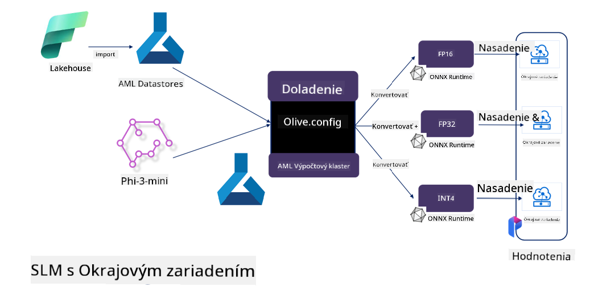

<!--
CO_OP_TRANSLATOR_METADATA:
{
  "original_hash": "5764be88ad2eb4f341e742eb8f14fab1",
  "translation_date": "2025-07-17T06:50:34+00:00",
  "source_file": "md/03.FineTuning/FineTuning_MicrosoftOlive.md",
  "language_code": "sk"
}
-->
# **Ladenie Phi-3 pomocou Microsoft Olive**

[Olive](https://github.com/microsoft/OLive?WT.mc_id=aiml-138114-kinfeylo) je jednoduchý nástroj na optimalizáciu modelov s ohľadom na hardvér, ktorý spája špičkové techniky v oblasti kompresie, optimalizácie a kompilácie modelov.

Je navrhnutý tak, aby zjednodušil proces optimalizácie strojového učenia a zabezpečil čo najefektívnejšie využitie konkrétnych hardvérových architektúr.

Či už pracujete na cloudových aplikáciách alebo na zariadeniach na okraji siete, Olive vám umožní optimalizovať modely jednoducho a efektívne.

## Kľúčové vlastnosti:
- Olive zhromažďuje a automatizuje optimalizačné techniky pre požadované hardvérové ciele.
- Žiadna jedna optimalizačná technika nevyhovuje všetkým scenárom, preto Olive umožňuje rozšíriteľnosť tým, že odborníci z odvetvia môžu pridávať svoje inovatívne optimalizácie.

## Zníženie inžinierskej námahy:
- Vývojári často potrebujú ovládať a používať viacero nástrojových reťazcov špecifických pre rôznych výrobcov hardvéru, aby pripravili a optimalizovali trénované modely na nasadenie.
- Olive túto skúsenosť zjednodušuje automatizáciou optimalizačných techník pre požadovaný hardvér.

## Hotové riešenie E2E optimalizácie:

Kombináciou a ladením integrovaných techník ponúka Olive jednotné riešenie pre end-to-end optimalizáciu.
Pri optimalizácii modelov zohľadňuje obmedzenia ako presnosť a latenciu.

## Použitie Microsoft Olive na ladenie

Microsoft Olive je veľmi jednoduchý open source nástroj na optimalizáciu modelov, ktorý pokrýva ako ladenie, tak referenciu v oblasti generatívnej umelej inteligencie. Vyžaduje len jednoduchú konfiguráciu, v kombinácii s použitím open source malých jazykových modelov a súvisiacich runtime prostredí (AzureML / lokálne GPU, CPU, DirectML) môžete dokončiť ladenie alebo referenciu modelu pomocou automatickej optimalizácie a nájsť najlepší model na nasadenie do cloudu alebo na edge zariadenia. Umožňuje firmám vytvárať vlastné vertikálne modely v priemysle lokálne aj v cloude.


## Ladenie Phi-3 pomocou Microsoft Olive



## Príklad kódu a ukážka Phi-3 Olive
V tomto príklade použijete Olive na:

- Ladenie LoRA adaptéra na klasifikáciu fráz do kategórií Smútok, Radosť, Strach, Prekvapenie.
- Zlúčenie váh adaptéra do základného modelu.
- Optimalizáciu a kvantizáciu modelu do int4.

[Ukážkový kód](../../code/03.Finetuning/olive-ort-example/README.md)

### Inštalácia Microsoft Olive

Inštalácia Microsoft Olive je veľmi jednoduchá a dá sa nainštalovať pre CPU, GPU, DirectML a Azure ML.

```bash
pip install olive-ai
```

Ak chcete spustiť ONNX model na CPU, môžete použiť

```bash
pip install olive-ai[cpu]
```

Ak chcete spustiť ONNX model na GPU, môžete použiť

```python
pip install olive-ai[gpu]
```

Ak chcete použiť Azure ML, použite

```python
pip install git+https://github.com/microsoft/Olive#egg=olive-ai[azureml]
```

**Upozornenie**  
Požiadavka na OS: Ubuntu 20.04 / 22.04

### **Konfigurácia Microsoft Olive Config.json**

Po inštalácii môžete nastaviť rôzne modelovo špecifické parametre cez konfiguračný súbor, vrátane dát, výpočtov, tréningu, nasadenia a generovania modelu.

**1. Dáta**

Microsoft Olive podporuje tréning na lokálnych aj cloudových dátach, ktoré je možné nakonfigurovať v nastaveniach.

*Nastavenie lokálnych dát*

Jednoducho nastavíte dátovú sadu, na ktorej chcete trénovať pre ladenie, zvyčajne vo formáte json, a prispôsobíte ju dátovej šablóne. Toto je potrebné upraviť podľa požiadaviek modelu (napríklad prispôsobiť formátu požadovanému Microsoft Phi-3-mini. Ak máte iné modely, pozrite si požadované formáty ladenia pre dané modely).

```json

    "data_configs": [
        {
            "name": "dataset_default_train",
            "type": "HuggingfaceContainer",
            "load_dataset_config": {
                "params": {
                    "data_name": "json", 
                    "data_files":"dataset/dataset-classification.json",
                    "split": "train"
                }
            },
            "pre_process_data_config": {
                "params": {
                    "dataset_type": "corpus",
                    "text_cols": [
                            "phrase",
                            "tone"
                    ],
                    "text_template": "### Text: {phrase}\n### The tone is:\n{tone}",
                    "corpus_strategy": "join",
                    "source_max_len": 2048,
                    "pad_to_max_len": false,
                    "use_attention_mask": false
                }
            }
        }
    ],
```

**Nastavenie cloudových dátových zdrojov**

Prepojením úložiska Azure AI Studio/Azure Machine Learning Service na cloudové dáta môžete vybrať rôzne zdroje dát do Azure AI Studio/Azure Machine Learning Service cez Microsoft Fabric a Azure Data ako podporu pre ladenie dát.

```json

    "data_configs": [
        {
            "name": "dataset_default_train",
            "type": "HuggingfaceContainer",
            "load_dataset_config": {
                "params": {
                    "data_name": "json", 
                    "data_files": {
                        "type": "azureml_datastore",
                        "config": {
                            "azureml_client": {
                                "subscription_id": "Your Azure Subscrition ID",
                                "resource_group": "Your Azure Resource Group",
                                "workspace_name": "Your Azure ML Workspaces name"
                            },
                            "datastore_name": "workspaceblobstore",
                            "relative_path": "Your train_data.json Azure ML Location"
                        }
                    },
                    "split": "train"
                }
            },
            "pre_process_data_config": {
                "params": {
                    "dataset_type": "corpus",
                    "text_cols": [
                            "Question",
                            "Best Answer"
                    ],
                    "text_template": "<|user|>\n{Question}<|end|>\n<|assistant|>\n{Best Answer}\n<|end|>",
                    "corpus_strategy": "join",
                    "source_max_len": 2048,
                    "pad_to_max_len": false,
                    "use_attention_mask": false
                }
            }
        }
    ],
    
```

**2. Konfigurácia výpočtov**

Ak potrebujete pracovať lokálne, môžete priamo použiť lokálne dátové zdroje. Ak chcete využiť zdroje Azure AI Studio / Azure Machine Learning Service, je potrebné nakonfigurovať príslušné Azure parametre, názov výpočtového výkonu a podobne.

```json

    "systems": {
        "aml": {
            "type": "AzureML",
            "config": {
                "accelerators": ["gpu"],
                "hf_token": true,
                "aml_compute": "Your Azure AI Studio / Azure Machine Learning Service Compute Name",
                "aml_docker_config": {
                    "base_image": "Your Azure AI Studio / Azure Machine Learning Service docker",
                    "conda_file_path": "conda.yaml"
                }
            }
        },
        "azure_arc": {
            "type": "AzureML",
            "config": {
                "accelerators": ["gpu"],
                "aml_compute": "Your Azure AI Studio / Azure Machine Learning Service Compute Name",
                "aml_docker_config": {
                    "base_image": "Your Azure AI Studio / Azure Machine Learning Service docker",
                    "conda_file_path": "conda.yaml"
                }
            }
        }
    },
```

***Upozornenie***

Keďže sa spúšťa cez kontajner na Azure AI Studio/Azure Machine Learning Service, je potrebné nakonfigurovať požadované prostredie. To sa nastavuje v súbore conda.yaml.

```yaml

name: project_environment
channels:
  - defaults
dependencies:
  - python=3.8.13
  - pip=22.3.1
  - pip:
      - einops
      - accelerate
      - azure-keyvault-secrets
      - azure-identity
      - bitsandbytes
      - datasets
      - huggingface_hub
      - peft
      - scipy
      - sentencepiece
      - torch>=2.2.0
      - transformers
      - git+https://github.com/microsoft/Olive@jiapli/mlflow_loading_fix#egg=olive-ai[gpu]
      - --extra-index-url https://aiinfra.pkgs.visualstudio.com/PublicPackages/_packaging/ORT-Nightly/pypi/simple/ 
      - ort-nightly-gpu==1.18.0.dev20240307004
      - --extra-index-url https://aiinfra.pkgs.visualstudio.com/PublicPackages/_packaging/onnxruntime-genai/pypi/simple/
      - onnxruntime-genai-cuda

    

```

**3. Výber SLM**

Model môžete použiť priamo z Hugging Face, alebo ho môžete vybrať z Model Catalog Azure AI Studio / Azure Machine Learning. V nasledujúcom príklade použijeme Microsoft Phi-3-mini.

Ak máte model lokálne, môžete použiť tento spôsob

```json

    "input_model":{
        "type": "PyTorchModel",
        "config": {
            "hf_config": {
                "model_name": "model-cache/microsoft/phi-3-mini",
                "task": "text-generation",
                "model_loading_args": {
                    "trust_remote_code": true
                }
            }
        }
    },
```

Ak chcete použiť model z Azure AI Studio / Azure Machine Learning Service, použite tento spôsob

```json

    "input_model":{
        "type": "PyTorchModel",
        "config": {
            "model_path": {
                "type": "azureml_registry_model",
                "config": {
                    "name": "microsoft/Phi-3-mini-4k-instruct",
                    "registry_name": "azureml-msr",
                    "version": "11"
                }
            },
             "model_file_format": "PyTorch.MLflow",
             "hf_config": {
                "model_name": "microsoft/Phi-3-mini-4k-instruct",
                "task": "text-generation",
                "from_pretrained_args": {
                    "trust_remote_code": true
                }
            }
        }
    },
```

**Upozornenie:**  
Je potrebná integrácia s Azure AI Studio / Azure Machine Learning Service, preto pri nastavovaní modelu dbajte na verziu a súvisiace pomenovania.

Všetky modely na Azure musia byť nastavené na PyTorch.MLflow.

Potrebujete mať účet na Hugging Face a prepojiť kľúč s hodnotou Key v Azure AI Studio / Azure Machine Learning.

**4. Algoritmus**

Microsoft Olive veľmi dobre zapuzdruje ladenie pomocou Lora a QLora algoritmov. Stačí nakonfigurovať niektoré relevantné parametre. Tu uvádzam príklad s QLora.

```json
        "lora": {
            "type": "LoRA",
            "config": {
                "target_modules": [
                    "o_proj",
                    "qkv_proj"
                ],
                "double_quant": true,
                "lora_r": 64,
                "lora_alpha": 64,
                "lora_dropout": 0.1,
                "train_data_config": "dataset_default_train",
                "eval_dataset_size": 0.3,
                "training_args": {
                    "seed": 0,
                    "data_seed": 42,
                    "per_device_train_batch_size": 1,
                    "per_device_eval_batch_size": 1,
                    "gradient_accumulation_steps": 4,
                    "gradient_checkpointing": false,
                    "learning_rate": 0.0001,
                    "num_train_epochs": 3,
                    "max_steps": 10,
                    "logging_steps": 10,
                    "evaluation_strategy": "steps",
                    "eval_steps": 187,
                    "group_by_length": true,
                    "adam_beta2": 0.999,
                    "max_grad_norm": 0.3
                }
            }
        },
```

Ak chcete vykonať kvantizačnú konverziu, hlavná vetva Microsoft Olive už podporuje metódu onnxruntime-genai. Môžete ju nastaviť podľa svojich potrieb:

1. zlúčiť váhy adaptéra do základného modelu  
2. previesť model na onnx model s požadovanou presnosťou pomocou ModelBuildera

napríklad prevod na kvantizovaný INT4

```json

        "merge_adapter_weights": {
            "type": "MergeAdapterWeights"
        },
        "builder": {
            "type": "ModelBuilder",
            "config": {
                "precision": "int4"
            }
        }
```

**Upozornenie**  
- Ak používate QLoRA, kvantizačná konverzia ONNXRuntime-genai zatiaľ nie je podporovaná.  
- Treba zdôrazniť, že vyššie uvedené kroky môžete nastaviť podľa vlastných potrieb. Nie je nutné ich všetky konfigurovať úplne. Podľa potreby môžete priamo použiť kroky algoritmu bez ladenia. Nakoniec je potrebné nakonfigurovať príslušné enginy.

```json

    "engine": {
        "log_severity_level": 0,
        "host": "aml",
        "target": "aml",
        "search_strategy": false,
        "execution_providers": ["CUDAExecutionProvider"],
        "cache_dir": "../model-cache/models/phi3-finetuned/cache",
        "output_dir" : "../model-cache/models/phi3-finetuned"
    }
```

**5. Dokončenie ladenia**

Na príkazovom riadku spustite v adresári s olive-config.json

```bash
olive run --config olive-config.json  
```

**Zrieknutie sa zodpovednosti**:  
Tento dokument bol preložený pomocou AI prekladateľskej služby [Co-op Translator](https://github.com/Azure/co-op-translator). Aj keď sa snažíme o presnosť, prosím, majte na pamäti, že automatizované preklady môžu obsahovať chyby alebo nepresnosti. Pôvodný dokument v jeho rodnom jazyku by mal byť považovaný za autoritatívny zdroj. Pre kritické informácie sa odporúča profesionálny ľudský preklad. Nie sme zodpovední za akékoľvek nedorozumenia alebo nesprávne interpretácie vyplývajúce z použitia tohto prekladu.