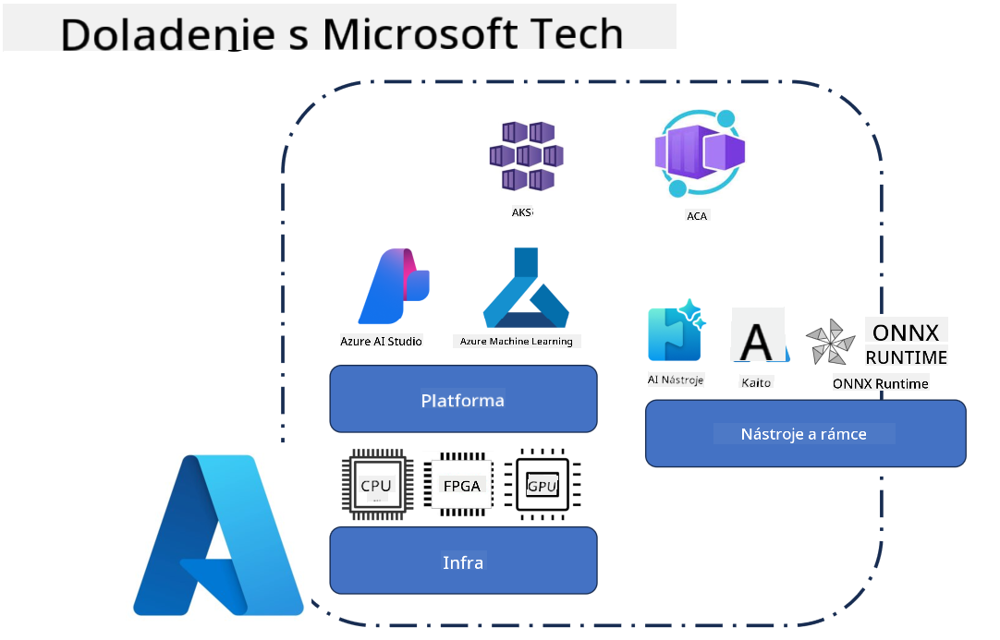
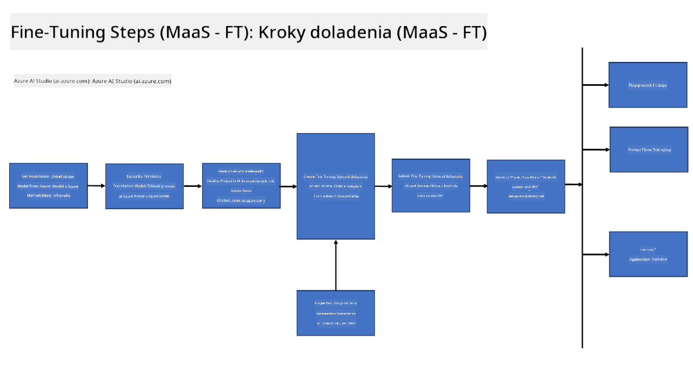
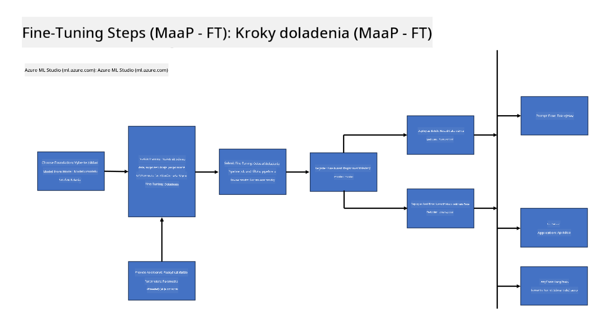
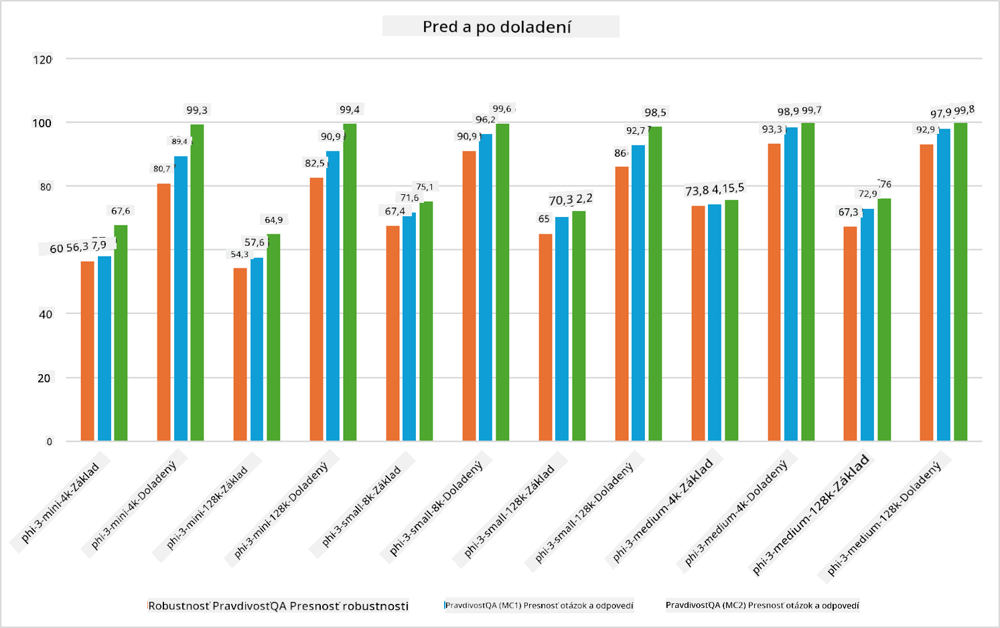

<!--
CO_OP_TRANSLATOR_METADATA:
{
  "original_hash": "cb5648935f63edc17e95ce38f23adc32",
  "translation_date": "2025-07-17T08:30:04+00:00",
  "source_file": "md/03.FineTuning/FineTuning_Scenarios.md",
  "language_code": "sk"
}
-->
## Scenáre doladenia

**Platforma** Zahŕňa rôzne technológie ako Azure AI Foundry, Azure Machine Learning, AI Tools, Kaito a ONNX Runtime.

**Infraštruktúra** Zahŕňa CPU a FPGA, ktoré sú nevyhnutné pre proces doladenia. Ukážem vám ikony pre každú z týchto technológií.

**Nástroje a rámce** Zahŕňa ONNX Runtime a ONNX Runtime. Ukážem vám ikony pre každú z týchto technológií.  
[Vložte ikony pre ONNX Runtime a ONNX Runtime]

Proces doladenia s technológiami Microsoft zahŕňa rôzne komponenty a nástroje. Pochopením a využitím týchto technológií môžeme efektívne doladiť naše aplikácie a vytvárať lepšie riešenia.

## Model ako služba

Doladte model pomocou hosťovaného doladenia bez potreby vytvárať a spravovať výpočtové zdroje.

Serverless doladenie je dostupné pre modely Phi-3-mini a Phi-3-medium, čo umožňuje vývojárom rýchlo a jednoducho prispôsobiť modely pre cloudové a edge scenáre bez nutnosti zabezpečovať výpočtové zdroje. Tiež sme oznámili, že Phi-3-small je teraz dostupný prostredníctvom našej ponuky Models-as-a-Service, takže vývojári môžu rýchlo a jednoducho začať s vývojom AI bez starostí o správu infraštruktúry.

## Model ako platforma

Používatelia spravujú vlastné výpočtové zdroje, aby mohli doladiť svoje modely.

[Príklad doladenia](https://github.com/Azure/azureml-examples/blob/main/sdk/python/foundation-models/system/finetune/chat-completion/chat-completion.ipynb)

## Scenáre doladenia

| | | | | | | |
|-|-|-|-|-|-|-|
|Scenár|LoRA|QLoRA|PEFT|DeepSpeed|ZeRO|DORA|
|Prispôsobenie predtrénovaných LLM na konkrétne úlohy alebo domény|Áno|Áno|Áno|Áno|Áno|Áno|
|Doladenie pre NLP úlohy ako klasifikácia textu, rozpoznávanie pomenovaných entít a strojový preklad|Áno|Áno|Áno|Áno|Áno|Áno|
|Doladenie pre úlohy QA|Áno|Áno|Áno|Áno|Áno|Áno|
|Doladenie na generovanie odpovedí podobných ľudským v chatbotov|Áno|Áno|Áno|Áno|Áno|Áno|
|Doladenie na generovanie hudby, umenia alebo iných foriem kreativity|Áno|Áno|Áno|Áno|Áno|Áno|
|Znižovanie výpočtových a finančných nákladov|Áno|Áno|Nie|Áno|Áno|Nie|
|Znižovanie využitia pamäte|Nie|Áno|Nie|Áno|Áno|Áno|
|Použitie menšieho počtu parametrov pre efektívne doladenie|Nie|Áno|Áno|Nie|Nie|Áno|
|Pamäťovo efektívna forma dátovej paralelizácie, ktorá umožňuje prístup k agregovanej GPU pamäti všetkých dostupných GPU zariadení|Nie|Nie|Nie|Áno|Áno|Áno|

## Príklady výkonu doladenia

**Vyhlásenie o zodpovednosti**:  
Tento dokument bol preložený pomocou AI prekladateľskej služby [Co-op Translator](https://github.com/Azure/co-op-translator). Aj keď sa snažíme o presnosť, prosím, majte na pamäti, že automatizované preklady môžu obsahovať chyby alebo nepresnosti. Originálny dokument v jeho pôvodnom jazyku by mal byť považovaný za autoritatívny zdroj. Pre kritické informácie sa odporúča profesionálny ľudský preklad. Nie sme zodpovední za akékoľvek nedorozumenia alebo nesprávne interpretácie vyplývajúce z použitia tohto prekladu.