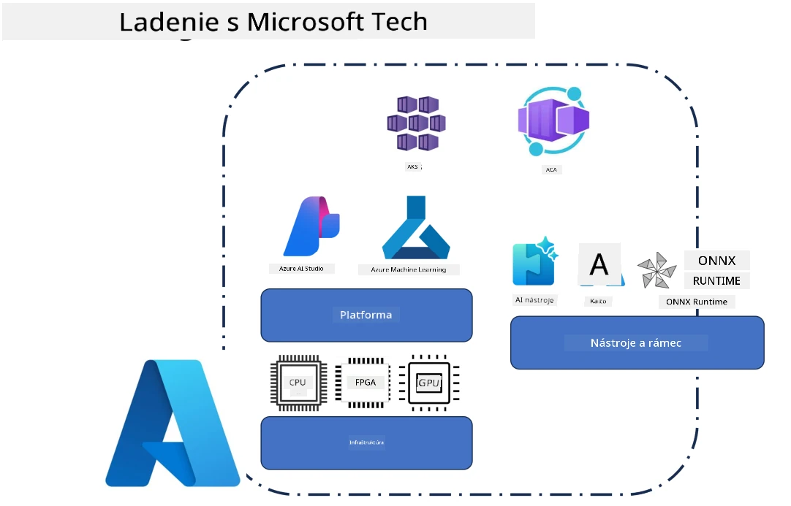
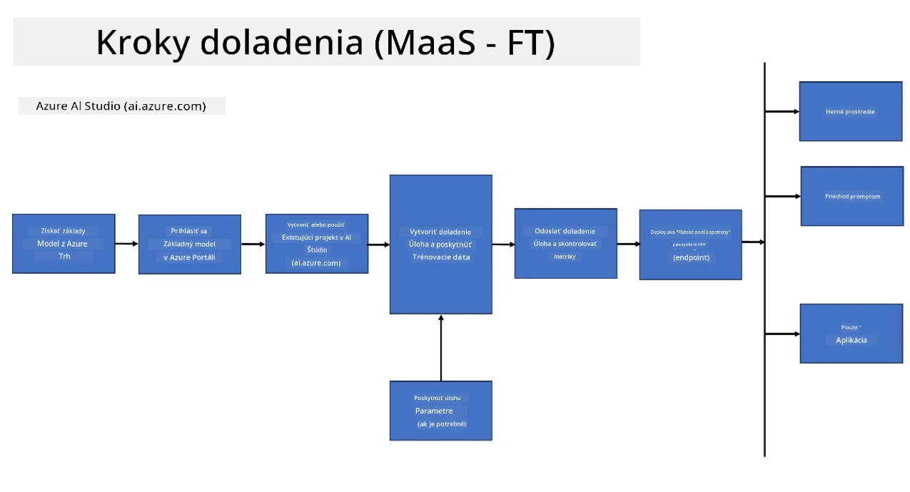
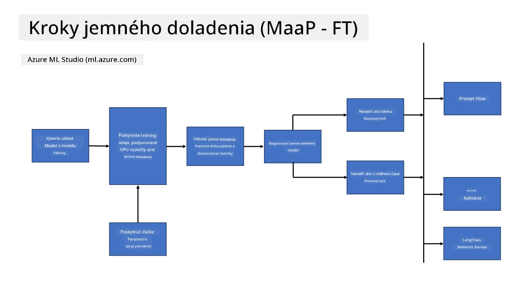
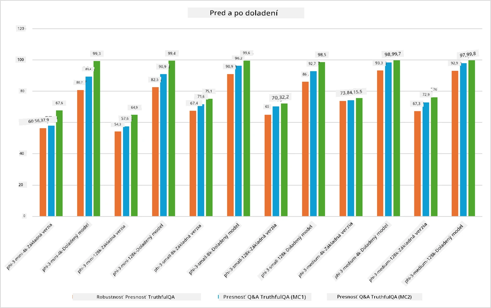

## Scenáre doladenia

Táto sekcia poskytuje prehľad scenárov doladenia v prostrediach Microsoft Foundry a Azure, vrátane modelov nasadenia, vrstiev infraštruktúry a často používaných optimalizačných techník.

**Platforma**  
Zahŕňa spravované služby, ako sú Microsoft Foundry (predtým Azure AI Foundry) a Azure Machine Learning, ktoré poskytujú správu modelov, orchestráciu, sledovanie experimentov a pracovné postupy nasadenia.

**Infraštruktúra**  
Doladenie vyžaduje škálovateľné výpočtové zdroje. V prostrediach Azure to zvyčajne zahŕňa virtuálne stroje so základom na GPU a CPU zdroje pre ľahké pracovné zaťaženia, spolu so škálovateľným úložiskom pre dátové súbory a kontrolné body.

**Nástroje a rámce**  
Pracovné postupy doladenia často používajú rámce a optimalizačné knižnice ako Hugging Face Transformers, DeepSpeed a PEFT (Parameter-Efficient Fine-Tuning).

Proces doladenia s technológiami Microsoft zahŕňa platformové služby, výpočtovú infraštruktúru a tréningové rámce. Pochopením spolupráce týchto komponentov môžu vývojári efektívne prispôsobiť základné modely na konkrétne úlohy a produkčné scenáre.

## Model ako služba

Doladte model pomocou hosťovaného doladenia bez potreby vytvárať a spravovať výpočtové zdroje.

Serverless doladenie je teraz dostupné pre rodiny modelov Phi-3, Phi-3.5 a Phi-4, čo umožňuje vývojárom rýchlo a jednoducho prispôsobiť modely pre cloudové a edge scenáre bez nutnosti zabezpečovať výpočtovú infraštruktúru.

## Model ako platforma

Používatelia spravujú vlastné výpočty, aby si mohli doladiť svoje modely.

[Príklad doladenia](https://github.com/Azure/azureml-examples/blob/main/sdk/python/foundation-models/system/finetune/chat-completion/chat-completion.ipynb)

## Porovnanie techník doladenia

|Scenár|LoRA|QLoRA|PEFT|DeepSpeed|ZeRO|DoRA|
|---|---|---|---|---|---|---|
|Prispôsobenie predtrénovaných LLM na konkrétne úlohy alebo domény|Áno|Áno|Áno|Áno|Áno|Áno|
|Doladenie pre NLP úlohy ako klasifikácia textu, rozpoznávanie pomenovaných entít a strojový preklad|Áno|Áno|Áno|Áno|Áno|Áno|
|Doladenie pre úlohy QA|Áno|Áno|Áno|Áno|Áno|Áno|
|Doladenie pre generovanie ľudsky znejúcich reakcií v chatbotov|Áno|Áno|Áno|Áno|Áno|Áno|
|Doladenie pre generovanie hudby, umenia alebo iných kreatívnych foriem|Áno|Áno|Áno|Áno|Áno|Áno|
|Znižovanie výpočtových a finančných nákladov|Áno|Áno|Áno|Áno|Áno|Áno|
|Znižovanie spotreby pamäte|Áno|Áno|Áno|Áno|Áno|Áno|
|Použitie menšieho počtu parametrov pre efektívne doladenie|Áno|Áno|Áno|Nie|Nie|Áno|
|Pamäťovo efektívna forma dátového paralelizmu, ktorá umožňuje prístup k súhrnnej GPU pamäti všetkých dostupných GPU zariadení|Nie|Nie|Nie|Áno|Áno|Nie|

> [!NOTE]
> LoRA, QLoRA, PEFT a DoRA sú metódy efektívneho doladenia parametrov, zatiaľ čo DeepSpeed a ZeRO sa zameriavajú na distribuované trénovanie a optimalizáciu pamäte.

## Príklady výkonu doladenia

---

<!-- CO-OP TRANSLATOR DISCLAIMER START -->
**Upozornenie**:
Tento dokument bol preložený pomocou AI prekladateľskej služby [Co-op Translator](https://github.com/Azure/co-op-translator). Aj keď sa snažíme o presnosť, majte na pamäti, že automatizované preklady môžu obsahovať chyby alebo nepresnosti. Pôvodný dokument v jeho pôvodnom jazyku by mal byť považovaný za autoritatívny zdroj. Pre dôležité informácie sa odporúča profesionálny ľudský preklad. Nie sme zodpovední za žiadne nedorozumenia alebo nesprávne interpretácie vyplývajúce z použitia tohto prekladu.
<!-- CO-OP TRANSLATOR DISCLAIMER END -->