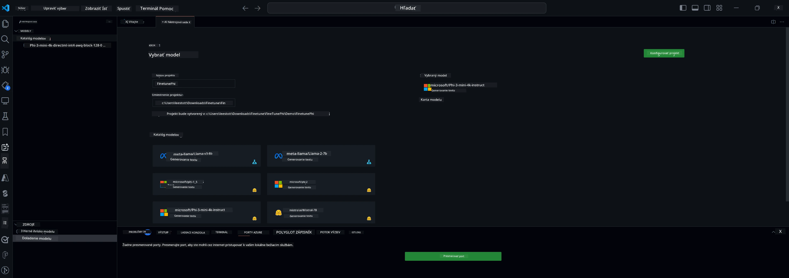

<!--
CO_OP_TRANSLATOR_METADATA:
{
  "original_hash": "c2bc0950f44919ac75a88c1a871680c2",
  "translation_date": "2025-07-17T09:20:30+00:00",
  "source_file": "md/03.FineTuning/Finetuning_VSCodeaitoolkit.md",
  "language_code": "sk"
}
-->
## Vitajte v AI Toolkite pre VS Code

[AI Toolkit pre VS Code](https://github.com/microsoft/vscode-ai-toolkit/tree/main) spája rôzne modely z Azure AI Studio Catalog a ďalších katalógov ako Hugging Face. Toolkit zjednodušuje bežné vývojové úlohy pri tvorbe AI aplikácií s generatívnymi AI nástrojmi a modelmi prostredníctvom:
- Začnite objavovaním modelov a ich testovaním v playgrounde.
- Doladenie modelov a inferencia pomocou lokálnych výpočtových zdrojov.
- Vzdialené doladenie a inferencia pomocou Azure zdrojov.

[Nainštalujte AI Toolkit pre VSCode](https://marketplace.visualstudio.com/items?itemName=ms-windows-ai-studio.windows-ai-studio)




**[Private Preview]** Jedným kliknutím nasadenie Azure Container Apps na spustenie doladenia modelov a inferencie v cloude.

Poďme sa teraz pustiť do vývoja vašej AI aplikácie:

- [Vitajte v AI Toolkite pre VS Code](../../../../md/03.FineTuning)
- [Lokálny vývoj](../../../../md/03.FineTuning)
  - [Prípravy](../../../../md/03.FineTuning)
  - [Aktivácia Conda](../../../../md/03.FineTuning)
  - [Len doladenie základného modelu](../../../../md/03.FineTuning)
  - [Doladenie modelu a inferencia](../../../../md/03.FineTuning)
  - [Doladenie modelu](../../../../md/03.FineTuning)
  - [Microsoft Olive](../../../../md/03.FineTuning)
  - [Ukážky a zdroje pre doladenie](../../../../md/03.FineTuning)
- [**\[Private Preview\]** Vzdialený vývoj](../../../../md/03.FineTuning)
  - [Predpoklady](../../../../md/03.FineTuning)
  - [Nastavenie projektu pre vzdialený vývoj](../../../../md/03.FineTuning)
  - [Provision Azure zdrojov](../../../../md/03.FineTuning)
  - [\[Voliteľné\] Pridanie Huggingface tokenu do Azure Container App Secret](../../../../md/03.FineTuning)
  - [Spustenie doladenia](../../../../md/03.FineTuning)
  - [Provision inference endpointu](../../../../md/03.FineTuning)
  - [Nasadenie inference endpointu](../../../../md/03.FineTuning)
  - [Pokročilé použitie](../../../../md/03.FineTuning)

## Lokálny vývoj
### Prípravy

1. Uistite sa, že na hostiteľskom počítači je nainštalovaný NVIDIA ovládač.
2. Spustite `huggingface-cli login`, ak používate HF na prácu s datasetmi.
3. Vysvetlenie nastavení kľúčov `Olive` pre všetko, čo ovplyvňuje využitie pamäte.

### Aktivácia Conda
Keďže používame WSL prostredie, ktoré je zdieľané, je potrebné manuálne aktivovať conda prostredie. Po tomto kroku môžete spustiť doladenie alebo inferenciu.

```bash
conda activate [conda-env-name] 
```

### Len doladenie základného modelu
Ak chcete len vyskúšať základný model bez doladenia, po aktivácii conda spustite tento príkaz.

```bash
cd inference

# Web browser interface allows to adjust a few parameters like max new token length, temperature and so on.
# User has to manually open the link (e.g. http://0.0.0.0:7860) in a browser after gradio initiates the connections.
python gradio_chat.py --baseonly
```

### Doladenie modelu a inferencia

Keď je pracovný priestor otvorený v dev kontejnery, otvorte terminál (predvolená cesta je koreň projektu) a spustite nižšie uvedený príkaz na doladenie LLM na vybranom datasete.

```bash
python finetuning/invoke_olive.py 
```

Kontrolné body a finálny model budú uložené v priečinku `models`.

Následne spustite inferenciu s doladeným modelom cez chaty v `console`, `web browser` alebo `prompt flow`.

```bash
cd inference

# Console interface.
python console_chat.py

# Web browser interface allows to adjust a few parameters like max new token length, temperature and so on.
# User has to manually open the link (e.g. http://127.0.0.1:7860) in a browser after gradio initiates the connections.
python gradio_chat.py
```

Ak chcete použiť `prompt flow` vo VS Code, pozrite si tento [Rýchly štart](https://microsoft.github.io/promptflow/how-to-guides/quick-start.html).

### Doladenie modelu

Ďalej si stiahnite nasledujúci model podľa dostupnosti GPU na vašom zariadení.

Na spustenie lokálnej doladenej relácie pomocou QLoRA vyberte model, ktorý chcete doladiť z nášho katalógu.
| Platforma(y) | Dostupné GPU | Názov modelu | Veľkosť (GB) |
|---------|---------|--------|--------|
| Windows | Áno | Phi-3-mini-4k-**directml**-int4-awq-block-128-onnx | 2.13GB |
| Linux | Áno | Phi-3-mini-4k-**cuda**-int4-onnx | 2.30GB |
| Windows<br>Linux | Nie | Phi-3-mini-4k-**cpu**-int4-rtn-block-32-acc-level-4-onnx | 2.72GB |

**_Poznámka_** Na stiahnutie modelov nepotrebujete Azure účet.

Model Phi3-mini (int4) má približne 2GB-3GB. V závislosti od rýchlosti siete môže stiahnutie trvať niekoľko minút.

Začnite výberom názvu projektu a jeho umiestnenia.
Potom vyberte model z katalógu modelov. Budete vyzvaní na stiahnutie šablóny projektu. Následne kliknite na "Configure Project" pre úpravu rôznych nastavení.

### Microsoft Olive

Používame [Olive](https://microsoft.github.io/Olive/why-olive.html) na spustenie QLoRA doladenia na PyTorch modeli z nášho katalógu. Všetky nastavenia sú prednastavené na optimalizované hodnoty pre lokálne doladenie s efektívnym využitím pamäte, no môžete ich prispôsobiť podľa svojho scenára.

### Ukážky a zdroje pre doladenie

- [Sprievodca začiatkom doladenia](https://learn.microsoft.com/windows/ai/toolkit/toolkit-fine-tune)
- [Doladenie s HuggingFace Datasetom](https://github.com/microsoft/vscode-ai-toolkit/blob/main/archive/walkthrough-hf-dataset.md)
- [Doladenie s jednoduchým datasetom](https://github.com/microsoft/vscode-ai-toolkit/blob/main/archive/walkthrough-simple-dataset.md)

## **[Private Preview]** Vzdialený vývoj

### Predpoklady

1. Ak chcete spustiť doladenie modelu vo vašom vzdialenom Azure Container App prostredí, uistite sa, že váš subscription má dostatočnú kapacitu GPU. Podajte [support ticket](https://azure.microsoft.com/support/create-ticket/) na požiadanie potrebnej kapacity pre vašu aplikáciu. [Viac informácií o kapacite GPU](https://learn.microsoft.com/azure/container-apps/workload-profiles-overview)
2. Ak používate súkromný dataset na HuggingFace, uistite sa, že máte [HuggingFace účet](https://huggingface.co/?WT.mc_id=aiml-137032-kinfeylo) a [vygenerovaný prístupový token](https://huggingface.co/docs/hub/security-tokens?WT.mc_id=aiml-137032-kinfeylo)
3. Aktivujte vo VS Code v AI Toolkite funkciu Remote Fine-tuning and Inference
   1. Otvorte nastavenia VS Code cez *File -> Preferences -> Settings*.
   2. Prejdite do *Extensions* a vyberte *AI Toolkit*.
   3. Zapnite možnosť *"Enable Remote Fine-tuning And Inference"*.
   4. Reštartujte VS Code, aby sa zmeny prejavili.

- [Vzdialené doladenie](https://github.com/microsoft/vscode-ai-toolkit/blob/main/archive/remote-finetuning.md)

### Nastavenie projektu pre vzdialený vývoj
1. Spustite príkazovú paletu `AI Toolkit: Focus on Resource View`.
2. Prejdite do *Model Fine-tuning* pre prístup ku katalógu modelov. Priraďte názov projektu a vyberte jeho umiestnenie na vašom zariadení. Potom kliknite na tlačidlo *"Configure Project"*.
3. Konfigurácia projektu
    1. Neaktivujte možnosť *"Fine-tune locally"*.
    2. Zobrazia sa nastavenia Olive s prednastavenými hodnotami. Upravte a vyplňte tieto nastavenia podľa potreby.
    3. Pokračujte kliknutím na *Generate Project*. Tento krok využíva WSL a zahŕňa vytvorenie nového Conda prostredia, pripravujúc sa na budúce aktualizácie vrátane Dev Containers.
4. Kliknite na *"Relaunch Window In Workspace"* pre otvorenie vášho vzdialeného vývojového projektu.

> **Poznámka:** Projekt momentálne funguje buď lokálne, alebo vzdialene v AI Toolkite pre VS Code. Ak pri vytváraní projektu zvolíte *"Fine-tune locally"*, bude fungovať výhradne v WSL bez možnosti vzdialeného vývoja. Ak túto možnosť neaktivujete, projekt bude obmedzený na vzdialené Azure Container App prostredie.

### Provision Azure zdrojov
Na začiatok je potrebné provision Azure zdroj pre vzdialené doladenie. Urobíte to spustením príkazu `AI Toolkit: Provision Azure Container Apps job for fine-tuning` z príkazovej palety.

Sledujte priebeh provisionu cez odkaz zobrazený v output kanáli.

### [Voliteľné] Pridanie Huggingface tokenu do Azure Container App Secret
Ak používate súkromný dataset HuggingFace, nastavte svoj HuggingFace token ako environmentálnu premennú, aby ste sa vyhli manuálnemu prihlasovaniu na Hugging Face Hub.
Môžete to urobiť pomocou príkazu `AI Toolkit: Add Azure Container Apps Job secret for fine-tuning`. Pri tomto príkaze nastavte názov tajomstva na [`HF_TOKEN`](https://huggingface.co/docs/huggingface_hub/package_reference/environment_variables#hftoken) a použite svoj Hugging Face token ako hodnotu tajomstva.

### Spustenie doladenia
Na spustenie vzdialenej doladenej úlohy vykonajte príkaz `AI Toolkit: Run fine-tuning`.

Pre zobrazenie systémových a konzolových logov môžete navštíviť Azure portál cez odkaz v output paneli (viac krokov v [Zobrazenie a dotazovanie logov na Azure](https://aka.ms/ai-toolkit/remote-provision#view-and-query-logs-on-azure)). Alebo môžete zobraziť konzolové logy priamo vo VSCode output paneli spustením príkazu `AI Toolkit: Show the running fine-tuning job streaming logs`.
> **Poznámka:** Úloha môže byť v čakacej dobe kvôli nedostatku zdrojov. Ak sa log nezobrazuje, spustite príkaz `AI Toolkit: Show the running fine-tuning job streaming logs`, chvíľu počkajte a potom príkaz zopakujte pre opätovné pripojenie k streamu logov.

Počas tohto procesu sa na doladenie použije QLoRA, ktorá vytvorí LoRA adaptéry pre model na použitie počas inferencie.
Výsledky doladenia budú uložené v Azure Files.

### Provision inference endpointu
Po natrénovaní adaptérov vo vzdialenom prostredí použite jednoduchú Gradio aplikáciu na interakciu s modelom.
Podobne ako pri doladení, je potrebné nastaviť Azure zdroje pre vzdialenú inferenciu spustením príkazu `AI Toolkit: Provision Azure Container Apps for inference` z príkazovej palety.

Predvolene by subscription a resource group pre inferenciu mali byť rovnaké ako tie použité pri doladení. Inferencia bude využívať rovnaké Azure Container App prostredie a pristupovať k modelu a adaptérovi uloženým v Azure Files, ktoré boli vytvorené počas doladenia.

### Nasadenie inference endpointu
Ak chcete upraviť inferenčný kód alebo znovu načítať inferenčný model, spustite príkaz `AI Toolkit: Deploy for inference`. Týmto sa synchronizuje váš najnovší kód s Azure Container App a reštartuje sa replika.

Po úspešnom nasadení môžete pristupovať k inference API kliknutím na tlačidlo "*Go to Inference Endpoint*" v notifikácii VSCode. Alebo webový API endpoint nájdete pod `ACA_APP_ENDPOINT` v súbore `./infra/inference.config.json` a v output paneli. Teraz ste pripravení na vyhodnotenie modelu pomocou tohto endpointu.

### Pokročilé použitie
Pre viac informácií o vzdialenom vývoji s AI Toolkit pozrite dokumentáciu [Doladenie modelov na diaľku](https://aka.ms/ai-toolkit/remote-provision) a [Inferencia s doladeným modelom](https://aka.ms/ai-toolkit/remote-inference).

**Vyhlásenie o zodpovednosti**:  
Tento dokument bol preložený pomocou AI prekladateľskej služby [Co-op Translator](https://github.com/Azure/co-op-translator). Aj keď sa snažíme o presnosť, prosím, majte na pamäti, že automatizované preklady môžu obsahovať chyby alebo nepresnosti. Originálny dokument v jeho pôvodnom jazyku by mal byť považovaný za autoritatívny zdroj. Pre kritické informácie sa odporúča profesionálny ľudský preklad. Nie sme zodpovední za akékoľvek nedorozumenia alebo nesprávne interpretácie vyplývajúce z použitia tohto prekladu.