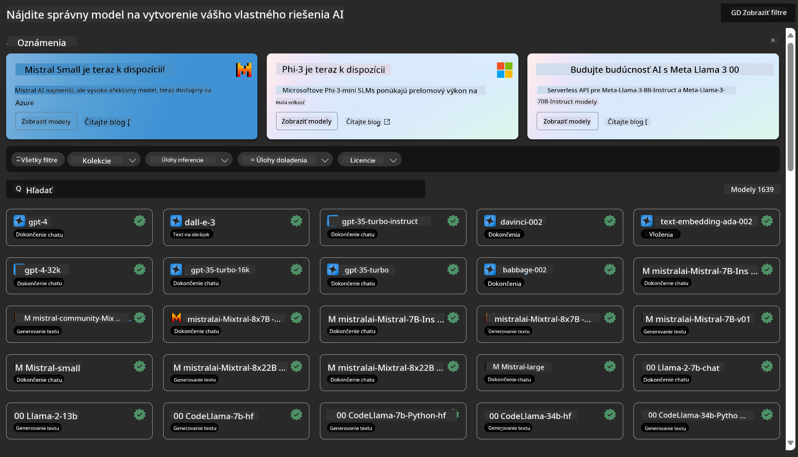
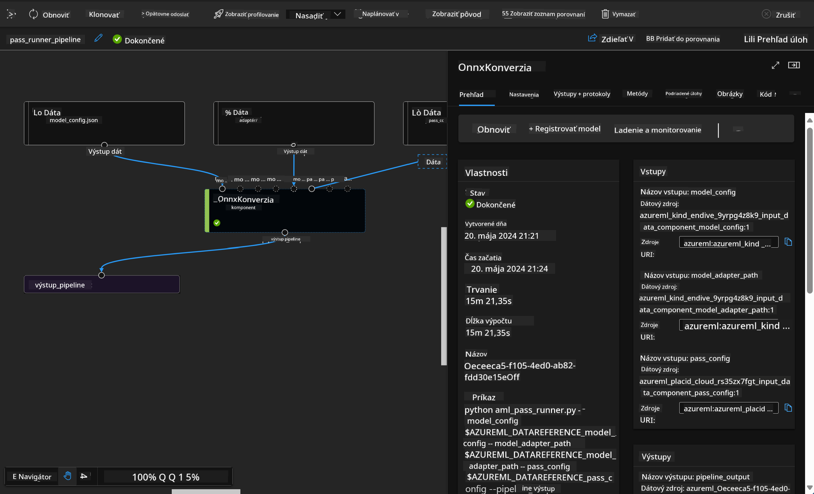

<!--
CO_OP_TRANSLATOR_METADATA:
{
  "original_hash": "7fe541373802e33568e94e13226d463c",
  "translation_date": "2025-05-09T22:23:39+00:00",
  "source_file": "md/03.FineTuning/Introduce_AzureML.md",
  "language_code": "sk"
}
-->
# **Predstavenie služby Azure Machine Learning**

[Azure Machine Learning](https://ml.azure.com?WT.mc_id=aiml-138114-kinfeylo) je cloudová služba na zrýchlenie a správu životného cyklu projektov strojového učenia (ML).

Odborníci na ML, dátoví vedci a inžinieri ju môžu využívať vo svojich každodenných pracovných postupoch na:

- Tréning a nasadzovanie modelov.
- Správu operácií strojového učenia (MLOps).
- Môžete vytvoriť model v Azure Machine Learning alebo použiť model vytvorený na open-source platformách, ako sú PyTorch, TensorFlow alebo scikit-learn.
- Nástroje MLOps vám pomáhajú sledovať, znovu trénovať a znovu nasadzovať modely.

## Pre koho je Azure Machine Learning určený?

**Dátoví vedci a ML inžinieri**

Môžu používať nástroje na zrýchlenie a automatizáciu svojich každodenných pracovných postupov.  
Azure ML ponúka funkcie pre spravodlivosť, vysvetliteľnosť, sledovanie a auditovateľnosť.

**Vývojári aplikácií:**  
Môžu jednoducho integrovať modely do aplikácií alebo služieb.

**Platformoví vývojári**

Majú prístup k robustnej sade nástrojov podporovaných trvácnymi Azure Resource Manager API.  
Tieto nástroje umožňujú vytvárať pokročilé ML nástroje.

**Firmy**

Pracujúce v Microsoft Azure cloude využívajú známe bezpečnostné mechanizmy a riadenie prístupu na základe rolí.  
Nastavte projekty na kontrolu prístupu k chráneným údajom a konkrétnym operáciám.

## Produktivita pre celý tím
Projekty ML často vyžadujú tím s rôznorodými zručnosťami na ich tvorbu a údržbu.

Azure ML poskytuje nástroje, ktoré vám umožnia:  
- Spolupracovať s tímom prostredníctvom zdieľaných notebookov, výpočtových zdrojov, serverless výpočtov, dát a prostredí.  
- Vyvíjať modely so zameraním na spravodlivosť, vysvetliteľnosť, sledovanie a auditovateľnosť, aby ste splnili požiadavky na pôvodnosť a audit.  
- Rýchlo a jednoducho nasadzovať ML modely vo veľkom meradle a efektívne ich spravovať a riadiť pomocou MLOps.  
- Spúšťať pracovné zaťaženia strojového učenia kdekoľvek s integrovanou správou, bezpečnosťou a súladom.

## Nástroje kompatibilné naprieč platformami

Každý člen ML tímu môže používať svoje preferované nástroje na vykonanie práce.  
Či už vykonávate rýchle experimenty, ladenie hyperparametrov, tvorbu pipeline alebo správu inferencií, môžete využiť známe rozhrania vrátane:  
- Azure Machine Learning Studio  
- Python SDK (v2)  
- Azure CLI (v2)  
- Azure Resource Manager REST API  

Pri dolaďovaní modelov a spolupráci počas celého vývojového cyklu môžete zdieľať a vyhľadávať aktíva, zdroje a metriky v rozhraní Azure Machine Learning studio.

## **LLM/SLM v Azure ML**

Azure ML pridalo množstvo funkcií súvisiacich s LLM/SLM, ktoré kombinujú LLMOps a SLMOps a vytvárajú tak podnikový generatívny AI technologický ekosystém.

### **Modelový katalóg**

Podnikový užívatelia môžu nasadzovať rôzne modely podľa rôznych obchodných scenárov cez Model Catalog a poskytovať služby ako Model as Service pre podnikových vývojárov alebo používateľov.

Modelový katalóg v Azure Machine Learning studio je centrum na objavovanie a používanie širokej škály modelov, ktoré vám umožňujú vytvárať generatívne AI aplikácie. Katalóg obsahuje stovky modelov od poskytovateľov ako Azure OpenAI service, Mistral, Meta, Cohere, Nvidia, Hugging Face, vrátane modelov trénovaných Microsoftom. Modely od iných ako Microsoft sú považované za Non-Microsoft Products podľa podmienok Microsoftu a podliehajú podmienkam spojeným s modelom.

### **Job Pipeline**

Jadro pipeline strojového učenia spočíva v rozdelení celého ML úlohy na viacstupňový pracovný tok. Každý krok je zvládnuteľná súčasť, ktorú je možné samostatne vyvíjať, optimalizovať, konfigurovať a automatizovať. Kroky sú prepojené cez jasne definované rozhrania. Služba pipeline Azure Machine Learning automaticky koordinuje všetky závislosti medzi krokmi pipeline.

Pri dolaďovaní SLM / LLM môžeme spravovať naše dáta, tréning a generovanie prostredníctvom Pipeline.

### **Prompt flow**

Výhody používania Azure Machine Learning prompt flow  
Azure Machine Learning prompt flow ponúka množstvo výhod, ktoré pomáhajú používateľom prejsť od nápadov cez experimentovanie až po produkčne pripravené aplikácie založené na LLM:

**Agilita prompt inžinierstva**

Interaktívne vytváranie: Azure Machine Learning prompt flow poskytuje vizuálne znázornenie štruktúry flow, čo umožňuje používateľom ľahko pochopiť a navigovať svoje projekty. Tiež ponúka prostredie podobné notebooku pre efektívny vývoj a ladenie flow.  
Varianty pre ladenie promptov: Používatelia môžu vytvárať a porovnávať viacero variant promptov, čo uľahčuje iteratívne dolaďovanie.

Hodnotenie: Vstavané hodnotiace flow umožňujú používateľom posúdiť kvalitu a efektívnosť ich promptov a flow.

Komplexné zdroje: Azure Machine Learning prompt flow obsahuje knižnicu vstavaných nástrojov, príkladov a šablón, ktoré slúžia ako východiskový bod pre vývoj, inšpirujú kreativitu a zrýchľujú proces.

**Podniková pripravenosť pre LLM aplikácie**

Spolupráca: Azure Machine Learning prompt flow podporuje tímovú spoluprácu, umožňuje viacerým používateľom pracovať spoločne na projektoch prompt inžinierstva, zdieľať vedomosti a udržiavať verziovanie.

Všetko v jednom: Azure Machine Learning prompt flow zjednodušuje celý proces prompt inžinierstva, od vývoja a hodnotenia po nasadenie a monitorovanie. Používatelia môžu jednoducho nasadiť svoje flow ako Azure Machine Learning endpoints a sledovať ich výkon v reálnom čase, čím zabezpečia optimálnu prevádzku a neustále zlepšovanie.

Azure Machine Learning Enterprise Readiness Solutions: Prompt flow využíva robustné podnikové riešenia Azure Machine Learning, ktoré poskytujú bezpečný, škálovateľný a spoľahlivý základ pre vývoj, experimentovanie a nasadzovanie flow.

S Azure Machine Learning prompt flow môžu používatelia uvoľniť svoju agilitu v prompt inžinierstve, efektívne spolupracovať a využiť podnikové riešenia na úspešný vývoj a nasadenie aplikácií založených na LLM.

Kombináciou výpočtovej sily, dát a rôznych komponentov Azure ML môžu podnikový vývojári ľahko vytvárať vlastné aplikácie umelej inteligencie.

**Vyhlásenie o zodpovednosti**:  
Tento dokument bol preložený pomocou AI prekladateľskej služby [Co-op Translator](https://github.com/Azure/co-op-translator). Aj keď sa snažíme o presnosť, majte prosím na pamäti, že automatizované preklady môžu obsahovať chyby alebo nepresnosti. Pôvodný dokument v jeho rodnom jazyku by mal byť považovaný za autoritatívny zdroj. Pre kritické informácie sa odporúča profesionálny ľudský preklad. Nie sme zodpovední za akékoľvek nedorozumenia alebo nesprávne výklady vyplývajúce z použitia tohto prekladu.