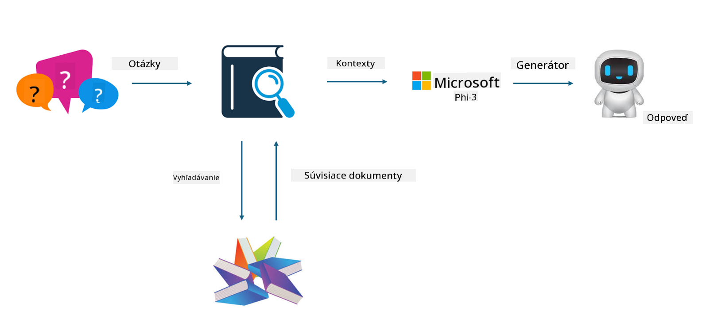

<!--
CO_OP_TRANSLATOR_METADATA:
{
  "original_hash": "743d7e9cb9c4e8ea642d77bee657a7fa",
  "translation_date": "2025-07-17T10:00:41+00:00",
  "source_file": "md/03.FineTuning/LetPhi3gotoIndustriy.md",
  "language_code": "sk"
}
-->
# **Nech Phi-3 sa stane odborníkom v priemysle**

Aby ste mohli model Phi-3 použiť v konkrétnom priemysle, je potrebné do modelu Phi-3 pridať obchodné dáta z daného odvetvia. Máme dve rôzne možnosti: prvá je RAG (Retrieval Augmented Generation) a druhá je Fine Tuning.

## **RAG vs Fine-Tuning**

### **Retrieval Augmented Generation**

RAG je kombinácia vyhľadávania dát a generovania textu. Štruktúrované aj neštruktúrované dáta podniku sú uložené vo vektorovej databáze. Pri vyhľadávaní relevantného obsahu sa nájde súhrn a obsah, ktoré tvoria kontext, a schopnosť dopĺňania textu modelom LLM/SLM sa využije na generovanie výsledného obsahu.

### **Fine-tuning**

Fine-tuning znamená doladenie existujúceho modelu. Nie je potrebné začínať od algoritmu modelu, ale je potrebné neustále zhromažďovať dáta. Ak chcete v priemyselných aplikáciách presnejšiu terminológiu a jazykový prejav, fine-tuning je lepšia voľba. Ak sa však vaše dáta často menia, fine-tuning môže byť komplikovaný.

### **Ako si vybrať**

1. Ak naša odpoveď vyžaduje zapojenie externých dát, RAG je najlepšia voľba.

2. Ak potrebujete stabilné a presné odborné znalosti z daného odvetvia, fine-tuning bude dobrá voľba. RAG uprednostňuje vyhľadávanie relevantného obsahu, ale nemusí vždy dokonale zachytiť špecializované nuansy.

3. Fine-tuning vyžaduje kvalitný dátový súbor, a ak ide len o malý rozsah dát, nebude mať veľký efekt. RAG je flexibilnejší.

4. Fine-tuning je čierna skrinka, metafyzika, a je ťažké pochopiť jeho vnútorný mechanizmus. RAG však umožňuje ľahšie nájsť zdroj dát, čím efektívne upravuje halucinácie alebo chyby v obsahu a poskytuje lepšiu transparentnosť.

### **Scenáre**

1. Vertikálne odvetvia vyžadujú špecifickú odbornú slovnú zásobu a výrazy, ***Fine-tuning*** je najlepšia voľba.

2. QA systém, ktorý zahŕňa syntézu rôznych znalostných bodov, ***RAG*** je najlepšia voľba.

3. Kombinácia automatizovaného obchodného toku ***RAG + Fine-tuning*** je najlepšia voľba.

## **Ako používať RAG**

Vektorová databáza je zbierka dát uložených v matematickej forme. Vektorové databázy uľahčujú modelom strojového učenia zapamätať si predchádzajúce vstupy, čo umožňuje ich využitie v prípadoch ako vyhľadávanie, odporúčania a generovanie textu. Dáta môžu byť identifikované na základe metrík podobnosti namiesto presných zhôd, čo umožňuje počítačovým modelom pochopiť kontext dát.

Vektorová databáza je kľúčom k realizácii RAG. Dáta môžeme previesť do vektorovej podoby pomocou vektorových modelov ako text-embedding-3, jina-ai-embedding a podobne.

Viac o vytváraní RAG aplikácie nájdete na [https://github.com/microsoft/Phi-3CookBook](https://github.com/microsoft/Phi-3CookBook?WT.mc_id=aiml-138114-kinfeylo)

## **Ako používať Fine-tuning**

Bežne používané algoritmy vo Fine-tuningu sú Lora a QLora. Ako si vybrať?
- [Viac informácií v tomto ukážkovom notebooku](../../../../code/04.Finetuning/Phi_3_Inference_Finetuning.ipynb)
- [Príklad Python FineTuning Sample](../../../../code/04.Finetuning/FineTrainingScript.py)

### **Lora a QLora**

LoRA (Low-Rank Adaptation) a QLoRA (Quantized Low-Rank Adaptation) sú techniky používané na doladenie veľkých jazykových modelov (LLM) pomocou Parameter Efficient Fine Tuning (PEFT). PEFT techniky sú navrhnuté tak, aby trénovanie modelov bolo efektívnejšie ako tradičné metódy.

LoRA je samostatná technika fine-tuningu, ktorá znižuje pamäťové nároky aplikovaním nízkorozmernej aproximácie na maticu aktualizácie váh. Ponúka rýchle časy trénovania a udržiava výkon blízky tradičnému fine-tuningu.

QLoRA je rozšírená verzia LoRA, ktorá využíva kvantizačné techniky na ďalšie zníženie pamäťovej náročnosti. QLoRA kvantizuje presnosť váhových parametrov v predtrénovanom LLM na 4-bitovú presnosť, čo je pamäťovo efektívnejšie ako LoRA. Tréning QLoRA je však približne o 30 % pomalší ako tréning LoRA kvôli dodatočným krokom kvantizácie a dekvantizácie.

QLoRA používa LoRA ako doplnok na opravu chýb zavedených počas kvantizácie. QLoRA umožňuje fine-tuning masívnych modelov s miliardami parametrov na relatívne malých, dobre dostupných GPU. Napríklad QLoRA dokáže doladiť model s 70 miliardami parametrov, ktorý by inak vyžadoval 36 GPU, len s 2...

**Vyhlásenie o zodpovednosti**:  
Tento dokument bol preložený pomocou AI prekladateľskej služby [Co-op Translator](https://github.com/Azure/co-op-translator). Aj keď sa snažíme o presnosť, prosím, majte na pamäti, že automatizované preklady môžu obsahovať chyby alebo nepresnosti. Originálny dokument v jeho pôvodnom jazyku by mal byť považovaný za autoritatívny zdroj. Pre kritické informácie sa odporúča profesionálny ľudský preklad. Nie sme zodpovední za akékoľvek nedorozumenia alebo nesprávne interpretácie vyplývajúce z použitia tohto prekladu.