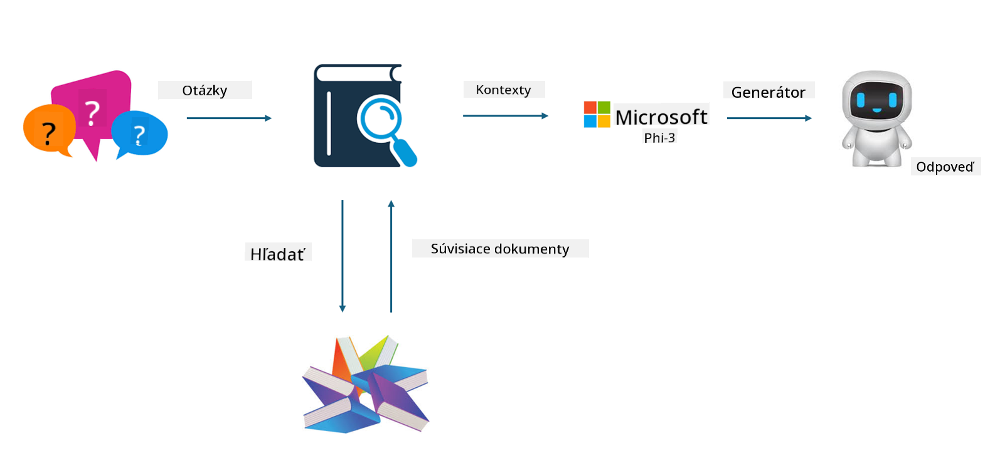
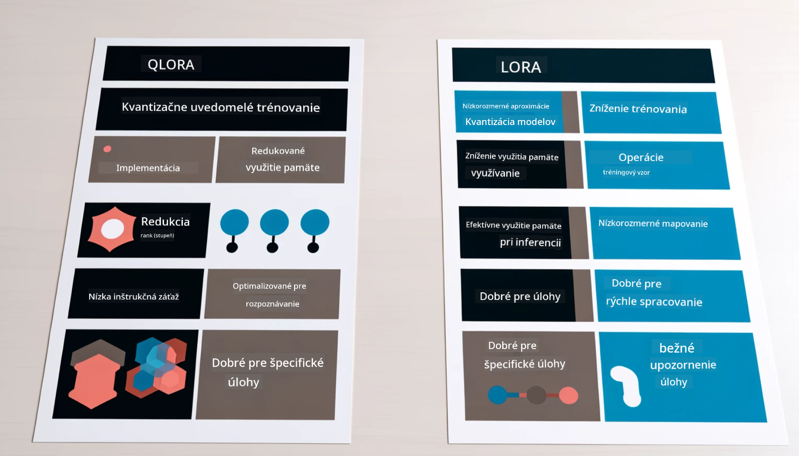

<!--
CO_OP_TRANSLATOR_METADATA:
{
  "original_hash": "743d7e9cb9c4e8ea642d77bee657a7fa",
  "translation_date": "2025-05-09T22:29:30+00:00",
  "source_file": "md/03.FineTuning/LetPhi3gotoIndustriy.md",
  "language_code": "sk"
}
-->
# **Nechaj Phi-3 stať sa odborníkom v priemysle**

Ak chcete model Phi-3 použiť v priemysle, musíte do neho pridať podnikové obchodné údaje. Máme dve možnosti: prvá je RAG (Retrieval Augmented Generation) a druhá je Fine Tuning.

## **RAG vs Fine-Tuning**

### **Retrieval Augmented Generation**

RAG je kombinácia vyhľadávania dát a generovania textu. Štruktúrované a neštruktúrované údaje podniku sú uložené vo vektorovej databáze. Pri vyhľadávaní relevantného obsahu sa nájdu súvisiace zhrnutia a obsah, ktoré vytvoria kontext, a schopnosť dopĺňania textu modelom LLM/SLM sa využije na generovanie obsahu.

### **Fine-tuning**

Fine-tuning znamená dolaďovanie existujúceho modelu. Nie je potrebné začínať od algoritmu modelu, ale je nutné neustále zhromažďovať dáta. Ak potrebujete presnejšiu terminológiu a jazykové vyjadrenie v priemyselných aplikáciách, fine-tuning je lepšou voľbou. Ak sa však vaše dáta často menia, fine-tuning môže byť komplikovaný.

### **Ako si vybrať**

1. Ak naša odpoveď vyžaduje zavedenie externých dát, RAG je najlepšia voľba.

2. Ak potrebujete stabilné a presné priemyselné znalosti, fine-tuning bude dobrá voľba. RAG uprednostňuje získavanie relevantného obsahu, ale nemusí vždy dokonale zachytiť špecializované nuansy.

3. Fine-tuning vyžaduje kvalitnú dátovú sadu, a ak ide len o malý rozsah dát, rozdiel nebude veľký. RAG je flexibilnejší.

4. Fine-tuning je čierna skrinka, metafyzika, a je ťažké pochopiť jeho vnútorný mechanizmus. RAG však umožňuje ľahšie nájsť zdroj dát, čím sa efektívne korigujú halucinácie alebo chyby v obsahu a poskytuje lepšiu transparentnosť.

### **Scenáre**

1. Vertikálne odvetvia vyžadujúce špecifickú odbornú terminológiu a vyjadrenia, ***Fine-tuning*** je najlepšia voľba.

2. QA systém, ktorý zahŕňa syntézu rôznych znalostných bodov, ***RAG*** je najlepšia voľba.

3. Kombinácia automatizovaného obchodného toku ***RAG + Fine-tuning*** je najlepšia voľba.

## **Ako používať RAG**

Vektorová databáza je zbierka dát uložených v matematickej forme. Vektorové databázy uľahčujú modelom strojového učenia zapamätať si predchádzajúce vstupy, čo umožňuje ich využitie v prípadoch ako vyhľadávanie, odporúčania a generovanie textu. Dáta sa identifikujú na základe metrík podobnosti, nie presných zhôd, čo umožňuje modelom pochopiť kontext dát.

Vektorová databáza je kľúčom k realizácii RAG. Dáta môžeme previesť do vektorového uloženia cez vektorové modely ako text-embedding-3, jina-ai-embedding a podobne.

Viac o vytváraní RAG aplikácie sa dozviete na [https://github.com/microsoft/Phi-3CookBook](https://github.com/microsoft/Phi-3CookBook?WT.mc_id=aiml-138114-kinfeylo)

## **Ako používať Fine-tuning**

Bežne používané algoritmy vo Fine-tuningu sú Lora a QLora. Ako si vybrať?
- [Viac informácií v tomto ukážkovom notebooku](../../../../code/04.Finetuning/Phi_3_Inference_Finetuning.ipynb)
- [Príklad Python FineTuning skriptu](../../../../code/04.Finetuning/FineTrainingScript.py)

### **Lora a QLora**

LoRA (Low-Rank Adaptation) a QLoRA (Quantized Low-Rank Adaptation) sú techniky na dolaďovanie veľkých jazykových modelov (LLM) pomocou Parameter Efficient Fine Tuning (PEFT). PEFT techniky sú navrhnuté na efektívnejší tréning modelov v porovnaní s tradičnými metódami.

LoRA je samostatná metóda fine-tuningu, ktorá znižuje pamäťové nároky aplikovaním nízkorozmernej aproximácie na maticu aktualizácie váh. Ponúka rýchle tréningové časy a zachováva výkon blízky tradičnému fine-tuningu.

QLoRA je rozšírená verzia LoRA, ktorá využíva kvantizačné techniky na ďalšie zníženie pamäťovej náročnosti. QLoRA kvantizuje presnosť váhových parametrov v predtrénovanom LLM na 4-bitovú presnosť, čo je pamäťovo efektívnejšie ako LoRA. Tréning QLoRA je však približne o 30 % pomalší ako LoRA kvôli dodatočným krokom kvantizácie a dekvantizácie.

QLoRA používa LoRA ako doplnok na opravu chýb spôsobených kvantizáciou. QLoRA umožňuje dolaďovanie obrovských modelov s miliardami parametrov na relatívne malých a dostupných GPU. Napríklad QLoRA dokáže dolaďovať 70-miliardový model, ktorý by inak vyžadoval 36 GPU, len s 2

**Vyhlásenie o zodpovednosti**:  
Tento dokument bol preložený pomocou AI prekladateľskej služby [Co-op Translator](https://github.com/Azure/co-op-translator). Hoci sa snažíme o presnosť, vezmite prosím na vedomie, že automatizované preklady môžu obsahovať chyby alebo nepresnosti. Pôvodný dokument v jeho rodnom jazyku by mal byť považovaný za autoritatívny zdroj. Pre dôležité informácie sa odporúča profesionálny ľudský preklad. Nie sme zodpovední za akékoľvek nedorozumenia alebo nesprávne výklady vyplývajúce z použitia tohto prekladu.