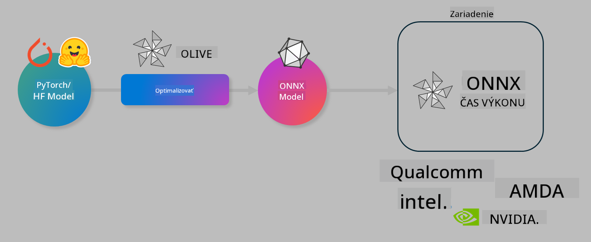

<!--
CO_OP_TRANSLATOR_METADATA:
{
  "original_hash": "6bbe47de3b974df7eea29dfeccf6032b",
  "translation_date": "2025-05-09T22:40:45+00:00",
  "source_file": "md/03.FineTuning/olive-lab/readme.md",
  "language_code": "sk"
}
-->
# Lab. Optimalizácia AI modelov pre inferenciu na zariadení

## Úvod

> [!IMPORTANT]
> Tento lab vyžaduje **Nvidia A10 alebo A100 GPU** s príslušnými ovládačmi a nainštalovaným CUDA toolkitom (verzia 12+).

> [!NOTE]
> Tento lab trvá približne **35 minút** a poskytne vám praktický úvod do základných konceptov optimalizácie modelov pre inferenciu priamo na zariadení pomocou OLIVE.

## Ciele učenia

Na konci tohto labu budete vedieť použiť OLIVE na:

- Kvantizáciu AI modelu pomocou metódy AWQ.
- Doladenie AI modelu pre konkrétnu úlohu.
- Generovanie LoRA adaptérov (doladených modelov) pre efektívnu inferenciu na zariadení pomocou ONNX Runtime.

### Čo je Olive

Olive (*O*NNX *live*) je nástroj na optimalizáciu modelov s príkazovým riadkom, ktorý vám umožňuje nasadiť modely pre ONNX runtime +++https://onnxruntime.ai+++ s dôrazom na kvalitu a výkon.



Vstupom do Olive je zvyčajne PyTorch alebo Hugging Face model a výstupom je optimalizovaný ONNX model, ktorý sa spúšťa na zariadení (cieľ nasadenia) bežiacom s ONNX runtime. Olive optimalizuje model pre AI akcelerátor cieľa nasadenia (NPU, GPU, CPU) poskytovaný hardvérovým dodávateľom ako Qualcomm, AMD, Nvidia alebo Intel.

Olive vykonáva *workflow*, čo je usporiadaná sekvencia jednotlivých úloh optimalizácie modelu nazývaných *passes* – príklady passov sú: kompresia modelu, zachytenie grafu, kvantizácia, optimalizácia grafu. Každý pass má sadu parametrov, ktoré sa dajú doladiť na dosiahnutie najlepších metrík, napríklad presnosti a latencie, ktoré vyhodnocuje príslušný evaluátor. Olive používa stratégiu vyhľadávania, ktorá automaticky doladí každý pass jednotlivo alebo ich skupiny pomocou vyhľadávacieho algoritmu.

#### Výhody Olive

- **Zníženie frustrácie a času** pri manuálnom skúšaní rôznych techník optimalizácie grafu, kompresie a kvantizácie. Definujte svoje požiadavky na kvalitu a výkon a nechajte Olive automaticky nájsť najlepší model pre vás.
- **Viac ako 40 vstavaných komponentov na optimalizáciu modelov** pokrývajúcich najmodernejšie techniky v kvantizácii, kompresii, optimalizácii grafu a doladení.
- **Jednoduché použitie cez CLI** pre bežné úlohy optimalizácie modelov, napríklad olive quantize, olive auto-opt, olive finetune.
- Zabudované balenie a nasadenie modelov.
- Podpora generovania modelov pre **Multi LoRA serving**.
- Možnosť vytvárať workflow pomocou YAML/JSON na orchestráciu úloh optimalizácie a nasadenia modelov.
- Integrácia s **Hugging Face** a **Azure AI**.
- Zabudovaný mechanizmus **cache** na **úsporu nákladov**.

## Inštrukcie k labu

> [!NOTE]
> Uistite sa, že máte nakonfigurovaný Azure AI Hub a projekt a že ste nastavili A100 výpočtový uzol podľa Lab 1.

### Krok 0: Pripojenie k Azure AI Compute

Pripojíte sa k Azure AI compute pomocou vzdialenej funkcie vo **VS Code**.

1. Otvorte desktopovú aplikáciu **VS Code**.
2. Otvorte **command palette** pomocou **Shift+Ctrl+P**.
3. V command palette vyhľadajte **AzureML - remote: Connect to compute instance in New Window**.
4. Postupujte podľa pokynov na obrazovke pre pripojenie k Compute. Budete vyzvaní vybrať Azure Subscription, Resource Group, Projekt a názov Compute, ktoré ste nastavili v Lab 1.
5. Po pripojení k Azure ML Compute uzlu sa zobrazí v **ľavom dolnom rohu Visual Code** `><Azure ML: Compute Name`.

### Krok 1: Klonovanie repozitára

Vo VS Code otvoríte nový terminál pomocou **Ctrl+J** a sklonujete tento repozitár:

V termináli by sa mal zobraziť prompt

```
azureuser@computername:~/cloudfiles/code$ 
```  
Klonovanie riešenia  

```bash
cd ~/localfiles
git clone https://github.com/microsoft/phi-3cookbook.git
```

### Krok 2: Otvorenie priečinka vo VS Code

Na otvorenie VS Code v príslušnom priečinku spustite v termináli nasledujúci príkaz, ktorý otvorí nové okno:

```bash
code phi-3cookbook/code/04.Finetuning/Olive-lab
```

Alternatívne môžete priečinok otvoriť cez **File** > **Open Folder**.

### Krok 3: Závislosti

Vo VS Code v Azure AI Compute inštancii otvorte terminál (tip: **Ctrl+J**) a spustite nasledujúce príkazy na inštaláciu závislostí:

```bash
conda create -n olive-ai python=3.11 -y
conda activate olive-ai
pip install -r requirements.txt
az extension remove -n azure-cli-ml
az extension add -n ml
```

> [!NOTE]
> Inštalácia všetkých závislostí potrvá približne 5 minút.

V tomto labe budete sťahovať a nahrávať modely do Azure AI Model katalógu. Na prístup k modelovému katalógu sa prihláste do Azure pomocou:

```bash
az login
```

> [!NOTE]
> Pri prihlasovaní budete vyzvaní vybrať predplatné. Nastavte predplatné, ktoré je určené pre tento lab.

### Krok 4: Spustenie príkazov Olive

Vo VS Code v Azure AI Compute inštancii otvorte terminál (tip: **Ctrl+J**) a uistite sa, že je aktívne conda prostredie `olive-ai`:

```bash
conda activate olive-ai
```

Potom spustite nasledujúce príkazy Olive v príkazovom riadku.

1. **Prehliadnite si dáta:** V tomto príklade doladíte model Phi-3.5-Mini, aby bol špecializovaný na odpovede na otázky súvisiace s cestovaním. Nižšie uvedený kód zobrazí prvé záznamy dátovej sady vo formáte JSON lines:
   
    ```bash
    head data/data_sample_travel.jsonl
    ```

2. **Kvantizujte model:** Pred trénovaním modelu ho najprv kvantizujte príkazom, ktorý používa techniku Active Aware Quantization (AWQ) +++https://arxiv.org/abs/2306.00978+++. AWQ kvantizuje váhy modelu s prihliadnutím na aktivácie počas inferencie. To znamená, že kvantizácia zohľadňuje skutočné rozdelenie dát v aktiváciách, čo vedie k lepšej zachovateľnosti presnosti modelu v porovnaní s tradičnými metódami kvantizácie váh.
    
    ```bash
    olive quantize \
       --model_name_or_path microsoft/Phi-3.5-mini-instruct \
       --trust_remote_code \
       --algorithm awq \
       --output_path models/phi/awq \
       --log_level 1
    ```
    
    AWQ kvantizácia trvá približne **8 minút** a **zmenší model z ~7,5GB na ~2,5GB**.
   
   V tomto labe ukazujeme, ako použiť modely z Hugging Face (napríklad: `microsoft/Phi-3.5-mini-instruct`). However, Olive also allows you to input models from the Azure AI catalog by updating the `model_name_or_path` argument to an Azure AI asset ID (for example:  `azureml://registries/azureml/models/Phi-3.5-mini-instruct/versions/4`). 

1. **Train the model:** Next, the `olive finetune` príkaz doladí kvantizovaný model. Kvantizácia modelu *pred* doladením namiesto po ňom prináša lepšiu presnosť, pretože doladenie čiastočne kompenzuje stratu spôsobenú kvantizáciou.
    
    ```bash
    olive finetune \
        --method lora \
        --model_name_or_path models/phi/awq \
        --data_files "data/data_sample_travel.jsonl" \
        --data_name "json" \
        --text_template "<|user|>\n{prompt}<|end|>\n<|assistant|>\n{response}<|end|>" \
        --max_steps 100 \
        --output_path ./models/phi/ft \
        --log_level 1
    ```
    
    Doladenie trvá približne **6 minút** (s 100 krokmi).

3. **Optimalizujte:** Po natrénovaní modelu ho optimalizujte pomocou Olive príkazu `auto-opt` command, which will capture the ONNX graph and automatically perform a number of optimizations to improve the model performance for CPU by compressing the model and doing fusions. It should be noted, that you can also optimize for other devices such as NPU or GPU by just updating the `--device` and `--provider`. Pre účely tohto labu použijeme CPU.

    ```bash
    olive auto-opt \
       --model_name_or_path models/phi/ft/model \
       --adapter_path models/phi/ft/adapter \
       --device cpu \
       --provider CPUExecutionProvider \
       --use_ort_genai \
       --output_path models/phi/onnx-ao \
       --log_level 1
    ```
    
    Optimalizácia trvá približne **5 minút**.

### Krok 5: Rýchly test inferencie modelu

Na otestovanie inferencie modelu vytvorte v priečinku Python súbor **app.py** a vložte nasledujúci kód:

```python
import onnxruntime_genai as og
import numpy as np

print("loading model and adapters...", end="", flush=True)
model = og.Model("models/phi/onnx-ao/model")
adapters = og.Adapters(model)
adapters.load("models/phi/onnx-ao/model/adapter_weights.onnx_adapter", "travel")
print("DONE!")

tokenizer = og.Tokenizer(model)
tokenizer_stream = tokenizer.create_stream()

params = og.GeneratorParams(model)
params.set_search_options(max_length=100, past_present_share_buffer=False)
user_input = "what is the best thing to see in chicago"
params.input_ids = tokenizer.encode(f"<|user|>\n{user_input}<|end|>\n<|assistant|>\n")

generator = og.Generator(model, params)

generator.set_active_adapter(adapters, "travel")

print(f"{user_input}")

while not generator.is_done():
    generator.compute_logits()
    generator.generate_next_token()

    new_token = generator.get_next_tokens()[0]
    print(tokenizer_stream.decode(new_token), end='', flush=True)

print("\n")
```

Kód spustite pomocou:

```bash
python app.py
```

### Krok 6: Nahranie modelu do Azure AI

Nahraním modelu do Azure AI modelového repozitára umožníte jeho zdieľanie s ostatnými členmi tímu a zároveň spravujete verzie modelu. Na nahratie modelu spustite nasledujúci príkaz:

> [!NOTE]
> Aktualizujte `{}` placeholders with the name of your resource group and Azure AI Project Name. 

To find your resource group `"resourceGroup"` a názov Azure AI projektu a spustite príkaz:

```
az ml workspace show
```

Prípadne môžete ísť na +++ai.azure.com+++ a vybrať **management center** > **project** > **overview**.

Nahraďte `{}` názvom vašej resource group a Azure AI projektu.

```bash
az ml model create \
    --name ft-for-travel \
    --version 1 \
    --path ./models/phi/onnx-ao \
    --resource-group {RESOURCE_GROUP_NAME} \
    --workspace-name {PROJECT_NAME}
```

Následne uvidíte svoj nahraný model a môžete ho nasadiť na https://ml.azure.com/model/list

**Zrieknutie sa zodpovednosti**:  
Tento dokument bol preložený pomocou AI prekladateľskej služby [Co-op Translator](https://github.com/Azure/co-op-translator). Aj keď sa snažíme o presnosť, berte prosím na vedomie, že automatizované preklady môžu obsahovať chyby alebo nepresnosti. Originálny dokument v jeho pôvodnom jazyku by mal byť považovaný za autoritatívny zdroj. Pre dôležité informácie sa odporúča profesionálny ľudský preklad. Nie sme zodpovední za akékoľvek nedorozumenia alebo nesprávne výklady vyplývajúce z použitia tohto prekladu.