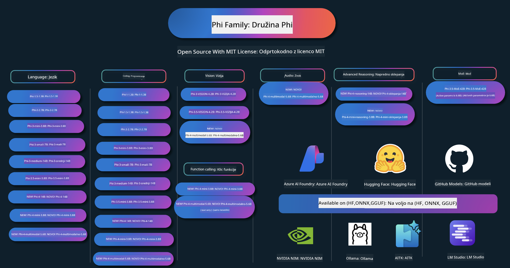

<!--
CO_OP_TRANSLATOR_METADATA:
{
  "original_hash": "1cab9282e04f2e1c388a38dca7763c16",
  "translation_date": "2025-05-09T04:16:31+00:00",
  "source_file": "README.md",
  "language_code": "sl"
}
-->
# Phi Cookbook: Microsoft Phi මොඩල සමඟ අත්හදා බැලීම්

Phi යනු Microsoft විසින් සංවර්ධනය කරන ලද විවෘත මූලාශ්‍ර AI මොඩල මාලාවකි.

Phi මේ වන විට බහු භාෂා, තර්ක කිරීම, පෙළ/කතා ජනනය, කේතනය, රූප, ශබ්ද සහ අනෙකුත් අවස්ථා සඳහා ඉතා හොඳ කාර්ය සාධන සහිත, බලවත් හා ආර්ථික කුඩා භාෂා මොඩලයක් (SLM) වේ.

ඔබට Phi ක්ලාඡ්‍යාවට හෝ එජ් උපකරණවලට යොදා ගත හැකි අතර, සීමිත ගණනයන බලයෙන් ජනක AI යෙදුම් පහසුවෙන් නිර්මාණය කළ හැක.

මෙම සම්පත් භාවිතා කිරීම ආරම්භ කිරීමට පහත පියවර අනුගමනය කරන්න:
1. **Repository එක Fork කරන්න**: Click 
2. **Repository එක Clone කරන්න**: `git clone https://github.com/microsoft/PhiCookBook.git`
3. [**Microsoft AI Discord Community එකට එක්වන්න සහ විශේෂඥයින් හා අනෙකුත් සංවර්ධකයින් හමුවෙන්න**](https://discord.com/invite/ByRwuEEgH4?WT.mc_id=aiml-137032-kinfeylo)

## 🌐 බහු භාෂා සහය

### GitHub Action මගින් සහාය දක්වයි (ස්වයංක්‍රීය සහ සෑම විටම නවීන)

[French](../fr/README.md) | [Spanish](../es/README.md) | [German](../de/README.md) | [Russian](../ru/README.md) | [Arabic](../ar/README.md) | [Persian (Farsi)](../fa/README.md) | [Urdu](../ur/README.md) | [Chinese (Simplified)](../zh/README.md) | [Chinese (Traditional, Macau)](../mo/README.md) | [Chinese (Traditional, Hong Kong)](../hk/README.md) | [Chinese (Traditional, Taiwan)](../tw/README.md) | [Japanese](../ja/README.md) | [Korean](../ko/README.md) | [Hindi](../hi/README.md)

### CLI මගින් සහාය දක්වයි
## Kazalo vsebine

- Uvod
- [Dobrodošli u Phi obitelj](./md/01.Introduction/01/01.PhiFamily.md)
  - [Postavljanje vašeg okruženja](./md/01.Introduction/01/01.EnvironmentSetup.md)
  - [Razumijevanje ključnih tehnologija](./md/01.Introduction/01/01.Understandingtech.md)
  - [Sigurnost AI za Phi modele](./md/01.Introduction/01/01.AISafety.md)
  - [Podrška za Phi hardver](./md/01.Introduction/01/01.Hardwaresupport.md)
  - [Phi modeli i dostupnost na različitim platformama](./md/01.Introduction/01/01.Edgeandcloud.md)
  - [Korištenje Guidance-ai i Phi](./md/01.Introduction/01/01.Guidance.md)
  - [GitHub Marketplace modeli](https://github.com/marketplace/models)
  - [Azure AI katalog modela](https://ai.azure.com)

- Inference Phi u različitim okruženjima
    -  [Hugging face](./md/01.Introduction/02/01.HF.md)
    -  [GitHub modeli](./md/01.Introduction/02/02.GitHubModel.md)
    -  [Azure AI Foundry katalog modela](./md/01.Introduction/02/03.AzureAIFoundry.md)
    -  [Ollama](./md/01.Introduction/02/04.Ollama.md)
    -  [AI Toolkit VSCode (AITK)](./md/01.Introduction/02/05.AITK.md)
    -  [NVIDIA NIM](./md/01.Introduction/02/06.NVIDIA.md)

- Inference Phi obitelj
    - [Inference Phi na iOS-u](./md/01.Introduction/03/iOS_Inference.md)
    - [Inference Phi na Androidu](./md/01.Introduction/03/Android_Inference.md)
    - [Inference Phi na Jetsonu](./md/01.Introduction/03/Jetson_Inference.md)
    - [Inference Phi na AI PC-u](./md/01.Introduction/03/AIPC_Inference.md)
    - [Inference Phi s Apple MLX Frameworkom](./md/01.Introduction/03/MLX_Inference.md)
    - [Inference Phi na lokalnom serveru](./md/01.Introduction/03/Local_Server_Inference.md)
    - [Inference Phi na udaljenom serveru koristeći AI Toolkit](./md/01.Introduction/03/Remote_Interence.md)
    - [Inference Phi s Rustom](./md/01.Introduction/03/Rust_Inference.md)
    - [Inference Phi--Vision lokalno](./md/01.Introduction/03/Vision_Inference.md)
    - [Inference Phi s Kaito AKS, Azure kontejnerima (službena podrška)](./md/01.Introduction/03/Kaito_Inference.md)
-  [Kvantificiranje Phi obitelji](./md/01.Introduction/04/QuantifyingPhi.md)
    - [Kvantiziranje Phi-3.5 / 4 koristeći llama.cpp](./md/01.Introduction/04/UsingLlamacppQuantifyingPhi.md)
    - [Kvantiziranje Phi-3.5 / 4 koristeći Generative AI ekstenzije za onnxruntime](./md/01.Introduction/04/UsingORTGenAIQuantifyingPhi.md)
    - [Kvantiziranje Phi-3.5 / 4 koristeći Intel OpenVINO](./md/01.Introduction/04/UsingIntelOpenVINOQuantifyingPhi.md)
    - [Kvantiziranje Phi-3.5 / 4 koristeći Apple MLX Framework](./md/01.Introduction/04/UsingAppleMLXQuantifyingPhi.md)

-  Evaluacija Phi
- [Response AI](./md/01.Introduction/05/ResponsibleAI.md)
    - [Azure AI Foundry for Evaluation](./md/01.Introduction/05/AIFoundry.md)
    - [Using Promptflow for Evaluation](./md/01.Introduction/05/Promptflow.md)
 
- RAG z Azure AI Search
    - [Kako uporabljati Phi-4-mini in Phi-4-multimodal(RAG) z Azure AI Search](https://github.com/microsoft/PhiCookBook/blob/main/code/06.E2E/E2E_Phi-4-RAG-Azure-AI-Search.ipynb)

- Primeri razvoja aplikacij Phi
  - Besedilne in klepetalne aplikacije
    - Phi-4 primeri 🆕
      - [📓] [Klepet z Phi-4-mini ONNX modelom](./md/02.Application/01.TextAndChat/Phi4/ChatWithPhi4ONNX/README.md)
      - [Klepet z lokalnim Phi-4 ONNX modelom v .NET](../../md/04.HOL/dotnet/src/LabsPhi4-Chat-01OnnxRuntime)
      - [Klepetalna .NET konzolna aplikacija s Phi-4 ONNX in Semantic Kernel](../../md/04.HOL/dotnet/src/LabsPhi4-Chat-02SK)
    - Phi-3 / 3.5 primeri
      - [Lokalni klepetalni robot v brskalniku z uporabo Phi3, ONNX Runtime Web in WebGPU](https://github.com/microsoft/onnxruntime-inference-examples/tree/main/js/chat)
      - [OpenVino klepet](./md/02.Application/01.TextAndChat/Phi3/E2E_OpenVino_Chat.md)
      - [Večmodelni - Interaktivni Phi-3-mini in OpenAI Whisper](./md/02.Application/01.TextAndChat/Phi3/E2E_Phi-3-mini_with_whisper.md)
      - [MLFlow - Izdelava ovojnice in uporaba Phi-3 z MLFlow](./md//02.Application/01.TextAndChat/Phi3/E2E_Phi-3-MLflow.md)
      - [Optimizacija modela - Kako optimizirati Phi-3-mini model za ONNX Runtime Web z Olive](https://github.com/microsoft/Olive/tree/main/examples/phi3)
      - [WinUI3 aplikacija s Phi-3 mini-4k-instruct-onnx](https://github.com/microsoft/Phi3-Chat-WinUI3-Sample/)
      - [WinUI3 večmodelni AI poganjani vzorčni notes app](https://github.com/microsoft/ai-powered-notes-winui3-sample)
      - [Prilagajanje in integracija lastnih Phi-3 modelov s Prompt flow](./md/02.Application/01.TextAndChat/Phi3/E2E_Phi-3-FineTuning_PromptFlow_Integration.md)
      - [Prilagajanje in integracija lastnih Phi-3 modelov s Prompt flow v Azure AI Foundry](./md/02.Application/01.TextAndChat/Phi3/E2E_Phi-3-FineTuning_PromptFlow_Integration_AIFoundry.md)
      - [Evalvacija prilagojenih Phi-3 / Phi-3.5 modelov v Azure AI Foundry s poudarkom na Microsoftovih načelih odgovorne AI](./md/02.Application/01.TextAndChat/Phi3/E2E_Phi-3-Evaluation_AIFoundry.md)
      - [📓] [Phi-3.5-mini-instruct primer jezikovnega napovedovanja (kitajščina/angleščina)](../../md/02.Application/01.TextAndChat/Phi3/phi3-instruct-demo.ipynb)
      - [Phi-3.5-Instruct WebGPU RAG klepetalni robot](./md/02.Application/01.TextAndChat/Phi3/WebGPUWithPhi35Readme.md)
      - [Uporaba Windows GPU za izdelavo Prompt flow rešitve s Phi-3.5-Instruct ONNX](./md/02.Application/01.TextAndChat/Phi3/UsingPromptFlowWithONNX.md)
      - [Uporaba Microsoft Phi-3.5 tflite za izdelavo Android aplikacije](./md/02.Application/01.TextAndChat/Phi3/UsingPhi35TFLiteCreateAndroidApp.md)
      - [Q&A .NET primer z lokalnim ONNX Phi-3 modelom z Microsoft.ML.OnnxRuntime](../../md/04.HOL/dotnet/src/LabsPhi301)
      - [Konzolna klepetalna .NET aplikacija s Semantic Kernel in Phi-3](../../md/04.HOL/dotnet/src/LabsPhi302)

  - Primeri na osnovi kode z Azure AI Inference SDK
    - Phi-4 primeri 🆕
      - [📓] [Generiranje kode projekta z Phi-4-multimodal](./md/02.Application/02.Code/Phi4/GenProjectCode/README.md)
    - Phi-3 / 3.5 primeri
      - [Zgradite svoj Visual Studio Code GitHub Copilot klepet z Microsoft Phi-3 družino](./md/02.Application/02.Code/Phi3/VSCodeExt/README.md)
      - [Ustvarite svoj Visual Studio Code Chat Copilot agenta s Phi-3.5 in GitHub modeli](./md/02.Application/02.Code/Phi3/CreateVSCodeChatAgentWithGitHubModels.md)

  - Napredni primeri razmišljanja
    - Phi-4 primeri 🆕
      - [📓] [Phi-4-mini-reasoning ali Phi-4-reasoning primeri](./md/02.Application/03.AdvancedReasoning/Phi4/AdvancedResoningPhi4mini/README.md)
      - [📓] [Prilagajanje Phi-4-mini-reasoning z Microsoft Olive](../../md/02.Application/03.AdvancedReasoning/Phi4/AdvancedResoningPhi4mini/olive_ft_phi_4_reasoning_with_medicaldata.ipynb)
      - [📓] [Prilagajanje Phi-4-mini-reasoning z Apple MLX](../../md/02.Application/03.AdvancedReasoning/Phi4/AdvancedResoningPhi4mini/mlx_ft_phi_4_reasoning_with_medicaldata.ipynb)
      - [📓] [Phi-4-mini-reasoning z GitHub modeli](../../md/02.Application/02.Code/Phi4r/github_models_inference.ipynb)
- [📓] [Phi-4-mini-reasoning with Azure AI Foundry Models](../../md/02.Application/02.Code/Phi4r/azure_models_inference.ipynb)
  - Demos
      - [Phi-4-mini demos hosted on Hugging Face Spaces](https://huggingface.co/spaces/microsoft/phi-4-mini?WT.mc_id=aiml-137032-kinfeylo)
      - [Phi-4-multimodal demos hosted on Hugginge Face Spaces](https://huggingface.co/spaces/microsoft/phi-4-multimodal?WT.mc_id=aiml-137032-kinfeylo)
  - Vision Samples
    - Phi-4 Samples 🆕
      - [📓] [Use Phi-4-multimodal to read images and generate code](./md/02.Application/04.Vision/Phi4/CreateFrontend/README.md) 
    - Phi-3 / 3.5 Samples
      -  [📓][Phi-3-vision-Image text to text](../../md/02.Application/04.Vision/Phi3/E2E_Phi-3-vision-image-text-to-text-online-endpoint.ipynb)
      - [Phi-3-vision-ONNX](https://onnxruntime.ai/docs/genai/tutorials/phi3-v.html)
      - [📓][Phi-3-vision CLIP Embedding](../../md/02.Application/04.Vision/Phi3/E2E_Phi-3-vision-image-text-to-text-online-endpoint.ipynb)
      - [DEMO: Phi-3 Recycling](https://github.com/jennifermarsman/PhiRecycling/)
      - [Phi-3-vision - Visual language assistant - with Phi3-Vision and OpenVINO](https://docs.openvino.ai/nightly/notebooks/phi-3-vision-with-output.html)
      - [Phi-3 Vision Nvidia NIM](./md/02.Application/04.Vision/Phi3/E2E_Nvidia_NIM_Vision.md)
      - [Phi-3 Vision OpenVino](./md/02.Application/04.Vision/Phi3/E2E_OpenVino_Phi3Vision.md)
      - [📓][Phi-3.5 Vision multi-frame or multi-image sample](../../md/02.Application/04.Vision/Phi3/phi3-vision-demo.ipynb)
      - [Phi-3 Vision Local ONNX Model using the Microsoft.ML.OnnxRuntime .NET](../../md/04.HOL/dotnet/src/LabsPhi303)
      - [Menu based Phi-3 Vision Local ONNX Model using the Microsoft.ML.OnnxRuntime .NET](../../md/04.HOL/dotnet/src/LabsPhi304)

  - Audio Samples
    - Phi-4 Samples 🆕
      - [📓] [Extracting audio transcripts using Phi-4-multimodal](./md/02.Application/05.Audio/Phi4/Transciption/README.md)
      - [📓] [Phi-4-multimodal Audio Sample](../../md/02.Application/05.Audio/Phi4/Siri/demo.ipynb)
      - [📓] [Phi-4-multimodal Speech Translation Sample](../../md/02.Application/05.Audio/Phi4/Translate/demo.ipynb)
      - [.NET console application using Phi-4-multimodal Audio to analyze an audio file and generate transcript](../../md/04.HOL/dotnet/src/LabsPhi4-MultiModal-02Audio)

  - MOE Samples
    - Phi-3 / 3.5 Samples
      - [📓] [Phi-3.5 Mixture of Experts Models (MoEs) Social Media Sample](../../md/02.Application/06.MoE/Phi3/phi3_moe_demo.ipynb)
      - [📓] [Building a Retrieval-Augmented Generation (RAG) Pipeline with NVIDIA NIM Phi-3 MOE, Azure AI Search, and LlamaIndex](../../md/02.Application/06.MoE/Phi3/azure-ai-search-nvidia-rag.ipynb)
  - Function Calling Samples
    - Phi-4 Samples 🆕
      -  [📓] [Using Function Calling With Phi-4-mini](./md/02.Application/07.FunctionCalling/Phi4/FunctionCallingBasic/README.md)
      -  [📓] [Using Function Calling to create multi-agents With Phi-4-mini](../../md/02.Application/07.FunctionCalling/Phi4/Multiagents/Phi_4_mini_multiagent.ipynb)
      -  [📓] [Using Function Calling with Ollama](../../md/02.Application/07.FunctionCalling/Phi4/Ollama/ollama_functioncalling.ipynb)
  - Multimodal Mixing Samples
    - Phi-4 Samples 🆕
      -  [📓] [Using Phi-4-multimodal as a Technology journalist](../../md/02.Application/08.Multimodel/Phi4/TechJournalist/phi_4_mm_audio_text_publish_news.ipynb)
      - [.NET console application using Phi-4-multimodal to analyze images](../../md/04.HOL/dotnet/src/LabsPhi4-MultiModal-01Images)

- Fine-tuning Phi Samples
  - [Fine-tuning Scenarios](./md/03.FineTuning/FineTuning_Scenarios.md)
  - [Fine-tuning vs RAG](./md/03.FineTuning/FineTuning_vs_RAG.md)
  - [Fine-tuning Let Phi-3 become an industry expert](./md/03.FineTuning/LetPhi3gotoIndustriy.md)
  - [Fine-tuning Phi-3 with AI Toolkit for VS Code](./md/03.FineTuning/Finetuning_VSCodeaitoolkit.md)
  - [Fine-tuning Phi-3 with Azure Machine Learning Service](./md/03.FineTuning/Introduce_AzureML.md)
- [Fine-tuning Phi-3 with Lora](./md/03.FineTuning/FineTuning_Lora.md)
  - [Fine-tuning Phi-3 with QLora](./md/03.FineTuning/FineTuning_Qlora.md)
  - [Fine-tuning Phi-3 with Azure AI Foundry](./md/03.FineTuning/FineTuning_AIFoundry.md)
  - [Fine-tuning Phi-3 with Azure ML CLI/SDK](./md/03.FineTuning/FineTuning_MLSDK.md)
  - [Fine-tuning with Microsoft Olive](./md/03.FineTuning/FineTuning_MicrosoftOlive.md)
  - [Fine-tuning with Microsoft Olive Hands-On Lab](./md/03.FineTuning/olive-lab/readme.md)
  - [Fine-tuning Phi-3-vision with Weights and Bias](./md/03.FineTuning/FineTuning_Phi-3-visionWandB.md)
  - [Fine-tuning Phi-3 with Apple MLX Framework](./md/03.FineTuning/FineTuning_MLX.md)
  - [Fine-tuning Phi-3-vision (official support)](./md/03.FineTuning/FineTuning_Vision.md)
  - [Fine-Tuning Phi-3 with Kaito AKS , Azure Containers(official Support)](./md/03.FineTuning/FineTuning_Kaito.md)
  - [Fine-Tuning Phi-3 and 3.5 Vision](https://github.com/2U1/Phi3-Vision-Finetune)

- Hands on Lab
  - [Exploring cutting-edge models: LLMs, SLMs, local development and more](https://github.com/microsoft/aitour-exploring-cutting-edge-models)
  - [Unlocking NLP Potential: Fine-Tuning with Microsoft Olive](https://github.com/azure/Ignite_FineTuning_workshop)

- Academic Research Papers and Publications
  - [Textbooks Are All You Need II: phi-1.5 technical report](https://arxiv.org/abs/2309.05463)
  - [Phi-3 Technical Report: A Highly Capable Language Model Locally on Your Phone](https://arxiv.org/abs/2404.14219)
  - [Phi-4 Technical Report](https://arxiv.org/abs/2412.08905)
  - [Phi-4-Mini Technical Report: Compact yet Powerful Multimodal Language Models via Mixture-of-LoRAs](https://arxiv.org/abs/2503.01743)
  - [Optimizing Small Language Models for In-Vehicle Function-Calling](https://arxiv.org/abs/2501.02342)
  - [(WhyPHI) Fine-Tuning PHI-3 for Multiple-Choice Question Answering: Methodology, Results, and Challenges](https://arxiv.org/abs/2501.01588)
  - [Phi-4-reasoning Technical Report](https://www.microsoft.com/en-us/research/wp-content/uploads/2025/04/phi_4_reasoning.pdf)
  - [Phi-4-mini-reasoning Technical Report](https://huggingface.co/microsoft/Phi-4-mini-reasoning/blob/main/Phi-4-Mini-Reasoning.pdf)

## Using Phi Models

### Phi on Azure AI Foundry

Lahko se naučite, kako uporabljati Microsoft Phi in kako zgraditi E2E rešitve na različnih strojnih napravah. Če želite Phi preizkusiti sami, začnite z igranjem z modeli in prilagajanjem Phi za svoje scenarije z uporabo [Azure AI Foundry Azure AI Model Catalog](https://aka.ms/phi3-azure-ai). Več informacij najdete v vodiču Začetek dela z [Azure AI Foundry](/md/02.QuickStart/AzureAIFoundry_QuickStart.md).

**Igralnica**  
Vsak model ima svojo igralnico za testiranje modela [Azure AI Playground](https://aka.ms/try-phi3).

### Phi on GitHub Models

Lahko se naučite, kako uporabljati Microsoft Phi in kako zgraditi E2E rešitve na različnih strojnih napravah. Če želite Phi preizkusiti sami, začnite z igranjem z modelom in prilagajanjem Phi za svoje scenarije z uporabo [GitHub Model Catalog](https://github.com/marketplace/models?WT.mc_id=aiml-137032-kinfeylo). Več informacij najdete v vodiču Začetek dela z [GitHub Model Catalog](/md/02.QuickStart/GitHubModel_QuickStart.md).

**Igralnica**  
Vsak model ima svojo [igralnico za testiranje modela](/md/02.QuickStart/GitHubModel_QuickStart.md).

### Phi on Hugging Face

Model lahko najdete tudi na [Hugging Face](https://huggingface.co/microsoft).

**Igralnica**  
[Hugging Chat igralnica](https://huggingface.co/chat/models/microsoft/Phi-3-mini-4k-instruct)

## Responsible AI

Microsoft je zavezan, da pomaga našim strankam odgovorno uporabljati naše AI izdelke, deli svoje izkušnje in gradi zaupanja vredna partnerstva z orodji, kot so Transparency Notes in Impact Assessments. Veliko teh virov najdete na [https://aka.ms/RAI](https://aka.ms/RAI).  
Microsoftov pristop k odgovorni umetni inteligenci temelji na naših AI načelih pravičnosti, zanesljivosti in varnosti, zasebnosti in varnosti, vključevanju, preglednosti ter odgovornosti.
Large-scale natural language, image, and speech models - like the ones used in this sample - lahko potencialno delujejo na načine, ki so nepravični, nezanesljivi ali žaljivi, kar lahko povzroči škodo. Za informacije o tveganjih in omejitvah si oglejte [Azure OpenAI service Transparency note](https://learn.microsoft.com/legal/cognitive-services/openai/transparency-note?tabs=text).

Priporočeni pristop za zmanjšanje teh tveganj je vključitev varnostnega sistema v vašo arhitekturo, ki lahko zazna in prepreči škodljivo vedenje. [Azure AI Content Safety](https://learn.microsoft.com/azure/ai-services/content-safety/overview) zagotavlja neodvisno zaščitno plast, ki lahko zazna škodljivo vsebino, ki jo ustvarijo uporabniki ali AI, v aplikacijah in storitvah. Azure AI Content Safety vključuje tekstovne in slikovne API-je, ki omogočajo zaznavanje škodljivega gradiva. V okviru Azure AI Foundry storitev Content Safety omogoča ogled, raziskovanje in preizkušanje vzorčne kode za zaznavanje škodljive vsebine v različnih modalitetah. Naslednja [quickstart dokumentacija](https://learn.microsoft.com/azure/ai-services/content-safety/quickstart-text?tabs=visual-studio%2Clinux&pivots=programming-language-rest) vas vodi skozi pošiljanje zahtevkov storitvi.

Drugi vidik, ki ga je treba upoštevati, je splošna zmogljivost aplikacije. Pri večmodalnih in večmodelnih aplikacijah razumemo zmogljivost kot to, da sistem deluje tako, kot vi in vaši uporabniki pričakujete, vključno s tem, da ne ustvarja škodljivih izhodov. Pomembno je oceniti zmogljivost vaše celotne aplikacije z uporabo [Performance and Quality and Risk and Safety evaluators](https://learn.microsoft.com/azure/ai-studio/concepts/evaluation-metrics-built-in). Prav tako imate možnost ustvarjanja in ocenjevanja s [custom evaluators](https://learn.microsoft.com/azure/ai-studio/how-to/develop/evaluate-sdk#custom-evaluators).

Vašo AI aplikacijo lahko ocenite v razvojni okolju z uporabo [Azure AI Evaluation SDK](https://microsoft.github.io/promptflow/index.html). Glede na testni nabor podatkov ali cilj se generacije vaše generativne AI aplikacije kvantitativno merijo z vgrajenimi evaluatorji ali po meri izbranimi evaluatorji. Za začetek z azure ai evaluation sdk za ocenjevanje vašega sistema lahko sledite [quickstart vodiču](https://learn.microsoft.com/azure/ai-studio/how-to/develop/flow-evaluate-sdk). Ko izvedete ocenjevalno izvajanje, lahko [vizualizirate rezultate v Azure AI Foundry](https://learn.microsoft.com/azure/ai-studio/how-to/evaluate-flow-results).

## Trademarks

Ta projekt lahko vsebuje blagovne znamke ali logotipe projektov, izdelkov ali storitev. Dovoljena uporaba Microsoftovih blagovnih znamk ali logotipov je podrejena in mora slediti [Microsoft's Trademark & Brand Guidelines](https://www.microsoft.com/legal/intellectualproperty/trademarks/usage/general).  
Uporaba Microsoftovih blagovnih znamk ali logotipov v spremenjenih različicah tega projekta ne sme povzročati zmede ali nakazovati sponzorstva Microsofta. Vsaka uporaba blagovnih znamk ali logotipov tretjih oseb je podvržena pravilom teh tretjih oseb.

**Opozorilo**:  
Ta dokument je bil preveden z uporabo AI prevajalske storitve [Co-op Translator](https://github.com/Azure/co-op-translator). Čeprav si prizadevamo za natančnost, vas prosimo, da upoštevate, da lahko avtomatizirani prevodi vsebujejo napake ali netočnosti. Izvirni dokument v njegovem izvirnem jeziku velja za avtoritativni vir. Za ključne informacije priporočamo strokovni človeški prevod. Ne odgovarjamo za morebitna nesporazume ali napačne interpretacije, ki izhajajo iz uporabe tega prevoda.