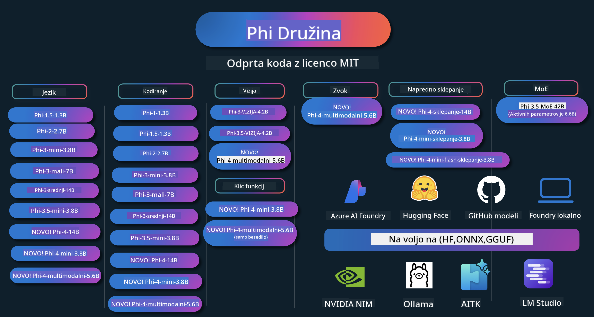

<!--
CO_OP_TRANSLATOR_METADATA:
{
  "original_hash": "ef3a50368712b1a7483d0def1f70c490",
  "translation_date": "2025-12-21T14:01:33+00:00",
  "source_file": "README.md",
  "language_code": "sl"
}
-->
# Phi Cookbook: Hands-On Examples with Microsoft's Phi Models

Phi is a series of open source AI models developed by Microsoft. 

Phi is currently the most powerful and cost-effective small language model (SLM), with very good benchmarks in multi-language, reasoning, text/chat generation,coding, images, audio and other scenarios. 

You can deploy Phi to the cloud or to edge devices, and you can easily build generative AI applications with limited computing power.

Follow these steps to get started using these resource :
1. **Razveji repozitorij**: Click 
2. **Kloniraj repozitorij**:   `git clone https://github.com/microsoft/PhiCookBook.git`
3. [**Pridružite se Microsoft AI Discord skupnosti in spoznajte strokovnjake ter razvijalce**](https://discord.com/invite/ByRwuEEgH4?WT.mc_id=aiml-137032-kinfeylo)

### 🌐 Večjezična podpora

#### Podprto prek GitHub Action (avtomatizirano in vedno posodobljeno)

<!-- CO-OP TRANSLATOR LANGUAGES TABLE START -->
[Arabščina](../ar/README.md) | [Bengalski](../bn/README.md) | [Bolgarščina](../bg/README.md) | [Burmanski (Mjanmar)](../my/README.md) | [Kitajščina (poenostavljeno)](../zh/README.md) | [Kitajščina (tradicionalna, Hong Kong)](../hk/README.md) | [Kitajščina (tradicionalna, Makao)](../mo/README.md) | [Kitajščina (tradicionalna, Tajvan)](../tw/README.md) | [Hrvaščina](../hr/README.md) | [Češčina](../cs/README.md) | [Danščina](../da/README.md) | [Nizozemščina](../nl/README.md) | [Estonščina](../et/README.md) | [Finščina](../fi/README.md) | [Francoščina](../fr/README.md) | [Nemščina](../de/README.md) | [Grščina](../el/README.md) | [Hebrejščina](../he/README.md) | [hindijščina](../hi/README.md) | [Madžarščina](../hu/README.md) | [Indonezijščina](../id/README.md) | [Italijanščina](../it/README.md) | [Japonščina](../ja/README.md) | [Kannadščina](../kn/README.md) | [Korejščina](../ko/README.md) | [Litovščina](../lt/README.md) | [Malajščina](../ms/README.md) | [malajalščina](../ml/README.md) | [maratščina](../mr/README.md) | [Nepalščina](../ne/README.md) | [Nigerijski pidžin](../pcm/README.md) | [Norveščina](../no/README.md) | [Perzijščina (Farsi)](../fa/README.md) | [Poljščina](../pl/README.md) | [Portugalščina (Brazilija)](../br/README.md) | [Portugalščina (Portugalska)](../pt/README.md) | [Pandžabi (Gurmukhi)](../pa/README.md) | [Romunščina](../ro/README.md) | [Ruščina](../ru/README.md) | [Srbščina (cirilica)](../sr/README.md) | [Slovaščina](../sk/README.md) | [Slovenščina](./README.md) | [Španščina](../es/README.md) | [Svahili](../sw/README.md) | [Švedščina](../sv/README.md) | [Tagalog (filipinščina)](../tl/README.md) | [Tamilščina](../ta/README.md) | [telugščina](../te/README.md) | [Tajsščina](../th/README.md) | [Turščina](../tr/README.md) | [Ukrajinščina](../uk/README.md) | [Urdu](../ur/README.md) | [Vietnamščina](../vi/README.md)
<!-- CO-OP TRANSLATOR LANGUAGES TABLE END -->

## Kazalo vsebine

- Uvod
  - [Dobrodošli v družini Phi](./md/01.Introduction/01/01.PhiFamily.md)
  - [Vzpostavitev vašega okolja](./md/01.Introduction/01/01.EnvironmentSetup.md)
  - [Razumevanje ključnih tehnologij](./md/01.Introduction/01/01.Understandingtech.md)
  - [Varnost AI za modele Phi](./md/01.Introduction/01/01.AISafety.md)
  - [Podpora strojne opreme Phi](./md/01.Introduction/01/01.Hardwaresupport.md)
  - [Modeli Phi in razpoložljivost po platformah](./md/01.Introduction/01/01.Edgeandcloud.md)
  - [Uporaba Guidance-ai in Phi](./md/01.Introduction/01/01.Guidance.md)
  - [GitHub Marketplace Models](https://github.com/marketplace/models)
  - [Azure AI Model Catalog](https://ai.azure.com)

- Vpeljava Phi v različnih okoljih
    -  [Hugging face](./md/01.Introduction/02/01.HF.md)
    -  [GitHub Models](./md/01.Introduction/02/02.GitHubModel.md)
    -  [Azure AI Foundry Model Catalog](./md/01.Introduction/02/03.AzureAIFoundry.md)
    -  [Ollama](./md/01.Introduction/02/04.Ollama.md)
    -  [AI Toolkit VSCode (AITK)](./md/01.Introduction/02/05.AITK.md)
    -  [NVIDIA NIM](./md/01.Introduction/02/06.NVIDIA.md)
    -  [Foundry Local](./md/01.Introduction/02/07.FoundryLocal.md)

- Vpeljava družine Phi
    - [Vpeljava Phi v iOS](./md/01.Introduction/03/iOS_Inference.md)
    - [Vpeljava Phi v Android](./md/01.Introduction/03/Android_Inference.md)
    - [Vpeljava Phi v Jetson](./md/01.Introduction/03/Jetson_Inference.md)
    - [Vpeljava Phi v AI PC](./md/01.Introduction/03/AIPC_Inference.md)
    - [Vpeljava Phi z Apple MLX Framework](./md/01.Introduction/03/MLX_Inference.md)
    - [Vpeljava Phi v lokalnem strežniku](./md/01.Introduction/03/Local_Server_Inference.md)
    - [Vpeljava Phi v oddaljenem strežniku z uporabo AI Toolkit](./md/01.Introduction/03/Remote_Interence.md)
    - [Vpeljava Phi z Rust](./md/01.Introduction/03/Rust_Inference.md)
    - [Vpeljava Phi -- Vizija lokalno](./md/01.Introduction/03/Vision_Inference.md)
    - [Vpeljava Phi z Kaito AKS, Azure Containers (uradna podpora)](./md/01.Introduction/03/Kaito_Inference.md)
-  [Kvantizacija družine Phi](./md/01.Introduction/04/QuantifyingPhi.md)
    - [Kvantizacija Phi-3.5 / 4 z uporabo llama.cpp](./md/01.Introduction/04/UsingLlamacppQuantifyingPhi.md)
    - [Kvantizacija Phi-3.5 / 4 z uporabo Generative AI extensions za onnxruntime](./md/01.Introduction/04/UsingORTGenAIQuantifyingPhi.md)
    - [Kvantizacija Phi-3.5 / 4 z uporabo Intel OpenVINO](./md/01.Introduction/04/UsingIntelOpenVINOQuantifyingPhi.md)
    - [Kvantizacija Phi-3.5 / 4 z uporabo Apple MLX Framework](./md/01.Introduction/04/UsingAppleMLXQuantifyingPhi.md)

-  Ocena Phi
    - [Odgovorna AI](./md/01.Introduction/05/ResponsibleAI.md)
    - [Azure AI Foundry za evalvacijo](./md/01.Introduction/05/AIFoundry.md)
    - [Uporaba Promptflow za evalvacijo](./md/01.Introduction/05/Promptflow.md)
 
- RAG z Azure AI Search
    - [Kako uporabljati Phi-4-mini in Phi-4-multimodal (RAG) z Azure AI Search](https://github.com/microsoft/PhiCookBook/blob/main/code/06.E2E/E2E_Phi-4-RAG-Azure-AI-Search.ipynb)

- Primeri razvoja aplikacij Phi
  - Besedilne in klepetalne aplikacije
    - Primeri Phi-4 🆕
      - [📓] [Klepet s Phi-4-mini ONNX modelom](./md/02.Application/01.TextAndChat/Phi4/ChatWithPhi4ONNX/README.md)
      - [Klepet z lokalnim ONNX modelom Phi-4 .NET](../../md/04.HOL/dotnet/src/LabsPhi4-Chat-01OnnxRuntime)
      - [Konzolna aplikacija .NET za klepet s Phi-4 ONNX z uporabo Semantic Kernel](../../md/04.HOL/dotnet/src/LabsPhi4-Chat-02SK)
    - Primeri Phi-3 / 3.5
      - [Lokalni klepetalni robot v brskalniku z uporabo Phi3, ONNX Runtime Web in WebGPU](https://github.com/microsoft/onnxruntime-inference-examples/tree/main/js/chat)
      - [OpenVino klepet](./md/02.Application/01.TextAndChat/Phi3/E2E_OpenVino_Chat.md)
      - [Večmodelno - interaktivni Phi-3-mini in OpenAI Whisper](./md/02.Application/01.TextAndChat/Phi3/E2E_Phi-3-mini_with_whisper.md)
      - [MLFlow - Izdelava ovojnice in uporaba Phi-3 z MLFlow](./md//02.Application/01.TextAndChat/Phi3/E2E_Phi-3-MLflow.md)
      - [Optimizacija modela - Kako optimizirati model Phi-3-min za ONNX Runtime Web z Olive](https://github.com/microsoft/Olive/tree/main/examples/phi3)
      - [Aplikacija WinUI3 s Phi-3 mini-4k-instruct-onnx](https://github.com/microsoft/Phi3-Chat-WinUI3-Sample/)
      -[Vzorec aplikacije WinUI3 z več modeli, podprto z AI, za zapiske](https://github.com/microsoft/ai-powered-notes-winui3-sample)
      - [Fino prilagajanje in integracija prilagojenih modelov Phi-3 s Prompt flow](./md/02.Application/01.TextAndChat/Phi3/E2E_Phi-3-FineTuning_PromptFlow_Integration.md)
      - [Fino prilagajanje in integracija prilagojenih modelov Phi-3 s Prompt flow v Azure AI Foundry](./md/02.Application/01.TextAndChat/Phi3/E2E_Phi-3-FineTuning_PromptFlow_Integration_AIFoundry.md)
      - [Ocenite fino dodelan model Phi-3 / Phi-3.5 v Azure AI Foundry s poudarkom na Microsoftovih načelih odgovorne AI](./md/02.Application/01.TextAndChat/Phi3/E2E_Phi-3-Evaluation_AIFoundry.md)
      - [📓] [Phi-3.5-mini-instruct vzorec napovedovanja jezika (kitajščina/angleščina)](./md/02.Application/01.TextAndChat/Phi3/phi3-instruct-demo.ipynb)
      - [Phi-3.5-Instruct WebGPU RAG klepetalnik](./md/02.Application/01.TextAndChat/Phi3/WebGPUWithPhi35Readme.md)
      - [Uporaba GPU v Windows za ustvarjanje rešitve Prompt flow s Phi-3.5-Instruct ONNX](./md/02.Application/01.TextAndChat/Phi3/UsingPromptFlowWithONNX.md)
      - [Uporaba Microsoft Phi-3.5 tflite za ustvarjanje Android aplikacije](./md/02.Application/01.TextAndChat/Phi3/UsingPhi35TFLiteCreateAndroidApp.md)
      - [Q&A .NET primer, ki uporablja lokalni ONNX Phi-3 model z Microsoft.ML.OnnxRuntime](../../md/04.HOL/dotnet/src/LabsPhi301)
      - [Konzolna .NET aplikacija za klepet z Semantic Kernel in Phi-3](../../md/04.HOL/dotnet/src/LabsPhi302)

  - Azure AI Inference SDK Code Based Samples 
    - Phi-4 Vzorci 🆕
      - [📓] [Generirajte kodo projekta z uporabo Phi-4-multimodal](./md/02.Application/02.Code/Phi4/GenProjectCode/README.md)
    - Phi-3 / 3.5 Vzorci
      - [Ustvarite svoj Visual Studio Code GitHub Copilot Chat z družino Microsoft Phi-3](./md/02.Application/02.Code/Phi3/VSCodeExt/README.md)
      - [Ustvarite svojega agenta Chat Copilot za Visual Studio Code z Phi-3.5 iz GitHub Models](/md/02.Application/02.Code/Phi3/CreateVSCodeChatAgentWithGitHubModels.md)

  - Napredni vzorci sklepanja
    - Phi-4 Vzorci 🆕
      - [📓] [Phi-4-mini-reasoning ali Phi-4-reasoning vzorci](./md/02.Application/03.AdvancedReasoning/Phi4/AdvancedResoningPhi4mini/README.md)
      - [📓] [Fino prilagajanje Phi-4-mini-reasoning z Microsoft Olive](./md/02.Application/03.AdvancedReasoning/Phi4/AdvancedResoningPhi4mini/olive_ft_phi_4_reasoning_with_medicaldata.ipynb)
      - [📓] [Fino prilagajanje Phi-4-mini-reasoning z Apple MLX](./md/02.Application/03.AdvancedReasoning/Phi4/AdvancedResoningPhi4mini/mlx_ft_phi_4_reasoning_with_medicaldata.ipynb)
      - [📓] [Phi-4-mini-reasoning z GitHub Models](./md/02.Application/02.Code/Phi4r/github_models_inference.ipynb)
      - [📓] [Phi-4-mini-reasoning z modeli Azure AI Foundry](./md/02.Application/02.Code/Phi4r/azure_models_inference.ipynb)
  - Demonstracije
      - [Phi-4-mini demoji gostovani na Hugging Face Spaces](https://huggingface.co/spaces/microsoft/phi-4-mini?WT.mc_id=aiml-137032-kinfeylo)
      - [Phi-4-multimodal demoji gostovani na Hugginge Face Spaces](https://huggingface.co/spaces/microsoft/phi-4-multimodal?WT.mc_id=aiml-137032-kinfeylo)
  - Vzorci za računalniški vid
    - Phi-4 Vzorci 🆕
      - [📓] [Uporabite Phi-4-multimodal za branje slik in generiranje kode](./md/02.Application/04.Vision/Phi4/CreateFrontend/README.md) 
    - Phi-3 / 3.5 Vzorci
      -  [📓][Phi-3-vision - besedilo iz slike v besedilo](./md/02.Application/04.Vision/Phi3/E2E_Phi-3-vision-image-text-to-text-online-endpoint.ipynb)
      - [Phi-3-vision-ONNX](https://onnxruntime.ai/docs/genai/tutorials/phi3-v.html)
      - [📓][Phi-3-vision CLIP vdelava](./md/02.Application/04.Vision/Phi3/E2E_Phi-3-vision-image-text-to-text-online-endpoint.ipynb)
      - [DEMO: Phi-3 Recikliranje](https://github.com/jennifermarsman/PhiRecycling/)
      - [Phi-3-vision - vizualni jezikovni asistent - s Phi3-Vision in OpenVINO](https://docs.openvino.ai/nightly/notebooks/phi-3-vision-with-output.html)
      - [Phi-3 Vision Nvidia NIM](./md/02.Application/04.Vision/Phi3/E2E_Nvidia_NIM_Vision.md)
      - [Phi-3 Vision OpenVino](./md/02.Application/04.Vision/Phi3/E2E_OpenVino_Phi3Vision.md)
      - [📓][Phi-3.5 Vision vzorec za več okvirjev ali več slik](./md/02.Application/04.Vision/Phi3/phi3-vision-demo.ipynb)
      - [Phi-3 Vision Local ONNX Model using the Microsoft.ML.OnnxRuntime .NET](../../md/04.HOL/dotnet/src/LabsPhi303)
      - [Menu based Phi-3 Vision Local ONNX Model using the Microsoft.ML.OnnxRuntime .NET](../../md/04.HOL/dotnet/src/LabsPhi304)

  - Matematični vzorci
    -  Phi-4-Mini-Flash-Reasoning-Instruct Vzorci 🆕 [Matematični demo s Phi-4-Mini-Flash-Reasoning-Instruct](./md/02.Application/09.Math/MathDemo.ipynb)

  - Avdio vzorci
    - Phi-4 Vzorci 🆕
      - [📓] [Izvleček prepisov zvoka z uporabo Phi-4-multimodal](./md/02.Application/05.Audio/Phi4/Transciption/README.md)
      - [📓] [Phi-4-multimodal vzorec za zvok](./md/02.Application/05.Audio/Phi4/Siri/demo.ipynb)
      - [📓] [Vzorec prevajanja govora s Phi-4-multimodal](./md/02.Application/05.Audio/Phi4/Translate/demo.ipynb)
      - [.NET konzolna aplikacija, ki uporablja Phi-4-multimodal Audio za analizo avdio datoteke in generiranje prepisa](../../md/04.HOL/dotnet/src/LabsPhi4-MultiModal-02Audio)

  - MOE vzorci
    - Phi-3 / 3.5 Vzorci
      - [📓] [Phi-3.5 Mixture of Experts Models (MoEs) vzorec za družbena omrežja](./md/02.Application/06.MoE/Phi3/phi3_moe_demo.ipynb)
      - [📓] [Gradnja cevovoda Retrieval-Augmented Generation (RAG) z NVIDIA NIM Phi-3 MOE, Azure AI Search in LlamaIndex](./md/02.Application/06.MoE/Phi3/azure-ai-search-nvidia-rag.ipynb)
      - 
  - Vzorci klicanja funkcij
    - Phi-4 Vzorci 🆕
      -  [📓] [Uporaba klicanja funkcij s Phi-4-mini](./md/02.Application/07.FunctionCalling/Phi4/FunctionCallingBasic/README.md)
      -  [📓] [Uporaba klicanja funkcij za ustvarjanje multi-agentov s Phi-4-mini](./md/02.Application/07.FunctionCalling/Phi4/Multiagents/Phi_4_mini_multiagent.ipynb)
      -  [📓] [Uporaba klicanja funkcij z Ollama](./md/02.Application/07.FunctionCalling/Phi4/Ollama/ollama_functioncalling.ipynb)
      -  [📓] [Uporaba klicanja funkcij z ONNX](../../md/02.Application/07.FunctionCalling/Phi4/ONNX/onnx_parallel_functioncalling_ipynb)
  - Vzorci za multimodalno mešanje
    - Phi-4 Vzorci 🆕
      -  [📓] [Uporaba Phi-4-multimodal kot tehnološki novinar](../../md/02.Application/08.Multimodel/Phi4/TechJournalist/phi_4_mm_audio_text_publish_news_ipynb)
      - [.NET konzolna aplikacija, ki uporablja Phi-4-multimodal za analizo slik](../../md/04.HOL/dotnet/src/LabsPhi4-MultiModal-01Images)

- Fino prilagajanje Phi vzorcev
  - [Scenariji fino prilagajanja](./md/03.FineTuning/FineTuning_Scenarios.md)
  - [Fino prilagajanje v primerjavi z RAG](./md/03.FineTuning/FineTuning_vs_RAG.md)
  - [Fino prilagajanje: Naj Phi-3 postane industrijski strokovnjak](./md/03.FineTuning/LetPhi3gotoIndustriy.md)
  - [Fino prilagajanje Phi-3 z AI Toolkit za VS Code](./md/03.FineTuning/Finetuning_VSCodeaitoolkit.md)
  - [Fino prilagajanje Phi-3 z Azure Machine Learning Service](./md/03.FineTuning/Introduce_AzureML.md)
  - [Fino prilagajanje Phi-3 z Lora](./md/03.FineTuning/FineTuning_Lora.md)
  - [Fino prilagajanje Phi-3 z QLora](./md/03.FineTuning/FineTuning_Qlora.md)
  - [Fino prilagajanje Phi-3 z Azure AI Foundry](./md/03.FineTuning/FineTuning_AIFoundry.md)
  - [Fino prilagajanje Phi-3 z Azure ML CLI/SDK](./md/03.FineTuning/FineTuning_MLSDK.md)
  - [Fino prilagajanje z Microsoft Olive](./md/03.FineTuning/FineTuning_MicrosoftOlive.md)
  - [Praktična delavnica o fino prilagajanju z Microsoft Olive](./md/03.FineTuning/olive-lab/readme.md)
  - [Fino prilagajanje Phi-3-vision z Weights and Bias](./md/03.FineTuning/FineTuning_Phi-3-visionWandB.md)
  - [Fino prilagajanje Phi-3 z Apple MLX Framework](./md/03.FineTuning/FineTuning_MLX.md)
  - [Fino prilagajanje Phi-3-vision (uradna podpora)](./md/03.FineTuning/FineTuning_Vision.md)
  - [Fino prilagajanje Phi-3 z Kaito AKS, Azure Containers (uradna podpora)](./md/03.FineTuning/FineTuning_Kaito.md)
  - [Fino prilagajanje Phi-3 in 3.5 Vision](https://github.com/2U1/Phi3-Vision-Finetune)

- Praktične delavnice
  - [Raziščite najsodobnejše modele: LLMs, SLMs, lokalni razvoj in več](https://github.com/microsoft/aitour-exploring-cutting-edge-models)
  - [Odklepanje potenciala NLP: Fino prilagajanje z Microsoft Olive](https://github.com/azure/Ignite_FineTuning_workshop)

- Akademske raziskave in publikacije
  - [Textbooks Are All You Need II: phi-1.5 tehnično poročilo](https://arxiv.org/abs/2309.05463)
  - [Phi-3 tehnično poročilo: Zelo zmogljiv jezikovni model lokalno na vašem telefonu](https://arxiv.org/abs/2404.14219)
  - [Phi-4 tehnično poročilo](https://arxiv.org/abs/2412.08905)
  - [Phi-4-Mini Technical Report: Kompaktni, a zmogljivi multimodalni jezikovni modeli prek mešanice LoRA](https://arxiv.org/abs/2503.01743)
  - [Optimizing Small Language Models for In-Vehicle Function-Calling](https://arxiv.org/abs/2501.02342)
  - [(WhyPHI) Fine-Tuning PHI-3 for Multiple-Choice Question Answering: Methodology, Results, and Challenges](https://arxiv.org/abs/2501.01588)
  - [Phi-4-reasoning Technical Report](https://www.microsoft.com/en-us/research/wp-content/uploads/2025/04/phi_4_reasoning.pdf)
  - [Phi-4-mini-reasoning Technical Report](https://huggingface.co/microsoft/Phi-4-mini-reasoning/blob/main/Phi-4-Mini-Reasoning.pdf)

## Uporaba modelov Phi

### Phi v Azure AI Foundry

Lahko se naučite, kako uporabljati Microsoft Phi in kako graditi E2E rešitve na različnih strojnih napravah. Da Phi preizkusite sami, začnite z igranjem z modeli in prilagajanjem Phi za vaše scenarije z uporabo [Azure AI Foundry Azure AI Model Catalog](https://aka.ms/phi3-azure-ai) več o tem pa lahko izveste v vodniku Začetek z [Azure AI Foundry](/md/02.QuickStart/AzureAIFoundry_QuickStart.md)

**Playground**
Vsak model ima namensko preizkuševalno okolje za testiranje modela [Azure AI Playground](https://aka.ms/try-phi3).

### Phi na GitHub Modelih

Lahko se naučite, kako uporabljati Microsoft Phi in kako graditi E2E rešitve na različnih strojnih napravah. Da Phi preizkusite sami, začnite z igranjem z modeli in prilagajanjem Phi za vaše scenarije z uporabo [GitHub Model Catalog](https://github.com/marketplace/models?WT.mc_id=aiml-137032-kinfeylo) več o tem pa lahko izveste v vodniku Začetek z [GitHub Model Catalog](/md/02.QuickStart/GitHubModel_QuickStart.md)

**Playground**
Vsak model ima namensko [preizkuševalno okolje za testiranje modela](/md/02.QuickStart/GitHubModel_QuickStart.md).

### Phi na Hugging Face

Model lahko najdete tudi na [Hugging Face](https://huggingface.co/microsoft)

**Playground**
 [Hugging Chat igralno okolje](https://huggingface.co/chat/models/microsoft/Phi-3-mini-4k-instruct)

 ## 🎒 Drugi tečaji

Naša ekipa ustvarja tudi druge tečaje! Oglejte si:

<!-- CO-OP TRANSLATOR OTHER COURSES START -->
### LangChain

---

### Azure / Edge / MCP / Agenti

---
 
### Serija generativne AI

[-9333EA?style=for-the-badge&labelColor=E5E7EB&color=9333EA)](https://github.com/microsoft/Generative-AI-for-beginners-dotnet?WT.mc_id=academic-105485-koreyst)
[-C084FC?style=for-the-badge&labelColor=E5E7EB&color=C084FC)](https://github.com/microsoft/generative-ai-for-beginners-java?WT.mc_id=academic-105485-koreyst)
[-E879F9?style=for-the-badge&labelColor=E5E7EB&color=E879F9)](https://github.com/microsoft/generative-ai-with-javascript?WT.mc_id=academic-105485-koreyst)

---
 
### Osnovno učenje

---
 
### Serija Copilot

<!-- CO-OP TRANSLATOR OTHER COURSES END -->

## Odgovorna umetna inteligenca 

Microsoft se zavezuje pomagati našim strankam pri odgovornem uporabi naših AI izdelkov, deliti naša spoznanja in graditi partnerstva, ki temeljijo na zaupanju, z orodji, kot so Transparency Notes in Impact Assessments. Veliko teh virov najdete na [https://aka.ms/RAI](https://aka.ms/RAI).
Pristop Microsofta k odgovorni umetni inteligenci temelji na naših načelih AI: pravičnost, zanesljivost in varnost, zasebnost in varnost, vključenost, preglednost in odgovornost.

Veliki jezikovni, slikovni in govorni modeli - podobni tistim, uporabljenim v tem vzorčnem primeru - se lahko obnašajo na načine, ki so nepravični, nezanesljivi ali žaljivi in tako povzročajo škodo. Prosimo, oglejte si [Opombo o preglednosti storitve Azure OpenAI](https://learn.microsoft.com/legal/cognitive-services/openai/transparency-note?tabs=text), da se seznanite s tveganji in omejitvami.

Priporočeni pristop za zmanjšanje teh tveganj je vključitev varnostnega sistema v vašo arhitekturo, ki lahko zazna in prepreči škodljivo vedenje. [Azure AI Content Safety](https://learn.microsoft.com/azure/ai-services/content-safety/overview) zagotavlja neodvisno plast zaščite, sposobno zaznati škodljivo vsebino, ki jo ustvarijo uporabniki ali AI, v aplikacijah in storitvah. Azure AI Content Safety vključuje besedilne in slikovne API-je, ki omogočajo zaznavanje škodljivega gradiva. Znotraj Azure AI Foundry storitev Content Safety omogoča ogled, raziskovanje in preizkušanje vzorčne kode za zaznavanje škodljive vsebine v različnih modalitetah. Naslednja [dokumentacija za hiter začetek](https://learn.microsoft.com/azure/ai-services/content-safety/quickstart-text?tabs=visual-studio%2Clinux&pivots=programming-language-rest) vas vodi skozi pošiljanje zahtev storitvi.

Drug vidik, ki ga je treba upoštevati, je splošna zmogljivost aplikacije. Pri multimodalnih in večmodelskih aplikacijah zmogljivost razumemo kot to, da sistem deluje tako, kot vi in vaši uporabniki pričakujete, vključno s tem, da ne ustvarja škodljivih izhodov. Pomembno je oceniti delovanje celotne aplikacije z uporabo [ocenjevalnikov zmogljivosti in kakovosti ter tveganja in varnosti](https://learn.microsoft.com/azure/ai-studio/concepts/evaluation-metrics-built-in). Prav tako imate možnost ustvariti in ocenjevati z [lastnimi ocenjevalniki](https://learn.microsoft.com/azure/ai-studio/how-to/develop/evaluate-sdk#custom-evaluators).

Svojo AI aplikacijo lahko ocenite v razvojnem okolju z uporabo [Azure AI Evaluation SDK](https://microsoft.github.io/promptflow/index.html). Z uporabo testnega nabora podatkov ali cilja se generacije vaše generativne AI aplikacije kvantitativno merijo z vgrajenimi ocenjevalniki ali z izbiro lastnih ocenjevalnikov. Če želite začeti z azure ai evaluation sdk za ocenjevanje vašega sistema, lahko sledite [vodniku za hiter začetek](https://learn.microsoft.com/azure/ai-studio/how-to/develop/flow-evaluate-sdk). Ko zaženete ocenjevalno izvedbo, lahko [vizualizirate rezultate v Azure AI Foundry](https://learn.microsoft.com/azure/ai-studio/how-to/evaluate-flow-results). 

## Blagovne znamke
Ta projekt lahko vsebuje blagovne znamke ali logotipe projektov, izdelkov ali storitev. Pooblaščena uporaba Microsoftovih blagovnih znamk ali logotipov je predmet in mora slediti [Microsoftovim smernicam za blagovne znamke in znamčenje](https://www.microsoft.com/legal/intellectualproperty/trademarks/usage/general).
Uporaba Microsoftovih blagovnih znamk ali logotipov v spremenjenih različicah tega projekta ne sme povzročiti zmede ali nakazovati sponzorstva s strani Microsofta. Vsaka uporaba blagovnih znamk ali logotipov tretjih oseb je predmet pravil teh tretjih oseb.

## Pridobite pomoč

Če se zataknete ali imate kakršnakoli vprašanja glede ustvarjanja AI aplikacij, se pridružite:

Če imate povratne informacije o izdelku ali naletite na napake med razvojem, obiščite:

---

<!-- CO-OP TRANSLATOR DISCLAIMER START -->
Izjava o omejitvi odgovornosti:
Ta dokument je bil preveden z uporabo AI prevajalske storitve [Co-op Translator](https://github.com/Azure/co-op-translator). Čeprav si prizadevamo za natančnost, upoštevajte, da avtomatizirani prevodi lahko vsebujejo napake ali netočnosti. Izvirni dokument v izvirnem jeziku velja za avtoritativni vir. Pri kritičnih informacijah priporočamo profesionalen človeški prevod. Ne odgovarjamo za morebitna nesporazuma ali napačne razlage, ki izhajajo iz uporabe tega prevoda.
<!-- CO-OP TRANSLATOR DISCLAIMER END -->