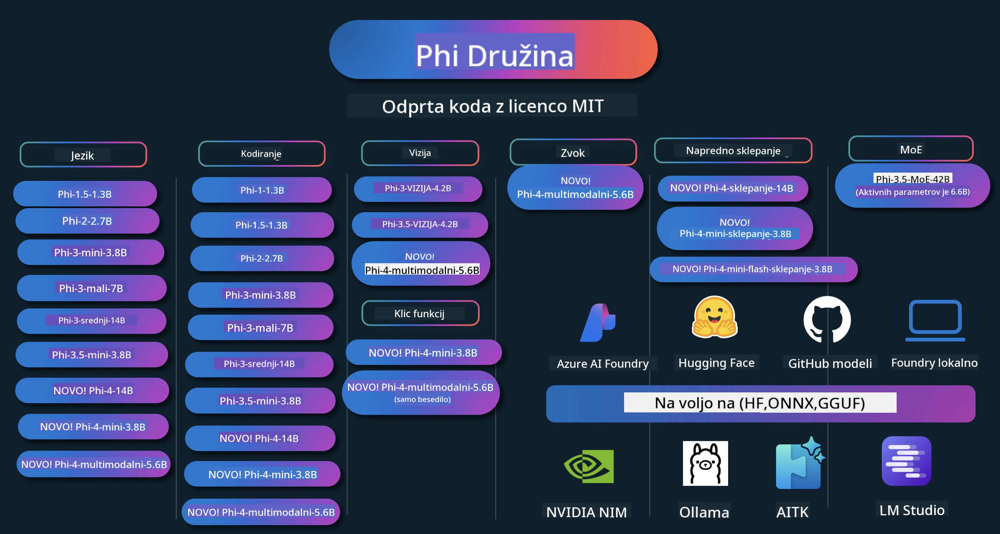

# Phi Kuharica: Praktični Primeri z Microsoftovimi Phi Modeli

[](https://codespaces.new/microsoft/phicookbook)
[](https://vscode.dev/redirect?url=vscode://ms-vscode-remote.remote-containers/cloneInVolume?url=https://github.com/microsoft/phicookbook)

[](https://GitHub.com/microsoft/phicookbook/graphs/contributors/?WT.mc_id=aiml-137032-kinfeylo)
[](https://GitHub.com/microsoft/phicookbook/issues/?WT.mc_id=aiml-137032-kinfeylo)
[](https://GitHub.com/microsoft/phicookbook/pulls/?WT.mc_id=aiml-137032-kinfeylo)
[](http://makeapullrequest.com?WT.mc_id=aiml-137032-kinfeylo)

[](https://GitHub.com/microsoft/phicookbook/watchers/?WT.mc_id=aiml-137032-kinfeylo)
[](https://GitHub.com/microsoft/phicookbook/network/?WT.mc_id=aiml-137032-kinfeylo)
[](https://GitHub.com/microsoft/phicookbook/stargazers/?WT.mc_id=aiml-137032-kinfeylo)

[](https://discord.com/invite/ByRwuEEgH4)

Phi je serija odprtokodnih AI modelov, ki jih je razvila Microsoft.

Phi je trenutno najbolj zmogljiv in stroškovno učinkovit majhen jezikovni model (SLM), s poprej dobrimi rezultati v večjezičnem okolju, sklepanju, generiranju besedil/pogovorov, kodiranju, slikah, zvoku in drugih scenarijih.

Phi lahko namestite v oblak ali na robne naprave, prav tako pa lahko z omejeno računsko močjo enostavno gradite generativne AI aplikacije.

Sledite tem korakom za začetek uporabe teh virov:
1. **Zaženi Fork repozitorija**: Kliknite [](https://GitHub.com/microsoft/phicookbook/network/?WT.mc_id=aiml-137032-kinfeylo)
2. **Klonirajte Repozitorij**: `git clone https://github.com/microsoft/PhiCookBook.git`
3. [**Pridružite se Microsoft AI Discord skupnosti in spoznajte strokovnjake ter razvijalce**](https://discord.com/invite/ByRwuEEgH4?WT.mc_id=aiml-137032-kinfeylo)



### 🌐 Večjezična Podpora

#### Podprto prek GitHub Akcije (Samodejno in Vedno Posodobljeno)

<!-- CO-OP TRANSLATOR LANGUAGES TABLE START -->
[Arabščina](../ar/README.md) | [Bengalščina](../bn/README.md) | [Bolgarščina](../bg/README.md) | [Burmanski (Mjanmar)](../my/README.md) | [Kitajščina (poenostavljena)](../zh-CN/README.md) | [Kitajščina (tradicionalna, Hongkong)](../zh-HK/README.md) | [Kitajščina (tradicionalna, Macao)](../zh-MO/README.md) | [Kitajščina (tradicionalna, Tajvan)](../zh-TW/README.md) | [Hrvaščina](../hr/README.md) | [Češčina](../cs/README.md) | [Danščina](../da/README.md) | [Nizozemščina](../nl/README.md) | [Estonščina](../et/README.md) | [Finščina](../fi/README.md) | [Francoščina](../fr/README.md) | [Nemščina](../de/README.md) | [Grščina](../el/README.md) | [Hebrejščina](../he/README.md) | [Hindijščina](../hi/README.md) | [Madžarščina](../hu/README.md) | [Indonezijska](../id/README.md) | [Italijanščina](../it/README.md) | [Japonščina](../ja/README.md) | [Kannada](../kn/README.md) | [Korejščina](../ko/README.md) | [Litovščina](../lt/README.md) | [Malajščina](../ms/README.md) | [Malajalščina](../ml/README.md) | [Maratščina](../mr/README.md) | [Nepalščina](../ne/README.md) | [Nigerijski Pidgin](../pcm/README.md) | [Norveščina](../no/README.md) | [Perzijska (Farsi)](../fa/README.md) | [Poljščina](../pl/README.md) | [Portugalščina (Brazilija)](../pt-BR/README.md) | [Portugalščina (Portugalska)](../pt-PT/README.md) | [Punjabi (Gurmukhi)](../pa/README.md) | [Romunščina](../ro/README.md) | [Ruščina](../ru/README.md) | [Srbščina (cirilica)](../sr/README.md) | [Slovaščina](../sk/README.md) | [Slovenščina](./README.md) | [Španščina](../es/README.md) | [Svasilščina](../sw/README.md) | [Švedščina](../sv/README.md) | [Tagaloščina (Filipinska)](../tl/README.md) | [Tamilščina](../ta/README.md) | [Telugu](../te/README.md) | [Tajščina](../th/README.md) | [Turščina](../tr/README.md) | [Ukrajinščina](../uk/README.md) | [Urdu](../ur/README.md) | [Vietnamščina](../vi/README.md)

> **Raje lokalno klonirate?**

> Ta repozitorij vključuje več kot 50 prevodov jezikov, kar znatno poveča velikost prenosa. Za kloniranje brez prevodov uporabite sparse checkout:
> ```bash
> git clone --filter=blob:none --sparse https://github.com/microsoft/PhiCookBook.git
> cd PhiCookBook
> git sparse-checkout set --no-cone '/*' '!translations' '!translated_images'
> ```
> S tem dobite vse, kar potrebujete za dokončanje tečaja z bistveno hitrejšim prenosom.
<!-- CO-OP TRANSLATOR LANGUAGES TABLE END -->

## Kazalo

- Uvod
  - [Dobrodošli v Phi družino](./md/01.Introduction/01/01.PhiFamily.md)
  - [Nastavitev vašega okolja](./md/01.Introduction/01/01.EnvironmentSetup.md)
  - [Razumevanje ključnih tehnologij](./md/01.Introduction/01/01.Understandingtech.md)
  - [Varnost AI za Phi modele](./md/01.Introduction/01/01.AISafety.md)
  - [Podpora za Phi strojno opremo](./md/01.Introduction/01/01.Hardwaresupport.md)
  - [Phi modeli in razpoložljivost na različnih platformah](./md/01.Introduction/01/01.Edgeandcloud.md)
  - [Uporaba Guidance-ai in Phi](./md/01.Introduction/01/01.Guidance.md)
  - [Modeli na GitHub Marketplace](https://github.com/marketplace/models)
  - [Katalog Azure AI modelov](https://ai.azure.com)

- Inferenca Phi v različnih okoljih
    -  [Hugging face](./md/01.Introduction/02/01.HF.md)
    -  [GitHub modeli](./md/01.Introduction/02/02.GitHubModel.md)
    -  [Azure AI Foundry katalog modelov](./md/01.Introduction/02/03.AzureAIFoundry.md)
    -  [Ollama](./md/01.Introduction/02/04.Ollama.md)
    -  [AI Toolkit VSCode (AITK)](./md/01.Introduction/02/05.AITK.md)
    -  [NVIDIA NIM](./md/01.Introduction/02/06.NVIDIA.md)
    -  [Foundry lokalno](./md/01.Introduction/02/07.FoundryLocal.md)

- Inferenca Phi družine
    - [Inferenca Phi na iOS](./md/01.Introduction/03/iOS_Inference.md)
    - [Inferenca Phi na Android](./md/01.Introduction/03/Android_Inference.md)
    - [Inferenca Phi na Jetson](./md/01.Introduction/03/Jetson_Inference.md)
    - [Inferenca Phi na AI PC](./md/01.Introduction/03/AIPC_Inference.md)
    - [Inferenca Phi z Apple MLX ogrodjem](./md/01.Introduction/03/MLX_Inference.md)
    - [Inferenca Phi na lokalnem strežniku](./md/01.Introduction/03/Local_Server_Inference.md)
    - [Inferenca Phi na oddaljenem strežniku z uporabo AI Toolkit](./md/01.Introduction/03/Remote_Interence.md)
    - [Inferenca Phi z Rust](./md/01.Introduction/03/Rust_Inference.md)
    - [Inferenca Phi--Vision lokalno](./md/01.Introduction/03/Vision_Inference.md)
    - [Inferenca Phi z Kaito AKS, Azure Containers (uradna podpora)](./md/01.Introduction/03/Kaito_Inference.md)
-  [Kvantifikacija Phi družine](./md/01.Introduction/04/QuantifyingPhi.md)
    - [Kvantifikacija Phi-3.5 / 4 z uporabo llama.cpp](./md/01.Introduction/04/UsingLlamacppQuantifyingPhi.md)
    - [Kvantifikacija Phi-3.5 / 4 z uporabo Generative AI razširitev za onnxruntime](./md/01.Introduction/04/UsingORTGenAIQuantifyingPhi.md)
    - [Kvantifikacija Phi-3.5 / 4 z uporabo Intel OpenVINO](./md/01.Introduction/04/UsingIntelOpenVINOQuantifyingPhi.md)
    - [Kvantifikacija Phi-3.5 / 4 z uporabo Apple MLX ogrodja](./md/01.Introduction/04/UsingAppleMLXQuantifyingPhi.md)

-  Evalvacija Phi
    - [Odgovorna AI](./md/01.Introduction/05/ResponsibleAI.md)
    - [Azure AI Foundry za evalvacijo](./md/01.Introduction/05/AIFoundry.md)
    - [Uporaba Promptflow za evalvacijo](./md/01.Introduction/05/Promptflow.md)
 
- RAG z Azure AI Search
    - [Kako uporabljati Phi-4-mini in Phi-4-multimodal (RAG) z Azure AI Search](https://github.com/microsoft/PhiCookBook/blob/main/code/06.E2E/E2E_Phi-4-RAG-Azure-AI-Search.ipynb)

- Vzorci razvoja Phi aplikacij
  - Besedilne in klepetalne aplikacije
    - Phi-4 vzorci 🆕
      - [📓] [Klepetajte z Phi-4-mini ONNX Modelom](./md/02.Application/01.TextAndChat/Phi4/ChatWithPhi4ONNX/README.md)
      - [Klepet z lokalnim Phi-4 ONNX modelom .NET](../../md/04.HOL/dotnet/src/LabsPhi4-Chat-01OnnxRuntime)
      - [Klepet .NET konzolna aplikacija s Phi-4 ONNX in Sementic Kernel](../../md/04.HOL/dotnet/src/LabsPhi4-Chat-02SK)
    - Phi-3 / 3.5 Vzorci
      - [Lokalni klepetalnik v brskalniku z uporabo Phi3, ONNX Runtime Web in WebGPU](https://github.com/microsoft/onnxruntime-inference-examples/tree/main/js/chat)
      - [OpenVino Chat](./md/02.Application/01.TextAndChat/Phi3/E2E_OpenVino_Chat.md)
      - [Večmodelni - Interaktivni Phi-3-mini in OpenAI Whisper](./md/02.Application/01.TextAndChat/Phi3/E2E_Phi-3-mini_with_whisper.md)
      - [MLFlow - Izdelava ovojnice in uporaba Phi-3 z MLFlow](./md//02.Application/01.TextAndChat/Phi3/E2E_Phi-3-MLflow.md)
      - [Optimizacija modela - Kako optimizirati model Phi-3-min za ONNX Runtime Web z Olive](https://github.com/microsoft/Olive/tree/main/examples/phi3)
      - [WinUI3 aplikacija s Phi-3 mini-4k-instruct-onnx](https://github.com/microsoft/Phi3-Chat-WinUI3-Sample/)
      -[Vzorec WinUI3 aplikacije z več modeli, podprte s AI](https://github.com/microsoft/ai-powered-notes-winui3-sample)
      - [Natančno prilagajanje in integracija prilagojenih modelov Phi-3 s Prompt flow](./md/02.Application/01.TextAndChat/Phi3/E2E_Phi-3-FineTuning_PromptFlow_Integration.md)
      - [Natančno prilagajanje in integracija prilagojenih modelov Phi-3 s Prompt flow v Azure AI Foundry](./md/02.Application/01.TextAndChat/Phi3/E2E_Phi-3-FineTuning_PromptFlow_Integration_AIFoundry.md)
      - [Ocenjevanje natančno prilagojenega modela Phi-3 / Phi-3.5 v Azure AI Foundry s poudarkom na Microsoftovih načelih odgovorne AI](./md/02.Application/01.TextAndChat/Phi3/E2E_Phi-3-Evaluation_AIFoundry.md)
      - [📓] [Vzorec jezikovne napovedi Phi-3.5-mini-instruct (kitajski/angleški)](./md/02.Application/01.TextAndChat/Phi3/phi3-instruct-demo.ipynb)
      - [Phi-3.5-Instruct WebGPU RAG klepetalnik](./md/02.Application/01.TextAndChat/Phi3/WebGPUWithPhi35Readme.md)
      - [Uporaba Windows GPU za ustvarjanje rešitve Prompt flow s Phi-3.5-Instruct ONNX](./md/02.Application/01.TextAndChat/Phi3/UsingPromptFlowWithONNX.md)
      - [Uporaba Microsoft Phi-3.5 tflite za ustvarjanje Android aplikacije](./md/02.Application/01.TextAndChat/Phi3/UsingPhi35TFLiteCreateAndroidApp.md)
      - [Vprašanja in odgovori .NET primer z uporabo lokalnega ONNX modela Phi-3 prek Microsoft.ML.OnnxRuntime](../../md/04.HOL/dotnet/src/LabsPhi301)
      - [Konzolna klepetalna .NET aplikacija s Semantic Kernel in Phi-3](../../md/04.HOL/dotnet/src/LabsPhi302)

  - Azure AI Inference SDK primeri z izvorno kodo 
    - Phi-4 Primeri 🆕
      - [📓] [Generiranje izvorne kode projekta z uporabo Phi-4-multimodal](./md/02.Application/02.Code/Phi4/GenProjectCode/README.md)
    - Phi-3 / 3.5 Primeri
      - [Izdelajte svoj Visual Studio Code GitHub Copilot Chat z Microsoft Phi-3 družino](./md/02.Application/02.Code/Phi3/VSCodeExt/README.md)
      - [Ustvarite svoj Visual Studio Code Chat Copilot agent s Phi-3.5 s GitHub modeli](/md/02.Application/02.Code/Phi3/CreateVSCodeChatAgentWithGitHubModels.md)

  - Napredni primeri sklepanja
    - Phi-4 Primeri 🆕
      - [📓] [Primeri Phi-4-mini-sklapanja ali Phi-4-sklapanja](./md/02.Application/03.AdvancedReasoning/Phi4/AdvancedResoningPhi4mini/README.md)
      - [📓] [Natančno prilagajanje Phi-4-mini-sklapanja z Microsoft Olive](./md/02.Application/03.AdvancedReasoning/Phi4/AdvancedResoningPhi4mini/olive_ft_phi_4_reasoning_with_medicaldata.ipynb)
      - [📓] [Natančno prilagajanje Phi-4-mini-sklapanja z Apple MLX](./md/02.Application/03.AdvancedReasoning/Phi4/AdvancedResoningPhi4mini/mlx_ft_phi_4_reasoning_with_medicaldata.ipynb)
      - [📓] [Phi-4-mini-sklapanje z GitHub modeli](./md/02.Application/02.Code/Phi4r/github_models_inference.ipynb)
      - [📓] [Phi-4-mini-sklapanje z Azure AI Foundry modeli](./md/02.Application/02.Code/Phi4r/azure_models_inference.ipynb)
  - Demo
      - [Phi-4-mini demo prikazan na Hugging Face Spaces](https://huggingface.co/spaces/microsoft/phi-4-mini?WT.mc_id=aiml-137032-kinfeylo)
      - [Phi-4-multimodal demo prikazan na Hugginge Face Spaces](https://huggingface.co/spaces/microsoft/phi-4-multimodal?WT.mc_id=aiml-137032-kinfeylo)
  - Vzorci za vizijo
    - Phi-4 Primeri 🆕
      - [📓] [Uporabite Phi-4-multimodal za branje slik in generiranje kode](./md/02.Application/04.Vision/Phi4/CreateFrontend/README.md) 
    - Phi-3 / 3.5 Primeri
      -  [📓][Phi-3-vision-Slika besedilo v besedilo](./md/02.Application/04.Vision/Phi3/E2E_Phi-3-vision-image-text-to-text-online-endpoint.ipynb)
      - [Phi-3-vision-ONNX](https://onnxruntime.ai/docs/genai/tutorials/phi3-v.html)
      - [📓][Phi-3-vision CLIP vdelava](./md/02.Application/04.Vision/Phi3/E2E_Phi-3-vision-image-text-to-text-online-endpoint.ipynb)
      - [DEMO: Phi-3 recikliranje](https://github.com/jennifermarsman/PhiRecycling/)
      - [Phi-3-vision - Vizualni jezikovni pomočnik - s Phi3-Vision in OpenVINO](https://docs.openvino.ai/nightly/notebooks/phi-3-vision-with-output.html)
      - [Phi-3 Vision Nvidia NIM](./md/02.Application/04.Vision/Phi3/E2E_Nvidia_NIM_Vision.md)
      - [Phi-3 Vision OpenVino](./md/02.Application/04.Vision/Phi3/E2E_OpenVino_Phi3Vision.md)
      - [📓][Phi-3.5 Vision večslični ali večslični vzorec](./md/02.Application/04.Vision/Phi3/phi3-vision-demo.ipynb)
      - [Phi-3 Vision Lokalni ONNX model z uporabo Microsoft.ML.OnnxRuntime .NET](../../md/04.HOL/dotnet/src/LabsPhi303)
      - [Meni na osnovi Phi-3 Vision Lokalni ONNX model z uporabo Microsoft.ML.OnnxRuntime .NET](../../md/04.HOL/dotnet/src/LabsPhi304)

  - Matematični primeri
    -  Phi-4-Mini-Flash-Reasoning-Instruct Primeri 🆕 [Matematični demo s Phi-4-Mini-Flash-Reasoning-Instruct](./md/02.Application/09.Math/MathDemo.ipynb)

  - Zvočni primeri
    - Phi-4 Primeri 🆕
      - [📓] [Izvlečenje zvočnih prepisk z uporabo Phi-4-multimodal](./md/02.Application/05.Audio/Phi4/Transciption/README.md)
      - [📓] [Zvočni vzorec Phi-4-multimodal](./md/02.Application/05.Audio/Phi4/Siri/demo.ipynb)
      - [📓] [Vzorčni prevod govora Phi-4-multimodal](./md/02.Application/05.Audio/Phi4/Translate/demo.ipynb)
      - [Konzolna .NET aplikacija, ki uporablja Phi-4-multimodal Audio za analizo zvočne datoteke in generiranje prepisa](../../md/04.HOL/dotnet/src/LabsPhi4-MultiModal-02Audio)

  - MOE Primeri
    - Phi-3 / 3.5 Primeri
      - [📓] [Phi-3.5 Mešanica ekspertnih modelov (MoEs) vzorec družbenih medijev](./md/02.Application/06.MoE/Phi3/phi3_moe_demo.ipynb)
      - [📓] [Izgradnja Retrieval-Augmented Generation (RAG) cevovoda z NVIDIA NIM Phi-3 MOE, Azure AI Search in LlamaIndex](./md/02.Application/06.MoE/Phi3/azure-ai-search-nvidia-rag.ipynb)
      - 
  - Primeri klicanja funkcij
    - Phi-4 Primeri 🆕
      -  [📓] [Uporaba klicanja funkcij s Phi-4-mini](./md/02.Application/07.FunctionCalling/Phi4/FunctionCallingBasic/README.md)
      -  [📓] [Uporaba klicanja funkcij za ustvarjanje več agentov s Phi-4-mini](./md/02.Application/07.FunctionCalling/Phi4/Multiagents/Phi_4_mini_multiagent.ipynb)
      -  [📓] [Uporaba klicanja funkcij z Ollama](./md/02.Application/07.FunctionCalling/Phi4/Ollama/ollama_functioncalling.ipynb)
      -  [📓] [Uporaba klicanja funkcij z ONNX](./md/02.Application/07.FunctionCalling/Phi4/ONNX/onnx_parallel_functioncalling.ipynb)
  - Primeri mešanja multimodalnosti
    - Phi-4 Primeri 🆕
      -  [📓] [Uporaba Phi-4-multimodal kot tehnološkega novinarja](./md/02.Application/08.Multimodel/Phi4/TechJournalist/phi_4_mm_audio_text_publish_news.ipynb)
      - [Konzolna .NET aplikacija, ki uporablja Phi-4-multimodal za analizo slik](../../md/04.HOL/dotnet/src/LabsPhi4-MultiModal-01Images)

- Natančno prilagajanje Phi primerov
  - [Scenariji natančnega prilagajanja](./md/03.FineTuning/FineTuning_Scenarios.md)
  - [Natančno prilagajanje proti RAG](./md/03.FineTuning/FineTuning_vs_RAG.md)
  - [Natančno prilagajanje: naj Phi-3 postane industrijski strokovnjak](./md/03.FineTuning/LetPhi3gotoIndustriy.md)
  - [Natančno prilagajanje Phi-3 z AI orodjem za VS Code](./md/03.FineTuning/Finetuning_VSCodeaitoolkit.md)
  - [Natančno prilagajanje Phi-3 z Azure Machine Learning Service](./md/03.FineTuning/Introduce_AzureML.md)
  - [Natančno prilagajanje Phi-3 z Lora](./md/03.FineTuning/FineTuning_Lora.md)
  - [Natančno prilagajanje Phi-3 z QLora](./md/03.FineTuning/FineTuning_Qlora.md)
  - [Natančno prilagajanje Phi-3 z Azure AI Foundry](./md/03.FineTuning/FineTuning_AIFoundry.md)
  - [Natančno prilagajanje Phi-3 z Azure ML CLI/SDK](./md/03.FineTuning/FineTuning_MLSDK.md)
  - [Natančno prilagajanje z Microsoft Olive](./md/03.FineTuning/FineTuning_MicrosoftOlive.md)
  - [Praktična delavnica za natančno prilagajanje z Microsoft Olive](./md/03.FineTuning/olive-lab/readme.md)
  - [Natančno prilagajanje Phi-3-vision z Weights and Bias](./md/03.FineTuning/FineTuning_Phi-3-visionWandB.md)
  - [Natančno prilagajanje Phi-3 z Apple MLX Framework](./md/03.FineTuning/FineTuning_MLX.md)
  - [Natančno prilagajanje Phi-3-vision (uradna podpora)](./md/03.FineTuning/FineTuning_Vision.md)
  - [Natančno prilagajanje Phi-3 z Kaito AKS, Azure Containers (uradna podpora)](./md/03.FineTuning/FineTuning_Kaito.md)
  - [Natančno prilagajanje Phi-3 in 3.5 Vision](https://github.com/2U1/Phi3-Vision-Finetune)

- Praktična delavnica
  - [Raziščite najsodobnejše modele: LLM, SLM, lokalni razvoj in več](https://github.com/microsoft/aitour-exploring-cutting-edge-models)
  - [Odklenite potencial NLP: natančno prilagajanje z Microsoft Olive](https://github.com/azure/Ignite_FineTuning_workshop)

- Akademski raziskovalni članki in publikacije
  - [Učbeniki so vse, kar potrebujete II: tehnično poročilo phi-1.5](https://arxiv.org/abs/2309.05463)
  - [Phi-3 tehnično poročilo: zmogljiv jezikovni model lokalno na vašem telefonu](https://arxiv.org/abs/2404.14219)
  - [Phi-4 tehnično poročilo](https://arxiv.org/abs/2412.08905)
  - [Phi-4-Mini tehnično poročilo: kompaktni a zmogljivi multimodalni jezikovni modeli preko mešanice LoRA](https://arxiv.org/abs/2503.01743)
  - [Optimizacija majhnih jezikovnih modelov za klic funkcij v vozilu](https://arxiv.org/abs/2501.02342)
  - [(WhyPHI) Fine-tuning PHI-3 za odgovarjanje na vprašanja z več izbirami: metodologija, rezultati in izzivi](https://arxiv.org/abs/2501.01588)
  - [Phi-4-reasoning tehnično poročilo](https://www.microsoft.com/en-us/research/wp-content/uploads/2025/04/phi_4_reasoning.pdf)
  - [Phi-4-mini-reasoning tehnično poročilo](https://huggingface.co/microsoft/Phi-4-mini-reasoning/blob/main/Phi-4-Mini-Reasoning.pdf)

## Uporaba modelov Phi

### Phi na Azure AI Foundry

Lahko se naučite, kako uporabljati Microsoft Phi in kako graditi E2E rešitve na različnih strojnih napravah. Če želite Phi preizkusiti sami, začnite z igranjem z modeli in prilagajanjem Phi za vaše scenarije z uporabo [Azure AI Foundry Azure AI Model Catalog](https://aka.ms/phi3-azure-ai). Več si lahko preberete v Uvod v [Azure AI Foundry](/md/02.QuickStart/AzureAIFoundry_QuickStart.md)

**Igralnica**
Vsak model ima svojo igralnico za testiranje modela [Azure AI Playground](https://aka.ms/try-phi3).

### Phi na GitHub modelih

Lahko se naučite, kako uporabljati Microsoft Phi in kako graditi E2E rešitve na različnih strojnih napravah. Če želite Phi preizkusiti sami, začnite z igranjem z modelom in prilagajanjem Phi za vaše scenarije z uporabo [GitHub Model Catalog](https://github.com/marketplace/models?WT.mc_id=aiml-137032-kinfeylo). Več si lahko preberete v Uvod v [GitHub Model Catalog](/md/02.QuickStart/GitHubModel_QuickStart.md)

**Igralnica**
Vsak model ima svojo [igralnico za testiranje modela](/md/02.QuickStart/GitHubModel_QuickStart.md).

### Phi na Hugging Face

Model lahko najdete tudi na [Hugging Face](https://huggingface.co/microsoft)

**Igralnica**
 [Hugging Chat igralnica](https://huggingface.co/chat/models/microsoft/Phi-3-mini-4k-instruct)

 ## 🎒 Drugi tečaji

Naša ekipa izdeluje tudi druge tečaje! Oglejte si:

<!-- CO-OP TRANSLATOR OTHER COURSES START -->
### LangChain
[](https://aka.ms/langchain4j-for-beginners)
[](https://aka.ms/langchainjs-for-beginners?WT.mc_id=m365-94501-dwahlin)
[](https://github.com/microsoft/langchain-for-beginners?WT.mc_id=m365-94501-dwahlin)
---

### Azure / Edge / MCP / Agent
[](https://github.com/microsoft/AZD-for-beginners?WT.mc_id=academic-105485-koreyst)
[](https://github.com/microsoft/edgeai-for-beginners?WT.mc_id=academic-105485-koreyst)
[](https://github.com/microsoft/mcp-for-beginners?WT.mc_id=academic-105485-koreyst)
[](https://github.com/microsoft/ai-agents-for-beginners?WT.mc_id=academic-105485-koreyst)

---
 
### Serija Generativna AI
[](https://github.com/microsoft/generative-ai-for-beginners?WT.mc_id=academic-105485-koreyst)
[-9333EA?style=for-the-badge&labelColor=E5E7EB&color=9333EA)](https://github.com/microsoft/Generative-AI-for-beginners-dotnet?WT.mc_id=academic-105485-koreyst)
[-C084FC?style=for-the-badge&labelColor=E5E7EB&color=C084FC)](https://github.com/microsoft/generative-ai-for-beginners-java?WT.mc_id=academic-105485-koreyst)
[-E879F9?style=for-the-badge&labelColor=E5E7EB&color=E879F9)](https://github.com/microsoft/generative-ai-with-javascript?WT.mc_id=academic-105485-koreyst)

---
 
### Osnovno učenje
[](https://aka.ms/ml-beginners?WT.mc_id=academic-105485-koreyst)
[](https://aka.ms/datascience-beginners?WT.mc_id=academic-105485-koreyst)
[](https://aka.ms/ai-beginners?WT.mc_id=academic-105485-koreyst)
[](https://github.com/microsoft/Security-101?WT.mc_id=academic-96948-sayoung)
[](https://aka.ms/webdev-beginners?WT.mc_id=academic-105485-koreyst)
[](https://aka.ms/iot-beginners?WT.mc_id=academic-105485-koreyst)
[](https://github.com/microsoft/xr-development-for-beginners?WT.mc_id=academic-105485-koreyst)

---
 
### Serija Copilot
[](https://aka.ms/GitHubCopilotAI?WT.mc_id=academic-105485-koreyst)
[](https://github.com/microsoft/mastering-github-copilot-for-dotnet-csharp-developers?WT.mc_id=academic-105485-koreyst)
[](https://github.com/microsoft/CopilotAdventures?WT.mc_id=academic-105485-koreyst)
<!-- CO-OP TRANSLATOR OTHER COURSES END -->

## Odgovorna umetna inteligenca

Microsoft je zavezan, da pomaga svojim strankam uporabljati naše AI izdelke odgovorno, deliti naše izkušnje in graditi partnerstva, ki temeljijo na zaupanju, prek orodij, kot so Opombe o preglednosti in Ocene vpliva. Mnogo teh virov lahko najdete na [https://aka.ms/RAI](https://aka.ms/RAI).
Microsoftov pristop k odgovorni umetni inteligenci temelji na naših AI načelih pravičnosti, zanesljivosti in varnosti, zasebnosti in varnosti, vključujočnosti, preglednosti in odgovornosti.

Veliki modeli za naravni jezik, slike in govor – kot so tisti, uporabljeni v tem vzorcu – se lahko obnašajo na načine, ki so nepravični, nezanesljivi ali žaljivi, kar lahko povzroči škodo. Prosimo, preberite [Opombo o preglednosti storitve Azure OpenAI](https://learn.microsoft.com/legal/cognitive-services/openai/transparency-note?tabs=text), da se seznanite z tveganji in omejitvami.

Priporočeni pristop za zmanjševanje teh tveganj je vključitev varnostnega sistema v vašo arhitekturo, ki lahko zazna in prepreči škodljivo vedenje. [Azure AI Content Safety](https://learn.microsoft.com/azure/ai-services/content-safety/overview) zagotavlja neodvisno zaščitno plast, ki lahko zazna škodljivo vsebino, ustvarjeno s strani uporabnikov ali AI, v aplikacijah in storitvah. Azure AI Content Safety vključuje API-je za besedilo in slike, ki omogočajo zaznavanje škodljivega gradiva. Znotraj Azure AI Foundry storitev Content Safety omogoča ogled, raziskovanje in preizkušanje vzorčne kode za zaznavanje škodljive vsebine v različnih modalitetah. Naslednja [dokumentacija za hiter začetek](https://learn.microsoft.com/azure/ai-services/content-safety/quickstart-text?tabs=visual-studio%2Clinux&pivots=programming-language-rest) vas vodi pri poizvedbah na storitev.
Še en vidik, ki ga je treba upoštevati, je splošna zmogljivost aplikacije. Pri večmodalnih in večmodelnih aplikacijah zmogljivost razumemo kot to, da sistem deluje tako, kot vi in vaši uporabniki pričakujete, vključno s tem, da ne generira škodljivih izhodov. Pomembno je oceniti zmogljivost vaše celotne aplikacije s pomočjo [ocenjevalcev zmogljivosti, kakovosti, tveganja in varnosti](https://learn.microsoft.com/azure/ai-studio/concepts/evaluation-metrics-built-in). Na voljo imate tudi možnost ustvarjanja in ocenjevanja s [lastnimi ocenjevalci](https://learn.microsoft.com/azure/ai-studio/how-to/develop/evaluate-sdk#custom-evaluators).

Vašo AI aplikacijo lahko ocenjujete v vašem razvojnem okolju z uporabo [Azure AI Evaluation SDK](https://microsoft.github.io/promptflow/index.html). Glede na testni podatkovni nabor ali cilj so generacije vaše generativne AI aplikacije kvantitativno merjene z vgrajenimi ocenjevalci ali ocenjevalci po vaši izbiri. Za začetek z azure ai evaluation sdk za ocenjevanje vašega sistema lahko sledite [vodniku za hitro začetek](https://learn.microsoft.com/azure/ai-studio/how-to/develop/flow-evaluate-sdk). Ko izvedete ocenjevalno izvedbo, lahko [vizualizirate rezultate v Azure AI Foundry](https://learn.microsoft.com/azure/ai-studio/how-to/evaluate-flow-results). 

## Trgovske znamke

Ta projekt lahko vsebuje trgovske znamke ali logotipe za projekte, izdelke ali storitve. Pooblaščena uporaba Microsoftovih trgovskih znamk ali logotipov je odvisna od in mora slediti [Microsoftovim smernicam za trgovske znamke in blagovne znamke](https://www.microsoft.com/legal/intellectualproperty/trademarks/usage/general).
Uporaba Microsoftovih trgovskih znamk ali logotipov v spremenjenih različicah tega projekta ne sme povzročati zmede ali nakazovati sponzorstva Microsofta. Vsakršna uporaba trgovskih znamk ali logotipov tretjih oseb je predmet politik teh tretjih oseb.

## Pridobitev pomoči

Če se zataknete ali imate vprašanja o gradnji AI aplikacij, se pridružite:

[](https://aka.ms/foundry/discord)

Če imate povratne informacije o izdelku ali napake med gradnjo, obiščite:

[](https://aka.ms/foundry/forum)

---

<!-- CO-OP TRANSLATOR DISCLAIMER START -->
**Izjava o omejitvi odgovornosti**:  
Ta dokument je bil preveden z uporabo storitve za strojno prevajanje [Co-op Translator](https://github.com/Azure/co-op-translator). Čeprav si prizadevamo za natančnost, upoštevajte, da lahko avtomatski prevodi vsebujejo napake ali netočnosti. Izvirni dokument v izvirnem jeziku velja za avtoritativni vir. Za ključne informacije priporočamo strokovni prevod, opravljen s strani človeka. Ne odgovarjamo za morebitna nerazumevanja ali napačne interpretacije, ki izhajajo iz uporabe tega prevoda.
<!-- CO-OP TRANSLATOR DISCLAIMER END -->