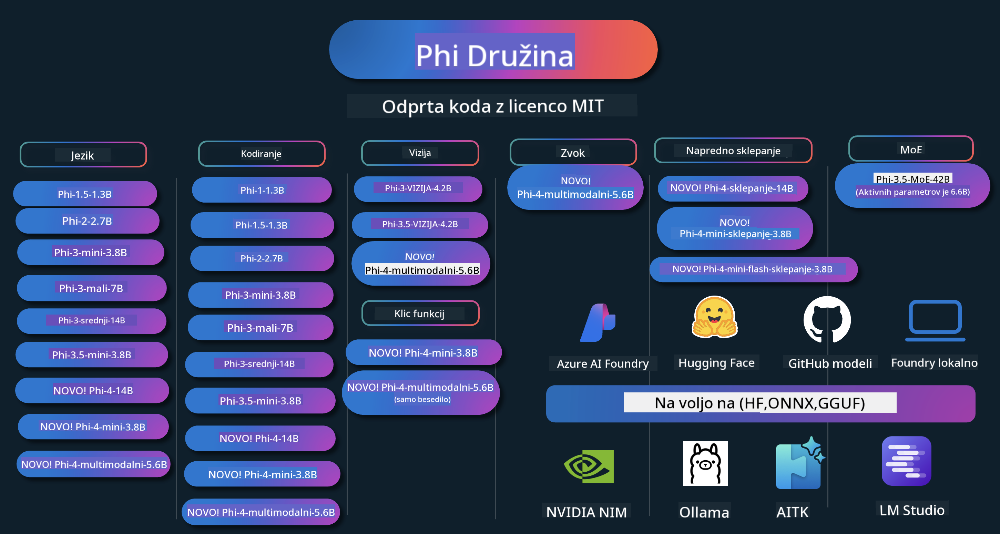

<!--
CO_OP_TRANSLATOR_METADATA:
{
  "original_hash": "5c07bb4c3c89a36c9be332a065a9a33c",
  "translation_date": "2025-07-16T15:34:24+00:00",
  "source_file": "README.md",
  "language_code": "sl"
}
-->
# Phi Kuharska knjiga: Praktični primeri z Microsoftovimi Phi modeli

  

  
  
  

  
  

Phi je serija odprtokodnih AI modelov, ki jih je razvil Microsoft.

Phi je trenutno najzmogljivejši in stroškovno najučinkovitejši majhen jezikovni model (SLM), z odličnimi rezultati na večjezičnih, razumsko zahtevnih, tekstovnih/klepetalnih, kodirnih, slikovnih, zvočnih in drugih področjih.

Phi lahko namestite v oblak ali na robne naprave, prav tako pa lahko z omejeno računsko močjo enostavno ustvarjate generativne AI aplikacije.

Sledite tem korakom, da začnete uporabljati te vire:  
1. **Razvezi repozitorij**: Kliknite   
2. **Kloniraj repozitorij**: `git clone https://github.com/microsoft/PhiCookBook.git`  
3. [**Pridruži se Microsoft AI Discord skupnosti in spoznaj strokovnjake ter razvijalce**](https://discord.com/invite/ByRwuEEgH4?WT.mc_id=aiml-137032-kinfeylo)

### 🌐 Večjezična podpora

#### Podprto preko GitHub Action (avtomatizirano in vedno posodobljeno)

[French](../fr/README.md) | [Spanish](../es/README.md) | [German](../de/README.md) | [Russian](../ru/README.md) | [Arabic](../ar/README.md) | [Persian (Farsi)](../fa/README.md) | [Urdu](../ur/README.md) | [Chinese (Simplified)](../zh/README.md) | [Chinese (Traditional, Macau)](../mo/README.md) | [Chinese (Traditional, Hong Kong)](../hk/README.md) | [Chinese (Traditional, Taiwan)](../tw/README.md) | [Japanese](../ja/README.md) | [Korean](../ko/README.md) | [Hindi](../hi/README.md)  
[Bengali](../bn/README.md) | [Marathi](../mr/README.md) | [Nepali](../ne/README.md) | [Punjabi (Gurmukhi)](../pa/README.md) | [Portuguese (Portugal)](../pt/README.md) | [Portuguese (Brazil)](../br/README.md) | [Italian](../it/README.md) | [Polish](../pl/README.md) | [Turkish](../tr/README.md) | [Greek](../el/README.md) | [Thai](../th/README.md) | [Swedish](../sv/README.md) | [Danish](../da/README.md) | [Norwegian](../no/README.md) | [Finnish](../fi/README.md) | [Dutch](../nl/README.md) | [Hebrew](../he/README.md) | [Vietnamese](../vi/README.md) | [Indonesian](../id/README.md) | [Malay](../ms/README.md) | [Tagalog (Filipino)](../tl/README.md) | [Swahili](../sw/README.md) | [Hungarian](../hu/README.md) | [Czech](../cs/README.md) | [Slovak](../sk/README.md) | [Romanian](../ro/README.md) | [Bulgarian](../bg/README.md) | [Serbian (Cyrillic)](../sr/README.md) | [Croatian](../hr/README.md) | [Slovenian](./README.md)

## Kazalo vsebine

- Uvod  
  - [Dobrodošli v Phi družino](./md/01.Introduction/01/01.PhiFamily.md)  
  - [Nastavitev okolja](./md/01.Introduction/01/01.EnvironmentSetup.md)  
  - [Razumevanje ključnih tehnologij](./md/01.Introduction/01/01.Understandingtech.md)  
  - [Varnost AI za Phi modele](./md/01.Introduction/01/01.AISafety.md)  
  - [Podpora strojne opreme Phi](./md/01.Introduction/01/01.Hardwaresupport.md)  
  - [Phi modeli in razpoložljivost na različnih platformah](./md/01.Introduction/01/01.Edgeandcloud.md)  
  - [Uporaba Guidance-ai in Phi](./md/01.Introduction/01/01.Guidance.md)  
  - [GitHub Marketplace modeli](https://github.com/marketplace/models)  
  - [Azure AI katalog modelov](https://ai.azure.com)

- Inferenca Phi v različnih okoljih  
  - [Hugging face](./md/01.Introduction/02/01.HF.md)  
  - [GitHub modeli](./md/01.Introduction/02/02.GitHubModel.md)  
  - [Azure AI Foundry katalog modelov](./md/01.Introduction/02/03.AzureAIFoundry.md)  
  - [Ollama](./md/01.Introduction/02/04.Ollama.md)  
  - [AI Toolkit VSCode (AITK)](./md/01.Introduction/02/05.AITK.md)  
  - [NVIDIA NIM](./md/01.Introduction/02/06.NVIDIA.md)  
  - [Foundry Local](./md/01.Introduction/02/07.FoundryLocal.md)

- Inferenca Phi družine  
  - [Inferenca Phi na iOS](./md/01.Introduction/03/iOS_Inference.md)  
  - [Inferenca Phi na Android](./md/01.Introduction/03/Android_Inference.md)  
  - [Inferenca Phi na Jetson](./md/01.Introduction/03/Jetson_Inference.md)  
  - [Inferenca Phi na AI PC](./md/01.Introduction/03/AIPC_Inference.md)  
  - [Inferenca Phi z Apple MLX Framework](./md/01.Introduction/03/MLX_Inference.md)  
  - [Inferenca Phi na lokalnem strežniku](./md/01.Introduction/03/Local_Server_Inference.md)  
  - [Inferenca Phi na oddaljenem strežniku z AI Toolkit](./md/01.Introduction/03/Remote_Interence.md)  
  - [Inferenca Phi z Rust](./md/01.Introduction/03/Rust_Inference.md)  
  - [Inferenca Phi--Vision lokalno](./md/01.Introduction/03/Vision_Inference.md)  
  - [Inferenca Phi z Kaito AKS, Azure Containers (uradna podpora)](./md/01.Introduction/03/Kaito_Inference.md)  
- [Kvantifikacija Phi družine](./md/01.Introduction/04/QuantifyingPhi.md)  
  - [Kvantifikacija Phi-3.5 / 4 z llama.cpp](./md/01.Introduction/04/UsingLlamacppQuantifyingPhi.md)  
  - [Kvantifikacija Phi-3.5 / 4 z Generative AI razširitvami za onnxruntime](./md/01.Introduction/04/UsingORTGenAIQuantifyingPhi.md)  
  - [Kvantifikacija Phi-3.5 / 4 z Intel OpenVINO](./md/01.Introduction/04/UsingIntelOpenVINOQuantifyingPhi.md)  
  - [Kvantifikacija Phi-3.5 / 4 z Apple MLX Framework](./md/01.Introduction/04/UsingAppleMLXQuantifyingPhi.md)

- Evalvacija Phi  
  - [Odgovorna AI](./md/01.Introduction/05/ResponsibleAI.md)  
  - [Azure AI Foundry za evalvacijo](./md/01.Introduction/05/AIFoundry.md)  
  - [Uporaba Promptflow za evalvacijo](./md/01.Introduction/05/Promptflow.md)

- RAG z Azure AI Search  
  - [Kako uporabljati Phi-4-mini in Phi-4-multimodal (RAG) z Azure AI Search](https://github.com/microsoft/PhiCookBook/blob/main/code/06.E2E/E2E_Phi-4-RAG-Azure-AI-Search.ipynb)

- Primeri razvoja Phi aplikacij  
  - Besedilne in klepetalne aplikacije  
    - Phi-4 primeri 🆕  
      - [📓] [Klepetaj s Phi-4-mini ONNX modelom](./md/02.Application/01.TextAndChat/Phi4/ChatWithPhi4ONNX/README.md)  
      - [Klepetaj z lokalnim Phi-4 ONNX modelom v .NET](../../md/04.HOL/dotnet/src/LabsPhi4-Chat-01OnnxRuntime)  
      - [Klepetalna .NET konzolna aplikacija s Phi-4 ONNX in Semantic Kernel](../../md/04.HOL/dotnet/src/LabsPhi4-Chat-02SK)  
    - Phi-3 / 3.5 primeri  
      - [Lokalni klepetalnik v brskalniku z uporabo Phi3, ONNX Runtime Web in WebGPU](https://github.com/microsoft/onnxruntime-inference-examples/tree/main/js/chat)  
      - [OpenVino klepet](./md/02.Application/01.TextAndChat/Phi3/E2E_OpenVino_Chat.md)  
      - [Večmodelni - interaktivni Phi-3-mini in OpenAI Whisper](./md/02.Application/01.TextAndChat/Phi3/E2E_Phi-3-mini_with_whisper.md)  
      - [MLFlow - izdelava ovojnice in uporaba Phi-3 z MLFlow](./md//02.Application/01.TextAndChat/Phi3/E2E_Phi-3-MLflow.md)  
      - [Optimizacija modela - kako optimizirati Phi-3-mini model za ONNX Runtime Web z Olive](https://github.com/microsoft/Olive/tree/main/examples/phi3)  
      - [WinUI3 aplikacija s Phi-3 mini-4k-instruct-onnx](https://github.com/microsoft/Phi3-Chat-WinUI3-Sample/)  
      - [WinUI3 večmodelna AI aplikacija za zapiske](https://github.com/microsoft/ai-powered-notes-winui3-sample)
- [Prilagajanje in integracija lastnih modelov Phi-3 s Prompt flow](./md/02.Application/01.TextAndChat/Phi3/E2E_Phi-3-FineTuning_PromptFlow_Integration.md)
- [Prilagajanje in integracija lastnih modelov Phi-3 s Prompt flow v Azure AI Foundry](./md/02.Application/01.TextAndChat/Phi3/E2E_Phi-3-FineTuning_PromptFlow_Integration_AIFoundry.md)
- [Ocenjevanje prilagojenega modela Phi-3 / Phi-3.5 v Azure AI Foundry s poudarkom na Microsoftovih načelih odgovorne umetne inteligence](./md/02.Application/01.TextAndChat/Phi3/E2E_Phi-3-Evaluation_AIFoundry.md)
- [📓] [Vzorec napovedovanja jezika Phi-3.5-mini-instruct (kitajščina/angleščina)](../../md/02.Application/01.TextAndChat/Phi3/phi3-instruct-demo.ipynb)
- [Phi-3.5-Instruct WebGPU RAG klepetalni robot](./md/02.Application/01.TextAndChat/Phi3/WebGPUWithPhi35Readme.md)
- [Uporaba Windows GPU za ustvarjanje rešitve Prompt flow s Phi-3.5-Instruct ONNX](./md/02.Application/01.TextAndChat/Phi3/UsingPromptFlowWithONNX.md)
- [Uporaba Microsoft Phi-3.5 tflite za izdelavo Android aplikacije](./md/02.Application/01.TextAndChat/Phi3/UsingPhi35TFLiteCreateAndroidApp.md)
- [Primer Q&A .NET z lokalnim ONNX Phi-3 modelom z uporabo Microsoft.ML.OnnxRuntime](../../md/04.HOL/dotnet/src/LabsPhi301)
- [Konzolna .NET aplikacija za klepet s Semantic Kernel in Phi-3](../../md/04.HOL/dotnet/src/LabsPhi302)

- Azure AI Inference SDK primeri na osnovi kode
  - Phi-4 primeri 🆕
    - [📓] [Generiranje kode projekta z uporabo Phi-4-multimodal](./md/02.Application/02.Code/Phi4/GenProjectCode/README.md)
  - Phi-3 / 3.5 primeri
    - [Ustvarite svoj Visual Studio Code GitHub Copilot klepet z Microsoft Phi-3 družino](./md/02.Application/02.Code/Phi3/VSCodeExt/README.md)
    - [Ustvarite svoj Visual Studio Code Chat Copilot agent s Phi-3.5 preko GitHub modelov](/md/02.Application/02.Code/Phi3/CreateVSCodeChatAgentWithGitHubModels.md)

- Napredni primeri sklepanja
  - Phi-4 primeri 🆕
    - [📓] [Phi-4-mini-reasoning ali Phi-4-reasoning primeri](./md/02.Application/03.AdvancedReasoning/Phi4/AdvancedResoningPhi4mini/README.md)
    - [📓] [Prilagajanje Phi-4-mini-reasoning z Microsoft Olive](../../md/02.Application/03.AdvancedReasoning/Phi4/AdvancedResoningPhi4mini/olive_ft_phi_4_reasoning_with_medicaldata.ipynb)
    - [📓] [Prilagajanje Phi-4-mini-reasoning z Apple MLX](../../md/02.Application/03.AdvancedReasoning/Phi4/AdvancedResoningPhi4mini/mlx_ft_phi_4_reasoning_with_medicaldata.ipynb)
    - [📓] [Phi-4-mini-reasoning z GitHub modeli](../../md/02.Application/02.Code/Phi4r/github_models_inference.ipynb)
    - [📓] [Phi-4-mini-reasoning z Azure AI Foundry modeli](../../md/02.Application/02.Code/Phi4r/azure_models_inference.ipynb)
- Demo
    - [Phi-4-mini demoji gostovani na Hugging Face Spaces](https://huggingface.co/spaces/microsoft/phi-4-mini?WT.mc_id=aiml-137032-kinfeylo)
    - [Phi-4-multimodal demoji gostovani na Hugging Face Spaces](https://huggingface.co/spaces/microsoft/phi-4-multimodal?WT.mc_id=aiml-137032-kinfeylo)
- Vizualni primeri
  - Phi-4 primeri 🆕
    - [📓] [Uporaba Phi-4-multimodal za branje slik in generiranje kode](./md/02.Application/04.Vision/Phi4/CreateFrontend/README.md)
  - Phi-3 / 3.5 primeri
    - [📓][Phi-3-vision - pretvorba slike v besedilo](../../md/02.Application/04.Vision/Phi3/E2E_Phi-3-vision-image-text-to-text-online-endpoint.ipynb)
    - [Phi-3-vision-ONNX](https://onnxruntime.ai/docs/genai/tutorials/phi3-v.html)
    - [📓][Phi-3-vision CLIP vdelava](../../md/02.Application/04.Vision/Phi3/E2E_Phi-3-vision-image-text-to-text-online-endpoint.ipynb)
    - [DEMO: Phi-3 recikliranje](https://github.com/jennifermarsman/PhiRecycling/)
    - [Phi-3-vision - vizualni jezikovni pomočnik - s Phi3-Vision in OpenVINO](https://docs.openvino.ai/nightly/notebooks/phi-3-vision-with-output.html)
    - [Phi-3 Vision Nvidia NIM](./md/02.Application/04.Vision/Phi3/E2E_Nvidia_NIM_Vision.md)
    - [Phi-3 Vision OpenVino](./md/02.Application/04.Vision/Phi3/E2E_OpenVino_Phi3Vision.md)
    - [📓][Phi-3.5 Vision vzorec z več okvirji ali več slikami](../../md/02.Application/04.Vision/Phi3/phi3-vision-demo.ipynb)
    - [Phi-3 Vision lokalni ONNX model z uporabo Microsoft.ML.OnnxRuntime .NET](../../md/04.HOL/dotnet/src/LabsPhi303)
    - [Meni osnovan Phi-3 Vision lokalni ONNX model z uporabo Microsoft.ML.OnnxRuntime .NET](../../md/04.HOL/dotnet/src/LabsPhi304)

- Matematični primeri
  - Phi-4-Mini-Flash-Reasoning-Instruct primeri 🆕 [Matematični demo s Phi-4-Mini-Flash-Reasoning-Instruct](../../md/02.Application/09.Math/MathDemo.ipynb)

- Avdio primeri
  - Phi-4 primeri 🆕
    - [📓] [Izvleček avdio prepisov z uporabo Phi-4-multimodal](./md/02.Application/05.Audio/Phi4/Transciption/README.md)
    - [📓] [Phi-4-multimodal avdio primer](../../md/02.Application/05.Audio/Phi4/Siri/demo.ipynb)
    - [📓] [Phi-4-multimodal vzorec govornega prevajanja](../../md/02.Application/05.Audio/Phi4/Translate/demo.ipynb)
    - [.NET konzolna aplikacija, ki uporablja Phi-4-multimodal Audio za analizo avdio datoteke in generiranje prepisa](../../md/04.HOL/dotnet/src/LabsPhi4-MultiModal-02Audio)

- MOE primeri
  - Phi-3 / 3.5 primeri
    - [📓] [Phi-3.5 mešanica ekspertnih modelov (MoEs) primer na družbenih omrežjih](../../md/02.Application/06.MoE/Phi3/phi3_moe_demo.ipynb)
    - [📓] [Gradnja Retrieval-Augmented Generation (RAG) cevovoda z NVIDIA NIM Phi-3 MOE, Azure AI Search in LlamaIndex](../../md/02.Application/06.MoE/Phi3/azure-ai-search-nvidia-rag.ipynb)

- Primeri klicanja funkcij
  - Phi-4 primeri 🆕
    - [📓] [Uporaba klicanja funkcij s Phi-4-mini](./md/02.Application/07.FunctionCalling/Phi4/FunctionCallingBasic/README.md)
    - [📓] [Uporaba klicanja funkcij za ustvarjanje več agentov s Phi-4-mini](../../md/02.Application/07.FunctionCalling/Phi4/Multiagents/Phi_4_mini_multiagent.ipynb)
    - [📓] [Uporaba klicanja funkcij z Ollama](../../md/02.Application/07.FunctionCalling/Phi4/Ollama/ollama_functioncalling.ipynb)
    - [📓] [Uporaba klicanja funkcij z ONNX](../../md/02.Application/07.FunctionCalling/Phi4/ONNX/onnx_parallel_functioncalling.ipynb)

- Primeri mešanja multimodalnosti
  - Phi-4 primeri 🆕
    - [📓] [Uporaba Phi-4-multimodal kot tehnološki novinar](../../md/02.Application/08.Multimodel/Phi4/TechJournalist/phi_4_mm_audio_text_publish_news.ipynb)
    - [.NET konzolna aplikacija, ki uporablja Phi-4-multimodal za analizo slik](../../md/04.HOL/dotnet/src/LabsPhi4-MultiModal-01Images)

- Prilagajanje Phi modelov
  - [Scenariji prilagajanja](./md/03.FineTuning/FineTuning_Scenarios.md)
  - [Prilagajanje v primerjavi z RAG](./md/03.FineTuning/FineTuning_vs_RAG.md)
  - [Prilagajanje: naj Phi-3 postane industrijski strokovnjak](./md/03.FineTuning/LetPhi3gotoIndustriy.md)
  - [Prilagajanje Phi-3 z AI Toolkit za VS Code](./md/03.FineTuning/Finetuning_VSCodeaitoolkit.md)
  - [Prilagajanje Phi-3 z Azure Machine Learning Service](./md/03.FineTuning/Introduce_AzureML.md)
  - [Prilagajanje Phi-3 z Lora](./md/03.FineTuning/FineTuning_Lora.md)
  - [Prilagajanje Phi-3 z QLora](./md/03.FineTuning/FineTuning_Qlora.md)
  - [Prilagajanje Phi-3 z Azure AI Foundry](./md/03.FineTuning/FineTuning_AIFoundry.md)
  - [Prilagajanje Phi-3 z Azure ML CLI/SDK](./md/03.FineTuning/FineTuning_MLSDK.md)
  - [Prilagajanje z Microsoft Olive](./md/03.FineTuning/FineTuning_MicrosoftOlive.md)
  - [Prilagajanje z Microsoft Olive Hands-On Lab](./md/03.FineTuning/olive-lab/readme.md)
  - [Prilagajanje Phi-3-vision z Weights and Bias](./md/03.FineTuning/FineTuning_Phi-3-visionWandB.md)
  - [Prilagajanje Phi-3 z Apple MLX Framework](./md/03.FineTuning/FineTuning_MLX.md)
  - [Prilagajanje Phi-3-vision (uradna podpora)](./md/03.FineTuning/FineTuning_Vision.md)
  - [Prilagajanje Phi-3 z Kaito AKS, Azure Containers (uradna podpora)](./md/03.FineTuning/FineTuning_Kaito.md)
  - [Prilagajanje Phi-3 in 3.5 Vision](https://github.com/2U1/Phi3-Vision-Finetune)

- Hands on Lab
  - [Raziskovanje najnovejših modelov: LLM, SLM, lokalni razvoj in več](https://github.com/microsoft/aitour-exploring-cutting-edge-models)
  - [Odklepanje potenciala NLP: prilagajanje z Microsoft Olive](https://github.com/azure/Ignite_FineTuning_workshop)

- Akademske raziskovalne publikacije in članki
  - [Textbooks Are All You Need II: tehnično poročilo phi-1.5](https://arxiv.org/abs/2309.05463)
  - [Phi-3 tehnično poročilo: zelo zmogljiv jezikovni model lokalno na vašem telefonu](https://arxiv.org/abs/2404.14219)
  - [Phi-4 tehnično poročilo](https://arxiv.org/abs/2412.08905)
  - [Phi-4-Mini tehnično poročilo: kompaktni a zmogljivi multimodalni jezikovni modeli preko mešanice LoRA](https://arxiv.org/abs/2503.01743)
  - [Optimizacija majhnih jezikovnih modelov za klicanje funkcij v vozilu](https://arxiv.org/abs/2501.02342)
  - [(WhyPHI) Prilagajanje PHI-3 za odgovarjanje na vprašanja z več izbirami: metodologija, rezultati in izzivi](https://arxiv.org/abs/2501.01588)
- [Phi-4-reasoning Tehnično poročilo](https://www.microsoft.com/en-us/research/wp-content/uploads/2025/04/phi_4_reasoning.pdf)
- [Phi-4-mini-reasoning Tehnično poročilo](https://huggingface.co/microsoft/Phi-4-mini-reasoning/blob/main/Phi-4-Mini-Reasoning.pdf)

## Uporaba Phi modelov

### Phi na Azure AI Foundry

Naučite se, kako uporabljati Microsoft Phi in kako graditi E2E rešitve na različnih strojnih napravah. Da boste Phi lahko preizkusili sami, začnite z igranjem z modeli in prilagajanjem Phija za vaše scenarije z uporabo [Azure AI Foundry Azure AI Model Catalog](https://aka.ms/phi3-azure-ai). Več o tem lahko izveste v vodiču Začetek z [Azure AI Foundry](/md/02.QuickStart/AzureAIFoundry_QuickStart.md).

**Igralnica**  
Vsak model ima svojo igralnico za testiranje modela [Azure AI Playground](https://aka.ms/try-phi3).

### Phi na GitHub modelih

Naučite se, kako uporabljati Microsoft Phi in kako graditi E2E rešitve na različnih strojnih napravah. Da boste Phi lahko preizkusili sami, začnite z igranjem z modelom in prilagajanjem Phija za vaše scenarije z uporabo [GitHub Model Catalog](https://github.com/marketplace/models?WT.mc_id=aiml-137032-kinfeylo). Več o tem lahko izveste v vodiču Začetek z [GitHub Model Catalog](/md/02.QuickStart/GitHubModel_QuickStart.md).

**Igralnica**  
Vsak model ima svojo [igralnico za testiranje modela](/md/02.QuickStart/GitHubModel_QuickStart.md).

### Phi na Hugging Face

Model lahko najdete tudi na [Hugging Face](https://huggingface.co/microsoft).

**Igralnica**  
[Hugging Chat igralnica](https://huggingface.co/chat/models/microsoft/Phi-3-mini-4k-instruct)

## Odgovorna umetna inteligenca

Microsoft si prizadeva pomagati našim strankam, da uporabljajo naše AI izdelke odgovorno, deliti naše izkušnje in graditi zaupanja vredna partnerstva z orodji, kot so Transparency Notes in Impact Assessments. Veliko teh virov najdete na [https://aka.ms/RAI](https://aka.ms/RAI).  
Microsoftov pristop k odgovorni umetni inteligenci temelji na naših AI načelih pravičnosti, zanesljivosti in varnosti, zasebnosti in varstvu, vključevanju, preglednosti in odgovornosti.

Veliki modeli za naravni jezik, slike in govor – kot tisti, uporabljeni v tem vzorcu – se lahko obnašajo na načine, ki so nepravični, nezanesljivi ali žaljivi, kar lahko povzroči škodo. Za informacije o tveganjih in omejitvah si oglejte [Azure OpenAI service Transparency note](https://learn.microsoft.com/legal/cognitive-services/openai/transparency-note?tabs=text).

Priporočeni pristop za zmanjševanje teh tveganj je vključitev varnostnega sistema v vašo arhitekturo, ki lahko zazna in prepreči škodljivo vedenje. [Azure AI Content Safety](https://learn.microsoft.com/azure/ai-services/content-safety/overview) zagotavlja neodvisno zaščitno plast, ki lahko zazna škodljivo vsebino, ustvarjeno s strani uporabnikov ali AI, v aplikacijah in storitvah. Azure AI Content Safety vključuje API-je za besedilo in slike, ki omogočajo zaznavanje škodljivega gradiva. Znotraj Azure AI Foundry storitev Content Safety omogoča ogled, raziskovanje in preizkušanje vzorčne kode za zaznavanje škodljive vsebine v različnih modalitetah. Naslednja [hitri vodič](https://learn.microsoft.com/azure/ai-services/content-safety/quickstart-text?tabs=visual-studio%2Clinux&pivots=programming-language-rest) vas vodi skozi pošiljanje zahtevkov storitvi.

Pomemben vidik je tudi splošna zmogljivost aplikacije. Pri večmodalnih in večmodelnih aplikacijah zmogljivost pomeni, da sistem deluje tako, kot vi in vaši uporabniki pričakujete, vključno s tem, da ne ustvarja škodljivih izhodov. Pomembno je oceniti zmogljivost celotne aplikacije z uporabo [Performance and Quality and Risk and Safety evaluators](https://learn.microsoft.com/azure/ai-studio/concepts/evaluation-metrics-built-in). Prav tako imate možnost ustvarjanja in ocenjevanja z [lastnimi evaluatorji](https://learn.microsoft.com/azure/ai-studio/how-to/develop/evaluate-sdk#custom-evaluators).

Vašo AI aplikacijo lahko ocenite v razvojni okolju z uporabo [Azure AI Evaluation SDK](https://microsoft.github.io/promptflow/index.html). Glede na testni nabor podatkov ali cilj se generacije vaše generativne AI aplikacije kvantitativno merijo z vgrajenimi ali lastnimi evaluatorji po vaši izbiri. Za začetek z Azure AI Evaluation SDK za ocenjevanje vašega sistema lahko sledite [hitremu vodiču](https://learn.microsoft.com/azure/ai-studio/how-to/develop/flow-evaluate-sdk). Ko izvedete ocenjevalno izvajanje, lahko [vizualizirate rezultate v Azure AI Foundry](https://learn.microsoft.com/azure/ai-studio/how-to/evaluate-flow-results).

## Blagovne znamke

Ta projekt lahko vsebuje blagovne znamke ali logotipe za projekte, izdelke ali storitve. Pooblaščena uporaba Microsoftovih blagovnih znamk ali logotipov je podvržena in mora slediti [Microsoftovim smernicam za blagovne znamke in znamčenje](https://www.microsoft.com/legal/intellectualproperty/trademarks/usage/general).  
Uporaba Microsoftovih blagovnih znamk ali logotipov v spremenjenih različicah tega projekta ne sme povzročati zmede ali nakazovati sponzorstva Microsofta. Vsaka uporaba blagovnih znamk ali logotipov tretjih oseb je podvržena pravilom teh tretjih oseb.

**Omejitev odgovornosti**:  
Ta dokument je bil preveden z uporabo storitve za avtomatski prevod AI [Co-op Translator](https://github.com/Azure/co-op-translator). Čeprav si prizadevamo za natančnost, vas opozarjamo, da lahko avtomatski prevodi vsebujejo napake ali netočnosti. Izvirni dokument v njegovem izvirnem jeziku velja za avtoritativni vir. Za pomembne informacije priporočamo strokovni človeški prevod. Za morebitna nesporazume ali napačne interpretacije, ki izhajajo iz uporabe tega prevoda, ne odgovarjamo.