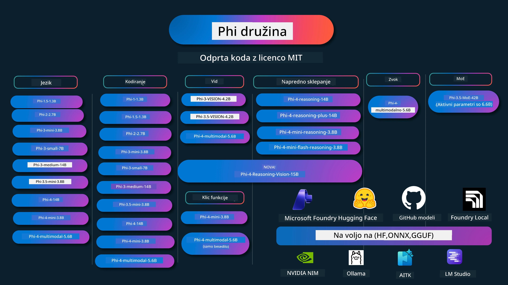

# Phi Cookbook: Praktični primeri z Microsoftovimi modeli Phi

[](https://codespaces.new/microsoft/phicookbook)
[](https://vscode.dev/redirect?url=vscode://ms-vscode-remote.remote-containers/cloneInVolume?url=https://github.com/microsoft/phicookbook)

[](https://GitHub.com/microsoft/phicookbook/graphs/contributors/?WT.mc_id=aiml-137032-kinfeylo)
[](https://GitHub.com/microsoft/phicookbook/issues/?WT.mc_id=aiml-137032-kinfeylo)
[](https://GitHub.com/microsoft/phicookbook/pulls/?WT.mc_id=aiml-137032-kinfeylo)
[](http://makeapullrequest.com?WT.mc_id=aiml-137032-kinfeylo)

[](https://GitHub.com/microsoft/phicookbook/watchers/?WT.mc_id=aiml-137032-kinfeylo)
[](https://GitHub.com/microsoft/phicookbook/network/?WT.mc_id=aiml-137032-kinfeylo)
[](https://GitHub.com/microsoft/phicookbook/stargazers/?WT.mc_id=aiml-137032-kinfeylo)

[](https://discord.com/invite/ByRwuEEgH4)

Phi je serija odprtokodnih AI modelov, ki jih je razvil Microsoft.

Phi je trenutno najbolj zmogljiv in stroškovno učinkovit majhen jezikovni model (SLM), z zelo dobrimi merili uspešnosti v več jezikih, sklepanju, generiranju besedil/pogovorov, kodiranju, slikah, zvoku in drugih scenarijih.

Phi lahko namestite v oblak ali na robne naprave in z omejeno računsko močjo enostavno ustvarite generativne AI aplikacije.

Sledite tem korakom za začetek uporabe teh virov:
1. **Razvejite repozitorij:** Kliknite [](https://GitHub.com/microsoft/phicookbook/network/?WT.mc_id=aiml-137032-kinfeylo)
2. **Klonirajte repozitorij:** `git clone https://github.com/microsoft/PhiCookBook.git`
3. [**Pridružite se Microsoft AI Discord skupnosti in spoznajte strokovnjake ter so-razvijalce**](https://discord.com/invite/ByRwuEEgH4?WT.mc_id=aiml-137032-kinfeylo)



### 🌐 Podpora več jezikom

#### Podprto preko GitHub Action (avtomatizirano in vedno posodobljeno)

<!-- CO-OP TRANSLATOR LANGUAGES TABLE START -->
[Arabski](../ar/README.md) | [Bengalski](../bn/README.md) | [Bolgarščina](../bg/README.md) | [Burmanski (Myanmar)](../my/README.md) | [Kitajski (poenostavljeni)](../zh-CN/README.md) | [Kitajski (tradicionalni, Hong Kong)](../zh-HK/README.md) | [Kitajski (tradicionalni, Macao)](../zh-MO/README.md) | [Kitajski (tradicionalni, Tajvan)](../zh-TW/README.md) | [Hrvaški](../hr/README.md) | [Češki](../cs/README.md) | [Danski](../da/README.md) | [Nizozemski](../nl/README.md) | [Estonski](../et/README.md) | [Finski](../fi/README.md) | [Francoski](../fr/README.md) | [Nemški](../de/README.md) | [Grški](../el/README.md) | [Hebrejski](../he/README.md) | [Hindski](../hi/README.md) | [Madžarski](../hu/README.md) | [Indonezijski](../id/README.md) | [Italijanski](../it/README.md) | [Japonski](../ja/README.md) | [Kannada](../kn/README.md) | [Khmer](../km/README.md) | [Korejski](../ko/README.md) | [Litovski](../lt/README.md) | [Malezijski](../ms/README.md) | [Malayalam](../ml/README.md) | [Marathi](../mr/README.md) | [Nepalski](../ne/README.md) | [Nigeryjski pidžin](../pcm/README.md) | [Norveški](../no/README.md) | [Perzijski (Farsi)](../fa/README.md) | [Poljski](../pl/README.md) | [Portugalski (Brazilija)](../pt-BR/README.md) | [Portugalski (Portugal)](../pt-PT/README.md) | [Punjabi (Gurmukhi)](../pa/README.md) | [Romunski](../ro/README.md) | [Ruski](../ru/README.md) | [Srbski (cirilica)](../sr/README.md) | [Slovaški](../sk/README.md) | [Slovenski](./README.md) | [Španski](../es/README.md) | [Svahili](../sw/README.md) | [Švedski](../sv/README.md) | [Tagalog (Filipino)](../tl/README.md) | [Tamil](../ta/README.md) | [Telugu](../te/README.md) | [Tajski](../th/README.md) | [Turški](../tr/README.md) | [Ukrajinski](../uk/README.md) | [Urdu](../ur/README.md) | [Vietnamski](../vi/README.md)

> **Dajte prednost lokalnemu kloniranju?**
>
> Ta repozitorij vsebuje več kot 50 jezikovnih prevodov, kar pomembno poveča velikost prenosa. Če želite klonirati brez prevodov, uporabite sparse checkout:
>
> **Bash / macOS / Linux:**
> ```bash
> git clone --filter=blob:none --sparse https://github.com/microsoft/PhiCookBook.git
> cd PhiCookBook
> git sparse-checkout set --no-cone '/*' '!translations' '!translated_images'
> ```
>
> **CMD (Windows):**
> ```cmd
> git clone --filter=blob:none --sparse https://github.com/microsoft/PhiCookBook.git
> cd PhiCookBook
> git sparse-checkout set --no-cone "/*" "!translations" "!translated_images"
> ```
>
> Tako boste dobili vse, kar potrebujete za dokončanje tečaja, z veliko hitrejšim prenosom.
<!-- CO-OP TRANSLATOR LANGUAGES TABLE END -->

## Kazalo vsebine
- Uvod - [Dobrodošli v družini Phi](./md/01.Introduction/01/01.PhiFamily.md) - [Nastavitev vašega okolja](./md/01.Introduction/01/01.EnvironmentSetup.md) - [Razumevanje ključnih tehnologij](./md/01.Introduction/01/01.Understandingtech.md) - [Varnost AI za modele Phi](./md/01.Introduction/01/01.AISafety.md) - [Podpora za strojno opremo Phi](./md/01.Introduction/01/01.Hardwaresupport.md) - [Modeli Phi in razpoložljivost na različnih platformah](./md/01.Introduction/01/01.Edgeandcloud.md) - [Uporaba Guidance-ai in Phi](./md/01.Introduction/01/01.Guidance.md) - [GitHub Marketplace modeli](https://github.com/marketplace/models) - [Azure AI katalog modelov](https://ai.azure.com) - Inferenca Phi v različnih okoljih - [Hugging face](./md/01.Introduction/02/01.HF.md) - [GitHub modeli](./md/01.Introduction/02/02.GitHubModel.md) - [Microsoft Foundry katalog modelov](./md/01.Introduction/02/03.AzureAIFoundry.md) - [Ollama](./md/01.Introduction/02/04.Ollama.md) - [AI Toolkit VSCode (AITK)](./md/01.Introduction/02/05.AITK.md) - [NVIDIA NIM](./md/01.Introduction/02/06.NVIDIA.md) - [Foundry Local](./md/01.Introduction/02/07.FoundryLocal.md) - Inferenca Phi Family - [Inferenca Phi v iOS](./md/01.Introduction/03/iOS_Inference.md) - [Inferenca Phi v Android](./md/01.Introduction/03/Android_Inference.md) - [Inferenca Phi v Jetson](./md/01.Introduction/03/Jetson_Inference.md) - [Inferenca Phi na AI PC](./md/01.Introduction/03/AIPC_Inference.md) - [Inferenca Phi z uporabo Apple MLX Framework](./md/01.Introduction/03/MLX_Inference.md) - [Inferenca Phi na lokalnem strežniku](./md/01.Introduction/03/Local_Server_Inference.md) - [Inferenca Phi na oddaljenem strežniku z AI Toolkit](./md/01.Introduction/03/Remote_Interence.md) - [Inferenca Phi z Rust](./md/01.Introduction/03/Rust_Inference.md) - [Inferenca Phi--Vision lokalno](./md/01.Introduction/03/Vision_Inference.md) - [Inferenca Phi s Kaito AKS, Azure Containerji (uradna podpora)](./md/01.Introduction/03/Kaito_Inference.md) - [Kvantisanje Phi Family](./md/01.Introduction/04/QuantifyingPhi.md) - [Kvantisanje Phi-3.5 / 4 z llama.cpp](./md/01.Introduction/04/UsingLlamacppQuantifyingPhi.md) - [Kvantisanje Phi-3.5 / 4 z razširitvami generativne AI za onnxruntime](./md/01.Introduction/04/UsingORTGenAIQuantifyingPhi.md) - [Kvantisanje Phi-3.5 / 4 z Intel OpenVINO](./md/01.Introduction/04/UsingIntelOpenVINOQuantifyingPhi.md) - [Kvantisanje Phi-3.5 / 4 z Apple MLX Framework](./md/01.Introduction/04/UsingAppleMLXQuantifyingPhi.md) - Evalvacija Phi - [Odgovorna AI](./md/01.Introduction/05/ResponsibleAI.md) - [Microsoft Foundry za evalvacijo](./md/01.Introduction/05/AIFoundry.md) - [Uporaba Promptflow za evalvacijo](./md/01.Introduction/05/Promptflow.md) - RAG z Azure AI Search - [Kako uporabljati Phi-4-mini in Phi-4-multimodal(RAG) z Azure AI Search](https://github.com/microsoft/PhiCookBook/blob/main/code/06.E2E/E2E_Phi-4-RAG-Azure-AI-Search.ipynb) - Primeri razvoja aplikacij Phi - Besedilne in klepetalne aplikacije - Vzorci Phi-4 - [📓] [Klepet z Phi-4-mini ONNX modelom](./md/02.Application/01.TextAndChat/Phi4/ChatWithPhi4ONNX/README.md) - [Klepet z lokalnim Phi-4 ONNX modelom v .NET](../../md/04.HOL/dotnet/src/LabsPhi4-Chat-01OnnxRuntime) - [Klepetalna .NET konzolna aplikacija z Phi-4 ONNX z uporabo Semantic Kernel](../../md/04.HOL/dotnet/src/LabsPhi4-Chat-02SK) - Vzorci Phi-3 / 3.5 - [Lokalni klepetalni robot v brskalniku z uporabo Phi3, ONNX Runtime Web in WebGPU](https://github.com/microsoft/onnxruntime-inference-examples/tree/main/js/chat) - [OpenVino klepet](./md/02.Application/01.TextAndChat/Phi3/E2E_OpenVino_Chat.md) - [Večmodelni - interaktivni Phi-3-mini in OpenAI Whisper](./md/02.Application/01.TextAndChat/Phi3/E2E_Phi-3-mini_with_whisper.md) - [MLFlow - izdelava ovojnice in uporaba Phi-3 z MLFlow](./md//02.Application/01.TextAndChat/Phi3/E2E_Phi-3-MLflow.md) - [Optimizacija modela - kako optimizirati model Phi-3-mini za ONNX Runtime Web z Olive](https://github.com/microsoft/Olive/tree/main/examples/phi3) - [WinUI3 aplikacija s Phi-3 mini-4k-instruct-onnx](https://github.com/microsoft/Phi3-Chat-WinUI3-Sample/) - [WinUI3 večmodelna AI poganjana aplikacija za zapiske](https://github.com/microsoft/ai-powered-notes-winui3-sample) - [Finetuning in integracija prilagojenih Phi-3 modelov s Prompt flow](./md/02.Application/01.TextAndChat/Phi3/E2E_Phi-3-FineTuning_PromptFlow_Integration.md) - [Finetuning in integracija prilagojenih Phi-3 modelov s Prompt flow v Microsoft Foundry](./md/02.Application/01.TextAndChat/Phi3/E2E_Phi-3-FineTuning_PromptFlow_Integration_AIFoundry.md) - [Evalvacija finetuniranega Phi-3 / Phi-3.5 modela v Microsoft Foundry z osredotočenjem na Microsoftova načela odgovorne AI](./md/02.Application/01.TextAndChat/Phi3/E2E_Phi-3-Evaluation_AIFoundry.md) - [📓] [Vzorec predikcije jezika Phi-3.5-mini-instruct (kitajsko/angleško)](./md/02.Application/01.TextAndChat/Phi3/phi3-instruct-demo.ipynb) - [Phi-3.5-Instruct WebGPU RAG klepetalni robot](./md/02.Application/01.TextAndChat/Phi3/WebGPUWithPhi35Readme.md) - [Uporaba Windows GPU za ustvarjanje Prompt flow rešitve s Phi-3.5-Instruct ONNX](./md/02.Application/01.TextAndChat/Phi3/UsingPromptFlowWithONNX.md) - [Uporaba Microsoft Phi-3.5 tflite za ustvarjanje Android aplikacije](./md/02.Application/01.TextAndChat/Phi3/UsingPhi35TFLiteCreateAndroidApp.md) - [Q&A .NET primer z uporabo lokalnega ONNX Phi-3 modela s Microsoft.ML.OnnxRuntime](../../md/04.HOL/dotnet/src/LabsPhi301) - [Konzolna klepetalna .NET aplikacija z Semantic Kernel in Phi-3](../../md/04.HOL/dotnet/src/LabsPhi302) - Azure AI Inference SDK primeri na osnovi kode - Vzorci Phi-4 - [📓] [Generiranje kode projekta z uporabo Phi-4-multimodal](./md/02.Application/02.Code/Phi4/GenProjectCode/README.md) - Vzorci Phi-3 / 3.5 - [Ustvarite svoj Visual Studio Code GitHub Copilot klepet z Microsoft Phi-3 Family](./md/02.Application/02.Code/Phi3/VSCodeExt/README.md) - [Ustvarite svoj Visual Studio Code Chat Copilot agenta s Phi-3.5 prek GitHub modelov](/md/02.Application/02.Code/Phi3/CreateVSCodeChatAgentWithGitHubModels.md) - Vzorci naprednega sklepanje - Vzorci Phi-4 - [📓] [Vzorec Phi-4-mini-reasoning ali Phi-4-reasoning](./md/02.Application/03.AdvancedReasoning/Phi4/AdvancedResoningPhi4mini/README.md) - [📓] [Finetuning Phi-4-mini-reasoning z Microsoft Olive](./md/02.Application/03.AdvancedReasoning/Phi4/AdvancedResoningPhi4mini/olive_ft_phi_4_reasoning_with_medicaldata.ipynb) - [📓] [Finetuning Phi-4-mini-reasoning z Apple MLX](./md/02.Application/03.AdvancedReasoning/Phi4/AdvancedResoningPhi4mini/mlx_ft_phi_4_reasoning_with_medicaldata.ipynb) - [📓] [Phi-4-mini-reasoning z GitHub modeli](./md/02.Application/02.Code/Phi4r/github_models_inference.ipynb) - [📓] [Phi-4-mini-reasoning z Microsoft Foundry modeli](./md/02.Application/02.Code/Phi4r/azure_models_inference.ipynb) -
Demoji - [Phi-4-mini demoji gostovani na Hugging Face Spaces](https://huggingface.co/spaces/microsoft/phi-4-mini?WT.mc_id=aiml-137032-kinfeylo) - [Phi-4-multimodal demoji gostovani na Hugginge Face Spaces](https://huggingface.co/spaces/microsoft/phi-4-multimodal?WT.mc_id=aiml-137032-kinfeylo) - Vzorci za vizijo - Vzorci za Phi-4 - [📓] [Uporaba Phi-4-multimodal za branje slik in generiranje kode](./md/02.Application/04.Vision/Phi4/CreateFrontend/README.md) - Vzorci za Phi-3 / 3.5 - [📓][Phi-3-vision-Image tekst v tekst](./md/02.Application/04.Vision/Phi3/E2E_Phi-3-vision-image-text-to-text-online-endpoint.ipynb) - [Phi-3-vision-ONNX](https://onnxruntime.ai/docs/genai/tutorials/phi3-v.html) - [📓][Phi-3-vision CLIP embedding](./md/02.Application/04.Vision/Phi3/E2E_Phi-3-vision-image-text-to-text-online-endpoint.ipynb) - [DEMO: Phi-3 recikliranje](https://github.com/jennifermarsman/PhiRecycling/) - [Phi-3-vision - Vizualni jezikovni asistent - s Phi3-Vision in OpenVINO](https://docs.openvino.ai/nightly/notebooks/phi-3-vision-with-output.html) - [Phi-3 Vision Nvidia NIM](./md/02.Application/04.Vision/Phi3/E2E_Nvidia_NIM_Vision.md) - [Phi-3 Vision OpenVino](./md/02.Application/04.Vision/Phi3/E2E_OpenVino_Phi3Vision.md) - [📓][Phi-3.5 Vision vzorec z več okvirji ali več slikami](./md/02.Application/04.Vision/Phi3/phi3-vision-demo.ipynb) - [Phi-3 Vision lokalni ONNX model z uporabo Microsoft.ML.OnnxRuntime .NET](../../md/04.HOL/dotnet/src/LabsPhi303) - [Meni na osnovi Phi-3 Vision lokalni ONNX model z uporabo Microsoft.ML.OnnxRuntime .NET](../../md/04.HOL/dotnet/src/LabsPhi304) - Vzorci za rezoniranje-vizijo - Phi-4-Rezoniranje-Vizija-15B - [📓] [Uporaba Phi-4-Rezoniranje-Vizija-15B za zaznavanje prehoda čez cesto](./md/02.Application/10.ReasoningVision/Phi_4_reasoning_vision_15b_Jaywalking.ipynb) - [📓] [Uporaba Phi-4-Rezoniranje-Vizija-15B za matematiko](./md/02.Application/10.ReasoningVision/Phi_4_reasoning_vision_15b_Math.ipynb) - [📓] [Uporaba Phi-4-Rezoniranje-Vizija-15B za zaznavanje UI](./md/02.Application/10.ReasoningVision/Phi_4_reasoning_vision_15b_ui.ipynb) - Matematični vzorci - Vzorci za Phi-4-Mini-Flash-Rezoniranje-Instrukt [Matematični demo s Phi-4-Mini-Flash-Rezoniranje-Instrukt](./md/02.Application/09.Math/MathDemo.ipynb) - Avdio vzorci - Vzorci za Phi-4 - [📓] [Izvleček avdio prepisov z uporabo Phi-4-multimodal](./md/02.Application/05.Audio/Phi4/Transciption/README.md) - [📓] [Phi-4-multimodal avdio vzorec](./md/02.Application/05.Audio/Phi4/Siri/demo.ipynb) - [📓] [Phi-4-multimodal govorjeni prevod vzorec](./md/02.Application/05.Audio/Phi4/Translate/demo.ipynb) - [.NET konzolna aplikacija z uporabo Phi-4-multimodal avdio za analizo avdio datoteke in generiranje prepisa](../../md/04.HOL/dotnet/src/LabsPhi4-MultiModal-02Audio) - MOE vzorci - Vzorci za Phi-3 / 3.5 - [📓] [Phi-3.5 Mešanica strokovnjakov modeli (MoEs) vzorec socialnih medijev](./md/02.Application/06.MoE/Phi3/phi3_moe_demo.ipynb) - [📓] [Gradnja pipeline za generacijo podprto z iskanjem (RAG) z NVIDIA NIM Phi-3 MOE, Azure AI Search in LlamaIndex](./md/02.Application/06.MoE/Phi3/azure-ai-search-nvidia-rag.ipynb) - - Vzorci za klice funkcij - Vzorci za Phi-4 🆕 - [📓] [Uporaba klicev funkcij s Phi-4-mini](./md/02.Application/07.FunctionCalling/Phi4/FunctionCallingBasic/README.md) - [📓] [Uporaba klicev funkcij za ustvarjanje multi-agentov s Phi-4-mini](./md/02.Application/07.FunctionCalling/Phi4/Multiagents/Phi_4_mini_multiagent.ipynb) - [📓] [Uporaba klicev funkcij z Ollama](./md/02.Application/07.FunctionCalling/Phi4/Ollama/ollama_functioncalling.ipynb) - [📓] [Uporaba klicev funkcij z ONNX](./md/02.Application/07.FunctionCalling/Phi4/ONNX/onnx_parallel_functioncalling.ipynb) - Vzorci za multimodalno mešanje - Vzorci za Phi-4 🆕 - [📓] [Uporaba Phi-4-multimodal kot tehnološki novinar](./md/02.Application/08.Multimodel/Phi4/TechJournalist/phi_4_mm_audio_text_publish_news.ipynb) - [.NET konzolna aplikacija z uporabo Phi-4-multimodal za analizo slik](../../md/04.HOL/dotnet/src/LabsPhi4-MultiModal-01Images) - Vzorci za fino nastavljanje Phi - [Scenariji za fino nastavljanje](./md/03.FineTuning/FineTuning_Scenarios.md) - [Fino nastavljanje proti RAG](./md/03.FineTuning/FineTuning_vs_RAG.md) - [Fino nastavljanje Naj Phi-3 postane industrijski strokovnjak](./md/03.FineTuning/LetPhi3gotoIndustriy.md) - [Fino nastavljanje Phi-3 s AI orodji za VS Code](./md/03.FineTuning/Finetuning_VSCodeaitoolkit.md) - [Fino nastavljanje Phi-3 z Azure Machine Learning storitvijo](./md/03.FineTuning/Introduce_AzureML.md) - [Fino nastavljanje Phi-3 z Loro](./md/03.FineTuning/FineTuning_Lora.md) - [Fino nastavljanje Phi-3 z QLoro](./md/03.FineTuning/FineTuning_Qlora.md) - [Fino nastavljanje Phi-3 z Microsoft Foundry](./md/03.FineTuning/FineTuning_AIFoundry.md) - [Fino nastavljanje Phi-3 z Azure ML CLI/SDK](./md/03.FineTuning/FineTuning_MLSDK.md) - [Fino nastavljanje z Microsoft Olive](./md/03.FineTuning/FineTuning_MicrosoftOlive.md) - [Fino nastavljanje z Microsoft Olive Hands-On Lab](./md/03.FineTuning/olive-lab/readme.md) - [Fino nastavljanje Phi-3-vision z Weights and Bias](./md/03.FineTuning/FineTuning_Phi-3-visionWandB.md) - [Fino nastavljanje Phi-3 z Apple MLX okvirjem](./md/03.FineTuning/FineTuning_MLX.md) - [Fino nastavljanje Phi-3-vision (uradna podpora)](./md/03.FineTuning/FineTuning_Vision.md) - [Fino nastavljanje Phi-3 z Kaito AKS, Azure Containers (uradna podpora)](./md/03.FineTuning/FineTuning_Kaito.md) - [Fino nastavljanje Phi-3 in 3.5 Vision](https://github.com/2U1/Phi3-Vision-Finetune) - Praktični laboratorij - [Raziskovanje najnovejših modelov: LLM, SLM, lokalni razvoj in več](https://github.com/microsoft/aitour-exploring-cutting-edge-models) - [Odkrivanje potenciala NLP: fino nastavljanje z Microsoft Olive](https://github.com/azure/Ignite_FineTuning_workshop) - Akademski raziskovalni članki in publikacije - [Textbooks Are All You Need II: tehnično poročilo phi-1.5](https://arxiv.org/abs/2309.05463) - [Phi-3 tehnično poročilo: zelo zmogljiv jezikovni model lokalno na tvojem telefonu](https://arxiv.org/abs/2404.14219) - [Phi-4 tehnično poročilo](https://arxiv.org/abs/2412.08905) - [Phi-4-Mini tehnično poročilo: kompaktni a zmogljivi multimodalni jezikovni modeli preko mešanice LoRAs](https://arxiv.org/abs/2503.01743) - [Optimizacija malih jezikovnih modelov za klic funkcij v vozilu](https://arxiv.org/abs/2501.02342) - [(WhyPHI) fino nastavljanje PHI-3 za odgovarjanje na vprašanja z več izbirami: metodologija, rezultati in izzivi](https://arxiv.org/abs/2501.01588) - [Phi-4-rezoniranje tehnično poročilo](https://www.microsoft.com/en-us/research/wp-content/uploads/2025/04/phi_4_reasoning.pdf)
- [Phi-4-mini-poročilo o tehničnih značilnostih](https://huggingface.co/microsoft/Phi-4-mini-reasoning/blob/main/Phi-4-Mini-Reasoning.pdf)
# Phi priročnik: praktični primeri z Microsoftovimi Phi modeli

[](https://codespaces.new/microsoft/phicookbook)
[](https://vscode.dev/redirect?url=vscode://ms-vscode-remote.remote-containers/cloneInVolume?url=https://github.com/microsoft/phicookbook)

[](https://GitHub.com/microsoft/phicookbook/graphs/contributors/?WT.mc_id=aiml-137032-kinfeylo)
[](https://GitHub.com/microsoft/phicookbook/issues/?WT.mc_id=aiml-137032-kinfeylo)
[](https://GitHub.com/microsoft/phicookbook/pulls/?WT.mc_id=aiml-137032-kinfeylo)
[](http://makeapullrequest.com?WT.mc_id=aiml-137032-kinfeylo)

[](https://GitHub.com/microsoft/phicookbook/watchers/?WT.mc_id=aiml-137032-kinfeylo)
[](https://GitHub.com/microsoft/phicookbook/network/?WT.mc_id=aiml-137032-kinfeylo)
[](https://GitHub.com/microsoft/phicookbook/stargazers/?WT.mc_id=aiml-137032-kinfeylo)

[](https://discord.com/invite/ByRwuEEgH4)

Phi je serija odprtokodnih AI modelov, ki jih je razvil Microsoft.

Phi je trenutno najzmogljivejši in stroškovno najučinkovitejši majhen jezikovni model (SLM) z zelo dobrimi merili za večjezičnost, sklepanje, generiranje besedila/klepeta, kodiranje, slike, zvok in druge scenarije.

Phi lahko namestite v oblak ali na robne naprave, prav tako pa lahko z omejeno računalniško močjo enostavno gradite generativne AI aplikacije.

Sledite tem korakom za začetek uporabe tega vira:
1. **Izvedite vilico repozitorija**: Kliknite [](https://GitHub.com/microsoft/phicookbook/network/?WT.mc_id=aiml-137032-kinfeylo)
2. **Klonirajte repozitorij**: `git clone https://github.com/microsoft/PhiCookBook.git`
3. [**Pridružite se Microsoft AI Discord skupnosti in spoznajte strokovnjake ter druge razvijalce**](https://discord.com/invite/ByRwuEEgH4?WT.mc_id=aiml-137032-kinfeylo)


### 🌐 Večjezična podpora

#### Podprto preko GitHub Akcije (avtomatizirano in vedno posodobljeno)

<!-- CO-OP TRANSLATOR LANGUAGES TABLE START -->
[Arabščina](../ar/README.md) | [Bengalščina](../bn/README.md) | [Bolgarščina](../bg/README.md) | [Burmanščina (Mjanmar)](../my/README.md) | [Kitajščina (poenostavljena)](../zh-CN/README.md) | [Kitajščina (tradicionalna, Hong Kong)](../zh-HK/README.md) | [Kitajščina (tradicionalna, Macau)](../zh-MO/README.md) | [Kitajščina (tradicionalna, Tajvan)](../zh-TW/README.md) | [Hrvaščina](../hr/README.md) | [Češčina](../cs/README.md) | [Danščina](../da/README.md) | [Nizozemščina](../nl/README.md) | [Estonščina](../et/README.md) | [Finščina](../fi/README.md) | [Francoščina](../fr/README.md) | [Nemščina](../de/README.md) | [Grščina](../el/README.md) | [Hebrejščina](../he/README.md) | [Hindijščina](../hi/README.md) | [Madžarščina](../hu/README.md) | [Indonezijščina](../id/README.md) | [Italijanščina](../it/README.md) | [Japonščina](../ja/README.md) | [Kannada](../kn/README.md) | [Khmerščina](../km/README.md) | [Korejščina](../ko/README.md) | [Litvanščina](../lt/README.md) | [Malajščina](../ms/README.md) | [Malayalam](../ml/README.md) | [Maratščina](../mr/README.md) | [Nepalščina](../ne/README.md) | [Nigerijski pidžin](../pcm/README.md) | [Norveščina](../no/README.md) | [Perzščina (Farsi)](../fa/README.md) | [Poljščina](../pl/README.md) | [Portugalščina (Brazilija)](../pt-BR/README.md) | [Portugalščina (Portugalska)](../pt-PT/README.md) | [Punjabi (Gurmukhi)](../pa/README.md) | [Romunščina](../ro/README.md) | [Ruščina](../ru/README.md) | [Srbščina (cirilica)](../sr/README.md) | [Slovaščina](../sk/README.md) | [Slovenščina](./README.md) | [Španščina](../es/README.md) | [Svahili](../sw/README.md) | [Švedščina](../sv/README.md) | [Tagalog (Filipini)](../tl/README.md) | [Tamilščina](../ta/README.md) | [Telugu](../te/README.md) | [Tajščina](../th/README.md) | [Turščina](../tr/README.md) | [Ukrajinščina](../uk/README.md) | [Urdu](../ur/README.md) | [Vietnamščina](../vi/README.md)

> **Raje lokalno klonirate?**
>
> Ta repozitorij vsebuje prevode za več kot 50 jezikov, kar znatno poveča velikost prenosa. Če želite klonirati brez prevodov, uporabite selektivni checkout:
>
> **Bash / macOS / Linux:**
> ```bash
> git clone --filter=blob:none --sparse https://github.com/microsoft/PhiCookBook.git
> cd PhiCookBook
> git sparse-checkout set --no-cone '/*' '!translations' '!translated_images'
> ```
>
> **CMD (Windows):**
> ```cmd
> git clone --filter=blob:none --sparse https://github.com/microsoft/PhiCookBook.git
> cd PhiCookBook
> git sparse-checkout set --no-cone "/*" "!translations" "!translated_images"
> ```
>
> Tako dobite vse, kar potrebujete za dokončanje tečaja z veliko hitrejšim prenosom.
<!-- CO-OP TRANSLATOR LANGUAGES TABLE END -->

## Kazalo

## Uporaba Phi modelov

### Phi na Microsoft Foundry

Naučite se, kako uporabljati Microsoft Phi in kako zgraditi celovite rešitve na različnih strojnih napravah. Za izkušnjo z Phi začnite z igranjem modelov in prilagajanjem Phija za vaše scenarije z uporabo [Microsoft Foundry Azure AI Model Katalog](https://aka.ms/phi3-azure-ai), več informacij pa najdete v Pričetku z [Microsoft Foundry](/md/02.QuickStart/AzureAIFoundry_QuickStart.md)

**Igralnica**
Vsak model ima svojo igralnico za testiranje modela [Azure AI Playground](https://aka.ms/try-phi3).

### Phi na GitHub modelih

Naučite se, kako uporabljati Microsoft Phi in kako zgraditi celovite rešitve na različnih strojnih napravah. Za izkušnjo z Phi začnite z igranjem z modelom in prilagajanjem Phija za vaše scenarije z uporabo [GitHub Model Kataloga](https://github.com/marketplace/models?WT.mc_id=aiml-137032-kinfeylo), več informacij pa najdete v Pričetku z [GitHub Model Katalog](/md/02.QuickStart/GitHubModel_QuickStart.md)

**Igralnica**
Vsak model ima svojo [igralnico za testiranje modela](/md/02.QuickStart/GitHubModel_QuickStart.md).

### Phi na Hugging Face

Model lahko najdete tudi na [Hugging Face](https://huggingface.co/microsoft)

**Igralnica**
 [Hugging Chat igralnica](https://huggingface.co/chat/models/microsoft/Phi-3-mini-4k-instruct)

## 🎒 Drugi tečaji

Naša ekipa ustvarja tudi druge tečaje! Preverite:

<!-- CO-OP TRANSLATOR OTHER COURSES START -->
### LangChain
[](https://aka.ms/langchain4j-for-beginners)
[](https://aka.ms/langchainjs-for-beginners?WT.mc_id=m365-94501-dwahlin)
[](https://github.com/microsoft/langchain-for-beginners?WT.mc_id=m365-94501-dwahlin)
---

### Azure / Edge / MCP / Agentje
[](https://github.com/microsoft/AZD-for-beginners?WT.mc_id=academic-105485-koreyst)
[](https://github.com/microsoft/edgeai-for-beginners?WT.mc_id=academic-105485-koreyst)
[](https://github.com/microsoft/mcp-for-beginners?WT.mc_id=academic-105485-koreyst)
[](https://github.com/microsoft/ai-agents-for-beginners?WT.mc_id=academic-105485-koreyst)

---
 
### Generativni AI serija
[](https://github.com/microsoft/generative-ai-for-beginners?WT.mc_id=academic-105485-koreyst)
[-9333EA?style=for-the-badge&labelColor=E5E7EB&color=9333EA)](https://github.com/microsoft/Generative-AI-for-beginners-dotnet?WT.mc_id=academic-105485-koreyst)
[-C084FC?style=for-the-badge&labelColor=E5E7EB&color=C084FC)](https://github.com/microsoft/generative-ai-for-beginners-java?WT.mc_id=academic-105485-koreyst)
[-E879F9?style=for-the-badge&labelColor=E5E7EB&color=E879F9)](https://github.com/microsoft/generative-ai-with-javascript?WT.mc_id=academic-105485-koreyst)

---
 
### Osnove učenja
[](https://aka.ms/ml-beginners?WT.mc_id=academic-105485-koreyst)
[](https://aka.ms/datascience-beginners?WT.mc_id=academic-105485-koreyst)
[](https://aka.ms/ai-beginners?WT.mc_id=academic-105485-koreyst)
[](https://github.com/microsoft/Security-101?WT.mc_id=academic-96948-sayoung)
[](https://aka.ms/webdev-beginners?WT.mc_id=academic-105485-koreyst)
[](https://aka.ms/iot-beginners?WT.mc_id=academic-105485-koreyst)
[](https://github.com/microsoft/xr-development-for-beginners?WT.mc_id=academic-105485-koreyst)

---
 
### Serija Copilot
[](https://aka.ms/GitHubCopilotAI?WT.mc_id=academic-105485-koreyst)
[](https://github.com/microsoft/mastering-github-copilot-for-dotnet-csharp-developers?WT.mc_id=academic-105485-koreyst)
[](https://github.com/microsoft/CopilotAdventures?WT.mc_id=academic-105485-koreyst)
<!-- CO-OP TRANSLATOR OTHER COURSES END -->

## Odgovorna umetna inteligenca

Microsoft je zavezan, da pomaga svojim strankam uporabljati naše izdelke umetne inteligence odgovorno, deliti naše ugotovitve in graditi partnerstva, ki temeljijo na zaupanju preko orodij, kot so Transparentnost in Vrednostne ocene. Številne od teh virov lahko najdete na [https://aka.ms/RAI](https://aka.ms/RAI).
Microsoftov pristop k odgovorni umetni inteligenci temelji na naših načelih AI: pravičnost, zanesljivost in varnost, zasebnost in varnost, vključujočnost, preglednost in odgovornost.

Veliki modeli za naravni jezik, slike in govor - kot tisti, ki se uporabljajo v tem vzorcu - se lahko potencialno obnašajo na načine, ki so nepravični, nezanesljivi ali žaljivi, kar lahko povzroči škodo. Prosimo, da preberete [azure openai service Transparency note](https://learn.microsoft.com/legal/cognitive-services/openai/transparency-note?tabs=text), da dobite informacije o tveganjih in omejitvah.

Priporočeni pristop za zmanjšanje teh tveganj je vključitev varnostnega sistema v vašo arhitekturo, ki lahko zazna in prepreči škodljivo vedenje. [Azure AI Content Safety](https://learn.microsoft.com/azure/ai-services/content-safety/overview) zagotavlja neodvisno zaščitno plast, sposobno zaznati škodljivo vsebino, ki jo ustvarijo uporabniki in umetna inteligenca v aplikacijah in storitvah. Azure AI Content Safety vključuje API-je za besedilo in slike, ki omogočajo zaznavanje škodljivega gradiva. Znotraj Microsoft Foundry storitev Content Safety omogoča ogled, raziskovanje in preizkušanje vzorčne kode za zaznavanje škodljive vsebine v različnih modalitetah. Naslednja [dokumentacija za hiter začetek](https://learn.microsoft.com/azure/ai-services/content-safety/quickstart-text?tabs=visual-studio%2Clinux&pivots=programming-language-rest) vas vodi skozi pošiljanje zahtevkov storitvi.

Drug vidik, ki ga je treba upoštevati, je splošna zmogljivost aplikacije. Pri večmodalnih in večmodelskih aplikacijah zmogljivost pomeni, da sistem deluje tako, kot pričakujete vi in vaši uporabniki, vključno s tem, da ne ustvarja škodljivih izhodov. Pomembno je oceniti zmogljivost vaše celotne aplikacije z uporabo [ocenjevalnikov zmogljivosti, kakovosti ter tveganj in varnosti](https://learn.microsoft.com/azure/ai-studio/concepts/evaluation-metrics-built-in). Prav tako imate možnost ustvarjanja in vrednotenja z [narejenimi po meri ocenami](https://learn.microsoft.com/azure/ai-studio/how-to/develop/evaluate-sdk#custom-evaluators).

Svoj AI aplikacijo lahko ocenite v svojem razvojnem okolju z uporabo [Azure AI Evaluation SDK](https://microsoft.github.io/promptflow/index.html). Glede na testni podatkovni niz ali cilj so generacije vaše generativne AI kvantitativno merjene z vgrajenimi ocenami ali poljubnimi ocenami, ki jih izberete. Za začetek z azure ai evaluation sdk, da ocenite svoj sistem, lahko sledite [vodniku za hiter začetek](https://learn.microsoft.com/azure/ai-studio/how-to/develop/flow-evaluate-sdk). Ko zaženete ocenjevanje, lahko [vizualizirate rezultate v Microsoft Foundry](https://learn.microsoft.com/azure/ai-studio/how-to/evaluate-flow-results).

## Zaščitni znaki

Ta projekt lahko vsebuje zaščitne znake ali logotipe projektov, izdelkov ali storitev. Dovoljena uporaba Microsoftovih zaščitnih znakov ali logotipov je podvržena in mora spoštovati [Microsoftova Pravila rabe zaščitnih znakov in blagovnih znamk](https://www.microsoft.com/legal/intellectualproperty/trademarks/usage/general).
Uporaba Microsoftovih zaščitnih znakov ali logotipov v spremenjenih različicah tega projekta ne sme povzročiti zmede ali nakazovati sponzorstva Microsofta. Vsaka uporaba zaščitnih znakov ali logotipov tretjih oseb je podvržena pravilom teh tretjih oseb.

## Pridobivanje pomoči

Če se zataknete ali imate vprašanja glede izdelave AI aplikacij, se pridružite:

[](https://aka.ms/foundry/discord)

Če imate povratne informacije o izdelku ali ali naletite na napake med razvojem, obiščite:

[](https://aka.ms/foundry/forum)

---

<!-- CO-OP TRANSLATOR DISCLAIMER START -->
**Omejitev odgovornosti**:  
Ta dokument je bil preveden z uporabo storitve za avtomatski prevod [Co-op Translator](https://github.com/Azure/co-op-translator). Čeprav si prizadevamo za natančnost, vas prosimo, da upoštevate, da lahko avtomatski prevodi vsebujejo napake ali netočnosti. Izvirni dokument v njegovem izvorni jezik je treba šteti za avtoritativni vir. Za ključne informacije priporočamo strokovni človeški prevod. Za morebitne nesporazume ali napačne interpretacije, ki izhajajo iz uporabe tega prevoda, ne prevzemamo odgovornosti.
<!-- CO-OP TRANSLATOR DISCLAIMER END -->