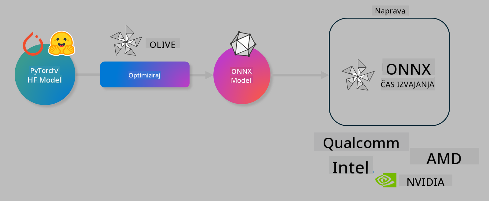

<!--
CO_OP_TRANSLATOR_METADATA:
{
  "original_hash": "6bbe47de3b974df7eea29dfeccf6032b",
  "translation_date": "2025-05-09T04:30:42+00:00",
  "source_file": "code/03.Finetuning/olive-lab/readme.md",
  "language_code": "sl"
}
-->
# Lab. Optimizirajte AI modele za izvajanje na napravi

## Uvod

> [!IMPORTANT]  
> Ta laboratorij zahteva **Nvidia A10 ali A100 GPU** z ustreznimi gonilniki in nameščenim CUDA orodjem (različica 12+).

> [!NOTE]  
> To je **35-minutni** laboratorij, ki vam bo omogočil praktičen uvod v osnovne koncepte optimizacije modelov za izvajanje na napravi z uporabo OLIVE.

## Cilji učenja

Na koncu tega laboratorija boste znali uporabljati OLIVE za:

- Kvantizacijo AI modela z metodo AWQ kvantizacije.  
- Fino prilagajanje AI modela za specifično nalogo.  
- Generiranje LoRA adapterjev (fino prilagojen model) za učinkovito izvajanje na napravi z ONNX Runtime.

### Kaj je Olive

Olive (*O*NNX *live*) je orodje za optimizacijo modelov z vmesnikom CLI, ki omogoča pošiljanje modelov za ONNX runtime +++https://onnxruntime.ai+++ z visoko kakovostjo in zmogljivostjo.



Vhod v Olive je običajno PyTorch ali Hugging Face model, izhod pa optimiziran ONNX model, ki se izvaja na napravi (ciljni platformi) z ONNX runtime. Olive optimizira model za AI pospeševalnik ciljne platforme (NPU, GPU, CPU), ki ga zagotavlja proizvajalec strojne opreme, kot so Qualcomm, AMD, Nvidia ali Intel.

Olive izvaja *workflow*, kar je zaporedje posameznih nalog optimizacije modela, imenovanih *passes* – primeri passes so: stiskanje modela, zajem grafa, kvantizacija, optimizacija grafa. Vsak pass ima niz parametrov, ki jih je mogoče prilagoditi za dosego najboljših meril, kot sta natančnost in zakasnitev, ki jih oceni ustrezni evaluator. Olive uporablja strategijo iskanja, ki samodejno nastavlja vsak pass posebej ali več passov skupaj.

#### Prednosti Olive

- **Zmanjšajte frustracije in čas** poskusov in napak pri ročnem eksperimentiranju z različnimi tehnikami optimizacije grafa, stiskanja in kvantizacije. Določite svoje zahteve glede kakovosti in zmogljivosti ter pustite, da Olive samodejno najde najboljši model za vas.  
- **Več kot 40 vgrajenih komponent** za optimizacijo modelov, ki pokrivajo najnovejše tehnike kvantizacije, stiskanja, optimizacije grafa in fino prilagajanje.  
- **Enostaven CLI** za pogoste naloge optimizacije modelov, na primer olive quantize, olive auto-opt, olive finetune.  
- Vgrajena podpora za pakiranje in nameščanje modelov.  
- Podpora za generiranje modelov za **Multi LoRA servisiranje**.  
- Sestavljanje workflow-ov z YAML/JSON za orkestracijo nalog optimizacije in nameščanja modelov.  
- Integracija z **Hugging Face** in **Azure AI**.  
- Vgrajen mehanizem za **predpomnjenje**, ki **zmanjšuje stroške**.

## Navodila za laboratorij

> [!NOTE]  
> Prepričajte se, da ste uredili svoj Azure AI Hub in projekt ter nastavili A100 računski vir, kot v Laboratoriju 1.

### Korak 0: Povežite se z vašim Azure AI računalnikom

Povežite se z Azure AI računalnikom preko oddaljene funkcije v **VS Code**.

1. Odprite svojo **VS Code** namizno aplikacijo:  
1. Odprite **ukazno paleto** s **Shift+Ctrl+P**  
1. V ukazni paleti poiščite **AzureML - remote: Connect to compute instance in New Window**.  
1. Sledite navodilom na zaslonu za povezavo z računalnikom. Izberite svojo Azure naročnino, skupino virov, projekt in ime računalnika, ki ste ga nastavili v Laboratoriju 1.  
1. Ko ste povezani z Azure ML računalnikom, bo to prikazano v **spodnjem levem kotu Visual Studio Code** `><Azure ML: Compute Name`

### Korak 1: Klonirajte ta repozitorij

V VS Code lahko odprete nov terminal s **Ctrl+J** in klonirate ta repozitorij:

V terminalu boste videli poziv

```
azureuser@computername:~/cloudfiles/code$ 
```  
Klonirajte rešitev

```bash
cd ~/localfiles
git clone https://github.com/microsoft/phi-3cookbook.git
```

### Korak 2: Odprite mapo v VS Code

Za odpiranje mape v VS Code izvedite naslednji ukaz v terminalu, ki bo odprl novo okno:

```bash
code phi-3cookbook/code/04.Finetuning/Olive-lab
```

Alternativno lahko mapo odprete preko **File** > **Open Folder**.

### Korak 3: Odvisnosti

Odprite terminal v VS Code na vašem Azure AI računalniku (namig: **Ctrl+J**) in izvedite naslednje ukaze za namestitev odvisnosti:

```bash
conda create -n olive-ai python=3.11 -y
conda activate olive-ai
pip install -r requirements.txt
az extension remove -n azure-cli-ml
az extension add -n ml
```

> [!NOTE]  
> Namestitev vseh odvisnosti bo trajala približno 5 minut.

V tem laboratoriju boste prenašali modele v Azure AI katalog modelov in iz njega. Za dostop do kataloga se prijavite v Azure z:

```bash
az login
```

> [!NOTE]  
> Ob prijavi boste morali izbrati svojo naročnino. Poskrbite, da nastavite naročnino, ki je namenjena temu laboratoriju.

### Korak 4: Izvedite Olive ukaze

Odprite terminal v VS Code na vašem Azure AI računalniku (namig: **Ctrl+J**) in poskrbite, da je aktivno okolje `olive-ai`:

```bash
conda activate olive-ai
```

Nato izvedite naslednje Olive ukaze v ukazni vrstici.

1. **Preglejte podatke:** V tem primeru boste fino prilagodili model Phi-3.5-Mini, da bo specializiran za odgovarjanje na vprašanja povezana s potovanji. Spodnja koda prikaže nekaj prvih zapisov v podatkovnem nizu, ki je v formatu JSON lines:

    ```bash
    head data/data_sample_travel.jsonl
    ```

1. **Kvantizirajte model:** Pred treniranjem modela ga najprej kvantizirate z naslednjim ukazom, ki uporablja tehniko imenovano Active Aware Quantization (AWQ) +++https://arxiv.org/abs/2306.00978+++. AWQ kvantizira uteži modela ob upoštevanju aktivacij, ki nastanejo med izvajanjem. To pomeni, da kvantizacija upošteva dejansko porazdelitev podatkov v aktivacijah, kar omogoča boljšo ohranitev natančnosti modela v primerjavi s tradicionalnimi metodami kvantizacije uteži.

    ```bash
    olive quantize \
       --model_name_or_path microsoft/Phi-3.5-mini-instruct \
       --trust_remote_code \
       --algorithm awq \
       --output_path models/phi/awq \
       --log_level 1
    ```

    Postopek AWQ kvantizacije traja približno **8 minut** in bo **zmanjšal velikost modela s približno 7,5 GB na približno 2,5 GB**.

    V tem laboratoriju prikazujemo, kako vnesti modele iz Hugging Face (na primer: `microsoft/Phi-3.5-mini-instruct`). However, Olive also allows you to input models from the Azure AI catalog by updating the `model_name_or_path` argument to an Azure AI asset ID (for example:  `azureml://registries/azureml/models/Phi-3.5-mini-instruct/versions/4`). 

1. **Train the model:** Next, the `olive finetune` ukaz fino prilagodi kvantizirani model. Kvantizacija modela *pred* fino prilagoditvijo namesto po njej zagotavlja boljšo natančnost, saj proces fino prilagajanja delno povrne izgube zaradi kvantizacije.

    ```bash
    olive finetune \
        --method lora \
        --model_name_or_path models/phi/awq \
        --data_files "data/data_sample_travel.jsonl" \
        --data_name "json" \
        --text_template "<|user|>\n{prompt}<|end|>\n<|assistant|>\n{response}<|end|>" \
        --max_steps 100 \
        --output_path ./models/phi/ft \
        --log_level 1
    ```

    Fino prilagajanje (100 korakov) traja približno **6 minut**.

1. **Optimizirajte:** Ko je model naučen, ga zdaj optimizirate z Olive ukazom `auto-opt` command, which will capture the ONNX graph and automatically perform a number of optimizations to improve the model performance for CPU by compressing the model and doing fusions. It should be noted, that you can also optimize for other devices such as NPU or GPU by just updating the `--device` and `--provider` – vendar bomo za namen tega laboratorija uporabili CPU.

    ```bash
    olive auto-opt \
       --model_name_or_path models/phi/ft/model \
       --adapter_path models/phi/ft/adapter \
       --device cpu \
       --provider CPUExecutionProvider \
       --use_ort_genai \
       --output_path models/phi/onnx-ao \
       --log_level 1
    ```

    Optimizacija traja približno **5 minut**.

### Korak 5: Hitri test inferenciranja modela

Za testiranje inferenciranja modela ustvarite Python datoteko v svoji mapi z imenom **app.py** in prilepite naslednjo kodo:

```python
import onnxruntime_genai as og
import numpy as np

print("loading model and adapters...", end="", flush=True)
model = og.Model("models/phi/onnx-ao/model")
adapters = og.Adapters(model)
adapters.load("models/phi/onnx-ao/model/adapter_weights.onnx_adapter", "travel")
print("DONE!")

tokenizer = og.Tokenizer(model)
tokenizer_stream = tokenizer.create_stream()

params = og.GeneratorParams(model)
params.set_search_options(max_length=100, past_present_share_buffer=False)
user_input = "what is the best thing to see in chicago"
params.input_ids = tokenizer.encode(f"<|user|>\n{user_input}<|end|>\n<|assistant|>\n")

generator = og.Generator(model, params)

generator.set_active_adapter(adapters, "travel")

print(f"{user_input}")

while not generator.is_done():
    generator.compute_logits()
    generator.generate_next_token()

    new_token = generator.get_next_tokens()[0]
    print(tokenizer_stream.decode(new_token), end='', flush=True)

print("\n")
```

Kodo izvedite z:

```bash
python app.py
```

### Korak 6: Naložite model v Azure AI

Nalaganje modela v Azure AI repozitorij omogoča deljenje modela z ostalimi člani vaše razvojne ekipe in hkrati urejanje različic modela. Za nalaganje modela zaženite naslednji ukaz:

> [!NOTE]  
> Posodobite `{}` za `resourceGroup` in ime Azure AI projekta ter zaženite ukaz:

```
az ml workspace show
```

Lahko pa greste na +++ai.azure.com+++ in izberete **management center** > **project** > **overview**

Posodobite `{}` z imenom vaše skupine virov in imenom Azure AI projekta.

```bash
az ml model create \
    --name ft-for-travel \
    --version 1 \
    --path ./models/phi/onnx-ao \
    --resource-group {RESOURCE_GROUP_NAME} \
    --workspace-name {PROJECT_NAME}
```

Svoj naložen model lahko nato vidite in ga namestite na https://ml.azure.com/model/list

**Izjava o omejitvi odgovornosti**:  
Ta dokument je bil preveden z uporabo storitve za prevajanje z umetno inteligenco [Co-op Translator](https://github.com/Azure/co-op-translator). Čeprav si prizadevamo za natančnost, vas opozarjamo, da avtomatizirani prevodi lahko vsebujejo napake ali netočnosti. Izvirni dokument v njegovem izvirnem jeziku velja za avtoritativni vir. Za ključne informacije priporočamo strokovni človeški prevod. Za morebitna nesporazume ali napačne interpretacije, ki izhajajo iz uporabe tega prevoda, ne prevzemamo odgovornosti.