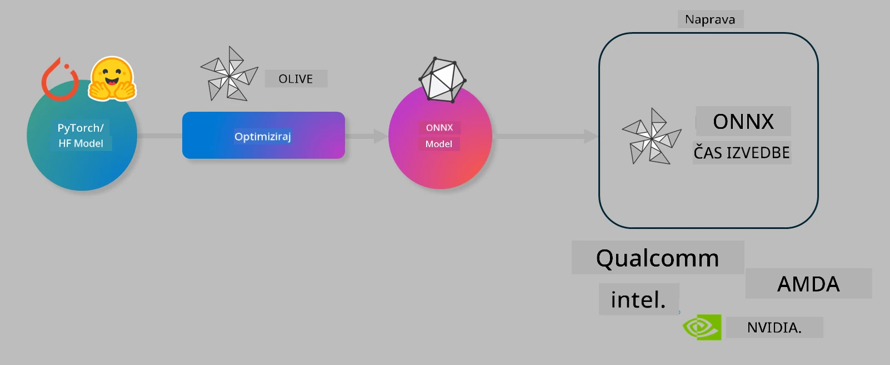

<!--
CO_OP_TRANSLATOR_METADATA:
{
  "original_hash": "6bbe47de3b974df7eea29dfeccf6032b",
  "translation_date": "2025-07-16T16:22:02+00:00",
  "source_file": "code/04.Finetuning/olive-lab/readme.md",
  "language_code": "sl"
}
-->
# Lab. Optimizacija AI modelov za izvajanje na napravi

## Uvod

> [!IMPORTANT]
> Ta laboratorij zahteva **Nvidia A10 ali A100 GPU** z ustreznimi gonilniki in nameščenim CUDA orodjem (verzija 12+).

> [!NOTE]
> To je **35-minutni** laboratorij, ki vam bo omogočil praktičen uvod v osnovne koncepte optimizacije modelov za izvajanje na napravi z uporabo OLIVE.

## Cilji učenja

Ob koncu tega laboratorija boste znali z OLIVE:

- Kvantizirati AI model z metodo kvantizacije AWQ.
- Izvesti fino nastavitev AI modela za specifično nalogo.
- Generirati LoRA adapterje (fino nastavljeni model) za učinkovito izvajanje na napravi z ONNX Runtime.

### Kaj je Olive

Olive (*O*NNX *live*) je orodje za optimizacijo modelov z vgrajenim CLI, ki omogoča pošiljanje modelov za ONNX runtime +++https://onnxruntime.ai+++ z visoko kakovostjo in zmogljivostjo.



Vhod v Olive je običajno PyTorch ali Hugging Face model, izhod pa optimiziran ONNX model, ki se izvaja na napravi (ciljni sistem za namestitev) z ONNX runtime. Olive optimizira model za AI pospeševalnik ciljnega sistema (NPU, GPU, CPU), ki ga zagotavlja proizvajalec strojne opreme, kot so Qualcomm, AMD, Nvidia ali Intel.

Olive izvaja *workflow*, kar je urejen niz posameznih nalog optimizacije modela, imenovanih *passes* – primeri teh nalog so: stiskanje modela, zajem grafa, kvantizacija, optimizacija grafa. Vsaka naloga ima niz parametrov, ki jih je mogoče prilagoditi za dosego najboljših metrik, kot sta natančnost in zakasnitev, ki jih ocenjuje ustrezni evaluator. Olive uporablja strategijo iskanja, ki z algoritmom samodejno nastavi posamezne naloge eno za drugo ali skupine nalog skupaj.

#### Prednosti Olive

- **Zmanjšajte frustracije in čas** ročnega poskušanja različnih tehnik optimizacije grafa, stiskanja in kvantizacije. Določite svoje zahteve glede kakovosti in zmogljivosti ter pustite, da Olive samodejno najde najboljši model za vas.
- **Več kot 40 vgrajenih komponent za optimizacijo modelov**, ki pokrivajo najnovejše tehnike kvantizacije, stiskanja, optimizacije grafa in fino nastavljanje.
- **Enostaven CLI** za pogoste naloge optimizacije modelov, na primer olive quantize, olive auto-opt, olive finetune.
- Vgrajeno pakiranje in nameščanje modelov.
- Podpora za generiranje modelov za **Multi LoRA strežbo**.
- Sestavljanje workflowov z YAML/JSON za orkestracijo nalog optimizacije in nameščanja modelov.
- Integracija z **Hugging Face** in **Azure AI**.
- Vgrajen mehanizem **predpomnjenja** za **znižanje stroškov**.

## Navodila za laboratorij

> [!NOTE]
> Prepričajte se, da ste pripravili svoj Azure AI Hub in projekt ter nastavili A100 računski vir, kot je opisano v laboratoriju 1.

### Korak 0: Povežite se z Azure AI Compute

Povezali se boste z Azure AI računalnikom preko oddaljene funkcije v **VS Code**.

1. Odprite namizno aplikacijo **VS Code**:
1. Odprite **ukazno paleto** s **Shift+Ctrl+P**
1. V ukazni paleti poiščite **AzureML - remote: Connect to compute instance in New Window**.
1. Sledite navodilom na zaslonu za povezavo z računalnikom. Izbrati boste morali svojo Azure naročnino, skupino virov, projekt in ime računalnika, ki ste ga nastavili v laboratoriju 1.
1. Ko ste povezani z Azure ML Compute vozliščem, bo to prikazano v **spodnjem levem kotu Visual Code** kot `><Azure ML: Compute Name`

### Korak 1: Klonirajte ta repozitorij

V VS Code lahko odprete nov terminal s **Ctrl+J** in klonirate ta repozitorij:

V terminalu boste videli poziv

```
azureuser@computername:~/cloudfiles/code$ 
```
Klonirajte rešitev

```bash
cd ~/localfiles
git clone https://github.com/microsoft/phi-3cookbook.git
```

### Korak 2: Odprite mapo v VS Code

Za odpiranje mape v VS Code zaženite naslednji ukaz v terminalu, ki bo odprl novo okno:

```bash
code phi-3cookbook/code/04.Finetuning/Olive-lab
```

Lahko pa mapo odprete tudi preko **File** > **Open Folder**.

### Korak 3: Odvisnosti

Odprite terminal v VS Code na svojem Azure AI Compute vozlišču (namig: **Ctrl+J**) in zaženite naslednje ukaze za namestitev odvisnosti:

```bash
conda create -n olive-ai python=3.11 -y
conda activate olive-ai
pip install -r requirements.txt
az extension remove -n azure-cli-ml
az extension add -n ml
```

> [!NOTE]
> Namestitev vseh odvisnosti bo trajala približno 5 minut.

V tem laboratoriju boste prenašali in nalagali modele v Azure AI katalog modelov. Za dostop do kataloga se morate prijaviti v Azure z:

```bash
az login
```

> [!NOTE]
> Ob prijavi boste morali izbrati svojo naročnino. Poskrbite, da izberete naročnino, dodeljeno za ta laboratorij.

### Korak 4: Izvedite Olive ukaze

Odprite terminal v VS Code na svojem Azure AI Compute vozlišču (namig: **Ctrl+J**) in poskrbite, da je aktivirano okolje `olive-ai`:

```bash
conda activate olive-ai
```

Nato izvedite naslednje Olive ukaze v ukazni vrstici.

1. **Preglejte podatke:** V tem primeru boste fino nastavili model Phi-3.5-Mini, da bo specializiran za odgovarjanje na vprašanja o potovanjih. Spodnja koda prikaže nekaj prvih zapisov iz nabora podatkov, ki so v formatu JSON lines:

    ```bash
    head data/data_sample_travel.jsonl
    ```
1. **Kvantizirajte model:** Pred treniranjem modela ga najprej kvantizirajte z ukazom, ki uporablja tehniko imenovano Active Aware Quantization (AWQ) +++https://arxiv.org/abs/2306.00978+++. AWQ kvantizira uteži modela ob upoštevanju aktivacij, ki nastanejo med izvajanjem. To pomeni, da kvantizacijski proces upošteva dejansko porazdelitev podatkov v aktivacijah, kar vodi do boljše ohranitve natančnosti modela v primerjavi s tradicionalnimi metodami kvantizacije uteži.

    ```bash
    olive quantize \
       --model_name_or_path microsoft/Phi-3.5-mini-instruct \
       --trust_remote_code \
       --algorithm awq \
       --output_path models/phi/awq \
       --log_level 1
    ```

    Postopek AWQ kvantizacije traja približno **8 minut** in bo **zmanjšal velikost modela s približno 7,5 GB na približno 2,5 GB**.

    V tem laboratoriju prikazujemo, kako vnesti modele iz Hugging Face (na primer: `microsoft/Phi-3.5-mini-instruct`). Olive pa omogoča tudi vnos modelov iz Azure AI kataloga z zamenjavo argumenta `model_name_or_path` z ID-jem Azure AI sredstva (na primer: `azureml://registries/azureml/models/Phi-3.5-mini-instruct/versions/4`).

1. **Trenirajte model:** Nato ukaz `olive finetune` fino nastavi kvantizirani model. Kvantizacija modela *pred* fino nastavitvijo namesto po njej prinaša boljšo natančnost, saj proces fino nastavitve delno povrne izgubo zaradi kvantizacije.

    ```bash
    olive finetune \
        --method lora \
        --model_name_or_path models/phi/awq \
        --data_files "data/data_sample_travel.jsonl" \
        --data_name "json" \
        --text_template "<|user|>\n{prompt}<|end|>\n<|assistant|>\n{response}<|end|>" \
        --max_steps 100 \
        --output_path ./models/phi/ft \
        --log_level 1
    ```

    Fino nastavljanje traja približno **6 minut** (100 korakov).

1. **Optimizirajte:** Ko je model treniran, ga optimizirate z Olive ukazom `auto-opt`, ki zajame ONNX graf in samodejno izvede več optimizacij za izboljšanje zmogljivosti modela na CPU z stiskanjem modela in združevanjem operacij. Omeniti je treba, da lahko optimizirate tudi za druge naprave, kot so NPU ali GPU, tako da spremenite argumenta `--device` in `--provider` – za potrebe tega laboratorija bomo uporabili CPU.

    ```bash
    olive auto-opt \
       --model_name_or_path models/phi/ft/model \
       --adapter_path models/phi/ft/adapter \
       --device cpu \
       --provider CPUExecutionProvider \
       --use_ort_genai \
       --output_path models/phi/onnx-ao \
       --log_level 1
    ```

    Optimizacija traja približno **5 minut**.

### Korak 5: Hiter preizkus izvajanja modela

Za preizkus izvajanja modela ustvarite Python datoteko v svoji mapi z imenom **app.py** in prilepite naslednjo kodo:

```python
import onnxruntime_genai as og
import numpy as np

print("loading model and adapters...", end="", flush=True)
model = og.Model("models/phi/onnx-ao/model")
adapters = og.Adapters(model)
adapters.load("models/phi/onnx-ao/model/adapter_weights.onnx_adapter", "travel")
print("DONE!")

tokenizer = og.Tokenizer(model)
tokenizer_stream = tokenizer.create_stream()

params = og.GeneratorParams(model)
params.set_search_options(max_length=100, past_present_share_buffer=False)
user_input = "what is the best thing to see in chicago"
params.input_ids = tokenizer.encode(f"<|user|>\n{user_input}<|end|>\n<|assistant|>\n")

generator = og.Generator(model, params)

generator.set_active_adapter(adapters, "travel")

print(f"{user_input}")

while not generator.is_done():
    generator.compute_logits()
    generator.generate_next_token()

    new_token = generator.get_next_tokens()[0]
    print(tokenizer_stream.decode(new_token), end='', flush=True)

print("\n")
```

Kodo zaženite z:

```bash
python app.py
```

### Korak 6: Naložite model v Azure AI

Nalaganje modela v Azure AI repozitorij omogoča deljenje modela z drugimi člani razvojne ekipe in hkrati upravljanje različic modela. Za nalaganje modela zaženite naslednji ukaz:

> [!NOTE]
> Posodobite `{}` z imenom vaše skupine virov in imenom Azure AI projekta.

Za iskanje imena skupine virov `"resourceGroup"` in imena Azure AI projekta zaženite naslednji ukaz:

```
az ml workspace show
```

Lahko pa tudi obiščete +++ai.azure.com+++ in izberete **management center** > **project** > **overview**

Posodobite `{}` z imenom vaše skupine virov in imenom Azure AI projekta.

```bash
az ml model create \
    --name ft-for-travel \
    --version 1 \
    --path ./models/phi/onnx-ao \
    --resource-group {RESOURCE_GROUP_NAME} \
    --workspace-name {PROJECT_NAME}
```

Naloženi model si lahko ogledate in ga namestite na https://ml.azure.com/model/list

**Omejitev odgovornosti**:  
Ta dokument je bil preveden z uporabo storitve za avtomatski prevod AI [Co-op Translator](https://github.com/Azure/co-op-translator). Čeprav si prizadevamo za natančnost, vas opozarjamo, da lahko avtomatski prevodi vsebujejo napake ali netočnosti. Izvirni dokument v njegovem izvirnem jeziku velja za avtoritativni vir. Za ključne informacije priporočamo strokovni človeški prevod. Za morebitne nesporazume ali napačne interpretacije, ki izhajajo iz uporabe tega prevoda, ne odgovarjamo.