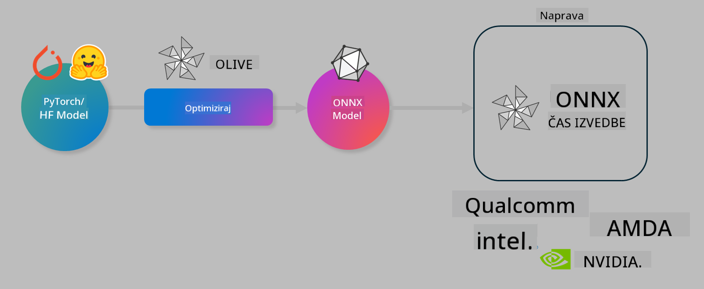

<!--
CO_OP_TRANSLATOR_METADATA:
{
  "original_hash": "6bbe47de3b974df7eea29dfeccf6032b",
  "translation_date": "2025-05-09T04:43:47+00:00",
  "source_file": "code/04.Finetuning/olive-lab/readme.md",
  "language_code": "sl"
}
-->
# Lab. Optimize AI models for on-device inference

## Introduction 

> [!IMPORTANT]
> Ta laboratorijska vaja zahteva **Nvidia A10 ali A100 GPU** z ustreznimi gonilniki in nameščenim CUDA orodjem (različica 12+).

> [!NOTE]
> To je **35-minutna** vaja, ki vam bo dala praktičen uvod v osnovne koncepte optimizacije modelov za izvajanje na napravi z uporabo OLIVE.

## Learning Objectives

Na koncu te vaje boste znali uporabiti OLIVE za:

- Kvantizacijo AI modela z metodo kvantizacije AWQ.
- Fino prilagoditi AI model za specifično nalogo.
- Generirati LoRA adapterje (fino prilagojen model) za učinkovito izvajanje na napravi z ONNX Runtime.

### Kaj je Olive

Olive (*O*NNX *live*) je orodje za optimizacijo modelov z vgrajenim CLI, ki omogoča pošiljanje modelov za ONNX runtime +++https://onnxruntime.ai+++ z zagotovljeno kakovostjo in zmogljivostjo.



Vhod v Olive je običajno PyTorch ali Hugging Face model, izhod pa optimiziran ONNX model, ki se izvaja na napravi (ciljna platforma) z ONNX runtime. Olive optimizira model za AI pospeševalnik ciljne platforme (NPU, GPU, CPU), ki ga zagotavlja proizvajalec strojne opreme, kot so Qualcomm, AMD, Nvidia ali Intel.

Olive izvaja *workflow*, kar je zaporedje posameznih nalog optimizacije modela, imenovanih *passes* – primeri teh nalog so: stiskanje modela, zajem grafa, kvantizacija, optimizacija grafa. Vsaka naloga ima niz parametrov, ki jih lahko prilagodite za dosego najboljših meritev, kot sta natančnost in zakasnitev, ki jih ocenjuje ustrezni evaluator. Olive uporablja strategijo iskanja, ki s pomočjo algoritma samodejno prilagaja posamezne naloge eno za drugo ali skupine nalog skupaj.

#### Prednosti Olive

- **Zmanjša frustracije in čas** ročnega preizkušanja različnih tehnik optimizacije grafa, stiskanja in kvantizacije. Določite svoje omejitve glede kakovosti in zmogljivosti ter pustite, da Olive samodejno poišče najboljši model za vas.
- **Več kot 40 vgrajenih komponent** za optimizacijo modelov, ki pokrivajo najnovejše tehnike kvantizacije, stiskanja, optimizacije grafa in fino nastavljanje.
- **Enostaven CLI** za pogoste naloge optimizacije modelov. Na primer, olive quantize, olive auto-opt, olive finetune.
- Vgrajeno pakiranje in nameščanje modelov.
- Podpora za generiranje modelov za **Multi LoRA strežbo**.
- Sestavljanje workflow-ov z YAML/JSON za orkestracijo nalog optimizacije in nameščanja modelov.
- Integracija z **Hugging Face** in **Azure AI**.
- Vgrajen mehanizem **predpomnjenja** za **znižanje stroškov**.

## Lab Instructions
> [!NOTE]
> Prepričajte se, da ste uredili Azure AI Hub in projekt ter nastavili A100 računski vir po navodilih v Lab 1.

### Step 0: Povežite se z Azure AI Compute

Povezali se boste z Azure AI računalniškim virom preko funkcije oddaljenega dostopa v **VS Code**.

1. Odprite aplikacijo **VS Code** na namizju:
1. Odprite **ukazno paleto** s **Shift+Ctrl+P**
1. V ukazni paleti poiščite **AzureML - remote: Connect to compute instance in New Window**.
1. Sledite navodilom na zaslonu za povezavo z računalniškim virom. Izbrati boste morali svojo Azure naročnino, Resource Group, projekt in ime računalniškega vira, ki ste ga nastavili v Lab 1.
1. Ko ste povezani z Azure ML Compute vozliščem, bo to prikazano v **spodnjem levem kotu Visual Studio Code** `><Azure ML: Compute Name`

### Step 1: Klonirajte ta repozitorij

V VS Code lahko odprete nov terminal s **Ctrl+J** in klonirate ta repozitorij:

V terminalu boste videli poziv

```
azureuser@computername:~/cloudfiles/code$ 
```
Klonirajte rešitev

```bash
cd ~/localfiles
git clone https://github.com/microsoft/phi-3cookbook.git
```

### Step 2: Odprite mapo v VS Code

Za odpiranje mape v VS Code zaženite naslednji ukaz v terminalu, ki bo odprl novo okno:

```bash
code phi-3cookbook/code/04.Finetuning/Olive-lab
```

Lahko pa mapo odprete tudi preko **File** > **Open Folder**.

### Step 3: Odvisnosti

Odprite terminal v VS Code na vašem Azure AI Compute vozlišču (nasvet: **Ctrl+J**) in izvedite naslednje ukaze za namestitev odvisnosti:

```bash
conda create -n olive-ai python=3.11 -y
conda activate olive-ai
pip install -r requirements.txt
az extension remove -n azure-cli-ml
az extension add -n ml
```

> [!NOTE]
> Namestitev vseh odvisnosti bo trajala približno 5 minut.

V tej vaji boste prenašali modele v Azure AI Model katalog in iz njega. Da boste lahko dostopali do kataloga, se morate prijaviti v Azure z:

```bash
az login
```

> [!NOTE]
> Ob prijavi boste morali izbrati svojo naročnino. Poskrbite, da izberete naročnino, ki je namenjena tej vaji.

### Step 4: Izvajanje Olive ukazov

Odprite terminal v VS Code na vašem Azure AI Compute vozlišču (nasvet: **Ctrl+J**) in poskrbite, da je aktivno okolje `olive-ai`:

```bash
conda activate olive-ai
```

Nato zaženite naslednje Olive ukaze v ukazni vrstici.

1. **Pregled podatkov:** V tem primeru boste fino prilagodili model Phi-3.5-Mini, da bo specializiran za odgovarjanje na vprašanja o potovanjih. Koda spodaj prikaže nekaj prvih zapisov iz podatkovnega nabora, ki so v formatu JSON lines:
   
    ```bash
    head data/data_sample_travel.jsonl
    ```
1. **Kvantizacija modela:** Pred treniranjem modela ga najprej kvantizirate z ukazom, ki uporablja tehniko Active Aware Quantization (AWQ) +++https://arxiv.org/abs/2306.00978+++. AWQ kvantizira uteži modela ob upoštevanju aktivacij, ki nastanejo med inferenco. To pomeni, da kvantizacijski proces upošteva dejansko porazdelitev podatkov v aktivacijah, kar bolje ohranja natančnost modela v primerjavi s tradicionalnimi metodami kvantizacije uteži.
    
    ```bash
    olive quantize \
       --model_name_or_path microsoft/Phi-3.5-mini-instruct \
       --trust_remote_code \
       --algorithm awq \
       --output_path models/phi/awq \
       --log_level 1
    ```
    
    Postopek AWQ kvantizacije traja približno **8 minut** in bo **zmanjšal velikost modela z okoli 7,5 GB na približno 2,5 GB**.
   
   V tej vaji prikazujemo, kako vnesti modele iz Hugging Face (na primer: `microsoft/Phi-3.5-mini-instruct`). However, Olive also allows you to input models from the Azure AI catalog by updating the `model_name_or_path` argument to an Azure AI asset ID (for example:  `azureml://registries/azureml/models/Phi-3.5-mini-instruct/versions/4`). 

1. **Train the model:** Next, the `olive finetune` ukaz fino prilagodi kvantizirani model. Kvantizacija modela *pred* fino prilagoditvijo namesto po njej zagotavlja boljšo natančnost, saj fino prilagajanje delno povrne izgubo zaradi kvantizacije.
    
    ```bash
    olive finetune \
        --method lora \
        --model_name_or_path models/phi/awq \
        --data_files "data/data_sample_travel.jsonl" \
        --data_name "json" \
        --text_template "<|user|>\n{prompt}<|end|>\n<|assistant|>\n{response}<|end|>" \
        --max_steps 100 \
        --output_path ./models/phi/ft \
        --log_level 1
    ```
    
    Fino prilagajanje (s 100 koraki) traja približno **6 minut**.

1. **Optimizacija:** Ko je model izurjen, ga zdaj optimizirate z Olive ukazom `auto-opt` command, which will capture the ONNX graph and automatically perform a number of optimizations to improve the model performance for CPU by compressing the model and doing fusions. It should be noted, that you can also optimize for other devices such as NPU or GPU by just updating the `--device` and `--provider` - za namen te vaje bomo uporabili CPU.

    ```bash
    olive auto-opt \
       --model_name_or_path models/phi/ft/model \
       --adapter_path models/phi/ft/adapter \
       --device cpu \
       --provider CPUExecutionProvider \
       --use_ort_genai \
       --output_path models/phi/onnx-ao \
       --log_level 1
    ```
    
    Optimizacija traja približno **5 minut**.

### Step 5: Hiter test inferenciranja modela

Za testiranje inferenciranja modela ustvarite Python datoteko v svoji mapi z imenom **app.py** in prilepite naslednjo kodo:

```python
import onnxruntime_genai as og
import numpy as np

print("loading model and adapters...", end="", flush=True)
model = og.Model("models/phi/onnx-ao/model")
adapters = og.Adapters(model)
adapters.load("models/phi/onnx-ao/model/adapter_weights.onnx_adapter", "travel")
print("DONE!")

tokenizer = og.Tokenizer(model)
tokenizer_stream = tokenizer.create_stream()

params = og.GeneratorParams(model)
params.set_search_options(max_length=100, past_present_share_buffer=False)
user_input = "what is the best thing to see in chicago"
params.input_ids = tokenizer.encode(f"<|user|>\n{user_input}<|end|>\n<|assistant|>\n")

generator = og.Generator(model, params)

generator.set_active_adapter(adapters, "travel")

print(f"{user_input}")

while not generator.is_done():
    generator.compute_logits()
    generator.generate_next_token()

    new_token = generator.get_next_tokens()[0]
    print(tokenizer_stream.decode(new_token), end='', flush=True)

print("\n")
```

Kodo zaženite z:

```bash
python app.py
```

### Step 6: Naložite model v Azure AI

Nalaganje modela v Azure AI repozitorij omogoča deljenje modela z drugimi člani vaše razvojne ekipe in hkrati upravljanje različic modela. Za nalaganje modela zaženite naslednji ukaz:

> [!NOTE]
> Posodobite `{}` ` placeholders with the name of your resource group and Azure AI Project Name. 

To find your resource group ` z imenom vaše Resource Group in imenom Azure AI projekta, nato zaženite ukaz

```
az ml workspace show
```

Lahko pa greste na +++ai.azure.com+++ in izberete **management center** > **project** > **overview**

Posodobite `{}` z imenom vaše resource group in Azure AI projekta.

```bash
az ml model create \
    --name ft-for-travel \
    --version 1 \
    --path ./models/phi/onnx-ao \
    --resource-group {RESOURCE_GROUP_NAME} \
    --workspace-name {PROJECT_NAME}
```
Model lahko nato vidite in namestite na https://ml.azure.com/model/list

**Izjava o omejitvi odgovornosti**:  
Ta dokument je bil preveden z uporabo storitve za avtomatski prevod [Co-op Translator](https://github.com/Azure/co-op-translator). Čeprav si prizadevamo za natančnost, vas prosimo, da upoštevate, da lahko avtomatski prevodi vsebujejo napake ali netočnosti. Izvirni dokument v njegovem izvirnem jeziku velja za avtoritativni vir. Za pomembne informacije priporočamo strokovni prevod s strani človeka. Ne odgovarjamo za morebitne nesporazume ali napačne interpretacije, ki izhajajo iz uporabe tega prevoda.