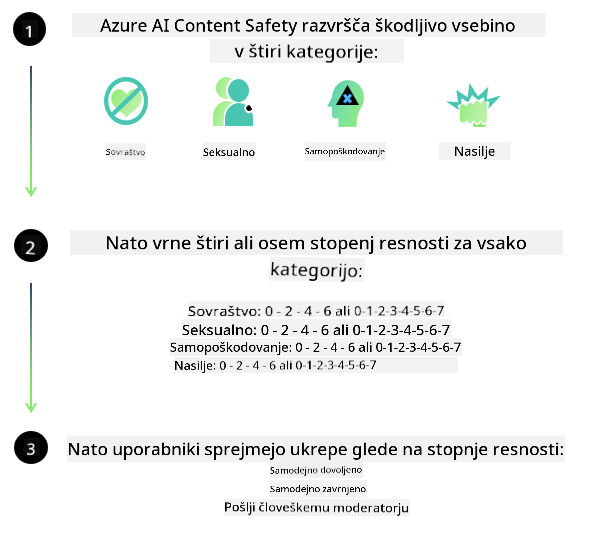

<!--
CO_OP_TRANSLATOR_METADATA:
{
  "original_hash": "839ccc4b3886ef10cfd4e64977f5792d",
  "translation_date": "2026-01-05T15:40:37+00:00",
  "source_file": "md/01.Introduction/01/01.AISafety.md",
  "language_code": "sl"
}
-->
# Varnost AI za modele Phi
Družina modelov Phi je bila razvita v skladu z [Microsoftovim standardom za odgovorno AI](https://www.microsoft.com/ai/principles-and-approach#responsible-ai-standard), ki predstavlja zahteve podjetja, osnovane na naslednjih šestih načelih: odgovornost, preglednost, pravičnost, zanesljivost in varnost, zasebnost in varnost ter vključevanje, ki tvorijo [Microsoftova načela odgovorne AI](https://www.microsoft.com/ai/responsible-ai).

Tako kot prejšnji modeli Phi je bil sprejet večplasten pristop k ocenjevanju varnosti in varnostni pristop po usposabljanju, pri čemer so bile dodatno upoštevane jezikovne zmožnosti tega izida. Naš pristop k varnostnemu usposabljanju in ocenjevanju, vključno s testiranjem v več jezikih in kategorijah tveganj, je predstavljen v [Phi Safety Post-Training Paper](https://arxiv.org/abs/2407.13833). Čeprav modeli Phi koristijo ta pristop, bi razvijalci morali uporabljati najboljše prakse odgovorne AI, vključno z mapiranjem, merjenjem in zmanjševanjem tveganj, povezanih z njihovim specifičnim primerom uporabe ter kulturnim in jezikovnim kontekstom.

## Najboljše prakse

Tako kot drugi modeli se lahko tudi družina modelov Phi potencialno obnaša na načine, ki so nepravični, nezanesljivi ali žaljivi.

Nekateri omejujoči vzorci obnašanja SLM in LLM, o katerih morate biti obveščeni, vključujejo:

- **Kakovost storitve:** Modeli Phi so primarno usposobljeni na angleškem besedilu. Jeziki, ki niso angleški, bodo doživeli slabšo zmogljivost. Angleške jezikovne različice z manjšo zastopanostjo v učnih podatkih bi lahko imele slabšo zmogljivost kot standardna ameriška angleščina.
- **Predstavitev škode in vzdrževanje stereotipov:** Ti modeli lahko prekomerno ali premalo predstavljajo določene skupine ljudi, izbrišejo predstavitev nekaterih skupin ali utrjujejo poniževalne ali negativne stereotipe. Kljub varnostnemu dodatnemu usposabljanju so te omejitve lahko še vedno prisotne zaradi različnih ravni zastopanosti različnih skupin ali pogostosti primerov negativnih stereotipov v učnih podatkih, ki odražajo vzorce iz resničnega sveta in družbene pristranskosti.
- **Neprimerno ali žaljivo vsebino:** Ti modeli lahko ustvarjajo tudi druge vrste neprimerne ali žaljive vsebine, kar lahko pomeni, da njihova uporaba v občutljivih kontekstih brez dodatnih ukrepov, specifičnih za primer uporabe, ni primerna.
Zanesljivost informacij: Jezikovni modeli lahko ustvarjajo nesmiselno vsebino ali izmišljajo vsebino, ki se morda zdi smiselna, vendar je netočna ali zastarela.
- **Omejen obseg za kodo:** Večina učnih podatkov za Phi-3 temelji na Pythonu in uporablja pogoste pakete, kot so "typing, math, random, collections, datetime, itertools". Če model generira Python skripte, ki uporabljajo druge pakete ali skripte v drugih jezikih, močno priporočamo, da uporabniki ročno preverijo vse uporabe API.

Razvijalci bi morali uporabljati najboljše prakse odgovorne AI in so odgovorni za zagotovitev, da specifičen primer uporabe izpolnjuje veljavne zakone in predpise (npr. zasebnost, trgovina itd.).

## Razmisleki o odgovorni AI

Tako kot drugi jezikovni modeli se lahko modeli serije Phi potencialno obnašajo na načine, ki so nepravični, nezanesljivi ali žaljivi. Nekateri omejujoči vzorci obnašanja, o katerih morate biti obveščeni, vključujejo:

**Kakovost storitve:** Modeli Phi so primarno usposobljeni na angleškem besedilu. Jeziki, ki niso angleški, bodo doživeli slabšo zmogljivost. Angleške jezikovne različice z manjšo zastopanostjo v učnih podatkih bi lahko imele slabšo zmogljivost kot standardna ameriška angleščina.

**Predstavitev škode in vzdrževanje stereotipov:** Ti modeli lahko prekomerno ali premalo predstavljajo določene skupine ljudi, izbrišejo predstavitev nekaterih skupin ali utrjujejo poniževalne ali negativne stereotipe. Kljub varnostnemu dodatnemu usposabljanju so te omejitve lahko še vedno prisotne zaradi različnih ravni zastopanosti različnih skupin ali pogostosti primerov negativnih stereotipov v učnih podatkih, ki odražajo vzorce iz resničnega sveta in družbene pristranskosti.

**Neprimerno ali žaljivo vsebino:** Ti modeli lahko ustvarjajo tudi druge vrste neprimerne ali žaljive vsebine, kar lahko pomeni, da njihova uporaba v občutljivih kontekstih brez dodatnih ukrepov, specifičnih za primer uporabe, ni primerna.
Zanesljivost informacij: Jezikovni modeli lahko ustvarjajo nesmiselno vsebino ali izmišljajo vsebino, ki se morda zdi smiselna, vendar je netočna ali zastarela.

**Omejen obseg za kodo:** Večina učnih podatkov za Phi-3 temelji na Pythonu in uporablja pogoste pakete, kot so "typing, math, random, collections, datetime, itertools". Če model generira Python skripte, ki uporabljajo druge pakete ali skripte v drugih jezikih, močno priporočamo, da uporabniki ročno preverijo vse uporabe API.

Razvijalci bi morali uporabljati najboljše prakse odgovorne AI in so odgovorni za zagotovitev, da specifičen primer uporabe izpolnjuje veljavne zakone in predpise (npr. zasebnost, trgovina itd.). Pomembna področja za razmislek vključujejo:

**Dodeljevanje:** Modeli morda niso primerni za scenarije, ki bi lahko imeli pomemben vpliv na pravni status ali dodeljevanje virov ali življenjskih priložnosti (npr. stanovanjska vprašanja, zaposlitev, kredit itd.) brez nadaljnjih ocen in dodatnih tehnik zmanjševanja pristranskosti.

**Scenariji z visokim tveganjem:** Razvijalci bi morali oceniti primernost uporabe modelov v scenarijih z visokim tveganjem, kjer bi lahko nepravični, nezanesljivi ali žaljivi izhodi povzročili visoke stroške ali škodo. To vključuje podajanje nasvetov v občutljivih ali strokovnih domenah, kjer sta natančnost in zanesljivost ključni (npr. pravni ali zdravstveni nasveti). Dodatni varnostni ukrepi naj bodo implementirani na ravni aplikacije glede na kontekst namestitve.

**Dezinformacije:** Modeli lahko ustvarjajo netočne informacije. Razvijalci bi morali upoštevati najboljše prakse preglednosti in obvestiti končne uporabnike, da komunicirajo z AI sistemom. Na ravni aplikacije lahko razvijalci zgradijo mehanizme povratnih informacij in cevovode za utemeljitev odgovorov s specifičnimi informacijami glede na primer uporabe, tehniko, znano kot Retrieval Augmented Generation (RAG).

**Generiranje škodljive vsebine:** Razvijalci bi morali oceniti izhode glede na njihov kontekst in uporabiti razpoložljive razvrščevalce varnosti ali po meri izdelane rešitve, primerne za njihov primer uporabe.

**Zloraba:** Druge oblike zlorabe, kot so goljufije, neželena pošta ali ustvarjanje zlonamerne programske opreme, so mogoče, zato morajo razvijalci zagotoviti, da njihove aplikacije ne kršijo veljavnih zakonov in predpisov.

### Izboljševanje in varnost vsebine AI

Po fino nastavljenem modelu močno priporočamo uporabo ukrepov [Azure AI Content Safety](https://learn.microsoft.com/azure/ai-services/content-safety/overview) za spremljanje vsebine, ki jo generirajo modeli, ter za prepoznavanje in blokiranje morebitnih tveganj, groženj in težav s kakovostjo.

[Azure AI Content Safety](https://learn.microsoft.com/azure/ai-services/content-safety/overview) podpira tako besedilo kot tudi slike. Lahko se uporablja v oblaku, v odklopljenih vsebnikih in na edge/embedded napravah.

## Pregled Azure AI Content Safety

Azure AI Content Safety ni univerzalna rešitev; prilagodljiv je za uskladitev s specifičnimi politikami podjetij. Poleg tega njegov večjezični model omogoča razumevanje več jezikov hkrati.

- **Azure AI Content Safety**
- **Microsoft Developer**
- **5 videoposnetkov**

Storitev Azure AI Content Safety zaznava škodljivo vsebino, ustvarjeno s strani uporabnikov in AI, v aplikacijah in storitvah. Vključuje API-je za besedilo in slike, ki omogočajo zaznavanje škodljive ali neprimerne vsebine.

[AI Content Safety Playlist](https://www.youtube.com/playlist?list=PLlrxD0HtieHjaQ9bJjyp1T7FeCbmVcPkQ)

---

<!-- CO-OP TRANSLATOR DISCLAIMER START -->
**Omejitev odgovornosti**:  
Ta dokument je bil preveden z uporabo storitve AI prevajanja [Co-op Translator](https://github.com/Azure/co-op-translator). Čeprav si prizadevamo za natančnost, prosimo, upoštevajte, da lahko avtomatizirani prevodi vsebujejo napake ali netočnosti. Izvirni dokument v njegovem izvorno jeziku je treba obravnavati kot avtoritativni vir. Za ključne informacije priporočamo strokovni človeški prevod. Ne odgovarjamo za morebitne nesporazume ali napačne razlage, ki izhajajo iz uporabe tega prevoda.
<!-- CO-OP TRANSLATOR DISCLAIMER END -->