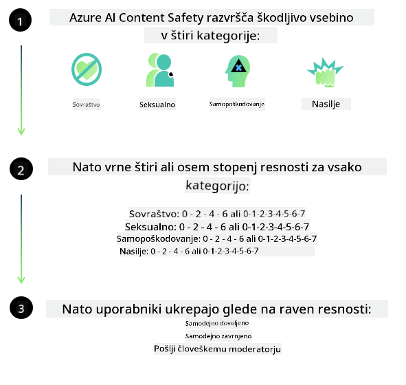
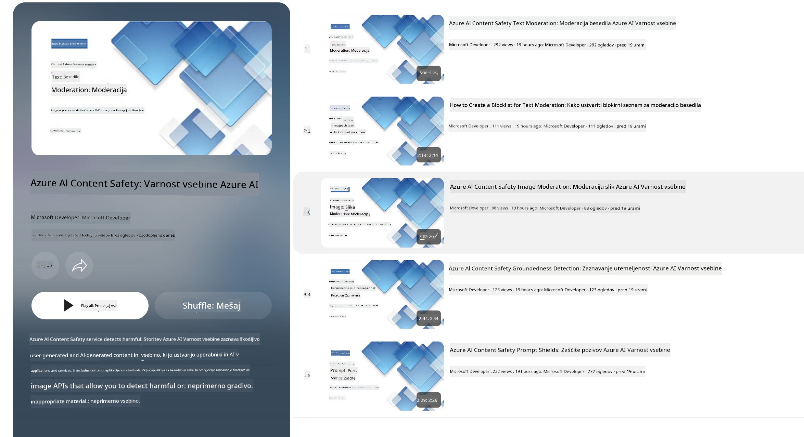

<!--
CO_OP_TRANSLATOR_METADATA:
{
  "original_hash": "c8273672cc57df2be675407a1383aaf0",
  "translation_date": "2025-05-09T06:29:36+00:00",
  "source_file": "md/01.Introduction/01/01.AISafety.md",
  "language_code": "sl"
}
-->
# AI varnost za Phi modele  
Družina modelov Phi je bila razvita v skladu z [Microsoft Responsible AI Standard](https://query.prod.cms.rt.microsoft.com/cms/api/am/binary/RE5cmFl), ki je podjetniški nabor zahtev, temelječih na šestih načelih: odgovornost, preglednost, pravičnost, zanesljivost in varnost, zasebnost in varnost ter vključevanje, ki sestavljajo [Microsoftova načela odgovorne umetne inteligence](https://www.microsoft.com/ai/responsible-ai).  

Kot pri prejšnjih Phi modelih je bil sprejet večplasten pristop k ocenjevanju varnosti in varnostnemu postopku po usposabljanju, z dodatnimi ukrepi za upoštevanje večjezičnih zmožnosti te izdaje. Naš pristop k usposabljanju in ocenjevanju varnosti, vključno s testiranjem v več jezikih in različnih kategorijah tveganj, je opisan v [Phi Safety Post-Training Paper](https://arxiv.org/abs/2407.13833). Čeprav Phi modeli koristijo ta pristop, naj razvijalci uporabljajo najboljše prakse odgovorne umetne inteligence, vključno z mapiranjem, merjenjem in ublažitvijo tveganj, povezanih z njihovim specifičnim primerom uporabe ter kulturnim in jezikovnim kontekstom.  

## Najboljše prakse  

Kot tudi drugi modeli lahko družina Phi modelov v določenih primerih deluje nepravično, nezanesljivo ali žaljivo.  

Nekatere omejitve vedenja SLM in LLM, ki jih je dobro poznati, vključujejo:  

- **Kakovost storitve:** Phi modeli so usposobljeni predvsem na angleškem besedilu. Jeziki, ki niso angleščina, bodo imeli slabše rezultate. Različice angleščine z manjšo zastopanostjo v učnih podatkih lahko dosegajo slabše rezultate kot standardna ameriška angleščina.  
- **Predstavitev škode in utrjevanje stereotipov:** Ti modeli lahko prekomerno ali premalo predstavljajo določene skupine ljudi, izbrišejo predstavitev nekaterih skupin ali okrepijo ponižujoče ali negativne stereotipe. Kljub varnostnemu postopku po usposabljanju te omejitve lahko še vedno obstajajo zaradi različnih ravni zastopanosti skupin ali prisotnosti negativnih stereotipov v učnih podatkih, ki odražajo vzorce iz resničnega sveta in družbene pristranskosti.  
- **Neprimerno ali žaljivo vsebino:** Ti modeli lahko ustvarjajo tudi druge vrste neprimerne ali žaljive vsebine, zaradi česar ni priporočljivo njihovo uvajanje v občutljivih okoljih brez dodatnih ukrepov, prilagojenih specifičnemu primeru uporabe.  
- **Zanesljivost informacij:** Jezikovni modeli lahko ustvarijo nesmiselno vsebino ali izmislijo podatke, ki se morda zdijo verodostojni, vendar so netočni ali zastareli.  
- **Omejen obseg za kodo:** Večina učnih podatkov za Phi-3 temelji na Pythonu in uporablja običajne pakete, kot so "typing, math, random, collections, datetime, itertools". Če model generira Python skripte z uporabo drugih paketov ali skripte v drugih jezikih, močno priporočamo ročno preverjanje vseh klicev API.  

Razvijalci naj uporabljajo najboljše prakse odgovorne umetne inteligence in so odgovorni, da specifični primer uporabe spoštuje veljavne zakone in predpise (npr. zasebnost, trgovina itd.).  

## Premisleki o odgovorni umetni inteligenci  

Kot tudi drugi jezikovni modeli lahko tudi Phi serija deluje nepravično, nezanesljivo ali žaljivo. Nekatere omejitve, ki jih je treba poznati, vključujejo:  

**Kakovost storitve:** Phi modeli so usposobljeni predvsem na angleškem besedilu. Jeziki, ki niso angleščina, bodo imeli slabše rezultate. Različice angleščine z manjšo zastopanostjo v učnih podatkih lahko dosegajo slabše rezultate kot standardna ameriška angleščina.  

**Predstavitev škode in utrjevanje stereotipov:** Ti modeli lahko prekomerno ali premalo predstavljajo določene skupine ljudi, izbrišejo predstavitev nekaterih skupin ali okrepijo ponižujoče ali negativne stereotipe. Kljub varnostnemu postopku po usposabljanju te omejitve lahko še vedno obstajajo zaradi različnih ravni zastopanosti skupin ali prisotnosti negativnih stereotipov v učnih podatkih, ki odražajo vzorce iz resničnega sveta in družbene pristranskosti.  

**Neprimerno ali žaljivo vsebino:** Ti modeli lahko ustvarjajo tudi druge vrste neprimerne ali žaljive vsebine, zaradi česar ni priporočljivo njihovo uvajanje v občutljivih okoljih brez dodatnih ukrepov, prilagojenih specifičnemu primeru uporabe.  
- **Zanesljivost informacij:** Jezikovni modeli lahko ustvarijo nesmiselno vsebino ali izmislijo podatke, ki se morda zdijo verodostojni, vendar so netočni ali zastareli.  

**Omejen obseg za kodo:** Večina učnih podatkov za Phi-3 temelji na Pythonu in uporablja običajne pakete, kot so "typing, math, random, collections, datetime, itertools". Če model generira Python skripte z uporabo drugih paketov ali skripte v drugih jezikih, močno priporočamo ročno preverjanje vseh klicev API.  

Razvijalci naj uporabljajo najboljše prakse odgovorne umetne inteligence in so odgovorni, da specifični primer uporabe spoštuje veljavne zakone in predpise (npr. zasebnost, trgovina itd.). Pomembna področja za razmislek vključujejo:  

**Dodeljevanje:** Modeli morda niso primerni za primere, ki lahko pomembno vplivajo na pravni status ali dodeljevanje virov oziroma življenjskih priložnosti (npr. stanovanje, zaposlitev, kredit itd.) brez dodatnih ocen in tehnik odpravljanja pristranskosti.  

**Tveganja v kritičnih scenarijih:** Razvijalci naj ocenijo primernost uporabe modelov v kritičnih primerih, kjer nepravični, nezanesljivi ali žaljivi izhodi lahko povzročijo velike stroške ali škodo. To vključuje svetovanje na občutljivih ali strokovnih področjih, kjer sta natančnost in zanesljivost ključni (npr. pravni ali zdravstveni nasveti). Na ravni aplikacije je treba glede na kontekst uvajanja uvesti dodatne varnostne ukrepe.  

**Dezinformacije:** Modeli lahko proizvajajo netočne informacije. Razvijalci naj sledijo najboljšim praksam preglednosti in obveščajo končne uporabnike, da komunicirajo z AI sistemom. Na ravni aplikacije lahko razvijalci zgradijo mehanizme povratnih informacij in procese, ki temeljijo na specifičnih informacijah glede na primer uporabe, tehniko poznano kot Retrieval Augmented Generation (RAG).  

**Generiranje škodljive vsebine:** Razvijalci naj ocenijo izhode glede na kontekst in uporabijo razpoložljive varnostne klasifikatorje ali prilagojene rešitve, primerne za njihov primer uporabe.  

**Zloraba:** Možne so tudi druge oblike zlorabe, kot so prevara, neželena pošta ali izdelava zlonamerne programske opreme, zato naj razvijalci zagotovijo, da njihove aplikacije ne kršijo veljavnih zakonov in predpisov.  

### Fino nastavljanje in varnost AI vsebin  

Po fino nastavitvi modela močno priporočamo uporabo ukrepov [Azure AI Content Safety](https://learn.microsoft.com/azure/ai-services/content-safety/overview) za spremljanje vsebine, ki jo ustvarijo modeli, prepoznavanje in blokiranje potencialnih tveganj, groženj in težav s kakovostjo.  

  

[Azure AI Content Safety](https://learn.microsoft.com/azure/ai-services/content-safety/overview) podpira tako besedilno kot slikovno vsebino. Lahko se izvaja v oblaku, v odklopljenih vsebnikih in na robnih/vgrajenih napravah.  

## Pregled Azure AI Content Safety  

Azure AI Content Safety ni rešitev po principu "ena velikost ustreza vsem"; lahko se prilagodi, da ustreza specifičnim politikam podjetij. Poleg tega njegovi večjezični modeli omogočajo razumevanje več jezikov hkrati.  

  

- **Azure AI Content Safety**  
- **Microsoft Developer**  
- **5 videoposnetkov**  

Storitev Azure AI Content Safety zaznava škodljivo vsebino, ki jo ustvarijo uporabniki ali AI, v aplikacijah in storitvah. Vključuje API-je za besedilo in slike, ki omogočajo zaznavanje škodljive ali neprimerne vsebine.  

[AI Content Safety Playlist](https://www.youtube.com/playlist?list=PLlrxD0HtieHjaQ9bJjyp1T7FeCbmVcPkQ)

**Izjava o omejitvi odgovornosti**:  
Ta dokument je bil preveden z uporabo AI prevajalske storitve [Co-op Translator](https://github.com/Azure/co-op-translator). Čeprav si prizadevamo za natančnost, vas prosimo, da upoštevate, da avtomatizirani prevodi lahko vsebujejo napake ali netočnosti. Izvirni dokument v njegovem izvorni jezik velja za avtoritativni vir. Za pomembne informacije priporočamo strokovni človeški prevod. Nismo odgovorni za morebitna nesporazumevanja ali napačne interpretacije, ki izhajajo iz uporabe tega prevoda.