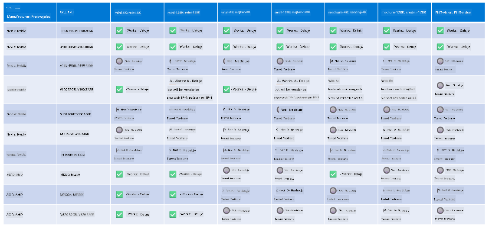

<!--
CO_OP_TRANSLATOR_METADATA:
{
  "original_hash": "8cdc17ce0f10535da30b53d23fe1a795",
  "translation_date": "2025-05-09T07:54:59+00:00",
  "source_file": "md/01.Introduction/01/01.Hardwaresupport.md",
  "language_code": "sl"
}
-->
# Phi Strojna Podpora

Microsoft Phi je optimiziran za ONNX Runtime in podpira Windows DirectML. Dobro deluje na različnih vrstah strojne opreme, vključno z GPU-ji, CPU-ji in celo mobilnimi napravami.

## Strojna oprema naprave  
Podprta strojna oprema vključuje:

- GPU SKU: RTX 4090 (DirectML)
- GPU SKU: 1 A100 80GB (CUDA)
- CPU SKU: Standard F64s v2 (64 vCPU-jev, 128 GiB pomnilnika)

## Mobilni SKU

- Android - Samsung Galaxy S21
- Apple iPhone 14 ali novejši z A16/A17 procesorjem

## Specifikacija strojne opreme Phi

- Minimalna potrebna konfiguracija.
- Windows: GPU z DirectX 12 podporo in najmanj 4 GB skupnega RAM-a

CUDA: NVIDIA GPU z zmogljivostjo Compute Capability >= 7.02



## Zagon onnxruntime na več GPU-jih

Trenutno so Phi ONNX modeli na voljo samo za 1 GPU. Možno je podpirati več GPU-jev za Phi modele, vendar ORT z 2 GPU-ji ne zagotavlja, da bo prinesel večjo prepustnost v primerjavi z dvema ločenima instancama ORT. Za najnovejše informacije obiščite [ONNX Runtime](https://onnxruntime.ai/).

Na [Build 2024 je GenAI ONNX ekipa](https://youtu.be/WLW4SE8M9i8?si=EtG04UwDvcjunyfC) napovedala, da so omogočili več instanc namesto več GPU-jev za Phi modele.

Trenutno to omogoča zagon ene instance onnxruntime ali onnxruntime-genai z okoljsko spremenljivko CUDA_VISIBLE_DEVICES, kot je prikazano spodaj.

```Python
CUDA_VISIBLE_DEVICES=0 python infer.py
CUDA_VISIBLE_DEVICES=1 python infer.py
```

Vabljeni k nadaljnjemu raziskovanju Phi v [Azure AI Foundry](https://ai.azure.com)

**Izjava o omejitvi odgovornosti**:  
Ta dokument je bil preveden z uporabo AI prevajalske storitve [Co-op Translator](https://github.com/Azure/co-op-translator). Čeprav si prizadevamo za natančnost, vas prosimo, da upoštevate, da avtomatizirani prevodi lahko vsebujejo napake ali netočnosti. Izvirni dokument v njegovem izvorni jezik je treba obravnavati kot avtoritativni vir. Za ključne informacije priporočamo strokovni človeški prevod. Nismo odgovorni za morebitna nesporazume ali napačne interpretacije, ki izhajajo iz uporabe tega prevoda.