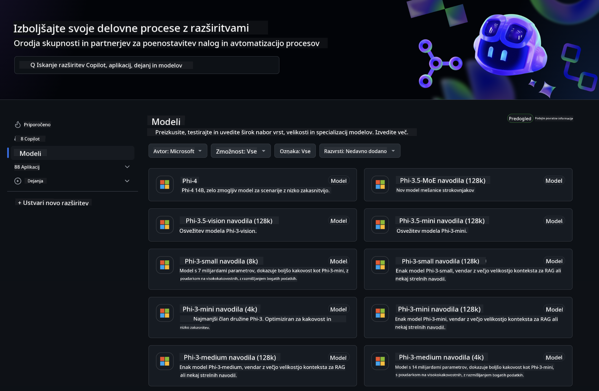
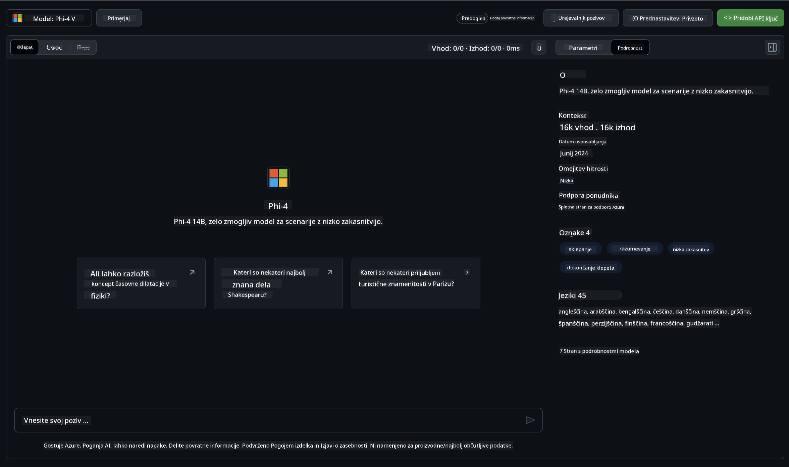
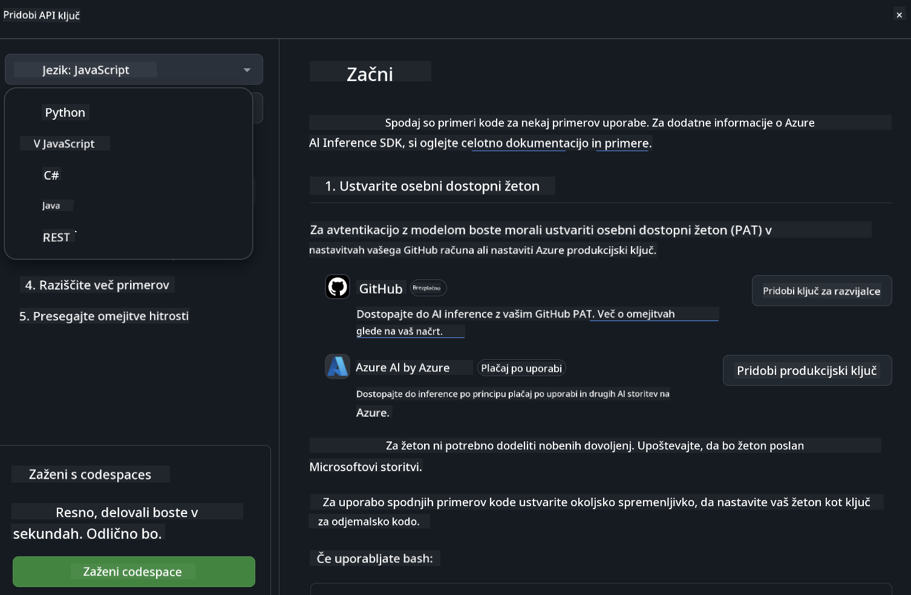
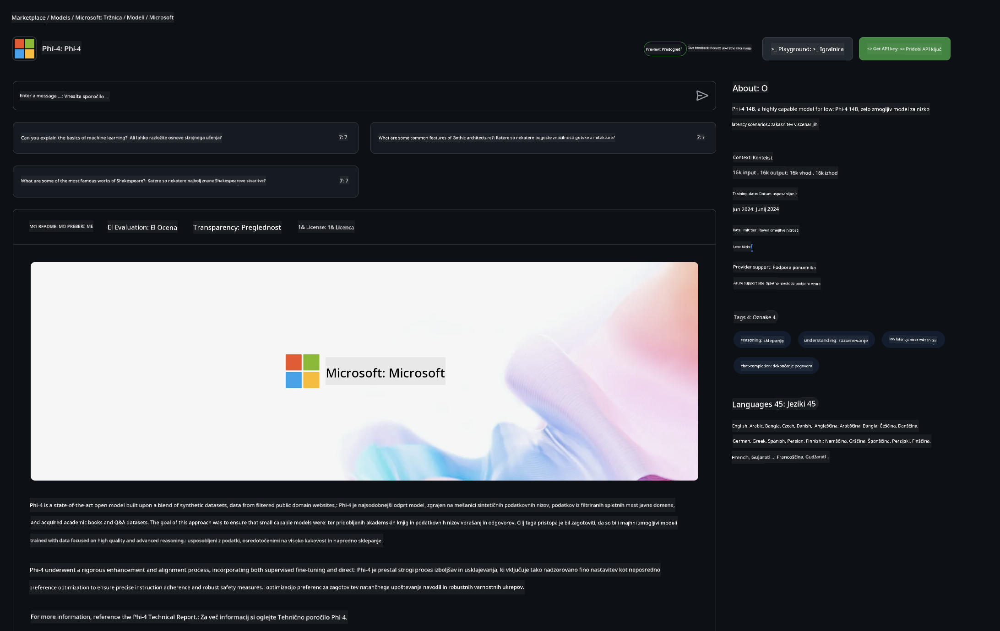

<!--
CO_OP_TRANSLATOR_METADATA:
{
  "original_hash": "fb67a08b9fc911a10ed58081fadef416",
  "translation_date": "2025-07-16T19:05:35+00:00",
  "source_file": "md/01.Introduction/02/02.GitHubModel.md",
  "language_code": "sl"
}
-->
## Phi družina v GitHub modelih

Dobrodošli na [GitHub Models](https://github.com/marketplace/models)! Vse je pripravljeno, da raziščete AI modele, gostovane na Azure AI.



Za več informacij o modelih, ki so na voljo na GitHub Models, si oglejte [GitHub Model Marketplace](https://github.com/marketplace/models)

## Na voljo modeli

Vsak model ima svoj prostor za preizkušanje in vzorčno kodo



### Phi družina v GitHub katalogu modelov

- [Phi-4](https://github.com/marketplace/models/azureml/Phi-4)

- [Phi-3.5-MoE instruct (128k)](https://github.com/marketplace/models/azureml/Phi-3-5-MoE-instruct)

- [Phi-3.5-vision instruct (128k)](https://github.com/marketplace/models/azureml/Phi-3-5-vision-instruct)

- [Phi-3.5-mini instruct (128k)](https://github.com/marketplace/models/azureml/Phi-3-5-mini-instruct)

- [Phi-3-Medium-128k-Instruct](https://github.com/marketplace/models/azureml/Phi-3-medium-128k-instruct)

- [Phi-3-medium-4k-instruct](https://github.com/marketplace/models/azureml/Phi-3-medium-4k-instruct)

- [Phi-3-mini-128k-instruct](https://github.com/marketplace/models/azureml/Phi-3-mini-128k-instruct)

- [Phi-3-mini-4k-instruct](https://github.com/marketplace/models/azureml/Phi-3-mini-4k-instruct)

- [Phi-3-small-128k-instruct](https://github.com/marketplace/models/azureml/Phi-3-small-128k-instruct)

- [Phi-3-small-8k-instruct](https://github.com/marketplace/models/azureml/Phi-3-small-8k-instruct)

## Začetek

Na voljo je nekaj osnovnih primerov, ki jih lahko takoj zaženete. Najdete jih v mapi samples. Če želite takoj skočiti na svoj najljubši programski jezik, so primeri na voljo v naslednjih jezikih:

- Python
- JavaScript
- C#
- Java
- cURL

Na voljo je tudi namensko Codespaces okolje za izvajanje primerov in modelov.



## Vzorec kode

Spodaj so primeri kode za nekaj primerov uporabe. Za dodatne informacije o Azure AI Inference SDK si oglejte celotno dokumentacijo in primere.

## Namestitev

1. Ustvarite osebni dostopni žeton  
Ni potrebno dodeliti nobenih dovoljenj žetonu. Upoštevajte, da bo žeton poslan Microsoftovi storitvi.

Za uporabo spodnjih primerov kode ustvarite okoljsko spremenljivko, ki nastavi vaš žeton kot ključ za odjemalsko kodo.

Če uporabljate bash:  
```
export GITHUB_TOKEN="<your-github-token-goes-here>"
```  
Če uporabljate powershell:  

```
$Env:GITHUB_TOKEN="<your-github-token-goes-here>"
```  

Če uporabljate Windows ukazno vrstico:  

```
set GITHUB_TOKEN=<your-github-token-goes-here>
```  

## Python vzorec

### Namestite odvisnosti  
Namestite Azure AI Inference SDK z uporabo pip (zahteva: Python >=3.8):

```
pip install azure-ai-inference
```  
### Zaženite osnovni primer kode

Ta primer prikazuje osnovni klic API-ja za dokončanje pogovora. Uporablja GitHub AI model inference endpoint in vaš GitHub žeton. Klic je sinhron.

```python
import os
from azure.ai.inference import ChatCompletionsClient
from azure.ai.inference.models import SystemMessage, UserMessage
from azure.core.credentials import AzureKeyCredential

endpoint = "https://models.inference.ai.azure.com"
model_name = "Phi-4"
token = os.environ["GITHUB_TOKEN"]

client = ChatCompletionsClient(
    endpoint=endpoint,
    credential=AzureKeyCredential(token),
)

response = client.complete(
    messages=[
        UserMessage(content="I have $20,000 in my savings account, where I receive a 4% profit per year and payments twice a year. Can you please tell me how long it will take for me to become a millionaire? Also, can you please explain the math step by step as if you were explaining it to an uneducated person?"),
    ],
    temperature=0.4,
    top_p=1.0,
    max_tokens=2048,
    model=model_name
)

print(response.choices[0].message.content)
```

### Zaženite večkrožni pogovor

Ta primer prikazuje večkrožni pogovor z API-jem za dokončanje pogovora. Pri uporabi modela za klepetalno aplikacijo morate upravljati zgodovino pogovora in poslati najnovejša sporočila modelu.

```
import os
from azure.ai.inference import ChatCompletionsClient
from azure.ai.inference.models import AssistantMessage, SystemMessage, UserMessage
from azure.core.credentials import AzureKeyCredential

token = os.environ["GITHUB_TOKEN"]
endpoint = "https://models.inference.ai.azure.com"
# Replace Model_Name
model_name = "Phi-4"

client = ChatCompletionsClient(
    endpoint=endpoint,
    credential=AzureKeyCredential(token),
)

messages = [
    SystemMessage(content="You are a helpful assistant."),
    UserMessage(content="What is the capital of France?"),
    AssistantMessage(content="The capital of France is Paris."),
    UserMessage(content="What about Spain?"),
]

response = client.complete(messages=messages, model=model_name)

print(response.choices[0].message.content)
```

### Pretakajte izhod

Za boljšo uporabniško izkušnjo boste želeli pretakati odziv modela, da se prvi token prikaže hitro in se izognete dolgemu čakanju na odgovor.

```
import os
from azure.ai.inference import ChatCompletionsClient
from azure.ai.inference.models import SystemMessage, UserMessage
from azure.core.credentials import AzureKeyCredential

token = os.environ["GITHUB_TOKEN"]
endpoint = "https://models.inference.ai.azure.com"
# Replace Model_Name
model_name = "Phi-4"

client = ChatCompletionsClient(
    endpoint=endpoint,
    credential=AzureKeyCredential(token),
)

response = client.complete(
    stream=True,
    messages=[
        SystemMessage(content="You are a helpful assistant."),
        UserMessage(content="Give me 5 good reasons why I should exercise every day."),
    ],
    model=model_name,
)

for update in response:
    if update.choices:
        print(update.choices[0].delta.content or "", end="")

client.close()
```

## BREZPLAČNA uporaba in omejitve hitrosti za GitHub modele



[Omejitve hitrosti za playground in brezplačno uporabo API-ja](https://docs.github.com/en/github-models/prototyping-with-ai-models#rate-limits) so namenjene temu, da lahko preizkušate modele in prototipirate svojo AI aplikacijo. Za uporabo nad temi omejitvami in za razširitev vaše aplikacije morate zagotoviti vire iz Azure računa in se tam tudi avtenticirati namesto z vašim GitHub osebnim dostopnim žetonom. V kodi ni potrebno spreminjati ničesar drugega. Uporabite to povezavo, da odkrijete, kako preseči brezplačne omejitve v Azure AI.

### Opozorila

Ne pozabite, da ko uporabljate model, eksperimentirate z AI, zato so možne vsebinske napake.

Funkcija je podvržena različnim omejitvam (vključno z zahtevki na minuto, zahtevki na dan, tokeni na zahtevo in sočasnimi zahtevki) in ni namenjena za produkcijsko uporabo.

GitHub Models uporablja Azure AI Content Safety. Ti filtri se ne dajo izklopiti kot del izkušnje GitHub Models. Če se odločite uporabljati modele preko plačljive storitve, prosimo, da konfigurirate svoje vsebinske filtre glede na vaše zahteve.

Ta storitev je podvržena GitHub-ovim pogojev predizdaje.

**Omejitev odgovornosti**:  
Ta dokument je bil preveden z uporabo AI prevajalske storitve [Co-op Translator](https://github.com/Azure/co-op-translator). Čeprav si prizadevamo za natančnost, vas opozarjamo, da avtomatizirani prevodi lahko vsebujejo napake ali netočnosti. Izvirni dokument v njegovem izvirnem jeziku velja za avtoritativni vir. Za pomembne informacije priporočamo strokovni človeški prevod. Za morebitna nesporazume ali napačne interpretacije, ki izhajajo iz uporabe tega prevoda, ne odgovarjamo.