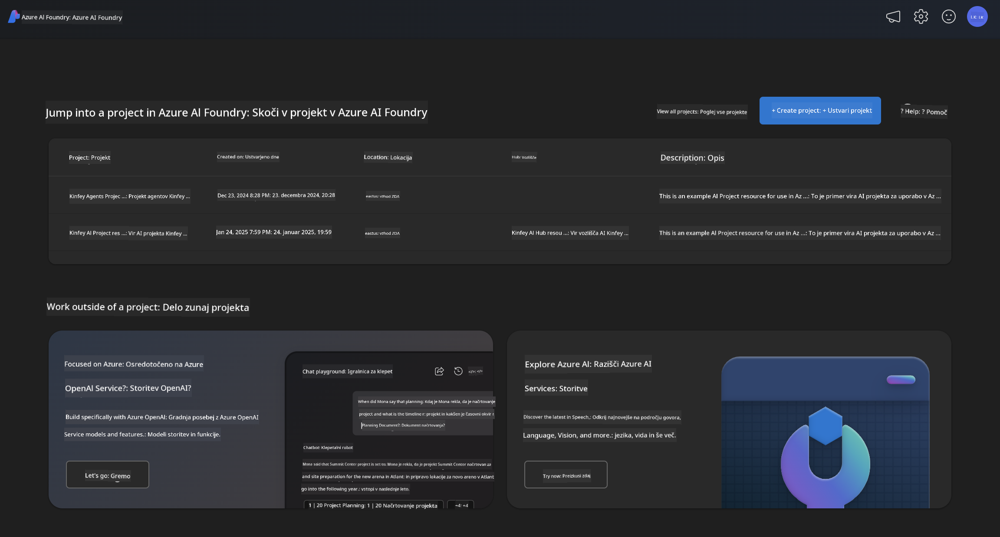
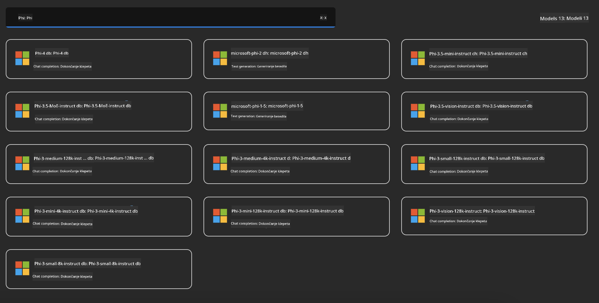
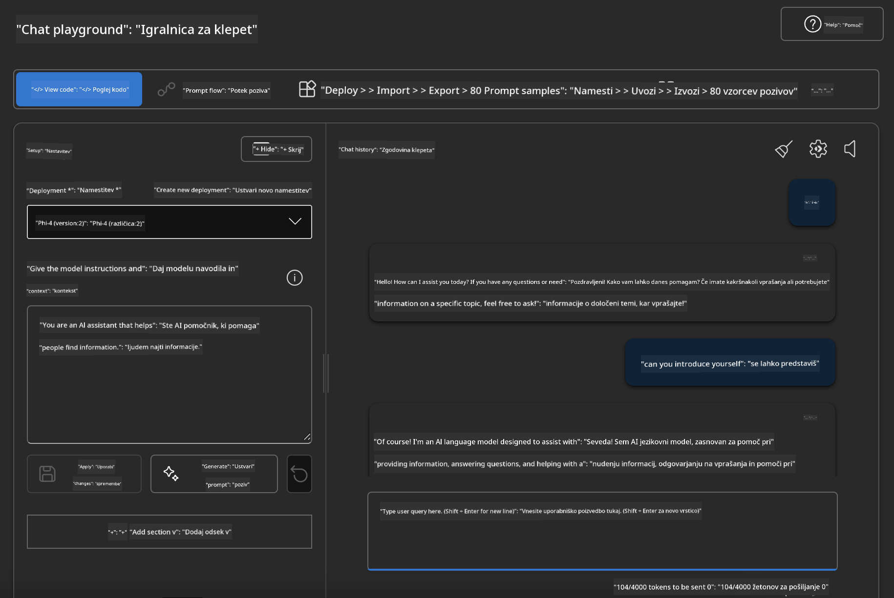

<!--
CO_OP_TRANSLATOR_METADATA:
{
  "original_hash": "3ae21dc5554e888defbe57946ee995ee",
  "translation_date": "2025-07-16T19:11:42+00:00",
  "source_file": "md/01.Introduction/02/03.AzureAIFoundry.md",
  "language_code": "sl"
}
-->
## Družina Phi v Azure AI Foundry

[Azure AI Foundry](https://ai.azure.com) je zaupanja vredna platforma, ki razvijalcem omogoča, da spodbujajo inovacije in oblikujejo prihodnost z AI na varen, zanesljiv in odgovoren način.

[Azure AI Foundry](https://ai.azure.com) je zasnovan za razvijalce, da:

- Gradijo generativne AI aplikacije na platformi podjetniške ravni.
- Raziskujejo, gradijo, testirajo in uvajajo z uporabo najsodobnejših AI orodij in ML modelov, ki temeljijo na odgovorni uporabi AI.
- Sodelujejo v ekipi skozi celoten življenjski cikel razvoja aplikacij.

Z Azure AI Foundry lahko raziskujete širok nabor modelov, storitev in zmogljivosti ter začnete graditi AI aplikacije, ki najbolje podpirajo vaše cilje. Platforma Azure AI Foundry omogoča enostavno skaliranje za preoblikovanje dokazov koncepta v polnopravne produkcijske aplikacije. Neprestano spremljanje in izboljševanje podpirata dolgoročni uspeh.



Poleg uporabe Azure AOAI Service v Azure AI Foundry lahko v katalogu modelov Azure AI Foundry uporabite tudi modele tretjih oseb. To je dobra izbira, če želite Azure AI Foundry uporabljati kot svojo platformo za AI rešitve.

Modeli družine Phi se hitro uvajajo preko kataloga modelov v Azure AI Foundry

[Microsoft Phi Models in Azure AI Foundry Models](https://ai.azure.com/explore/models/?selectedCollection=phi)



### **Uvajanje Phi-4 v Azure AI Foundry**


### **Testiranje Phi-4 v Azure AI Foundry Playground**



### **Zagon Python kode za klic Azure AI Foundry Phi-4**

```python

import os  
import base64
from openai import AzureOpenAI  
from azure.identity import DefaultAzureCredential, get_bearer_token_provider  
        
endpoint = os.getenv("ENDPOINT_URL", "Your Azure AOAI Service Endpoint")  
deployment = os.getenv("DEPLOYMENT_NAME", "Phi-4")  
      
token_provider = get_bearer_token_provider(  
    DefaultAzureCredential(),  
    "https://cognitiveservices.azure.com/.default"  
)  
  
client = AzureOpenAI(  
    azure_endpoint=endpoint,  
    azure_ad_token_provider=token_provider,  
    api_version="2024-05-01-preview",  
)  
  

chat_prompt = [
    {
        "role": "system",
        "content": "You are an AI assistant that helps people find information."
    },
    {
        "role": "user",
        "content": "can you introduce yourself"
    }
] 
    
# Include speech result if speech is enabled  
messages = chat_prompt 

completion = client.chat.completions.create(  
    model=deployment,  
    messages=messages,
    max_tokens=800,  
    temperature=0.7,  
    top_p=0.95,  
    frequency_penalty=0,  
    presence_penalty=0,
    stop=None,  
    stream=False  
)  
  
print(completion.to_json())  

```

**Omejitev odgovornosti**:  
Ta dokument je bil preveden z uporabo storitve za avtomatski prevod AI [Co-op Translator](https://github.com/Azure/co-op-translator). Čeprav si prizadevamo za natančnost, vas opozarjamo, da lahko avtomatski prevodi vsebujejo napake ali netočnosti. Izvirni dokument v njegovem izvirnem jeziku velja za avtoritativni vir. Za pomembne informacije priporočamo strokovni človeški prevod. Za morebitna nesporazume ali napačne interpretacije, ki izhajajo iz uporabe tega prevoda, ne odgovarjamo.