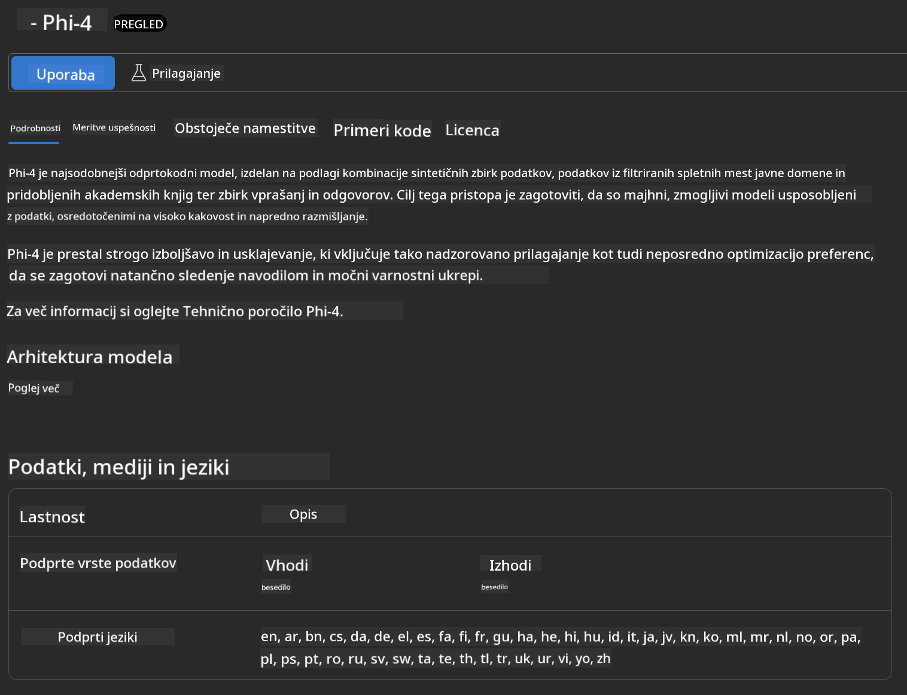
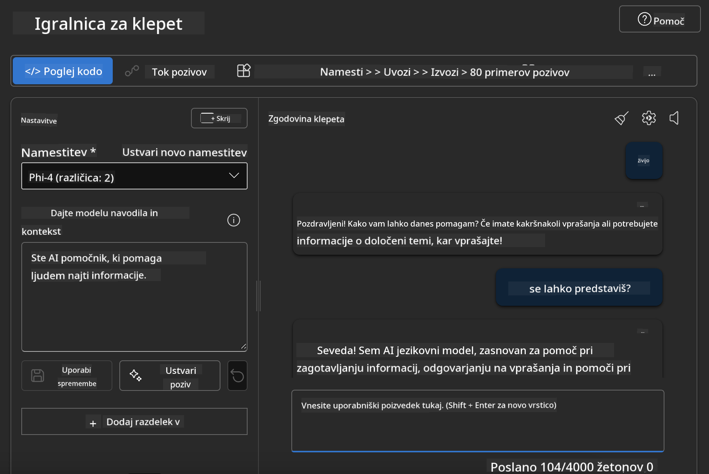

<!--
CO_OP_TRANSLATOR_METADATA:
{
  "original_hash": "3ae21dc5554e888defbe57946ee995ee",
  "translation_date": "2025-05-09T09:10:56+00:00",
  "source_file": "md/01.Introduction/02/03.AzureAIFoundry.md",
  "language_code": "sl"
}
-->
## Phi Family v Azure AI Foundry

[Azure AI Foundry](https://ai.azure.com) je zaupanja vreden platforma, ki razvijalcem omogoča, da s pomočjo AI varno, zanesljivo in odgovorno spodbujajo inovacije ter oblikujejo prihodnost.

[Azure AI Foundry](https://ai.azure.com) je namenjen razvijalcem, da:

- Gradijo generativne AI aplikacije na platformi podjetniške ravni.
- Raziskujejo, gradijo, testirajo in uvajajo z uporabo najsodobnejših AI orodij in ML modelov, temelječih na odgovorni uporabi AI.
- Sodelujejo v timu skozi celoten življenjski cikel razvoja aplikacij.

Z Azure AI Foundry lahko raziskujete široko paleto modelov, storitev in zmogljivosti ter začnete graditi AI aplikacije, ki najbolje služijo vašim ciljem. Platforma Azure AI Foundry omogoča enostavno skaliranje in preobrazbo konceptnih dokazov v polnopravne produkcijske aplikacije. Neprestano spremljanje in izboljševanje podpirata dolgoročni uspeh.


Poleg uporabe Azure AOAI Service v Azure AI Foundry lahko uporabite tudi modele tretjih oseb iz Azure AI Foundry Model Catalog. To je dobra izbira, če želite Azure AI Foundry uporabljati kot svojo AI rešitev.

Modeli Phi Family se hitro nameščajo preko Model Catalog v Azure AI Foundry.

[Microsoft Phi Models v Azure AI Foundry Models](https://ai.azure.com/explore/models/?selectedCollection=phi)


### **Namestitev Phi-4 v Azure AI Foundry**



### **Testiranje Phi-4 v Azure AI Foundry Playground**



### **Zagon Python kode za klic Azure AI Foundry Phi-4**

```python

import os  
import base64
from openai import AzureOpenAI  
from azure.identity import DefaultAzureCredential, get_bearer_token_provider  
        
endpoint = os.getenv("ENDPOINT_URL", "Your Azure AOAI Service Endpoint")  
deployment = os.getenv("DEPLOYMENT_NAME", "Phi-4")  
      
token_provider = get_bearer_token_provider(  
    DefaultAzureCredential(),  
    "https://cognitiveservices.azure.com/.default"  
)  
  
client = AzureOpenAI(  
    azure_endpoint=endpoint,  
    azure_ad_token_provider=token_provider,  
    api_version="2024-05-01-preview",  
)  
  

chat_prompt = [
    {
        "role": "system",
        "content": "You are an AI assistant that helps people find information."
    },
    {
        "role": "user",
        "content": "can you introduce yourself"
    }
] 
    
# Include speech result if speech is enabled  
messages = chat_prompt 

completion = client.chat.completions.create(  
    model=deployment,  
    messages=messages,
    max_tokens=800,  
    temperature=0.7,  
    top_p=0.95,  
    frequency_penalty=0,  
    presence_penalty=0,
    stop=None,  
    stream=False  
)  
  
print(completion.to_json())  

```

**Opozorilo**:  
Ta dokument je bil preveden z uporabo AI prevajalske storitve [Co-op Translator](https://github.com/Azure/co-op-translator). Čeprav si prizadevamo za natančnost, upoštevajte, da lahko avtomatizirani prevodi vsebujejo napake ali netočnosti. Izvirni dokument v izvirnem jeziku velja za avtoritativni vir. Za ključne informacije priporočamo strokovni človeški prevod. Nismo odgovorni za morebitna nesporazumevanja ali napačne interpretacije, ki izhajajo iz uporabe tega prevoda.