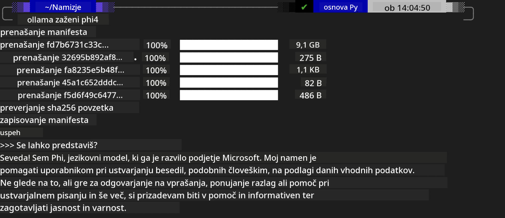
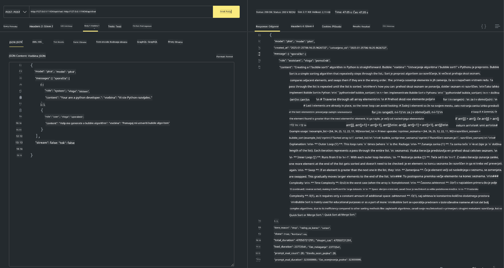

<!--
CO_OP_TRANSLATOR_METADATA:
{
  "original_hash": "0b38834693bb497f96bf53f0d941f9a1",
  "translation_date": "2025-07-16T19:19:34+00:00",
  "source_file": "md/01.Introduction/02/04.Ollama.md",
  "language_code": "sl"
}
-->
## Družina Phi v Ollama

[Ollama](https://ollama.com) omogoča več ljudem, da neposredno zaženejo odprtokodne LLM ali SLM preko preprostih skript, prav tako pa lahko zgradi API-je za podporo lokalnim aplikacijam Copilot.

## **1. Namestitev**

Ollama podpira delovanje na Windows, macOS in Linux. Ollama lahko namestite preko te povezave ([https://ollama.com/download](https://ollama.com/download)). Po uspešni namestitvi lahko neposredno uporabite Ollama skripto za klic Phi-3 preko terminala. Vse [razpoložljive knjižnice v Ollama](https://ollama.com/library) si lahko ogledate tukaj. Če odprete ta repozitorij v Codespace, bo Ollama že nameščen.

```bash

ollama run phi4

```

> [!NOTE]
> Model se bo ob prvem zagonu najprej prenesel. Seveda lahko tudi neposredno določite že preneseni model Phi-4. Za primer vzamemo WSL, kjer zaženemo ukaz. Ko je model uspešno prenesen, lahko z njim neposredno komunicirate v terminalu.



## **2. Klic API-ja phi-4 iz Ollama**

Če želite klicati Phi-4 API, ki ga generira Ollama, lahko v terminalu zaženete ta ukaz za zagon Ollama strežnika.

```bash

ollama serve

```

> [!NOTE]
> Če uporabljate macOS ali Linux, bodite pozorni, da se lahko pojavi naslednja napaka **"Error: listen tcp 127.0.0.1:11434: bind: address already in use"**. Ta napaka se lahko pojavi pri zagonu ukaza. Napako lahko ignorirate, saj običajno pomeni, da strežnik že teče, ali pa Ollama ustavite in ponovno zaženete:

**macOS**

```bash

brew services restart ollama

```

**Linux**

```bash

sudo systemctl stop ollama

```

Ollama podpira dva API-ja: generate in chat. Model lahko kličete preko Ollama API-ja glede na vaše potrebe, tako da pošljete zahteve lokalni storitvi, ki teče na vratih 11434.

**Chat**

```bash

curl http://127.0.0.1:11434/api/chat -d '{
  "model": "phi3",
  "messages": [
    {
      "role": "system",
      "content": "Your are a python developer."
    },
    {
      "role": "user",
      "content": "Help me generate a bubble algorithm"
    }
  ],
  "stream": false
  
}'

This is the result in Postman



## Additional Resources

Check the list of available models in Ollama in [their library](https://ollama.com/library).

Pull your model from the Ollama server using this command

```bash
ollama pull phi4
```

Run the model using this command

```bash
ollama run phi4
```

***Note:*** Visit this link [https://github.com/ollama/ollama/blob/main/docs/api.md](https://github.com/ollama/ollama/blob/main/docs/api.md) to learn more

## Calling Ollama from Python

You can use `requests` or `urllib3` to make requests to the local server endpoints used above. However, a popular way to use Ollama in Python is via the [openai](https://pypi.org/project/openai/) SDK, since Ollama provides OpenAI-compatible server endpoints as well.

Here is an example for phi3-mini:

```python
import openai

client = openai.OpenAI(
    base_url="http://localhost:11434/v1",
    api_key="nokeyneeded",
)

response = client.chat.completions.create(
    model="phi4",
    temperature=0.7,
    n=1,
    messages=[
        {"role": "system", "content": "You are a helpful assistant."},
        {"role": "user", "content": "Write a haiku about a hungry cat"},
    ],
)

print("Response:")
print(response.choices[0].message.content)
```

## Calling Ollama from JavaScript 

```javascript
// Primer povzetka datoteke s Phi-4
script({
    model: "ollama:phi4",
    title: "Povzetek s Phi-4",
    system: ["system"],
})

// Primer povzetka
const file = def("FILE", env.files)
$`Povzemi ${file} v enem odstavku.`
```

## Calling Ollama from C#

Create a new C# Console application and add the following NuGet package:

```bash
dotnet add package Microsoft.SemanticKernel --version 1.34.0
```

Then replace this code in the `Program.cs` file

```csharp
using Microsoft.SemanticKernel;
using Microsoft.SemanticKernel.ChatCompletion;

// dodajanje storitve chat completion preko lokalnega Ollama strežnika
#pragma warning disable SKEXP0001, SKEXP0003, SKEXP0010, SKEXP0011, SKEXP0050, SKEXP0052
builder.AddOpenAIChatCompletion(
    modelId: "phi4",
    endpoint: new Uri("http://localhost:11434/"),
    apiKey: "non required");

// pošlji preprost poziv v chat storitev
string prompt = "Napiši šalo o muckah";
var response = await kernel.InvokePromptAsync(prompt);
Console.WriteLine(response.GetValue<string>());
```

Run the app with the command:

```bash
dotnet run

**Omejitev odgovornosti**:  
Ta dokument je bil preveden z uporabo storitve za avtomatski prevod AI [Co-op Translator](https://github.com/Azure/co-op-translator). Čeprav si prizadevamo za natančnost, vas opozarjamo, da lahko avtomatski prevodi vsebujejo napake ali netočnosti. Izvirni dokument v njegovem izvirnem jeziku velja za avtoritativni vir. Za pomembne informacije priporočamo strokovni človeški prevod. Za morebitna nesporazume ali napačne interpretacije, ki izhajajo iz uporabe tega prevoda, ne odgovarjamo.