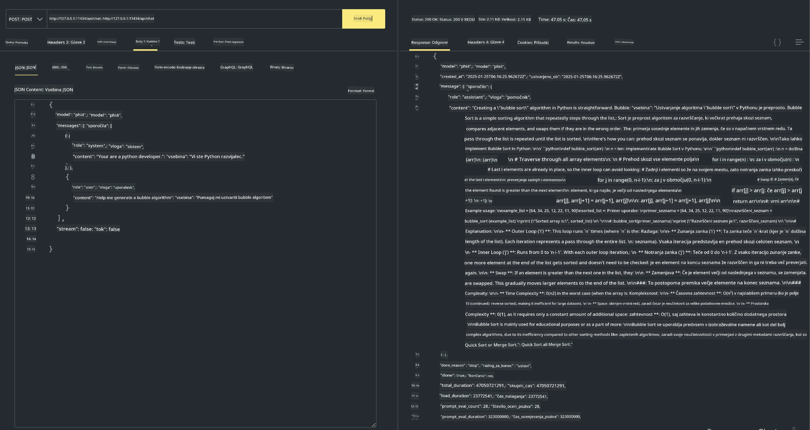

## Družina Phi v Ollama


[Ollama](https://ollama.com) omogoča več ljudem, da neposredno nameščajo odprtokodne LLM ali SLM prek preprostih skript in lahko tudi ustvarjajo API-je za pomoč pri lokalnih scenarijih uporabe Copilota.

## **1. Namestitev**

Ollama podpira delovanje na Windows, macOS in Linux. Ollama lahko namestite prek te povezave ([https://ollama.com/download](https://ollama.com/download)). Po uspešni namestitvi lahko neposredno v terminalu uporabite Ollama skripto za klic Phi-3. Vse [available libaries in Ollama](https://ollama.com/library) si lahko ogledate. Če odprete ta repozitorij v Codespace, bo Ollama že nameščen.

```bash

ollama run phi4

```

> [!NOTE]
> Model bo najprej prenesen ob prvem zaganjanju. Seveda lahko tudi neposredno navedete že preneseni model Phi-4. Kot primer za izvedbo ukaza bomo uporabili WSL. Ko je model uspešno prenesen, lahko neposredno komunicirate v terminalu.


## **2. Klic API-ja phi-4 iz Ollama**

Če želite poklicati Phi-4 API, ki ga zagotavlja Ollama, lahko v terminalu uporabite ta ukaz za zagon strežnika Ollama.

```bash

ollama serve

```

> [!NOTE]
> Če uporabljate macOS ali Linux, upoštevajte, da se lahko pojavi naslednja napaka **"Error: listen tcp 127.0.0.1:11434: bind: address already in use"**. To napako lahko dobite pri zagonu ukaza. Napako lahko bodisi prezrete, saj običajno pomeni, da strežnik že teče, ali pa Ollama ustavite in znova zaženete:

**macOS**

```bash

brew services restart ollama

```

**Linux**

```bash

sudo systemctl stop ollama

```

Ollama podpira dva API-ja: generate in chat. Modelne API-je, ki jih zagotavlja Ollama, lahko kličete glede na vaše potrebe, tako da pošiljate zahteve lokalni storitvi, ki teče na portu 11434.

**Chat**

```bash

curl http://127.0.0.1:11434/api/chat -d '{
  "model": "phi3",
  "messages": [
    {
      "role": "system",
      "content": "Your are a python developer."
    },
    {
      "role": "user",
      "content": "Help me generate a bubble algorithm"
    }
  ],
  "stream": false
  
}'
```

To je rezultat v Postmanu



## Dodatni viri

Preverite seznam razpoložljivih modelov v Ollama v [njihovi knjižnici](https://ollama.com/library).

Prenesite svoj model s strežnika Ollama z uporabo tega ukaza

```bash
ollama pull phi4
```

Zaženite model z uporabo tega ukaza

```bash
ollama run phi4
```

***Opomba:*** Obiščite to povezavo [https://github.com/ollama/ollama/blob/main/docs/api.md](https://github.com/ollama/ollama/blob/main/docs/api.md) za več informacij

## Klicanje Ollama iz Pythona

Za pošiljanje zahtevkov na lokalne končne točke, opisane zgoraj, lahko uporabite `requests` ali `urllib3`. Vendar je priljubljen način uporabe Ollama v Pythonu prek SDK-ja [openai](https://pypi.org/project/openai/), saj Ollama prav tako zagotavlja strežniške končne točke združljive z OpenAI.

Tukaj je primer za phi3-mini:

```python
import openai

client = openai.OpenAI(
    base_url="http://localhost:11434/v1",
    api_key="nokeyneeded",
)

response = client.chat.completions.create(
    model="phi4",
    temperature=0.7,
    n=1,
    messages=[
        {"role": "system", "content": "You are a helpful assistant."},
        {"role": "user", "content": "Write a haiku about a hungry cat"},
    ],
)

print("Response:")
print(response.choices[0].message.content)
```

## Klicanje Ollama iz JavaScripta 

```javascript
// Primer povzetka datoteke s Phi-4
script({
    model: "ollama:phi4",
    title: "Summarize with Phi-4",
    system: ["system"],
})

// Primer povzetka
const file = def("FILE", env.files)
$`Summarize ${file} in a single paragraph.`
```

## Klicanje Ollama iz C#

Ustvarite novo konzolno aplikacijo C# in dodajte naslednji paket NuGet:

```bash
dotnet add package Microsoft.SemanticKernel --version 1.34.0
```

Nato zamenjajte to kodo v datoteki `Program.cs`

```csharp
using Microsoft.SemanticKernel;
using Microsoft.SemanticKernel.ChatCompletion;

// add chat completion service using the local ollama server endpoint
#pragma warning disable SKEXP0001, SKEXP0003, SKEXP0010, SKEXP0011, SKEXP0050, SKEXP0052
builder.AddOpenAIChatCompletion(
    modelId: "phi4",
    endpoint: new Uri("http://localhost:11434/"),
    apiKey: "non required");

// invoke a simple prompt to the chat service
string prompt = "Write a joke about kittens";
var response = await kernel.InvokePromptAsync(prompt);
Console.WriteLine(response.GetValue<string>());
```

Zaženite aplikacijo z ukazom:

```bash
dotnet run
```

---

<!-- CO-OP TRANSLATOR DISCLAIMER START -->
Izjava o omejitvi odgovornosti:
Ta dokument je bil preveden z uporabo AI prevajalske storitve [Co-op Translator](https://github.com/Azure/co-op-translator). Čeprav si prizadevamo za natančnost, upoštevajte, da lahko avtomatski prevodi vsebujejo napake ali netočnosti. Za avtoritativni vir velja izvirni dokument v njegovem izvirnem jeziku. Za kritične informacije priporočamo strokovni človeški prevod. Ne odgovarjamo za morebitne nesporazume ali napačne razlage, ki izhajajo iz uporabe tega prevoda.
<!-- CO-OP TRANSLATOR DISCLAIMER END -->