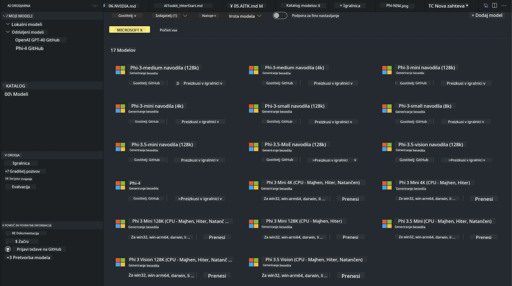
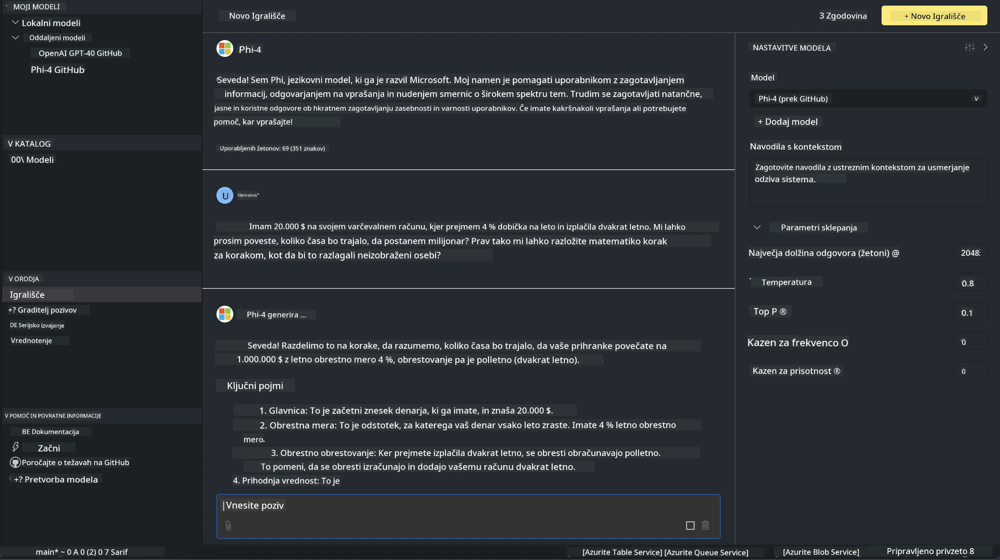

<!--
CO_OP_TRANSLATOR_METADATA:
{
  "original_hash": "4951d458c0b60c02cd1e751b40903877",
  "translation_date": "2025-07-16T19:31:22+00:00",
  "source_file": "md/01.Introduction/02/05.AITK.md",
  "language_code": "sl"
}
-->
# Phi Family v AITK

[AI Toolkit za VS Code](https://marketplace.visualstudio.com/items?itemName=ms-windows-ai-studio.windows-ai-studio) poenostavi razvoj generativnih AI aplikacij z združevanjem najsodobnejših orodij in modelov za razvoj AI iz Azure AI Foundry kataloga ter drugih katalogov, kot je Hugging Face. Lahko boste brskali po katalogu AI modelov, ki ga poganjata GitHub Models in Azure AI Foundry Model Catalogs, jih prenesli lokalno ali na daljavo, prilagajali, testirali in uporabljali v svoji aplikaciji.

Predogled AI Toolkit bo tekel lokalno. Lokalno sklepanje ali prilagajanje modela je odvisno od izbranega modela, za kar boste morda potrebovali GPU, kot je NVIDIA CUDA GPU. GitHub modele lahko prav tako zaženete neposredno z AITK.

## Začetek

[Več o namestitvi Windows podsistema za Linux](https://learn.microsoft.com/windows/wsl/install?WT.mc_id=aiml-137032-kinfeylo)

in [spremembi privzete distribucije](https://learn.microsoft.com/windows/wsl/install#change-the-default-linux-distribution-installed).

[AI Toolkit GitHub repozitorij](https://github.com/microsoft/vscode-ai-toolkit/)

- Windows, Linux, macOS
  
- Za finetuning na Windows in Linux boste potrebovali Nvidia GPU. Poleg tega **Windows** zahteva podsistem za Linux z Ubuntu distribucijo 18.4 ali novejšo. [Več o namestitvi Windows podsistema za Linux](https://learn.microsoft.com/windows/wsl/install) in [spremembi privzete distribucije](https://learn.microsoft.com/windows/wsl/install#change-the-default-linux-distribution-installed).

### Namestitev AI Toolkit

AI Toolkit je na voljo kot [razširitev za Visual Studio Code](https://code.visualstudio.com/docs/setup/additional-components#_vs-code-extensions), zato morate najprej namestiti [VS Code](https://code.visualstudio.com/docs/setup/windows?WT.mc_id=aiml-137032-kinfeylo) in nato prenesti AI Toolkit iz [VS Marketplace](https://marketplace.visualstudio.com/items?itemName=ms-windows-ai-studio.windows-ai-studio).  
[AI Toolkit je na voljo v Visual Studio Marketplace](https://marketplace.visualstudio.com/items?itemName=ms-windows-ai-studio.windows-ai-studio) in ga lahko namestite kot katerokoli drugo razširitev za VS Code.

Če niste seznanjeni z namestitvijo razširitev za VS Code, sledite tem korakom:

### Prijava

1. V vrstici z aktivnostmi v VS Code izberite **Extensions**
1. V iskalno polje za razširitve vpišite "AI Toolkit"
1. Izberite "AI Toolkit for Visual Studio code"
1. Kliknite **Install**

Zdaj ste pripravljeni za uporabo razširitve!

Pozvani boste k prijavi v GitHub, zato kliknite "Allow" za nadaljevanje. Preusmerjeni boste na prijavno stran GitHub.

Prijavite se in sledite navodilom. Po uspešni prijavi boste preusmerjeni nazaj v VS Code.

Ko je razširitev nameščena, se bo v vrstici z aktivnostmi prikazala ikona AI Toolkit.

Raziščimo razpoložljive možnosti!

### Razpoložljive možnosti

Glavni stranski meni AI Toolkit je organiziran v  

- **Models**
- **Resources**
- **Playground**  
- **Fine-tuning**
- **Evaluation**

so na voljo v razdelku Resources. Za začetek izberite **Model Catalog**.

### Prenos modela iz kataloga

Ko zaženete AI Toolkit iz stranske vrstice VS Code, lahko izberete med naslednjimi možnostmi:



- Poiščite podprt model v **Model Catalog** in ga prenesite lokalno
- Preizkusite sklepanje modela v **Model Playground**
- Prilagodite model lokalno ali na daljavo v **Model Fine-tuning**
- Namestite prilagojene modele v oblak preko ukazne palete AI Toolkit
- Ocenjevanje modelov

> [!NOTE]
>
> **GPU proti CPU**
>
> Opazili boste, da kartice modelov prikazujejo velikost modela, platformo in tip pospeševalnika (CPU, GPU). Za optimalno delovanje na **Windows napravah z vsaj enim GPU**, izberite različice modelov, ki ciljajo samo na Windows.
>
> Tako zagotovite model, optimiziran za pospeševalnik DirectML.
>
> Imena modelov so v formatu
>
> - `{model_name}-{accelerator}-{quantization}-{format}`.
>
>Za preverjanje, ali imate GPU na svoji Windows napravi, odprite **Task Manager** in izberite zavihek **Performance**. Če imate GPU(e), bodo navedeni pod imeni, kot so "GPU 0" ali "GPU 1".

### Zagon modela v playgroundu

Ko so vsi parametri nastavljeni, kliknite **Generate Project**.

Ko je model prenesen, izberite **Load in Playground** na kartici modela v katalogu:

- Začnite prenos modela
- Namestite vse potrebne predpogoje in odvisnosti
- Ustvarite delovno okolje VS Code



### Uporaba REST API v vaši aplikaciji

AI Toolkit vključuje lokalni REST API spletni strežnik **na vratih 5272**, ki uporablja [OpenAI chat completions format](https://platform.openai.com/docs/api-reference/chat/create).

To vam omogoča testiranje aplikacije lokalno, brez potrebe po uporabi oblačne AI storitve. Na primer, naslednja JSON datoteka prikazuje, kako konfigurirati telo zahteve:

```json
{
    "model": "Phi-4",
    "messages": [
        {
            "role": "user",
            "content": "what is the golden ratio?"
        }
    ],
    "temperature": 0.7,
    "top_p": 1,
    "top_k": 10,
    "max_tokens": 100,
    "stream": true
}
```

REST API lahko preizkusite z orodjem, kot je [Postman](https://www.postman.com/) ali ukazom CURL (Client URL):

```bash
curl -vX POST http://127.0.0.1:5272/v1/chat/completions -H 'Content-Type: application/json' -d @body.json
```

### Uporaba OpenAI odjemalske knjižnice za Python

```python
from openai import OpenAI

client = OpenAI(
    base_url="http://127.0.0.1:5272/v1/", 
    api_key="x" # required for the API but not used
)

chat_completion = client.chat.completions.create(
    messages=[
        {
            "role": "user",
            "content": "what is the golden ratio?",
        }
    ],
    model="Phi-4",
)

print(chat_completion.choices[0].message.content)
```

### Uporaba Azure OpenAI odjemalske knjižnice za .NET

Dodajte [Azure OpenAI odjemalsko knjižnico za .NET](https://www.nuget.org/packages/Azure.AI.OpenAI/) v svoj projekt preko NuGet:

```bash
dotnet add {project_name} package Azure.AI.OpenAI --version 1.0.0-beta.17
```

Dodajte datoteko C# z imenom **OverridePolicy.cs** v svoj projekt in prilepite naslednjo kodo:

```csharp
// OverridePolicy.cs
using Azure.Core.Pipeline;
using Azure.Core;

internal partial class OverrideRequestUriPolicy(Uri overrideUri)
    : HttpPipelineSynchronousPolicy
{
    private readonly Uri _overrideUri = overrideUri;

    public override void OnSendingRequest(HttpMessage message)
    {
        message.Request.Uri.Reset(_overrideUri);
    }
}
```

Nato prilepite naslednjo kodo v svojo datoteko **Program.cs**:

```csharp
// Program.cs
using Azure.AI.OpenAI;

Uri localhostUri = new("http://localhost:5272/v1/chat/completions");

OpenAIClientOptions clientOptions = new();
clientOptions.AddPolicy(
    new OverrideRequestUriPolicy(localhostUri),
    Azure.Core.HttpPipelinePosition.BeforeTransport);
OpenAIClient client = new(openAIApiKey: "unused", clientOptions);

ChatCompletionsOptions options = new()
{
    DeploymentName = "Phi-4",
    Messages =
    {
        new ChatRequestSystemMessage("You are a helpful assistant. Be brief and succinct."),
        new ChatRequestUserMessage("What is the golden ratio?"),
    }
};

StreamingResponse<StreamingChatCompletionsUpdate> streamingChatResponse
    = await client.GetChatCompletionsStreamingAsync(options);

await foreach (StreamingChatCompletionsUpdate chatChunk in streamingChatResponse)
{
    Console.Write(chatChunk.ContentUpdate);
}
```


## Prilagajanje modelov z AI Toolkit

- Začnite z iskanjem modelov in playgroundom.
- Prilagajanje modelov in sklepanje z uporabo lokalnih računalniških virov.
- Oddaljeno prilagajanje in sklepanje z uporabo Azure virov

[Prilagajanje z AI Toolkit](../../03.FineTuning/Finetuning_VSCodeaitoolkit.md)

## Viri za vprašanja in odgovore o AI Toolkit

Za najpogostejše težave in rešitve si oglejte našo [Q&A stran](https://github.com/microsoft/vscode-ai-toolkit/blob/main/archive/QA.md)

**Omejitev odgovornosti**:  
Ta dokument je bil preveden z uporabo AI prevajalske storitve [Co-op Translator](https://github.com/Azure/co-op-translator). Čeprav si prizadevamo za natančnost, vas opozarjamo, da avtomatizirani prevodi lahko vsebujejo napake ali netočnosti. Izvirni dokument v njegovem izvirnem jeziku velja za avtoritativni vir. Za ključne informacije priporočamo strokovni človeški prevod. Za morebitna nesporazume ali napačne interpretacije, ki izhajajo iz uporabe tega prevoda, ne odgovarjamo.