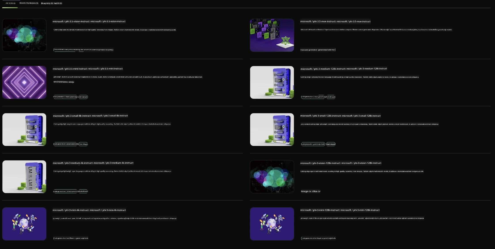

<!--
CO_OP_TRANSLATOR_METADATA:
{
  "original_hash": "7b08e277df2a9307f861ae54bc30c772",
  "translation_date": "2025-07-16T19:40:33+00:00",
  "source_file": "md/01.Introduction/02/06.NVIDIA.md",
  "language_code": "sl"
}
-->
## Družina Phi v NVIDIA NIM

NVIDIA NIM je niz enostavnih mikroservisov, zasnovanih za pospešitev uvajanja generativnih AI modelov v oblaku, podatkovnih centrih in delovnih postajah. NIM-je razvrščamo po družinah modelov in posameznih modelih. Na primer, NVIDIA NIM za velike jezikovne modele (LLM) prinaša moč najsodobnejših LLM-jev v poslovne aplikacije, kar omogoča vrhunsko obdelavo in razumevanje naravnega jezika.

NIM IT in DevOps ekipam omogoča enostavno samostojno gostovanje velikih jezikovnih modelov (LLM) v lastnih upravljanih okoljih, hkrati pa razvijalcem nudi industrijske standardne API-je, s katerimi lahko ustvarijo zmogljive kopilote, klepetalne bote in AI asistente, ki lahko preoblikujejo njihovo poslovanje. Z uporabo vrhunske NVIDIA-jeve GPU pospešitve in skalabilnega uvajanja NIM ponuja najhitrejšo pot do inferenc z neprekosljivo zmogljivostjo.

NVIDIA NIM lahko uporabite za inferenco modelov družine Phi



### **Primeri - Phi-3-Vision v NVIDIA NIM**

Predstavljajte si, da imate sliko (`demo.png`) in želite ustvariti Python kodo, ki to sliko obdela in shrani novo različico (`phi-3-vision.jpg`).

Zgornja koda avtomatizira ta postopek tako, da:

1. Nastavi okolje in potrebne konfiguracije.
2. Ustvari poziv, ki modelu naroči, naj generira zahtevano Python kodo.
3. Pošlje poziv modelu in zbere ustvarjeno kodo.
4. Izvleče in zažene ustvarjeno kodo.
5. Prikaže izvirno in obdelano sliko.

Ta pristop izkorišča moč AI za avtomatizacijo nalog obdelave slik, kar omogoča lažje in hitrejše doseganje ciljev.

[Primer rešitve kode](../../../../../code/06.E2E/E2E_Nvidia_NIM_Phi3_Vision.ipynb)

Poglejmo si, kaj celotna koda počne korak za korakom:

1. **Namestitev potrebnega paketa**:
    ```python
    !pip install langchain_nvidia_ai_endpoints -U
    ```
    Ta ukaz namesti paket `langchain_nvidia_ai_endpoints` in zagotovi, da je nameščena najnovejša različica.

2. **Uvoz potrebnih modulov**:
    ```python
    from langchain_nvidia_ai_endpoints import ChatNVIDIA
    import getpass
    import os
    import base64
    ```
    Ti uvozi vključujejo potrebne module za delo z NVIDIA AI končnimi točkami, varno upravljanje gesel, interakcijo z operacijskim sistemom ter kodiranje/dekodiranje podatkov v base64 formatu.

3. **Nastavitev API ključa**:
    ```python
    if not os.getenv("NVIDIA_API_KEY"):
        os.environ["NVIDIA_API_KEY"] = getpass.getpass("Enter your NVIDIA API key: ")
    ```
    Ta koda preveri, ali je okoljska spremenljivka `NVIDIA_API_KEY` nastavljena. Če ni, uporabnika varno pozove, da vnese svoj API ključ.

4. **Določitev modela in poti do slike**:
    ```python
    model = 'microsoft/phi-3-vision-128k-instruct'
    chat = ChatNVIDIA(model=model)
    img_path = './imgs/demo.png'
    ```
    Tukaj se določi model, ustvari instanca `ChatNVIDIA` z izbranim modelom in definira pot do slikovne datoteke.

5. **Ustvarjanje besedilnega poziva**:
    ```python
    text = "Please create Python code for image, and use plt to save the new picture under imgs/ and name it phi-3-vision.jpg."
    ```
    Definira se besedilni poziv, ki modelu naroči, naj generira Python kodo za obdelavo slike.

6. **Kodiranje slike v base64**:
    ```python
    with open(img_path, "rb") as f:
        image_b64 = base64.b64encode(f.read()).decode()
    image = f''
    ```
    Ta koda prebere slikovno datoteko, jo kodira v base64 in ustvari HTML oznako za sliko z vključenimi podatki.

7. **Združevanje besedila in slike v poziv**:
    ```python
    prompt = f"{text} {image}"
    ```
    Besedilni poziv in HTML oznaka slike se združita v en sam niz.

8. **Generiranje kode z uporabo ChatNVIDIA**:
    ```python
    code = ""
    for chunk in chat.stream(prompt):
        print(chunk.content, end="")
        code += chunk.content
    ```
    Ta koda pošlje poziv modelu `ChatNVIDIA` in zbira generirano kodo v delih, pri čemer vsak del izpiše in doda v spremenljivko `code`.

9. **Izvleček Python kode iz generirane vsebine**:
    ```python
    begin = code.index('```python') + 9
    code = code[begin:]
    end = code.index('```')
    code = code[:end]
    ```
    Iz generirane vsebine se odstrani markdown oblika in izvleče dejanska Python koda.

10. **Zagon generirane kode**:
    ```python
    import subprocess
    result = subprocess.run(["python", "-c", code], capture_output=True)
    ```
    Izvlečena Python koda se zažene kot podproces in zajame njen izhod.

11. **Prikaz slik**:
    ```python
    from IPython.display import Image, display
    display(Image(filename='./imgs/phi-3-vision.jpg'))
    display(Image(filename='./imgs/demo.png'))
    ```
    Te vrstice prikažejo slike z uporabo modula `IPython.display`.

**Omejitev odgovornosti**:  
Ta dokument je bil preveden z uporabo AI prevajalske storitve [Co-op Translator](https://github.com/Azure/co-op-translator). Čeprav si prizadevamo za natančnost, vas opozarjamo, da avtomatizirani prevodi lahko vsebujejo napake ali netočnosti. Izvirni dokument v njegovem izvirnem jeziku velja za avtoritativni vir. Za ključne informacije priporočamo strokovni človeški prevod. Za morebitna nesporazume ali napačne interpretacije, ki izhajajo iz uporabe tega prevoda, ne odgovarjamo.