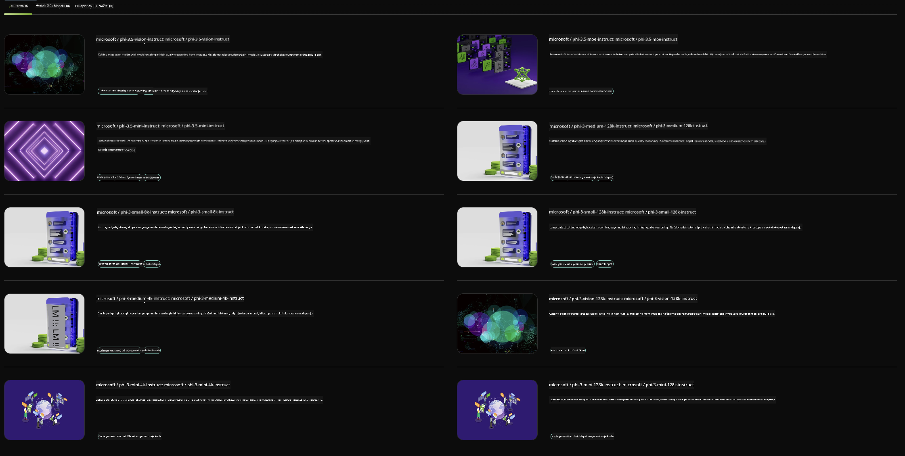

<!--
CO_OP_TRANSLATOR_METADATA:
{
  "original_hash": "7b08e277df2a9307f861ae54bc30c772",
  "translation_date": "2025-05-09T10:05:10+00:00",
  "source_file": "md/01.Introduction/02/06.NVIDIA.md",
  "language_code": "sl"
}
-->
## Phi Family in NVIDIA NIM

NVIDIA NIM je niz mikroservisov, ki so enostavni za uporabo in namenjeni pospeševanju uvajanja generativnih AI modelov v oblaku, podatkovnih centrih in delovnih postajah. NIM-i so razvrščeni po družinah modelov in posameznih modelih. Na primer, NVIDIA NIM za velike jezikovne modele (LLM) prinaša moč najsodobnejših LLM-ov v poslovne aplikacije, kar omogoča vrhunsko obdelavo in razumevanje naravnega jezika.

NIM omogoča IT in DevOps ekipam, da enostavno gostijo velike jezikovne modele (LLM) v lastnih upravljanih okoljih, hkrati pa razvijalcem zagotavlja industrijske standardne API-je, s katerimi lahko ustvarijo zmogljive kopilote, klepetalne bote in AI asistente, ki lahko spremenijo njihovo poslovanje. Z uporabo vrhunske NVIDIA GPU pospešitve in skalabilnega uvajanja NIM ponuja najhitrejšo pot do inferenc z neprimerljivo zmogljivostjo.

NVIDIA NIM lahko uporabite za inferenco Phi Family modelov



### **Primeri - Phi-3-Vision v NVIDIA NIM**

Predstavljajte si, da imate sliko (`demo.png`) in želite ustvariti Python kodo, ki to sliko obdela in shrani novo različico (`phi-3-vision.jpg`).

Zgornja koda avtomatizira ta postopek tako, da:

1. Nastavi okolje in potrebne konfiguracije.
2. Ustvari poziv, ki modelu naroči, naj generira zahtevano Python kodo.
3. Pošlje poziv modelu in zbere ustvarjeno kodo.
4. Izvleče in zažene ustvarjeno kodo.
5. Prikaže izvirno in obdelano sliko.

Ta pristop izkorišča moč AI za avtomatizacijo nalog obdelave slik, kar olajša in pohitri doseganje vaših ciljev.

[Sample Code Solution](../../../../../code/06.E2E/E2E_Nvidia_NIM_Phi3_Vision.ipynb)

Poglejmo si podrobneje, kaj celotna koda počne korak za korakom:

1. **Namesti potrebni paket**:  
    ```python
    !pip install langchain_nvidia_ai_endpoints -U
    ```  
    Ta ukaz namesti paket `langchain_nvidia_ai_endpoints` in zagotovi, da je različica najnovejša.

2. **Uvozi potrebne module**:  
    ```python
    from langchain_nvidia_ai_endpoints import ChatNVIDIA
    import getpass
    import os
    import base64
    ```  
    Ti uvozi vključujejo module za delo z NVIDIA AI endpointi, varno upravljanje gesel, interakcijo z operacijskim sistemom in kodiranje/dekodiranje v base64 formatu.

3. **Nastavi API ključ**:  
    ```python
    if not os.getenv("NVIDIA_API_KEY"):
        os.environ["NVIDIA_API_KEY"] = getpass.getpass("Enter your NVIDIA API key: ")
    ```  
    Ta koda preveri, ali je okoljska spremenljivka `NVIDIA_API_KEY` nastavljena. Če ni, uporabnika varno pozove k vnosu API ključa.

4. **Določi model in pot do slike**:  
    ```python
    model = 'microsoft/phi-3-vision-128k-instruct'
    chat = ChatNVIDIA(model=model)
    img_path = './imgs/demo.png'
    ```  
    Tukaj se nastavi model, ustvari primerek `ChatNVIDIA` z določenim modelom in določi pot do slikovne datoteke.

5. **Ustvari tekstovni poziv**:  
    ```python
    text = "Please create Python code for image, and use plt to save the new picture under imgs/ and name it phi-3-vision.jpg."
    ```  
    Določi tekstovni poziv, ki modelu naroči, naj generira Python kodo za obdelavo slike.

6. **Kodira sliko v base64**:  
    ```python
    with open(img_path, "rb") as f:
        image_b64 = base64.b64encode(f.read()).decode()
    image = f''
    ```  
    Ta koda prebere slikovno datoteko, jo kodira v base64 in ustvari HTML tag za sliko z vključenimi podatki.

7. **Združi tekst in sliko v poziv**:  
    ```python
    prompt = f"{text} {image}"
    ```  
    Združi tekstovni poziv in HTML slikovni tag v en sam niz.

8. **Generira kodo z uporabo ChatNVIDIA**:  
    ```python
    code = ""
    for chunk in chat.stream(prompt):
        print(chunk.content, end="")
        code += chunk.content
    ```  
    Ta koda pošlje poziv modelu `ChatNVIDIA` model and collects the generated code in chunks, printing and appending each chunk to the `code` niz.

9. **Izvleče Python kodo iz generirane vsebine**:  
    ```python
    begin = code.index('```python') + 9  
    code = code[begin:]  
    end = code.index('```')
    code = code[:end]
    ```  
    Ta del izvleče dejansko Python kodo iz generirane vsebine tako, da odstrani markdown oblikovanje.

10. **Zažene generirano kodo**:  
    ```python
    import subprocess
    result = subprocess.run(["python", "-c", code], capture_output=True)
    ```  
    Zažene izvlečeno Python kodo kot podproces in zajame njen izhod.

11. **Prikaže slike**:  
    ```python
    from IPython.display import Image, display
    display(Image(filename='./imgs/phi-3-vision.jpg'))
    display(Image(filename='./imgs/demo.png'))
    ```  
    Te vrstice prikažejo slike z uporabo modula `IPython.display`.

**Omejitev odgovornosti**:  
Ta dokument je bil preveden z uporabo AI prevajalske storitve [Co-op Translator](https://github.com/Azure/co-op-translator). Čeprav si prizadevamo za natančnost, vas prosimo, da upoštevate, da avtomatizirani prevodi lahko vsebujejo napake ali netočnosti. Izvirni dokument v njegovem izvirnem jeziku velja za avtoritativni vir. Za ključne informacije priporočamo strokovni človeški prevod. Ne odgovarjamo za morebitna nesporazumevanja ali napačne interpretacije, ki izhajajo iz uporabe tega prevoda.