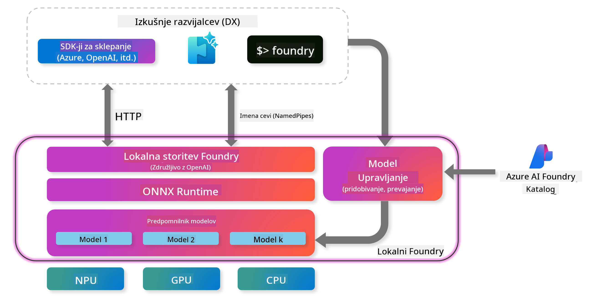

<!--
CO_OP_TRANSLATOR_METADATA:
{
  "original_hash": "52973a5680a65a810aa80b7036afd31f",
  "translation_date": "2025-07-16T19:51:51+00:00",
  "source_file": "md/01.Introduction/02/07.FoundryLocal.md",
  "language_code": "sl"
}
-->
## Začetek z modeli Phi-Family v Foundry Local

### Uvod v Foundry Local

Foundry Local je zmogljiva rešitev za AI inferenco na napravi, ki prinaša zmogljivosti AI na ravni podjetij neposredno na vašo lokalno strojno opremo. Ta vodič vas bo popeljal skozi namestitev in uporabo modelov Phi-Family z Foundry Local, kar vam omogoča popoln nadzor nad vašimi AI nalogami ob ohranjanju zasebnosti in znižanju stroškov.

Foundry Local zagotavlja prednosti glede zmogljivosti, zasebnosti, prilagodljivosti in stroškov z izvajanjem AI modelov lokalno na vaši napravi. Brezhibno se integrira v vaše obstoječe delovne procese in aplikacije preko intuitivnega CLI, SDK in REST API.



### Zakaj izbrati Foundry Local?

Razumevanje prednosti Foundry Local vam bo pomagalo sprejeti premišljene odločitve glede vaše strategije uvajanja AI:

- **Inferenca na napravi:** Zaženite modele lokalno na svoji strojni opremi, s čimer znižate stroške in hkrati ohranite vse podatke na svoji napravi.

- **Prilagoditev modelov:** Izberite med vnaprej pripravljenimi modeli ali uporabite svoje, da izpolnite specifične zahteve in primere uporabe.

- **Učinkovitost stroškov:** Odpravite ponavljajoče se stroške oblačnih storitev z uporabo obstoječe strojne opreme, kar AI naredi bolj dostopno.

- **Brezhibna integracija:** Povežite se z vašimi aplikacijami preko SDK, API končnih točk ali CLI, z enostavnim razširjanjem na Azure AI Foundry, ko vaše potrebe rastejo.

> **Opomba za začetek:** Ta vodič se osredotoča na uporabo Foundry Local preko CLI in SDK vmesnikov. Naučili se boste obeh pristopov, da boste lažje izbrali najboljšo metodo za vaš primer uporabe.

## Del 1: Namestitev Foundry Local CLI

### Korak 1: Namestitev

Foundry Local CLI je vaš vhod v upravljanje in zagon AI modelov lokalno. Začnimo z njegovo namestitvijo na vaš sistem.

**Podprte platforme:** Windows in macOS

Za podrobna navodila za namestitev si oglejte [uradno dokumentacijo Foundry Local](https://github.com/microsoft/Foundry-Local/blob/main/README.md).

### Korak 2: Raziščite razpoložljive modele

Ko imate nameščen Foundry Local CLI, lahko odkrijete, kateri modeli so na voljo za vaš primer uporabe. Ta ukaz vam bo prikazal vse podprte modele:

```bash
foundry model list
```

### Korak 3: Razumevanje modelov Phi Family

Phi Family ponuja vrsto modelov, optimiziranih za različne primere uporabe in strojne konfiguracije. Tukaj so Phi modeli, ki so na voljo v Foundry Local:

**Razpoložljivi Phi modeli:** 

- **phi-3.5-mini** - Kompakten model za osnovne naloge
- **phi-3-mini-128k** - Razširjena različica za daljše pogovore
- **phi-3-mini-4k** - Standardni model za splošno uporabo
- **phi-4** - Napreden model z izboljšanimi zmogljivostmi
- **phi-4-mini** - Lažja različica Phi-4
- **phi-4-mini-reasoning** - Specializiran za kompleksne naloge sklepanja

> **Združljivost s strojno opremo:** Vsak model je mogoče konfigurirati za različne vrste strojne pospešitve (CPU, GPU) glede na zmogljivosti vašega sistema.

### Korak 4: Zagon prvega Phi modela

Začnimo s praktičnim primerom. Zaženemo model `phi-4-mini-reasoning`, ki odlično rešuje kompleksne probleme korak za korakom.

**Ukaz za zagon modela:**

```bash
foundry model run Phi-4-mini-reasoning-generic-cpu
```

> **Prva namestitev:** Ob prvem zagonu modela bo Foundry Local samodejno prenesel model na vašo lokalno napravo. Čas prenosa je odvisen od hitrosti vaše povezave, zato prosimo za potrpežljivost med začetno namestitvijo.

### Korak 5: Testiranje modela z resničnim problemom

Preizkusimo model z klasično logično nalogo, da vidimo, kako se spopada s postopnim sklepnim razmišljanjem:

**Primer problema:**

```txt
Please calculate the following step by step: Now there are pheasants and rabbits in the same cage, there are thirty-five heads on top and ninety-four legs on the bottom, how many pheasants and rabbits are there?
```

**Pričakovano vedenje:** Model bi moral razčleniti problem na logične korake, pri čemer uporabi dejstvo, da fazani imajo 2 nogi, zajci pa 4 noge, za reševanje sistema enačb.

**Rezultati:**


## Del 2: Gradnja aplikacij z Foundry Local SDK

### Zakaj uporabljati SDK?

Medtem ko je CLI odličen za testiranje in hitre interakcije, vam SDK omogoča, da Foundry Local programersko integrirate v svoje aplikacije. To odpira možnosti za:

- Gradnjo prilagojenih AI aplikacij
- Ustvarjanje avtomatiziranih delovnih tokov
- Integracijo AI zmogljivosti v obstoječe sisteme
- Razvoj chatbotov in interaktivnih orodij

### Podprani programski jeziki

Foundry Local nudi podporo SDK za več programskih jezikov, da ustreza vašim razvojnim željam:

**📦 Razpoložljivi SDK-ji:**

- **C# (.NET):** [SDK Dokumentacija in primeri](https://github.com/microsoft/Foundry-Local/tree/main/sdk/cs)
- **Python:** [SDK Dokumentacija in primeri](https://github.com/microsoft/Foundry-Local/tree/main/sdk/python)
- **JavaScript:** [SDK Dokumentacija in primeri](https://github.com/microsoft/Foundry-Local/tree/main/sdk/js)
- **Rust:** [SDK Dokumentacija in primeri](https://github.com/microsoft/Foundry-Local/tree/main/sdk/rust)

### Naslednji koraki

1. **Izberite svoj priljubljeni SDK** glede na razvojno okolje
2. **Sledite dokumentaciji za izbran SDK** za podrobna navodila za implementacijo
3. **Začnite z enostavnimi primeri** preden se lotite kompleksnih aplikacij
4. **Raziskujte vzorčno kodo** v vsakem SDK repozitoriju

## Zaključek

Zdaj ste se naučili, kako:
- ✅ Namestiti in nastaviti Foundry Local CLI
- ✅ Odkriti in zagnati modele Phi Family
- ✅ Testirati modele z resničnimi problemi
- ✅ Razumeti možnosti SDK za razvoj aplikacij

Foundry Local ponuja močno osnovo za prinašanje AI zmogljivosti neposredno v vaše lokalno okolje, kar vam daje nadzor nad zmogljivostjo, zasebnostjo in stroški, hkrati pa ohranja fleksibilnost za razširitev na oblačne rešitve, ko je to potrebno.

**Omejitev odgovornosti**:  
Ta dokument je bil preveden z uporabo storitve za avtomatski prevod AI [Co-op Translator](https://github.com/Azure/co-op-translator). Čeprav si prizadevamo za natančnost, vas opozarjamo, da lahko avtomatski prevodi vsebujejo napake ali netočnosti. Izvirni dokument v njegovem izvirnem jeziku velja za avtoritativni vir. Za pomembne informacije priporočamo strokovni človeški prevod. Za morebitna nesporazume ali napačne interpretacije, ki izhajajo iz uporabe tega prevoda, ne odgovarjamo.