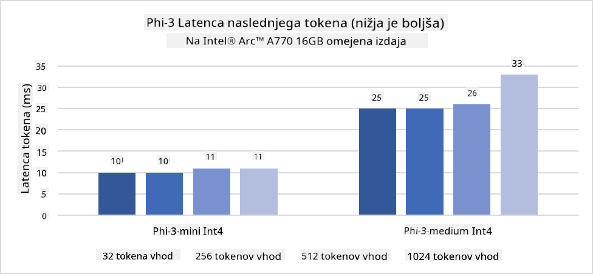
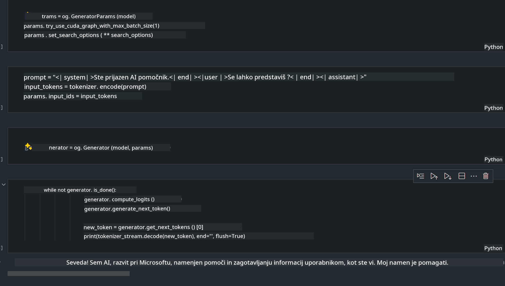
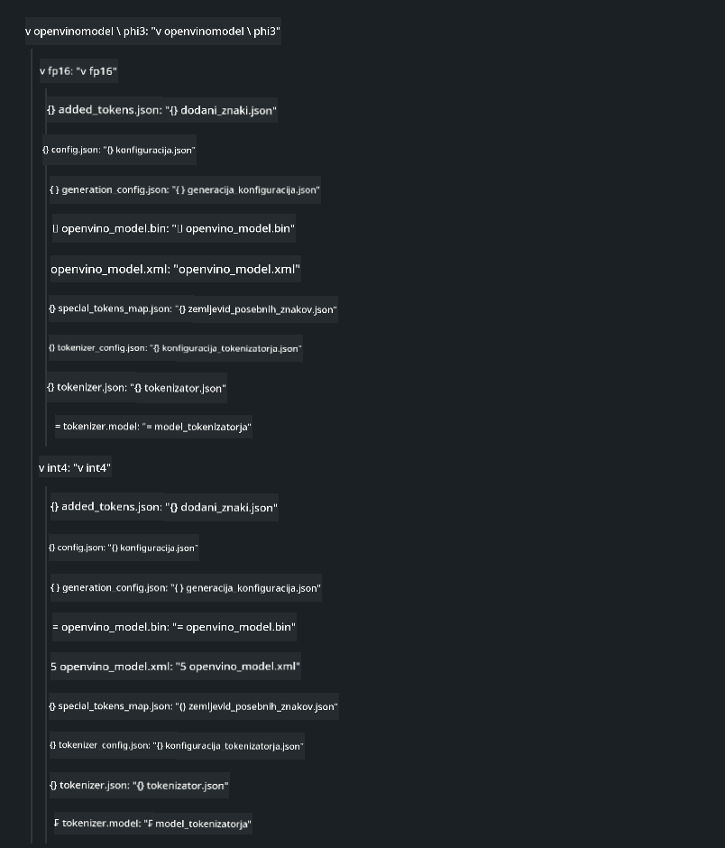
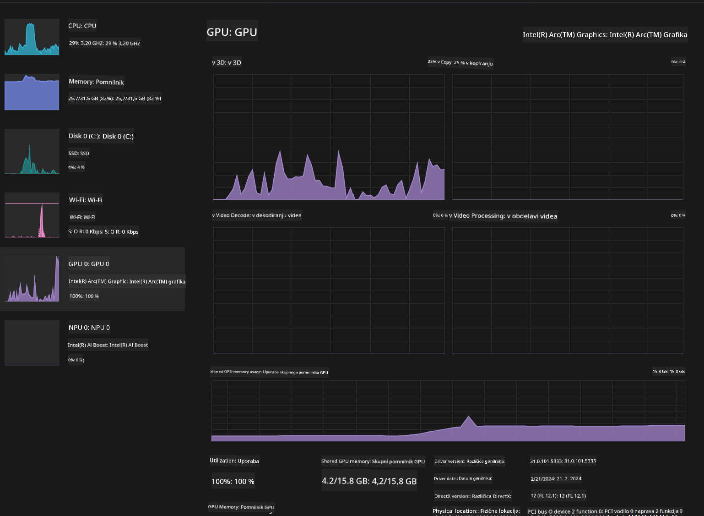

<!--
CO_OP_TRANSLATOR_METADATA:
{
  "original_hash": "e08ce816e23ad813244a09ca34ebb8ac",
  "translation_date": "2025-05-09T10:41:12+00:00",
  "source_file": "md/01.Introduction/03/AIPC_Inference.md",
  "language_code": "sl"
}
-->
# **Inference Phi-3 v AI PC**

S razvojem generativne AI i poboljšanjem hardverskih sposobnosti edge uređaja, sve više generativnih AI modelov lahko integriramo v uporabnikove naprave Bring Your Own Device (BYOD). AI PC spadajo med te modele. Od leta 2024 so Intel, AMD in Qualcomm sodelovali s proizvajalci računalnikov, da uvedejo AI PC-je, ki omogočajo izvajanje lokaliziranih generativnih AI modelov preko sprememb v strojni opremi. V tem pogovoru se bomo osredotočili na Intel AI PC-je in raziskali, kako namestiti Phi-3 na Intel AI PC.

### Kaj je NPU

NPU (Neural Processing Unit) je namenski procesor ali procesorska enota na večjem SoC, zasnovan posebej za pospeševanje operacij nevronskih mrež in AI nalog. Za razliko od splošnih CPU in GPU, so NPU optimizirani za podatkovno-paralelno računanje, zaradi česar so zelo učinkoviti pri obdelavi velikih količin multimedijskih podatkov, kot so video posnetki in slike, ter obdelavi podatkov za nevronske mreže. Posebej dobro obvladajo AI naloge, kot so prepoznavanje govora, zameglitev ozadja med video klici in urejanje fotografij ali videov, na primer zaznavanje objektov.

## NPU proti GPU

Medtem ko veliko AI in strojnih učnih nalog teče na GPU-jih, obstaja pomembna razlika med GPU in NPU.
GPU-ji so znani po svojih paralelnih računalniških zmogljivostih, vendar niso vsi GPU-ji enako učinkoviti izven grafične obdelave. NPU-ji pa so namenjeni kompleksnim izračunom, ki jih zahtevajo nevronske mreže, zato so zelo učinkoviti za AI naloge.

Na kratko, NPU so matematični mojstri, ki pospešujejo AI izračune in igrajo ključno vlogo v nastajajoči dobi AI PC-jev!

***Ta primer temelji na najnovejšem Intel Core Ultra procesorju podjetja Intel***

## **1. Uporaba NPU za poganjanje modela Phi-3**

Intel® NPU naprava je AI pospeševalnik za inferenco, integriran v Intelove odjemalske CPU-je, začetek pri Intel® Core™ Ultra generaciji CPU-jev (prej znana kot Meteor Lake). Omogoča energetsko učinkovito izvajanje umetnih nevronskih mrež.




**Intel NPU Acceleration Library**

Intel NPU Acceleration Library [https://github.com/intel/intel-npu-acceleration-library](https://github.com/intel/intel-npu-acceleration-library) je Python knjižnica, namenjena izboljšanju učinkovitosti vaših aplikacij z uporabo moči Intel Neural Processing Unit (NPU) za hitro izvajanje izračunov na združljivi strojni opremi.

Primer Phi-3-mini na AI PC z Intel® Core™ Ultra procesorji.


Namestite Python knjižnico z pip

```bash

   pip install intel-npu-acceleration-library

```

***Note*** Projekt je še v razvoju, vendar je referenčni model že zelo izpopolnjen.

### **Zagon Phi-3 z Intel NPU Acceleration Library**

Z uporabo Intel NPU pospeševanja ta knjižnica ne vpliva na tradicionalni proces kodiranja. Potrebno je le uporabiti to knjižnico za kvantizacijo izvirnega modela Phi-3, na primer FP16, INT8, INT4, kot je prikazano

```python
from transformers import AutoTokenizer, pipeline,TextStreamer
from intel_npu_acceleration_library import NPUModelForCausalLM, int4
from intel_npu_acceleration_library.compiler import CompilerConfig
import warnings

model_id = "microsoft/Phi-3-mini-4k-instruct"

compiler_conf = CompilerConfig(dtype=int4)
model = NPUModelForCausalLM.from_pretrained(
    model_id, use_cache=True, config=compiler_conf, attn_implementation="sdpa"
).eval()

tokenizer = AutoTokenizer.from_pretrained(model_id)

text_streamer = TextStreamer(tokenizer, skip_prompt=True)
```

Po uspešni kvantizaciji nadaljujte z izvajanjem in pokličite NPU za poganjanje modela Phi-3.

```python
generation_args = {
   "max_new_tokens": 1024,
   "return_full_text": False,
   "temperature": 0.3,
   "do_sample": False,
   "streamer": text_streamer,
}

pipe = pipeline(
   "text-generation",
   model=model,
   tokenizer=tokenizer,
)

query = "<|system|>You are a helpful AI assistant.<|end|><|user|>Can you introduce yourself?<|end|><|assistant|>"

with warnings.catch_warnings():
    warnings.simplefilter("ignore")
    pipe(query, **generation_args)
```

Med izvajanjem kode lahko stanje NPU spremljamo prek Upravitelja opravil


***Vzorec*** : [AIPC_NPU_DEMO.ipynb](../../../../../code/03.Inference/AIPC/AIPC_NPU_DEMO.ipynb)

## **2. Uporaba DirectML + ONNX Runtime za poganjanje modela Phi-3**

### **Kaj je DirectML**

[DirectML](https://github.com/microsoft/DirectML) je visoko zmogljiva, strojno pospešena DirectX 12 knjižnica za strojno učenje. DirectML omogoča pospeševanje GPU za pogoste naloge strojnega učenja na širokem naboru podprte strojne opreme in gonilnikov, vključno z vsemi GPU-ji, ki podpirajo DirectX 12, od proizvajalcev kot so AMD, Intel, NVIDIA in Qualcomm.

Ko se uporablja samostojno, je DirectML API nizkonivojska DirectX 12 knjižnica, primerna za visoko zmogljive, nizko zakasnitvene aplikacije, kot so ogrodja, igre in druge aplikacije v realnem času. Gladko sodelovanje DirectML z Direct3D 12 ter njegov nizki režijski stroški in skladnost na različnih strojnih opremah naredijo DirectML idealen za pospeševanje strojnega učenja, kadar želimo visoko zmogljivost in zanesljive, predvidljive rezultate na različnih napravah.

***Note*** : Najnovejši DirectML že podpira NPU (https://devblogs.microsoft.com/directx/introducing-neural-processor-unit-npu-support-in-directml-developer-preview/)

### DirectML in CUDA glede na zmogljivosti in performanse:

**DirectML** je knjižnica za strojno učenje, ki jo je razvil Microsoft. Namenjena je pospeševanju strojnih učnih opravil na Windows napravah, vključno z namiznimi, prenosnimi in edge napravami.
- Na osnovi DX12: DirectML temelji na DirectX 12, ki nudi široko podporo strojni opremi na GPU-jih, tako NVIDIA kot AMD.
- Širša podpora: Ker uporablja DX12, lahko DirectML deluje na kateremkoli GPU-ju, ki podpira DX12, tudi na integriranih GPU-jih.
- Obdelava slik: DirectML obdeluje slike in druge podatke preko nevronskih mrež, primeren je za naloge kot so prepoznavanje slik, zaznavanje objektov in podobno.
- Enostavna nastavitev: Namestitev DirectML je preprosta, ne zahteva posebnih SDK-jev ali knjižnic proizvajalcev GPU.
- Performanse: V nekaterih primerih DirectML deluje zelo dobro in je lahko hitrejši od CUDA, še posebej za določene naloge.
- Omejitve: Vendar pa je v nekaterih primerih DirectML počasnejši, zlasti pri velikih serijah float16 podatkov.

**CUDA** je NVIDIA-jeva platforma za paralelno računanje in programski model. Omogoča razvijalcem, da izkoristijo moč NVIDIA GPU-jev za splošno računalništvo, vključno s strojno učenjem in znanstvenimi simulacijami.
- NVIDIA-specifičen: CUDA je tesno integriran z NVIDIA GPU-ji in je zasnovan posebej zanje.
- Visoko optimiziran: Nudi odlično zmogljivost za GPU pospešene naloge, še posebej na NVIDIA strojni opremi.
- Široko uporabljen: Veliko strojnih učnih ogrodij in knjižnic (kot TensorFlow in PyTorch) podpira CUDA.
- Prilagodljivost: Razvijalci lahko prilagodijo nastavitve CUDA za specifične naloge, kar omogoča optimalno zmogljivost.
- Omejitve: Vendar pa je odvisnost CUDA od NVIDIA strojne opreme omejujoča, če želite širšo združljivost med različnimi GPU-ji.

### Izbira med DirectML in CUDA

Izbira med DirectML in CUDA je odvisna od vaših specifičnih potreb, razpoložljive strojne opreme in osebnih preferenc.
Če želite širšo združljivost in enostavno nastavitev, je DirectML dobra izbira. Če pa imate NVIDIA GPU-je in potrebujete visoko optimizirano zmogljivost, je CUDA še vedno močna možnost. Na kratko, oba imata svoje prednosti in slabosti, zato upoštevajte svoje zahteve in razpoložljivo strojno opremo pri odločitvi.

### **Generativna AI z ONNX Runtime**

V dobi AI je prenosljivost AI modelov zelo pomembna. ONNX Runtime omogoča enostavno nameščanje izurjenih modelov na različne naprave. Razvijalci se ne rabijo ukvarjati z različnimi inferenčnimi okviri in uporabljajo enoten API za izvedbo inferenc. V dobi generativne AI je ONNX Runtime prav tako optimiziral kodo (https://onnxruntime.ai/docs/genai/). Z optimiziranim ONNX Runtime lahko kvantizirane generativne AI modele izvajamo na različnih terminalih. Pri generativni AI z ONNX Runtime lahko inferenco AI modela izvajamo preko Python, C#, C/C++ API-jev. Seveda pa lahko na iPhonu izkoristimo C++ Generative AI z ONNX Runtime API.

[Sample Code](https://github.com/Azure-Samples/Phi-3MiniSamples/tree/main/onnx)

***Kompilacija generativne AI z ONNX Runtime knjižnico***

```bash

winget install --id=Kitware.CMake  -e

git clone https://github.com/microsoft/onnxruntime.git

cd .\onnxruntime\

./build.bat --build_shared_lib --skip_tests --parallel --use_dml --config Release

cd ../

git clone https://github.com/microsoft/onnxruntime-genai.git

cd .\onnxruntime-genai\

mkdir ort

cd ort

mkdir include

mkdir lib

copy ..\onnxruntime\include\onnxruntime\core\providers\dml\dml_provider_factory.h ort\include

copy ..\onnxruntime\include\onnxruntime\core\session\onnxruntime_c_api.h ort\include

copy ..\onnxruntime\build\Windows\Release\Release\*.dll ort\lib

copy ..\onnxruntime\build\Windows\Release\Release\onnxruntime.lib ort\lib

python build.py --use_dml


```

**Namestitev knjižnice**

```bash

pip install .\onnxruntime_genai_directml-0.3.0.dev0-cp310-cp310-win_amd64.whl

```

To je rezultat zagona



***Vzorec*** : [AIPC_DirectML_DEMO.ipynb](../../../../../code/03.Inference/AIPC/AIPC_DirectML_DEMO.ipynb)

## **3. Uporaba Intel OpenVino za poganjanje modela Phi-3**

### **Kaj je OpenVINO**

[OpenVINO](https://github.com/openvinotoolkit/openvino) je odprtokodni komplet orodij za optimizacijo in nameščanje globokih učnih modelov. Ponuja pospešeno delovanje globokega učenja za modele vida, zvoka in jezika iz priljubljenih ogrodij, kot so TensorFlow, PyTorch in drugi. Začnite z OpenVINO. OpenVINO se lahko uporablja tudi v kombinaciji s CPU in GPU za poganjanje modela Phi-3.

***Note***: Trenutno OpenVINO ne podpira NPU.

### **Namestitev OpenVINO knjižnice**

```bash

 pip install git+https://github.com/huggingface/optimum-intel.git

 pip install git+https://github.com/openvinotoolkit/nncf.git

 pip install openvino-nightly

```

### **Zagon Phi-3 z OpenVINO**

Tako kot pri NPU, OpenVINO zaženemo generativne AI modele preko kvantiziranih modelov. Najprej moramo kvantizirati model Phi-3 in to storiti preko ukazne vrstice z optimum-cli

**INT4**

```bash

optimum-cli export openvino --model "microsoft/Phi-3-mini-4k-instruct" --task text-generation-with-past --weight-format int4 --group-size 128 --ratio 0.6  --sym  --trust-remote-code ./openvinomodel/phi3/int4

```

**FP16**

```bash

optimum-cli export openvino --model "microsoft/Phi-3-mini-4k-instruct" --task text-generation-with-past --weight-format fp16 --trust-remote-code ./openvinomodel/phi3/fp16

```

Pretvorjeni format izgleda takole



Naložite poti modelov (model_dir), povezane konfiguracije (ov_config = {"PERFORMANCE_HINT": "LATENCY", "NUM_STREAMS": "1", "CACHE_DIR": ""}) in strojno pospešene naprave (GPU.0) preko OVModelForCausalLM

```python

ov_model = OVModelForCausalLM.from_pretrained(
     model_dir,
     device='GPU.0',
     ov_config=ov_config,
     config=AutoConfig.from_pretrained(model_dir, trust_remote_code=True),
     trust_remote_code=True,
)

```

Med izvajanjem kode lahko stanje GPU spremljamo prek Upravitelja opravil



***Vzorec*** : [AIPC_OpenVino_Demo.ipynb](../../../../../code/03.Inference/AIPC/AIPC_OpenVino_Demo.ipynb)

### ***Note*** : Zgornji trije načini imajo vsak svoje prednosti, vendar se za inferenco na AI PC priporoča uporaba NPU pospeševanja.

**Izjava o omejitvi odgovornosti**:  
Ta dokument je bil preveden z uporabo storitve za prevajanje z umetno inteligenco [Co-op Translator](https://github.com/Azure/co-op-translator). Čeprav si prizadevamo za natančnost, vas opozarjamo, da lahko avtomatizirani prevodi vsebujejo napake ali netočnosti. Izvirni dokument v njegovem izvirnem jeziku velja za avtoritativni vir. Za ključne informacije priporočamo strokovni človeški prevod. Ne odgovarjamo za morebitne nesporazume ali napačne razlage, ki izhajajo iz uporabe tega prevoda.