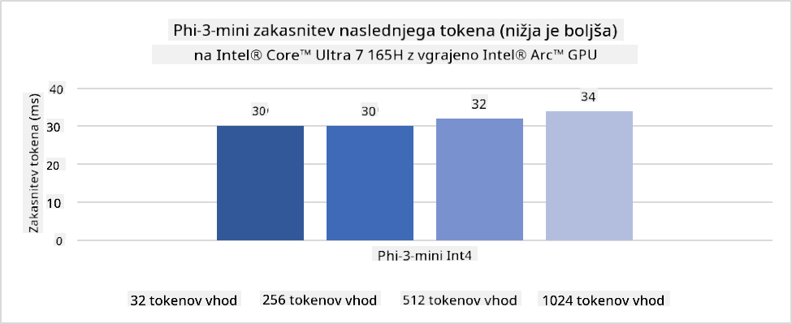
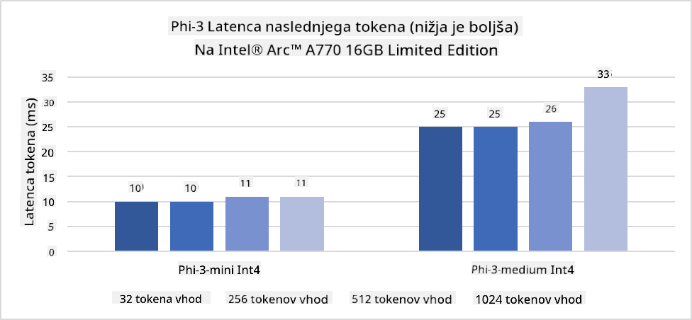
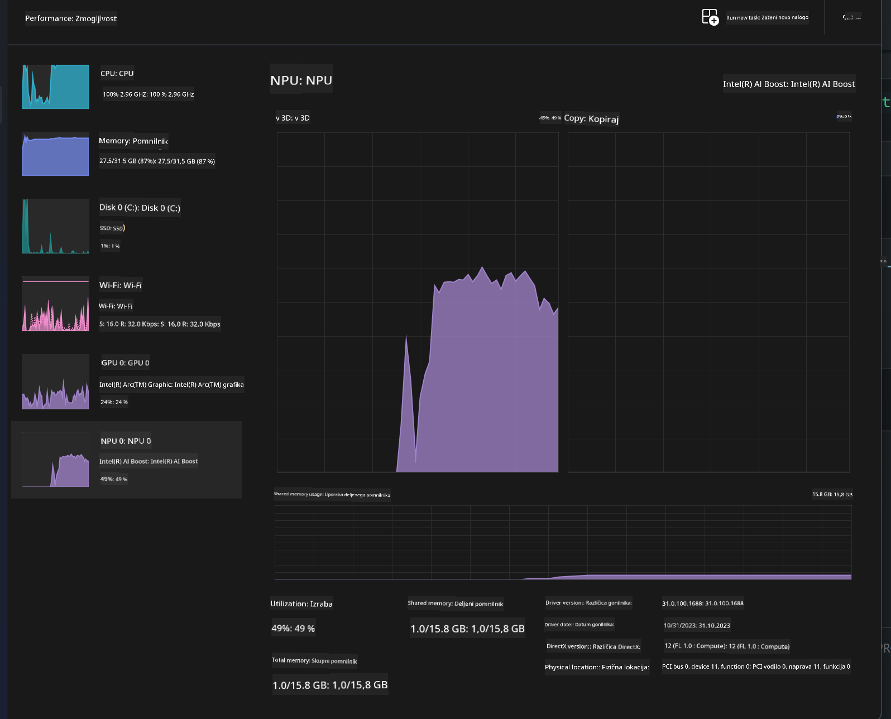
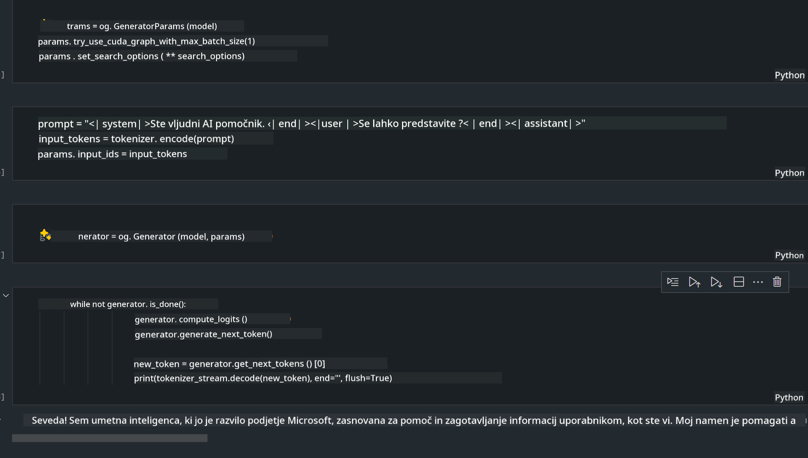
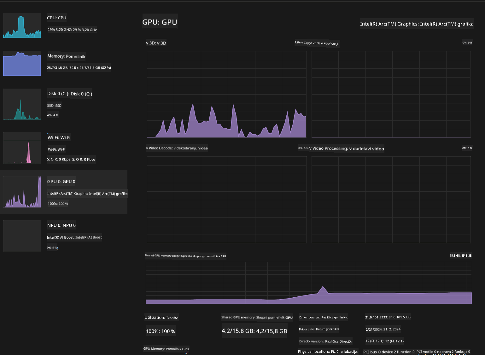

<!--
CO_OP_TRANSLATOR_METADATA:
{
  "original_hash": "e08ce816e23ad813244a09ca34ebb8ac",
  "translation_date": "2025-07-16T20:09:01+00:00",
  "source_file": "md/01.Introduction/03/AIPC_Inference.md",
  "language_code": "sl"
}
-->
# **Inferenca Phi-3 na AI PC**

Z razvojem generativne umetne inteligence in izboljšavami zmogljivosti strojne opreme na robnih napravah je vse več generativnih AI modelov mogoče integrirati v uporabniške naprave Bring Your Own Device (BYOD). AI PC-ji so med temi modeli. Od leta 2024 so Intel, AMD in Qualcomm sodelovali s proizvajalci računalnikov, da bi uvedli AI PC-je, ki omogočajo izvajanje lokaliziranih generativnih AI modelov preko strojnih prilagoditev. V tej razpravi se bomo osredotočili na Intel AI PC-je in raziskali, kako namestiti Phi-3 na Intel AI PC.

### Kaj je NPU

NPU (Neural Processing Unit) je namenski procesor ali procesorska enota na večjem SoC, zasnovana posebej za pospeševanje operacij nevronskih mrež in AI nalog. Za razliko od splošnih CPU-jev in GPU-jev so NPU-ji optimizirani za podatkovno usmerjeno vzporedno računalništvo, kar jih naredi zelo učinkovite pri obdelavi velikih količin multimedijskih podatkov, kot so videoposnetki in slike, ter pri obdelavi podatkov za nevronske mreže. Posebej so spretni pri opravljanju AI nalog, kot so prepoznavanje govora, zamegljevanje ozadja med video klici in procesi urejanja fotografij ali videoposnetkov, kot je zaznavanje predmetov.

## NPU proti GPU

Čeprav veliko AI in strojno učno delo poteka na GPU-jih, obstaja pomembna razlika med GPU-ji in NPU-ji.  
GPU-ji so znani po svojih zmogljivostih vzporednega računalništva, vendar niso vsi GPU-ji enako učinkoviti pri drugih nalogah poleg grafične obdelave. NPU-ji so po drugi strani namenjeni kompleksnim izračunom, ki so potrebni za delovanje nevronskih mrež, zaradi česar so zelo učinkoviti za AI naloge.

Povzemimo, NPU-ji so matematični mojstri, ki pospešujejo AI izračune in igrajo ključno vlogo v nastajajoči dobi AI PC-jev!

***Ta primer temelji na najnovejšem Intel Core Ultra procesorju podjetja Intel***

## **1. Uporaba NPU za zagon modela Phi-3**

Intel® NPU naprava je AI pospeševalnik za inferenco, integriran z Intelovimi odjemalskimi CPU-ji, začenši z generacijo Intel® Core™ Ultra CPU-jev (prej znanih kot Meteor Lake). Omogoča energijsko učinkovito izvajanje nalog umetnih nevronskih mrež.





**Intel NPU Acceleration Library**

Intel NPU Acceleration Library [https://github.com/intel/intel-npu-acceleration-library](https://github.com/intel/intel-npu-acceleration-library) je Python knjižnica, zasnovana za povečanje učinkovitosti vaših aplikacij z izkoriščanjem moči Intel Neural Processing Unit (NPU) za izvajanje hitrih izračunov na združljivi strojni opremi.

Primer Phi-3-mini na AI PC-ju, ki ga poganjajo Intel® Core™ Ultra procesorji.


Namestite Python knjižnico z uporabo pip

```bash

   pip install intel-npu-acceleration-library

```

***Opomba*** Projekt je še v razvoju, vendar je referenčni model že zelo dovršen.

### **Zagon Phi-3 z Intel NPU Acceleration Library**

Z uporabo Intel NPU pospeševanja ta knjižnica ne vpliva na tradicionalni postopek kodiranja. Potrebno je le uporabiti to knjižnico za kvantizacijo izvirnega modela Phi-3, kot so FP16, INT8, INT4, na primer

```python
from transformers import AutoTokenizer, pipeline,TextStreamer
from intel_npu_acceleration_library import NPUModelForCausalLM, int4
from intel_npu_acceleration_library.compiler import CompilerConfig
import warnings

model_id = "microsoft/Phi-3-mini-4k-instruct"

compiler_conf = CompilerConfig(dtype=int4)
model = NPUModelForCausalLM.from_pretrained(
    model_id, use_cache=True, config=compiler_conf, attn_implementation="sdpa"
).eval()

tokenizer = AutoTokenizer.from_pretrained(model_id)

text_streamer = TextStreamer(tokenizer, skip_prompt=True)
```

Po uspešni kvantizaciji nadaljujte z izvajanjem, da pokličete NPU za zagon modela Phi-3.

```python
generation_args = {
   "max_new_tokens": 1024,
   "return_full_text": False,
   "temperature": 0.3,
   "do_sample": False,
   "streamer": text_streamer,
}

pipe = pipeline(
   "text-generation",
   model=model,
   tokenizer=tokenizer,
)

query = "<|system|>You are a helpful AI assistant.<|end|><|user|>Can you introduce yourself?<|end|><|assistant|>"

with warnings.catch_warnings():
    warnings.simplefilter("ignore")
    pipe(query, **generation_args)
```

Med izvajanjem kode lahko stanje delovanja NPU spremljamo preko Upravitelja opravil



***Vzorec*** : [AIPC_NPU_DEMO.ipynb](../../../../../code/03.Inference/AIPC/AIPC_NPU_DEMO.ipynb)

## **2. Uporaba DirectML + ONNX Runtime za zagon modela Phi-3**

### **Kaj je DirectML**

[DirectML](https://github.com/microsoft/DirectML) je visoko zmogljiva, strojno pospešena knjižnica DirectX 12 za strojno učenje. DirectML omogoča pospešitev na GPU-jih za pogoste naloge strojnega učenja na širokem naboru podprte strojne opreme in gonilnikov, vključno z vsemi GPU-ji, ki podpirajo DirectX 12, proizvajalcev, kot so AMD, Intel, NVIDIA in Qualcomm.

Ko se uporablja samostojno, je DirectML API nizkonivojska knjižnica DirectX 12, primerna za visoko zmogljive, nizko zakasnitev aplikacije, kot so ogrodja, igre in druge aplikacije v realnem času. Gladko sodelovanje DirectML z Direct3D 12, nizka režija in skladnost med strojno opremo naredijo DirectML idealen za pospeševanje strojnega učenja, kadar želimo visoko zmogljivost in zanesljivost ter predvidljivost rezultatov na različnih napravah.

***Opomba*** : Najnovejši DirectML že podpira NPU (https://devblogs.microsoft.com/directx/introducing-neural-processor-unit-npu-support-in-directml-developer-preview/)

### Primerjava DirectML in CUDA glede zmogljivosti in učinkovitosti:

**DirectML** je knjižnica za strojno učenje, ki jo je razvil Microsoft. Namenjena je pospeševanju strojno učenih nalog na Windows napravah, vključno z namiznimi računalniki, prenosniki in robnimi napravami.  
- Na osnovi DX12: DirectML temelji na DirectX 12 (DX12), ki omogoča široko podporo strojne opreme na GPU-jih, vključno z NVIDIA in AMD.  
- Širša podpora: Ker uporablja DX12, lahko DirectML deluje z vsakim GPU-jem, ki podpira DX12, tudi z integriranimi GPU-ji.  
- Obdelava slik: DirectML obdeluje slike in druge podatke z nevronskimi mrežami, zato je primeren za naloge, kot so prepoznavanje slik, zaznavanje predmetov in podobno.  
- Enostavna namestitev: Namestitev DirectML je preprosta in ne zahteva posebnih SDK-jev ali knjižnic proizvajalcev GPU-jev.  
- Zmogljivost: V nekaterih primerih DirectML deluje zelo dobro in je lahko hitrejši od CUDA, zlasti pri določenih nalogah.  
- Omejitve: Vendar pa je v določenih primerih DirectML lahko počasnejši, zlasti pri velikih serijah z uporabo float16.

**CUDA** je NVIDIA-jeva platforma za vzporedno računalništvo in programski model. Razvijalcem omogoča izkoriščanje moči NVIDIA GPU-jev za splošno računalništvo, vključno s strojnim učenjem in znanstvenimi simulacijami.  
- Specifično za NVIDIA: CUDA je tesno povezana z NVIDIA GPU-ji in je posebej zasnovana zanje.  
- Visoko optimizirana: Ponuja odlično zmogljivost za naloge, pospešene na GPU-jih, še posebej z NVIDIA GPU-ji.  
- Široko uporabljena: Veliko ogrodij in knjižnic za strojno učenje (kot sta TensorFlow in PyTorch) podpira CUDA.  
- Prilagodljivost: Razvijalci lahko prilagajajo nastavitve CUDA za specifične naloge, kar lahko vodi do optimalne zmogljivosti.  
- Omejitve: Vendar pa je odvisnost CUDA od NVIDIA strojne opreme lahko omejujoča, če želite širšo združljivost z različnimi GPU-ji.

### Izbira med DirectML in CUDA

Izbira med DirectML in CUDA je odvisna od vašega specifičnega primera uporabe, razpoložljive strojne opreme in osebnih preferenc.  
Če iščete širšo združljivost in enostavnost nastavitve, je DirectML lahko dobra izbira. Če pa imate NVIDIA GPU-je in potrebujete visoko optimizirano zmogljivost, je CUDA še vedno močan kandidat. Povzetek: oba imata svoje prednosti in slabosti, zato upoštevajte svoje zahteve in razpoložljivo strojno opremo pri odločitvi.

### **Generativna AI z ONNX Runtime**

V dobi AI je prenosljivost AI modelov zelo pomembna. ONNX Runtime omogoča enostavno nameščanje usposobljenih modelov na različne naprave. Razvijalci se ne rabijo ukvarjati z inferenčnim ogrodjem in uporabljajo enoten API za izvedbo inferenc modelov. V dobi generativne AI je ONNX Runtime prav tako izvedel optimizacijo kode (https://onnxruntime.ai/docs/genai/). Z optimiziranim ONNX Runtime lahko kvantizirani generativni AI model izvajamo na različnih terminalih. Pri Generativni AI z ONNX Runtime lahko inferenco AI modela izvajate preko Python, C#, C / C++. Seveda pa lahko pri nameščanju na iPhone izkoristite C++ API za Generativno AI z ONNX Runtime.

[Primer kode](https://github.com/Azure-Samples/Phi-3MiniSamples/tree/main/onnx)

***Kompilacija generativne AI z ONNX Runtime knjižnico***

```bash

winget install --id=Kitware.CMake  -e

git clone https://github.com/microsoft/onnxruntime.git

cd .\onnxruntime\

./build.bat --build_shared_lib --skip_tests --parallel --use_dml --config Release

cd ../

git clone https://github.com/microsoft/onnxruntime-genai.git

cd .\onnxruntime-genai\

mkdir ort

cd ort

mkdir include

mkdir lib

copy ..\onnxruntime\include\onnxruntime\core\providers\dml\dml_provider_factory.h ort\include

copy ..\onnxruntime\include\onnxruntime\core\session\onnxruntime_c_api.h ort\include

copy ..\onnxruntime\build\Windows\Release\Release\*.dll ort\lib

copy ..\onnxruntime\build\Windows\Release\Release\onnxruntime.lib ort\lib

python build.py --use_dml


```

**Namestitev knjižnice**

```bash

pip install .\onnxruntime_genai_directml-0.3.0.dev0-cp310-cp310-win_amd64.whl

```

To je rezultat izvajanja



***Vzorec*** : [AIPC_DirectML_DEMO.ipynb](../../../../../code/03.Inference/AIPC/AIPC_DirectML_DEMO.ipynb)

## **3. Uporaba Intel OpenVino za zagon modela Phi-3**

### **Kaj je OpenVINO**

[OpenVINO](https://github.com/openvinotoolkit/openvino) je odprtokodni komplet orodij za optimizacijo in nameščanje globokih učnih modelov. Ponuja pospešeno delovanje globokega učenja za modele vida, zvoka in jezika iz priljubljenih ogrodij, kot so TensorFlow, PyTorch in drugi. Začnite z OpenVINO. OpenVINO se lahko uporablja tudi v kombinaciji s CPU in GPU za zagon modela Phi-3.

***Opomba***: Trenutno OpenVINO ne podpira NPU.

### **Namestitev OpenVINO knjižnice**

```bash

 pip install git+https://github.com/huggingface/optimum-intel.git

 pip install git+https://github.com/openvinotoolkit/nncf.git

 pip install openvino-nightly

```

### **Zagon Phi-3 z OpenVINO**

Tako kot NPU, OpenVINO omogoča klic generativnih AI modelov z izvajanjem kvantiziranih modelov. Najprej moramo kvantizirati model Phi-3 in dokončati kvantizacijo modela preko ukazne vrstice z optimum-cli.

**INT4**

```bash

optimum-cli export openvino --model "microsoft/Phi-3-mini-4k-instruct" --task text-generation-with-past --weight-format int4 --group-size 128 --ratio 0.6  --sym  --trust-remote-code ./openvinomodel/phi3/int4

```

**FP16**

```bash

optimum-cli export openvino --model "microsoft/Phi-3-mini-4k-instruct" --task text-generation-with-past --weight-format fp16 --trust-remote-code ./openvinomodel/phi3/fp16

```

pretvorjeni format, kot je ta


Naložite poti modela (model_dir), povezane konfiguracije (ov_config = {"PERFORMANCE_HINT": "LATENCY", "NUM_STREAMS": "1", "CACHE_DIR": ""}) in strojno pospešene naprave (GPU.0) preko OVModelForCausalLM

```python

ov_model = OVModelForCausalLM.from_pretrained(
     model_dir,
     device='GPU.0',
     ov_config=ov_config,
     config=AutoConfig.from_pretrained(model_dir, trust_remote_code=True),
     trust_remote_code=True,
)

```

Med izvajanjem kode lahko stanje delovanja GPU spremljamo preko Upravitelja opravil



***Vzorec*** : [AIPC_OpenVino_Demo.ipynb](../../../../../code/03.Inference/AIPC/AIPC_OpenVino_Demo.ipynb)

### ***Opomba*** : Vse tri zgornje metode imajo svoje prednosti, vendar je za inferenco na AI PC-ju priporočljivo uporabiti NPU pospeševanje.

**Omejitev odgovornosti**:  
Ta dokument je bil preveden z uporabo storitve za avtomatski prevod AI [Co-op Translator](https://github.com/Azure/co-op-translator). Čeprav si prizadevamo za natančnost, vas opozarjamo, da lahko avtomatski prevodi vsebujejo napake ali netočnosti. Izvirni dokument v njegovem izvirnem jeziku velja za avtoritativni vir. Za ključne informacije priporočamo strokovni človeški prevod. Za morebitne nesporazume ali napačne interpretacije, ki izhajajo iz uporabe tega prevoda, ne odgovarjamo.