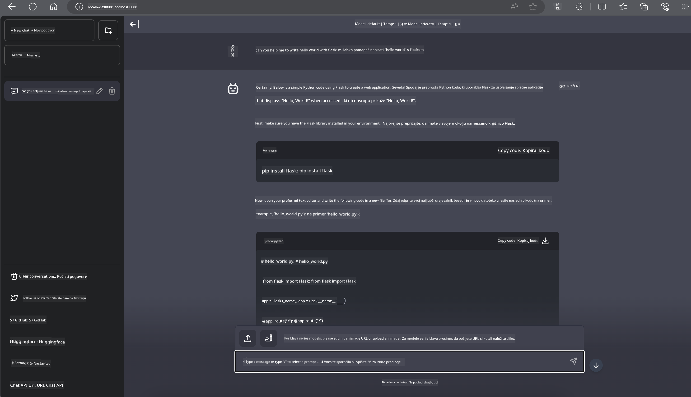

<!--
CO_OP_TRANSLATOR_METADATA:
{
  "original_hash": "be4101a30d98e95a71d42c276e8bcd37",
  "translation_date": "2025-07-16T20:46:02+00:00",
  "source_file": "md/01.Introduction/03/Jetson_Inference.md",
  "language_code": "sl"
}
-->
# **Inferenca Phi-3 na Nvidia Jetson**

Nvidia Jetson je serija vgrajenih računalniških plošč iz podjetja Nvidia. Modeli Jetson TK1, TX1 in TX2 imajo vsi Tegra procesor (ali SoC) iz Nvidie, ki združuje centralno procesno enoto (CPU) z arhitekturo ARM. Jetson je nizkoenergijski sistem, zasnovan za pospeševanje aplikacij strojnega učenja. Nvidia Jetson uporabljajo profesionalni razvijalci za ustvarjanje prelomnih AI izdelkov v različnih panogah, študentje in navdušenci pa za praktično učenje AI in izdelavo izjemnih projektov. SLM je nameščen na robnih napravah, kot je Jetson, kar omogoča boljšo implementacijo industrijskih scenarijev generativne AI.

## Namestitev na NVIDIA Jetson:
Razvijalci, ki delajo na avtonomni robotiki in vgrajenih napravah, lahko izkoristijo Phi-3 Mini. Relativno majhna velikost Phi-3 ga naredi idealnega za robno nameščanje. Parametri so bili skrbno nastavljeni med učenjem, kar zagotavlja visoko natančnost odgovorov.

### Optimizacija TensorRT-LLM:
NVIDIA-jeva [TensorRT-LLM knjižnica](https://github.com/NVIDIA/TensorRT-LLM?WT.mc_id=aiml-138114-kinfeylo) optimizira inferenco velikih jezikovnih modelov. Podpira dolgo kontekstno okno Phi-3 Mini, kar izboljšuje tako prepustnost kot zakasnitev. Optimizacije vključujejo tehnike, kot so LongRoPE, FP8 in inflight batching.

### Razpoložljivost in namestitev:
Razvijalci lahko preizkusijo Phi-3 Mini z 128K kontekstnim oknom na [NVIDIA AI](https://www.nvidia.com/en-us/ai-data-science/generative-ai/). Pakiran je kot NVIDIA NIM, mikrostoritev s standardnim API-jem, ki jo je mogoče namestiti kjerkoli. Poleg tega so na voljo [implementacije TensorRT-LLM na GitHubu](https://github.com/NVIDIA/TensorRT-LLM).

## **1. Priprava**

a. Jetson Orin NX / Jetson NX

b. JetPack 5.1.2+

c. Cuda 11.8

d. Python 3.8+

## **2. Zagon Phi-3 na Jetson**

Lahko izberemo [Ollama](https://ollama.com) ali [LlamaEdge](https://llamaedge.com)

Če želite uporabljati gguf hkrati v oblaku in na robnih napravah, lahko LlamaEdge razumemo kot WasmEdge (WasmEdge je lahka, zmogljiva in razširljiva izvedbena okolja WebAssembly, primerna za cloud native, edge in decentralizirane aplikacije. Podpira serverless aplikacije, vgrajene funkcije, mikro storitve, pametne pogodbe in IoT naprave). Z LlamaEdge lahko namestite kvantitativni model gguf na robne naprave in v oblak.


Tukaj so koraki za uporabo

1. Namestite in prenesite ustrezne knjižnice in datoteke

```bash

curl -sSf https://raw.githubusercontent.com/WasmEdge/WasmEdge/master/utils/install.sh | bash -s -- --plugin wasi_nn-ggml

curl -LO https://github.com/LlamaEdge/LlamaEdge/releases/latest/download/llama-api-server.wasm

curl -LO https://github.com/LlamaEdge/chatbot-ui/releases/latest/download/chatbot-ui.tar.gz

tar xzf chatbot-ui.tar.gz

```

**Opomba**: llama-api-server.wasm in chatbot-ui morata biti v isti mapi

2. Zaženite skripte v terminalu

```bash

wasmedge --dir .:. --nn-preload default:GGML:AUTO:{Your gguf path} llama-api-server.wasm -p phi-3-chat

```

Tukaj je rezultat zagona



***Primer kode*** [Phi-3 mini WASM Notebook Sample](https://github.com/Azure-Samples/Phi-3MiniSamples/tree/main/wasm)

Povzetek: Phi-3 Mini predstavlja velik napredek v jezikovnem modeliranju, saj združuje učinkovitost, zavedanje konteksta in optimizacijsko moč NVIDIE. Ne glede na to, ali gradite robote ali robne aplikacije, je Phi-3 Mini močno orodje, ki ga je vredno poznati.

**Omejitev odgovornosti**:  
Ta dokument je bil preveden z uporabo storitve za avtomatski prevod AI [Co-op Translator](https://github.com/Azure/co-op-translator). Čeprav si prizadevamo za natančnost, vas opozarjamo, da lahko avtomatizirani prevodi vsebujejo napake ali netočnosti. Izvirni dokument v njegovem izvirnem jeziku velja za avtoritativni vir. Za ključne informacije priporočamo strokovni človeški prevod. Za morebitna nesporazume ali napačne interpretacije, ki izhajajo iz uporabe tega prevoda, ne odgovarjamo.