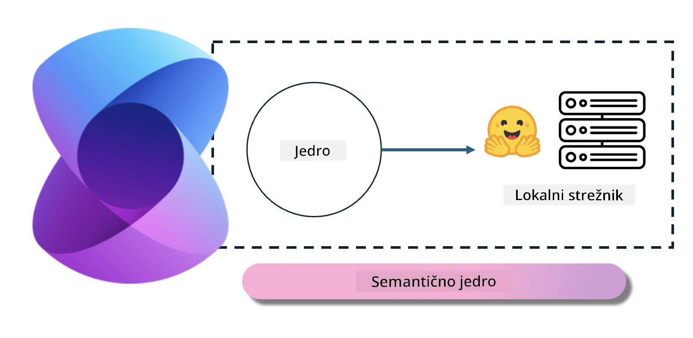
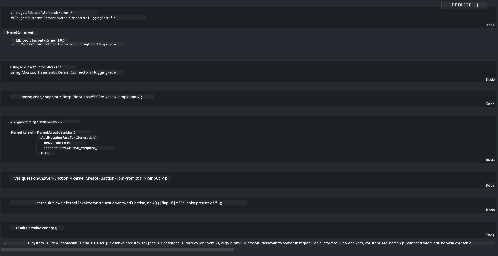

# **Inferenca Phi-3 na lokalnem strežniku**

Phi-3 lahko namestimo na lokalni strežnik. Uporabniki lahko izberejo rešitve [Ollama](https://ollama.com) ali [LM Studio](https://llamaedge.com), lahko pa napišejo tudi svojo kodo. Lokalnim storitvam Phi-3 se lahko povežemo preko [Semantic Kernel](https://github.com/microsoft/semantic-kernel?WT.mc_id=aiml-138114-kinfeylo) ali [Langchain](https://www.langchain.com/), da zgradimo aplikacije Copilot.

## **Uporaba Semantic Kernel za dostop do Phi-3-mini**

V aplikaciji Copilot ustvarjamo aplikacije preko Semantic Kernel / LangChain. Ta vrsta aplikacijskega ogrodja je na splošno združljiva z Azure OpenAI Service / OpenAI modeli, prav tako pa podpira odprtokodne modele na Hugging Face in lokalne modele. Kaj storiti, če želimo uporabiti Semantic Kernel za dostop do Phi-3-mini? Kot primer uporabimo .NET, ki ga lahko združimo s Hugging Face Connectorjem v Semantic Kernel. Privzeto se poveže z id-jem modela na Hugging Face (ob prvem zagonu se model prenese z Hugging Face, kar traja nekaj časa). Povežemo se lahko tudi z lokalno zgrajeno storitvijo. Priporočamo slednjo možnost, saj omogoča večjo avtonomijo, še posebej v poslovnih aplikacijah.

Iz slike je razvidno, da dostop do lokalnih storitev preko Semantic Kernel enostavno poveže s samostojno zgrajenim strežnikom modela Phi-3-mini. Tukaj je rezultat zagona:

***Primer kode*** https://github.com/kinfey/Phi3MiniSamples/tree/main/semantickernel

**Omejitev odgovornosti**:  
Ta dokument je bil preveden z uporabo AI prevajalske storitve [Co-op Translator](https://github.com/Azure/co-op-translator). Čeprav si prizadevamo za natančnost, vas opozarjamo, da avtomatizirani prevodi lahko vsebujejo napake ali netočnosti. Izvirni dokument v njegovem izvirnem jeziku velja za avtoritativni vir. Za ključne informacije priporočamo strokovni človeški prevod. Za morebitna nesporazume ali napačne interpretacije, ki izhajajo iz uporabe tega prevoda, ne odgovarjamo.